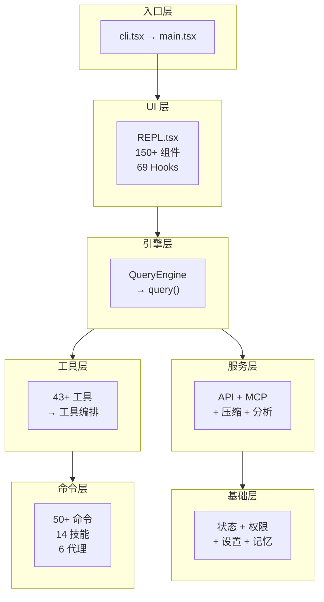

# Claude Code 源代码架构文档

> 29 份文档，125+ 应用场景，全面覆盖 Claude Code CLI 的架构和工作原理。所有图表使用 Mermaid 语法。

---

## 架构速查卡

**技术栈**: TypeScript + React(Ink) + Bun | **API**: `@anthropic-ai/sdk` | **MCP**: `@modelcontextprotocol/sdk` | **验证**: Zod v4

---

## 文档目录

### I. 架构与系统 (01-12)

| # | 文档 | 内容 | 关键图表 |
|---|------|------|---------|
| 01 | [architecture-overview](01-architecture-overview.md) | 分层架构、模块依赖、特性门控 | 5 图 |
| 02 | [startup-flow](02-startup-flow.md) | 启动序列、模式分支、迁移、并行初始化 | 4 图 |
| 03 | [query-engine](03-query-engine.md) | 对话生命周期、工具调用分区、压缩触发 | 5 图 |
| 04 | [tool-system](04-tool-system.md) | 工具注册/过滤、43+ 工具清单、执行流水线 | 5 图 |
| 05 | [command-system](05-command-system.md) | 命令加载、类型体系、技能系统、安全分级 | 5 图 |
| 06 | [state-management](06-state-management.md) | 双层状态、数据流、Store 模式、设置层级 | 5 图 |
| 07 | [permission-system](07-permission-system.md) | 权限决策流、三种模式、规则匹配 | 4 图 |
| 08 | [mcp-system](08-mcp-system.md) | MCP 架构、配置优先级、连接生命周期 | 5 图 |
| 09 | [service-layer](09-service-layer.md) | API 调用、压缩策略、分析、LSP、OAuth、费用追踪 | 7 图 |
| 10 | [ui-layer](10-ui-layer.md) | REPL 结构、Hooks 分类、对话框、上下文链 | 5 图 |
| 11 | [bridge-remote](11-bridge-remote.md) | Bridge 架构、远程会话流、状态机、消息协议 | 4 图 |
| 12 | [subsystems](12-subsystems.md) | 内存、协调器、钩子、语音、Buddy、插件、迁移 | 9 图 |

### II. 专题深入 (13-17)

| # | 文档 | 内容 | 关键数据 |
|---|------|------|---------|
| 13 | [hidden-features](13-hidden-features.md) | 隐藏功能（推测执行、AutoDream、Buddy 等） | 14 图 |
| 14a | [prompt-catalog](14-prompt-catalog.md) | 提示词索引（108 条，结构图） | 组装流程图 |
| 14b | [prompt-catalog-full](14-prompt-catalog-full.md) | 提示词完整原文 | 28 个工具提示 |
| 15 | [skills-system](15-skills-system.md) | 技能系统（14 个内置技能参数表） | batch/simplify 流程 |
| 16 | [subagent-system](16-subagent-system.md) | 子代理（6 个内置、Fork、执行生命周期） | 5 种执行模式 |
| 17 | [agent-team-system](17-agent-team-system.md) | Team 协作（Coordinator、Swarm、任务管理） | 完整端到端示例 |

### III. 应用场景 (18-23) — 125+ 个

| # | 文档 | 场景数 | 核心主题 |
|---|------|--------|---------|
| 18 | [application-scenarios](18-application-scenarios.md) | 20 | 推测执行、AutoDream、MagicDocs、压缩、策略、沙箱 |
| 19 | [hooks-lifecycle](19-hooks-lifecycle.md) | 25 | 25 事件 × 4 类型，Agent Hook 多轮验证 |
| 20 | [more-scenarios](20-more-scenarios.md) | 20 | Shell !前缀、缓存检测、限流、通知、安全存储 |
| 21 | [advanced-scenarios](21-advanced-scenarios.md) | 20 | API 子系统、Ink 渲染、IDE 集成、语音、Swarm |
| 22 | [deep-internals](22-deep-internals.md) | 20 | 工具协调、6 层压缩、任务系统、VCR、调试 |
| 23 | [user-features-catalog](23-user-features-catalog.md) | 20+ | 50+ 命令分类、代码审查、账户管理、移动/桌面 |

### IV. 全局分析 (24-25)

| # | 文档 | 内容 |
|---|------|------|
| 24 | [end-to-end-flows](24-end-to-end-flows.md) | 7 条完整链路：输入→响应、权限决策、MCP、恢复、压缩、子代理、文件编辑 |
| 25 | [design-patterns](25-design-patterns.md) | 10 个设计模式 + 量化：缓存(TTL/LRU)、分叉代理、feature()×960、logEvent()×1041 |

### V. 参考手册 (26-28)

| # | 文档 | 内容 |
|---|------|------|
| 26 | [config-reference](26-config-reference.md) | 473 环境变量、20+ 设置项、50+ CLI 标志、700+ 特性门控、9 内部代号 |
| 27 | [security-model](27-security-model.md) | 7 层纵深防御、23 项 Bash 检查、Unicode 净化、否决追踪 |
| 28 | [performance-optimization](28-performance-optimization.md) | 30+ 阈值速查表、启动/缓存/运行时/后台 4 类优化 |
| 29 | [source-map](29-source-map.md) | 1884 文件按目录归类 + 热力图 + 命名约定 |
| 30 | [gap-supplement](30-gap-supplement.md) | 文档缺口补全（Computer Use、GitHub App、Settings Sync 等 10 项） |
| 31 | [minor-systems](31-minor-systems.md) | 小型系统补遗（后台维护、并发会话、自动更新等 8 项） |

---

## 按主题快速导航

### 我想了解...

| 问题 | 去看 |
|------|------|
| Claude Code 整体架构是什么样的？ | [01](01-architecture-overview.md) |
| 用户输入一条消息后发生了什么？ | [24](24-end-to-end-flows.md) 流程 1 |
| 工具权限是怎么判断的？ | [07](07-permission-system.md) + [24](24-end-to-end-flows.md) 流程 2 + [27](27-security-model.md) |
| MCP 工具怎么调用的？ | [08](08-mcp-system.md) + [24](24-end-to-end-flows.md) 流程 3 |
| 子代理怎么工作？ | [16](16-subagent-system.md) + [24](24-end-to-end-flows.md) 流程 6 |
| Team/Swarm 多代理怎么协作？ | [17](17-agent-team-system.md) |
| 技能系统怎么运作？ | [15](15-skills-system.md) |
| 系统提示词是怎么组装的？ | [14a](14-prompt-catalog.md) + [14b](14-prompt-catalog-full.md) |
| 有哪些隐藏功能？ | [13](13-hidden-features.md) |
| Hook 有哪些事件？ | [19](19-hooks-lifecycle.md) |
| 有哪些环境变量可以配？ | [26](26-config-reference.md) |
| 内部代号什么意思？ | [26](26-config-reference.md) 术语表 |
| 安全防护怎么做的？ | [27](27-security-model.md) |
| 性能优化用了哪些技术？ | [28](28-performance-optimization.md) |
| 代码库用了哪些设计模式？ | [25](25-design-patterns.md) |
| 对话压缩怎么工作？ | [22](22-deep-internals.md) 六层管线 |
| 所有斜杠命令有哪些？ | [23](23-user-features-catalog.md) |

---

## 统计总览

| 维度 | 数量 |
|------|------|
| 文档总数 | 32 |
| Mermaid 图表 | 289 (flowchart 142, graph 79, sequence 39, state 11, class 5, pie 4, mindmap 3, gantt 2) |
| 应用场景 | 125+ |
| 工具提示原文 | 28 |
| 设计模式 | 10 |
| 端到端链路 | 7 |
| 环境变量 | 473 |
| CLI 标志 | 50+ |
| 特性门控 | 700+ |
| 阈值参数 | 30+ |
| 文档总大小 | 334 KB |
| 源码覆盖率 | ~93% |
