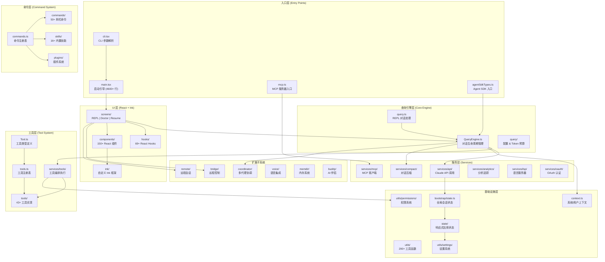
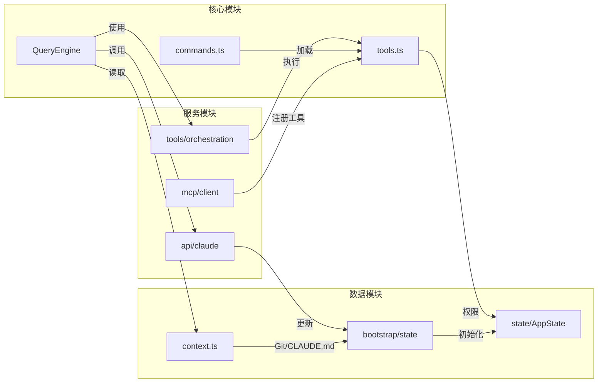
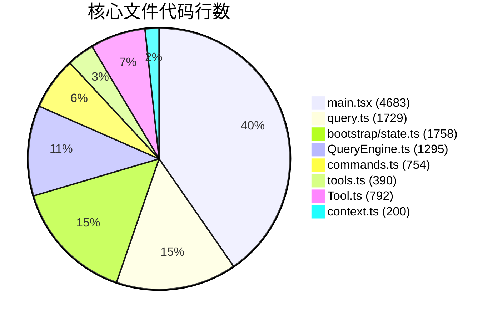
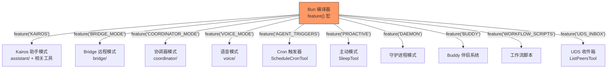
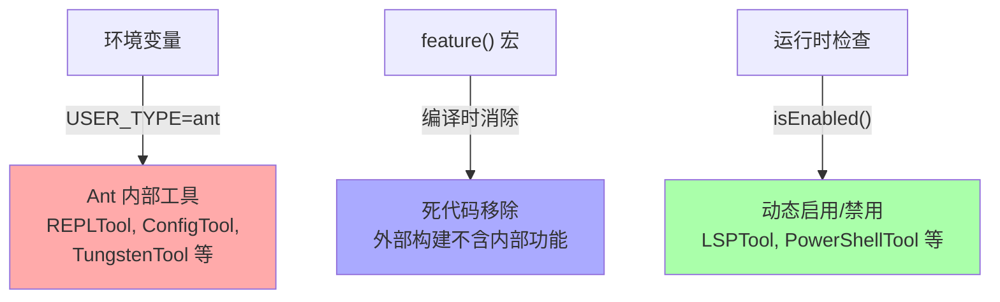

# 01 - 总体架构概览

## 分层架构

```mermaid
graph TB
    subgraph 入口层["入口层 (Entry Points)"]
        CLI["cli.tsx<br/>CLI 参数解析"]
        MAIN["main.tsx<br/>启动引导 (4600+ 行)"]
        MCP_ENTRY["mcp.ts<br/>MCP 服务器入口"]
        SDK_ENTRY["agentSdkTypes.ts<br/>Agent SDK 入口"]
    end

    subgraph UI层["UI 层 (React + Ink)"]
        SCREENS["screens/<br/>REPL | Doctor | Resume"]
        COMPONENTS["components/<br/>150+ React 组件"]
        INK["ink/<br/>自定义 Ink 框架"]
        HOOKS_UI["hooks/<br/>69+ React Hooks"]
    end

    subgraph 引擎层["查询引擎层 (Core Engine)"]
        QE["QueryEngine.ts<br/>对话生命周期管理"]
        QUERY["query.ts<br/>REPL 对话处理"]
        QUERY_CFG["query/<br/>配置 & Token 预算"]
    end

    subgraph 工具层["工具层 (Tool System)"]
        TOOL_DEF["Tool.ts<br/>工具类型定义"]
        TOOL_REG["tools.ts<br/>工具注册表"]
        TOOLS["tools/<br/>43+ 工具实现"]
        TOOL_ORCH["services/tools/<br/>工具编排执行"]
    end

    subgraph 命令层["命令层 (Command System)"]
        CMD_REG["commands.ts<br/>命令注册表"]
        CMDS["commands/<br/>50+ 斜杠命令"]
        SKILLS["skills/<br/>16+ 内置技能"]
        PLUGINS["plugins/<br/>插件系统"]
    end

    subgraph 服务层["服务层 (Services)"]
        API["services/api/<br/>Claude API 调用"]
        MCP_SVC["services/mcp/<br/>MCP 客户端"]
        COMPACT["services/compact/<br/>对话压缩"]
        ANALYTICS["services/analytics/<br/>分析追踪"]
        LSP["services/lsp/<br/>语言服务器"]
        OAUTH["services/oauth/<br/>OAuth 认证"]
    end

    subgraph 基础层["基础设施层"]
        STATE["bootstrap/state.ts<br/>全局会话状态"]
        APPSTATE["state/<br/>响应式应用状态"]
        UTILS["utils/<br/>290+ 工具函数"]
        PERMS["utils/permissions/<br/>权限系统"]
        SETTINGS["utils/settings/<br/>设置系统"]
        CONTEXT["context.ts<br/>系统/用户上下文"]
    end

    subgraph 扩展层["扩展子系统"]
        BRIDGE["bridge/<br/>远程控制"]
        REMOTE["remote/<br/>远程会话"]
        COORD["coordinator/<br/>多代理协调"]
        VOICE["voice/<br/>语音集成"]
        MEMDIR["memdir/<br/>内存系统"]
        BUDDY["buddy/<br/>AI 伴侣"]
    end

    CLI --> MAIN
    MAIN --> SCREENS
    MCP_ENTRY --> MCP_SVC
    SDK_ENTRY --> QE

    SCREENS --> QE
    SCREENS --> HOOKS_UI
    SCREENS --> COMPONENTS
    COMPONENTS --> INK

    QE --> TOOL_ORCH
    QE --> API
    QUERY --> QE

    TOOL_ORCH --> TOOLS
    TOOL_REG --> TOOLS
    TOOL_DEF --> TOOL_REG

    CMD_REG --> CMDS
    CMD_REG --> SKILLS
    CMD_REG --> PLUGINS

    API --> STATE
    TOOL_ORCH --> PERMS
    QE --> CONTEXT
    QE --> COMPACT

    SCREENS --> BRIDGE
    SCREENS --> REMOTE
    QE --> COORD

    STATE --> APPSTATE
    APPSTATE --> SETTINGS
```

## 模块依赖关系

```mermaid
graph LR
    subgraph 核心["核心模块"]
        QE["QueryEngine"]
        TOOLS["tools.ts"]
        CMDS["commands.ts"]
    end

    subgraph 数据["数据模块"]
        BS["bootstrap/state"]
        AS["state/AppState"]
        CTX["context.ts"]
    end

    subgraph 服务["服务模块"]
        API["api/claude"]
        MCP["mcp/client"]
        ORCH["tools/orchestration"]
    end

    QE -->|调用| API
    QE -->|读取| CTX
    QE -->|使用| ORCH
    ORCH -->|执行| TOOLS
    TOOLS -->|权限| AS
    CMDS -->|加载| TOOLS
    API -->|更新| BS
    BS -->|初始化| AS
    CTX -->|Git/CLAUDE.md| BS
    MCP -->|注册工具| TOOLS
```

## 关键文件规模

```mermaid
pie title 核心文件代码行数
    "main.tsx (4683)" : 4683
    "query.ts (1729)" : 1729
    "bootstrap/state.ts (1758)" : 1758
    "QueryEngine.ts (1295)" : 1295
    "commands.ts (754)" : 754
    "tools.ts (390)" : 390
    "Tool.ts (792)" : 792
    "context.ts (200)" : 200
```

## 特性门控（编译时）

```mermaid
graph TD
    BUN["Bun 编译器<br/>feature() 宏"]

    BUN -->|"feature('KAIROS')"| K["Kairos 助手模式<br/>assistant/ + 相关工具"]
    BUN -->|"feature('BRIDGE_MODE')"| B["Bridge 远程模式<br/>bridge/"]
    BUN -->|"feature('COORDINATOR_MODE')"| C["协调器模式<br/>coordinator/"]
    BUN -->|"feature('VOICE_MODE')"| V["语音模式<br/>voice/"]
    BUN -->|"feature('AGENT_TRIGGERS')"| T["Cron 触发器<br/>ScheduleCronTool"]
    BUN -->|"feature('PROACTIVE')"| P["主动模式<br/>SleepTool"]
    BUN -->|"feature('DAEMON')"| D["守护进程模式"]
    BUN -->|"feature('BUDDY')"| BD["Buddy 伴侣系统"]
    BUN -->|"feature('WORKFLOW_SCRIPTS')"| W["工作流脚本"]
    BUN -->|"feature('UDS_INBOX')"| U["UDS 收件箱<br/>ListPeersTool"]

    style BUN fill:#f96,stroke:#333
```

## 条件加载机制

```mermaid
graph TD
    ENV["环境变量"]
    FEAT["feature() 宏"]
    RT["运行时检查"]

    ENV -->|"USER_TYPE=ant"| ANT["Ant 内部工具<br/>REPLTool, ConfigTool,<br/>TungstenTool 等"]
    FEAT -->|编译时消除| DEAD["死代码移除<br/>外部构建不含内部功能"]
    RT -->|"isEnabled()"| DYN["动态启用/禁用<br/>LSPTool, PowerShellTool 等"]

    style ANT fill:#faa
    style DEAD fill:#aaf
    style DYN fill:#afa
```
