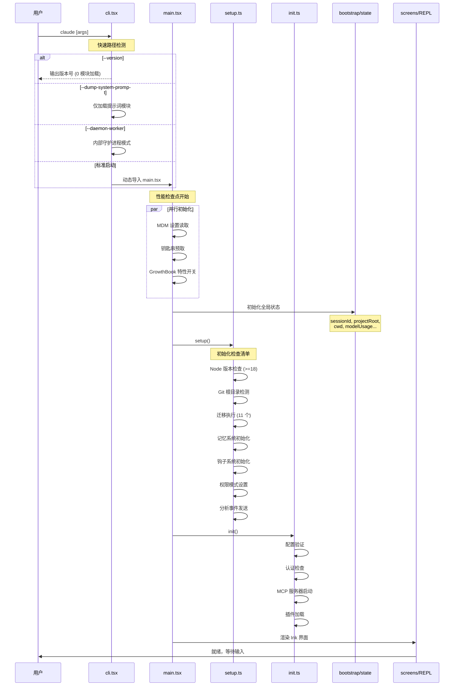
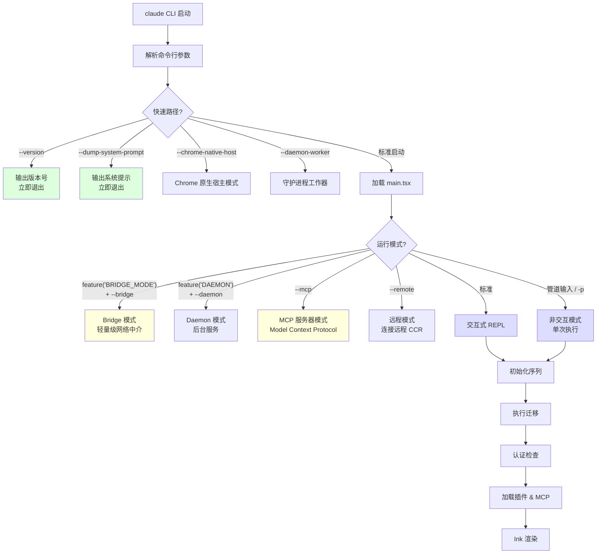
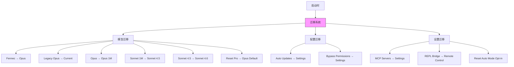

# 02 - 启动流程

## 完整启动序列

```mermaid
sequenceDiagram
    participant User as 用户
    participant CLI as cli.tsx
    participant Main as main.tsx
    participant Setup as setup.ts
    participant Init as init.ts
    participant State as bootstrap/state
    participant REPL as screens/REPL

    User->>CLI: claude [args]
    
    Note over CLI: 快速路径检测
    alt --version
        CLI-->>User: 输出版本号 (0 模块加载)
    else --dump-system-prompt
        CLI->>CLI: 仅加载提示词模块
    else --daemon-worker
        CLI->>CLI: 内部守护进程模式
    else 标准启动
        CLI->>Main: 动态导入 main.tsx
    end

    Note over Main: 性能检查点开始
    
    par 并行初始化
        Main->>Main: MDM 设置读取
        Main->>Main: 钥匙串预取
        Main->>Main: GrowthBook 特性开关
    end

    Main->>State: 初始化全局状态
    Note over State: sessionId, projectRoot,<br/>cwd, modelUsage...

    Main->>Setup: setup()
    
    Note over Setup: 初始化检查清单
    Setup->>Setup: Node 版本检查 (>=18)
    Setup->>Setup: Git 根目录检测
    Setup->>Setup: 迁移执行 (11 个)
    Setup->>Setup: 记忆系统初始化
    Setup->>Setup: 钩子系统初始化
    Setup->>Setup: 权限模式设置
    Setup->>Setup: 分析事件发送

    Main->>Init: init()
    Init->>Init: 配置验证
    Init->>Init: 认证检查
    Init->>Init: MCP 服务器启动
    Init->>Init: 插件加载

    Main->>REPL: 渲染 Ink 界面
    REPL->>User: 就绪，等待输入
```

## 启动模式分支

```mermaid
flowchart TD
    START["claude CLI 启动"] --> ARGS["解析命令行参数"]
    
    ARGS --> CHECK{"快速路径?"}
    
    CHECK -->|"--version"| VER["输出版本号<br/>立即退出"]
    CHECK -->|"--dump-system-prompt"| DUMP["输出系统提示<br/>立即退出"]
    CHECK -->|"--chrome-native-host"| CHROME["Chrome 原生宿主模式"]
    CHECK -->|"--daemon-worker"| DAEMON["守护进程工作器"]
    
    CHECK -->|"标准启动"| LOAD["加载 main.tsx"]
    
    LOAD --> MODE{"运行模式?"}
    
    MODE -->|"feature('BRIDGE_MODE')<br/>+ --bridge"| BRIDGE["Bridge 模式<br/>轻量级网络中介"]
    MODE -->|"feature('DAEMON')<br/>+ --daemon"| DAEMON_MODE["Daemon 模式<br/>后台服务"]
    MODE -->|"--mcp"| MCP_MODE["MCP 服务器模式<br/>Model Context Protocol"]
    MODE -->|"--remote"| REMOTE["远程模式<br/>连接远程 CCR"]
    MODE -->|"标准"| INTERACTIVE["交互式 REPL"]
    MODE -->|"管道输入 / -p"| NON_INT["非交互模式<br/>单次执行"]
    
    INTERACTIVE --> INIT["初始化序列"]
    NON_INT --> INIT
    
    INIT --> MIGRATE["执行迁移"]
    MIGRATE --> AUTH["认证检查"]
    AUTH --> PLUGINS["加载插件 & MCP"]
    PLUGINS --> RENDER["Ink 渲染"]

    style VER fill:#dfd
    style DUMP fill:#dfd
    style BRIDGE fill:#ffd
    style MCP_MODE fill:#ffd
    style INTERACTIVE fill:#ddf
    style NON_INT fill:#ddf
```

## 迁移系统（启动时执行）

```mermaid
graph TD
    BOOT["启动时"] --> MIG["迁移系统"]
    
    MIG --> M1["模型迁移"]
    MIG --> M2["配置迁移"]
    MIG --> M3["设置迁移"]
    
    M1 --> M1A["Fennec → Opus"]
    M1 --> M1B["Legacy Opus → Current"]
    M1 --> M1C["Opus → Opus 1M"]
    M1 --> M1D["Sonnet 1M → Sonnet 4.5"]
    M1 --> M1E["Sonnet 4.5 → Sonnet 4.6"]
    M1 --> M1F["Reset Pro → Opus Default"]
    
    M2 --> M2A["Auto Updates → Settings"]
    M2 --> M2B["Bypass Permissions → Settings"]
    
    M3 --> M3A["MCP Servers → Settings"]
    M3 --> M3B["REPL Bridge → Remote Control"]
    M3 --> M3C["Reset Auto Mode Opt-in"]
    
    style MIG fill:#f9f,stroke:#333
```

## 并行初始化时序

```mermaid
gantt
    title 启动并行初始化
    dateFormat X
    axisFormat %s

    section 第一阶段
    性能检查点        :a1, 0, 1
    参数解析          :a2, 0, 2

    section 第二阶段 (并行)
    MDM 设置读取      :b1, 2, 5
    钥匙串预取        :b2, 2, 4
    GrowthBook 初始化 :b3, 2, 6

    section 第三阶段
    全局状态初始化     :c1, 6, 8
    迁移执行          :c2, 8, 11

    section 第四阶段 (并行)
    MCP 服务器连接    :d1, 11, 16
    插件加载          :d2, 11, 14
    技能目录扫描      :d3, 11, 13

    section 第五阶段
    Ink 界面渲染      :e1, 16, 18
    就绪              :milestone, 18, 18
```
