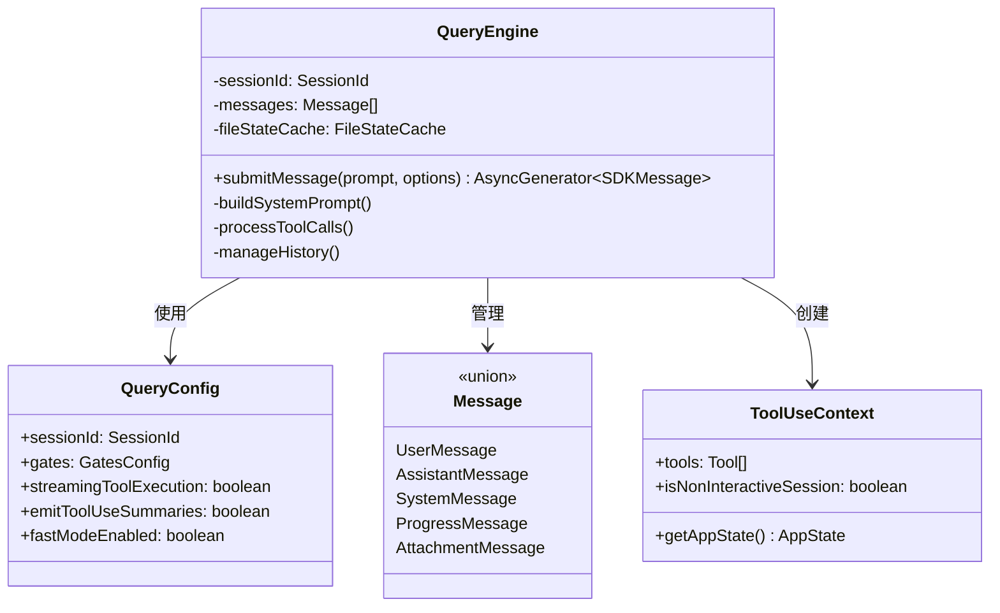
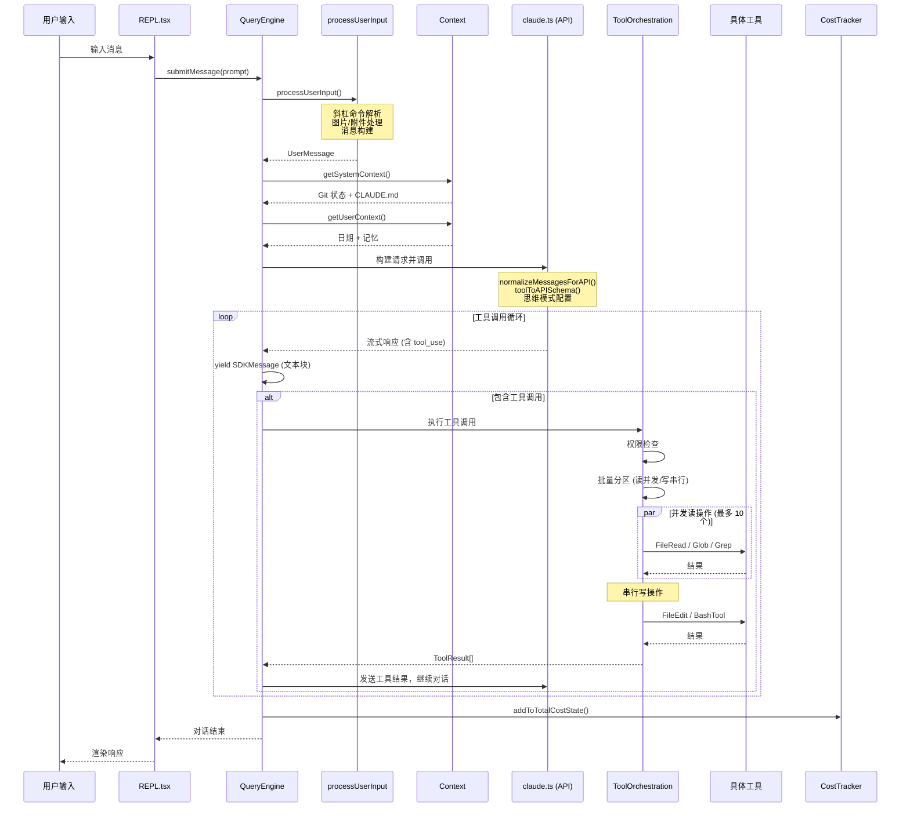
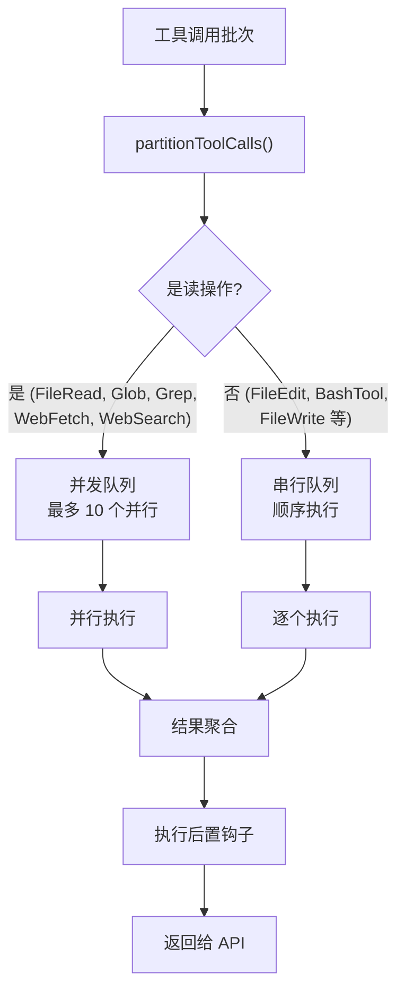
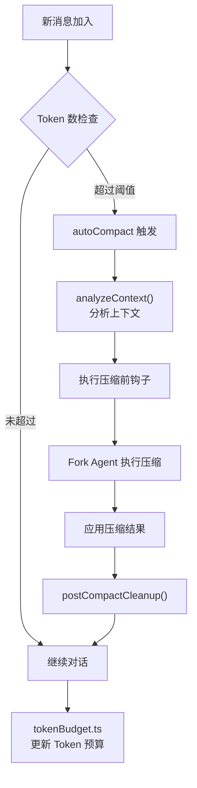
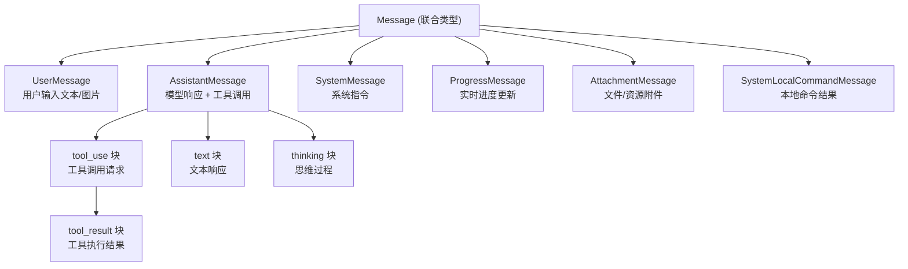

# 03 - 查询引擎与对话生命周期

## 查询引擎核心架构

```mermaid
classDiagram
    class QueryEngine {
        -sessionId: SessionId
        -messages: Message[]
        -fileStateCache: FileStateCache
        +submitMessage(prompt, options) AsyncGenerator~SDKMessage~
        -buildSystemPrompt()
        -processToolCalls()
        -manageHistory()
    }

    class QueryConfig {
        +sessionId: SessionId
        +gates: GatesConfig
        +streamingToolExecution: boolean
        +emitToolUseSummaries: boolean
        +fastModeEnabled: boolean
    }

    class Message {
        <<union>>
        UserMessage
        AssistantMessage
        SystemMessage
        ProgressMessage
        AttachmentMessage
    }

    class ToolUseContext {
        +tools: Tool[]
        +getAppState() AppState
        +isNonInteractiveSession: boolean
    }

    QueryEngine --> QueryConfig : 使用
    QueryEngine --> Message : 管理
    QueryEngine --> ToolUseContext : 创建
```

## 对话完整生命周期

```mermaid
sequenceDiagram
    participant User as 用户输入
    participant REPL as REPL.tsx
    participant QE as QueryEngine
    participant Proc as processUserInput
    participant CTX as Context
    participant API as claude.ts (API)
    participant Orch as ToolOrchestration
    participant Tool as 具体工具
    participant Cost as CostTracker

    User->>REPL: 输入消息
    REPL->>QE: submitMessage(prompt)
    
    QE->>Proc: processUserInput()
    Note over Proc: 斜杠命令解析<br/>图片/附件处理<br/>消息构建
    Proc-->>QE: UserMessage

    QE->>CTX: getSystemContext()
    CTX-->>QE: Git 状态 + CLAUDE.md
    
    QE->>CTX: getUserContext()
    CTX-->>QE: 日期 + 记忆

    QE->>API: 构建请求并调用
    Note over API: normalizeMessagesForAPI()<br/>toolToAPISchema()<br/>思维模式配置

    loop 工具调用循环
        API-->>QE: 流式响应 (含 tool_use)
        QE->>QE: yield SDKMessage (文本块)
        
        alt 包含工具调用
            QE->>Orch: 执行工具调用
            Orch->>Orch: 权限检查
            Orch->>Orch: 批量分区 (读并发/写串行)
            
            par 并发读操作 (最多 10 个)
                Orch->>Tool: FileRead / Glob / Grep
                Tool-->>Orch: 结果
            end
            
            Note over Orch: 串行写操作
            Orch->>Tool: FileEdit / BashTool
            Tool-->>Orch: 结果
            
            Orch-->>QE: ToolResult[]
            QE->>API: 发送工具结果，继续对话
        end
    end
    
    QE->>Cost: addToTotalCostState()
    QE-->>REPL: 对话结束
    REPL-->>User: 渲染响应
```

## 工具调用分区策略

```mermaid
flowchart TD
    CALLS["工具调用批次"] --> PARTITION["partitionToolCalls()"]
    
    PARTITION --> READ{"是读操作?"}
    
    READ -->|"是 (FileRead, Glob, Grep,<br/>WebFetch, WebSearch)"| CONCURRENT["并发队列<br/>最多 10 个并行"]
    READ -->|"否 (FileEdit, BashTool,<br/>FileWrite 等)"| SERIAL["串行队列<br/>顺序执行"]
    
    CONCURRENT --> EXEC_R["并行执行"]
    SERIAL --> EXEC_W["逐个执行"]
    
    EXEC_R --> RESULTS["结果聚合"]
    EXEC_W --> RESULTS
    
    RESULTS --> HOOKS["执行后置钩子"]
    HOOKS --> RETURN["返回给 API"]
```

## 对话压缩触发

```mermaid
flowchart TD
    MSG["新消息加入"] --> CHECK{"Token 数检查"}
    
    CHECK -->|"超过阈值"| AUTO["autoCompact 触发"]
    CHECK -->|"未超过"| CONTINUE["继续对话"]
    
    AUTO --> ANALYZE["analyzeContext()<br/>分析上下文"]
    ANALYZE --> PRE_HOOK["执行压缩前钩子"]
    PRE_HOOK --> FORK["Fork Agent 执行压缩"]
    FORK --> APPLY["应用压缩结果"]
    APPLY --> POST_HOOK["postCompactCleanup()"]
    POST_HOOK --> CONTINUE
    
    CONTINUE --> BUDGET["tokenBudget.ts<br/>更新 Token 预算"]
```

## 消息类型系统

```mermaid
graph TD
    MSG["Message (联合类型)"]
    
    MSG --> USER["UserMessage<br/>用户输入文本/图片"]
    MSG --> ASST["AssistantMessage<br/>模型响应 + 工具调用"]
    MSG --> SYS["SystemMessage<br/>系统指令"]
    MSG --> PROG["ProgressMessage<br/>实时进度更新"]
    MSG --> ATT["AttachmentMessage<br/>文件/资源附件"]
    MSG --> LOCAL["SystemLocalCommandMessage<br/>本地命令结果"]

    ASST --> TOOL_USE["tool_use 块<br/>工具调用请求"]
    ASST --> TEXT["text 块<br/>文本响应"]
    ASST --> THINK["thinking 块<br/>思维过程"]
    
    TOOL_USE --> TOOL_RES["tool_result 块<br/>工具执行结果"]
```
