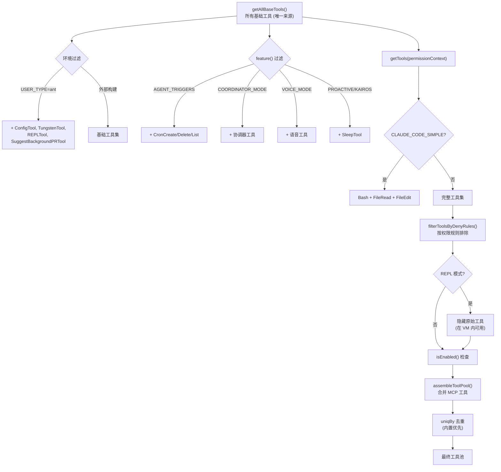
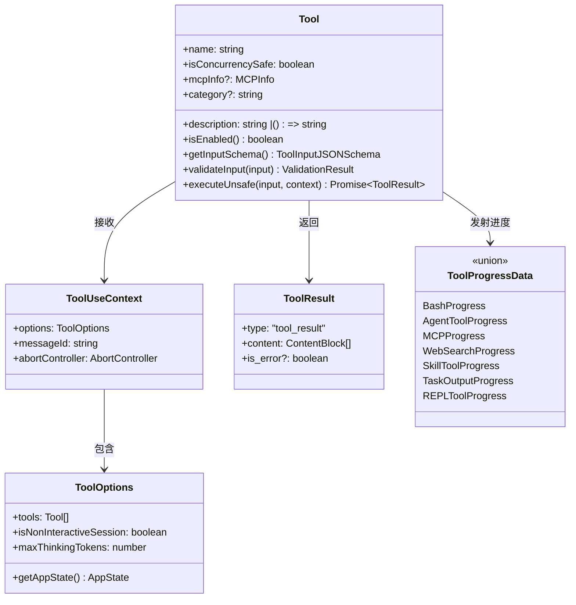
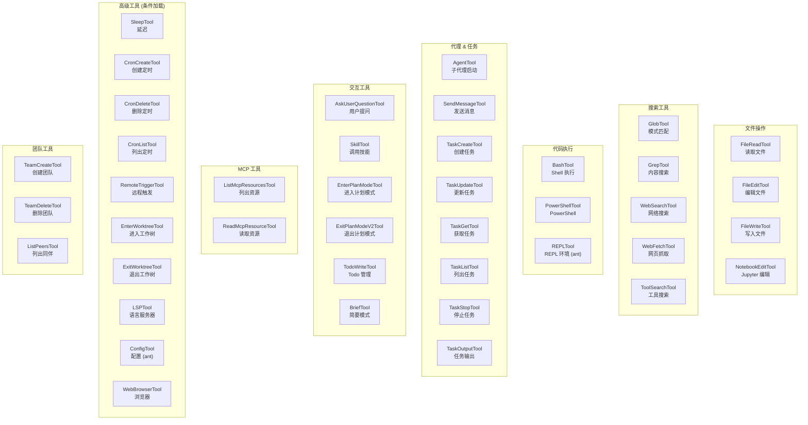
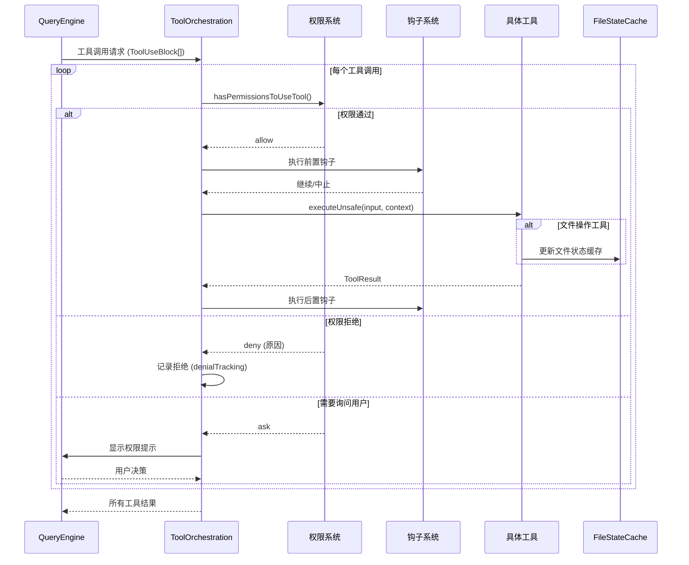
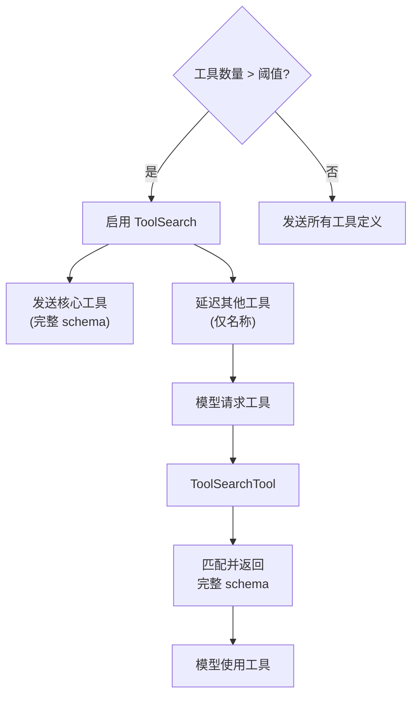

# 04 - 工具系统架构

## 工具注册与过滤流程

```mermaid
flowchart TD
    ALL["getAllBaseTools()<br/>所有基础工具 (唯一来源)"]
    
    ALL --> FILTER1{"环境过滤"}
    FILTER1 -->|"USER_TYPE=ant"| ANT["+ ConfigTool, TungstenTool,<br/>REPLTool, SuggestBackgroundPRTool"]
    FILTER1 -->|"外部构建"| EXT["基础工具集"]
    
    ALL --> FILTER2{"feature() 过滤"}
    FILTER2 -->|"AGENT_TRIGGERS"| CRON["+ CronCreate/Delete/List"]
    FILTER2 -->|"COORDINATOR_MODE"| COORD_T["+ 协调器工具"]
    FILTER2 -->|"VOICE_MODE"| VOICE_T["+ 语音工具"]
    FILTER2 -->|"PROACTIVE/KAIROS"| SLEEP["+ SleepTool"]
    
    ALL --> GET_TOOLS["getTools(permissionContext)"]
    
    GET_TOOLS --> SIMPLE{"CLAUDE_CODE_SIMPLE?"}
    SIMPLE -->|"是"| SIMPLE_SET["Bash + FileRead + FileEdit"]
    SIMPLE -->|"否"| FULL["完整工具集"]
    
    FULL --> DENY["filterToolsByDenyRules()<br/>按权限规则排除"]
    DENY --> REPL_CHECK{"REPL 模式?"}
    REPL_CHECK -->|"是"| HIDE["隐藏原始工具<br/>(在 VM 内可用)"]
    REPL_CHECK -->|"否"| ENABLED["isEnabled() 检查"]
    HIDE --> ENABLED
    
    ENABLED --> ASSEMBLE["assembleToolPool()<br/>合并 MCP 工具"]
    ASSEMBLE --> DEDUP["uniqBy 去重<br/>(内置优先)"]
    DEDUP --> FINAL["最终工具池"]
```

## 工具类型定义

```mermaid
classDiagram
    class Tool {
        +name: string
        +description: string | () => string
        +isEnabled() boolean
        +isConcurrencySafe: boolean
        +getInputSchema() ToolInputJSONSchema
        +validateInput(input) ValidationResult
        +executeUnsafe(input, context) Promise~ToolResult~
        +mcpInfo?: MCPInfo
        +category?: string
    }

    class ToolUseContext {
        +options: ToolOptions
        +messageId: string
        +abortController: AbortController
    }

    class ToolOptions {
        +tools: Tool[]
        +getAppState() AppState
        +isNonInteractiveSession: boolean
        +maxThinkingTokens: number
    }

    class ToolResult {
        +type: "tool_result"
        +content: ContentBlock[]
        +is_error?: boolean
    }

    class ToolProgressData {
        <<union>>
        BashProgress
        AgentToolProgress
        MCPProgress
        WebSearchProgress
        SkillToolProgress
        TaskOutputProgress
        REPLToolProgress
    }

    Tool --> ToolUseContext : 接收
    Tool --> ToolResult : 返回
    Tool --> ToolProgressData : 发射进度
    ToolUseContext --> ToolOptions : 包含
```

## 完整工具清单

```mermaid
graph TD
    subgraph 文件操作["文件操作"]
        FR["FileReadTool<br/>读取文件"]
        FE["FileEditTool<br/>编辑文件"]
        FW["FileWriteTool<br/>写入文件"]
        NE["NotebookEditTool<br/>Jupyter 编辑"]
    end

    subgraph 搜索工具["搜索工具"]
        GL["GlobTool<br/>模式匹配"]
        GR["GrepTool<br/>内容搜索"]
        WS["WebSearchTool<br/>网络搜索"]
        WF["WebFetchTool<br/>网页抓取"]
        TS["ToolSearchTool<br/>工具搜索"]
    end

    subgraph 执行工具["代码执行"]
        BA["BashTool<br/>Shell 执行"]
        PS["PowerShellTool<br/>PowerShell"]
        RP["REPLTool<br/>REPL 环境 (ant)"]
    end

    subgraph 代理工具["代理 & 任务"]
        AG["AgentTool<br/>子代理启动"]
        SM["SendMessageTool<br/>发送消息"]
        TC["TaskCreateTool<br/>创建任务"]
        TU["TaskUpdateTool<br/>更新任务"]
        TG["TaskGetTool<br/>获取任务"]
        TL["TaskListTool<br/>列出任务"]
        TS2["TaskStopTool<br/>停止任务"]
        TO["TaskOutputTool<br/>任务输出"]
    end

    subgraph 交互工具["交互工具"]
        AQ["AskUserQuestionTool<br/>用户提问"]
        SK["SkillTool<br/>调用技能"]
        EP["EnterPlanModeTool<br/>进入计划模式"]
        XP["ExitPlanModeV2Tool<br/>退出计划模式"]
        TD2["TodoWriteTool<br/>Todo 管理"]
        BR["BriefTool<br/>简要模式"]
    end

    subgraph MCP工具["MCP 工具"]
        LR["ListMcpResourcesTool<br/>列出资源"]
        RR["ReadMcpResourceTool<br/>读取资源"]
    end

    subgraph 高级工具["高级工具 (条件加载)"]
        SL["SleepTool<br/>延迟"]
        CC["CronCreateTool<br/>创建定时"]
        CD["CronDeleteTool<br/>删除定时"]
        CL["CronListTool<br/>列出定时"]
        RT["RemoteTriggerTool<br/>远程触发"]
        EW["EnterWorktreeTool<br/>进入工作树"]
        XW["ExitWorktreeTool<br/>退出工作树"]
        LS["LSPTool<br/>语言服务器"]
        CF["ConfigTool<br/>配置 (ant)"]
        WB["WebBrowserTool<br/>浏览器"]
    end

    subgraph 团队工具["团队工具"]
        TCR["TeamCreateTool<br/>创建团队"]
        TDL["TeamDeleteTool<br/>删除团队"]
        LP["ListPeersTool<br/>列出同伴"]
    end
```

## 工具执行流水线

```mermaid
sequenceDiagram
    participant QE as QueryEngine
    participant Orch as ToolOrchestration
    participant Perm as 权限系统
    participant Hook as 钩子系统
    participant Tool as 具体工具
    participant Cache as FileStateCache

    QE->>Orch: 工具调用请求 (ToolUseBlock[])

    loop 每个工具调用
        Orch->>Perm: hasPermissionsToUseTool()
        
        alt 权限通过
            Perm-->>Orch: allow
            Orch->>Hook: 执行前置钩子
            Hook-->>Orch: 继续/中止
            
            Orch->>Tool: executeUnsafe(input, context)
            
            alt 文件操作工具
                Tool->>Cache: 更新文件状态缓存
            end
            
            Tool-->>Orch: ToolResult
            Orch->>Hook: 执行后置钩子
            
        else 权限拒绝
            Perm-->>Orch: deny (原因)
            Orch->>Orch: 记录拒绝 (denialTracking)
            
        else 需要询问用户
            Perm-->>Orch: ask
            Orch->>QE: 显示权限提示
            QE-->>Orch: 用户决策
        end
    end

    Orch-->>QE: 所有工具结果
```

## 工具搜索与延迟加载

```mermaid
flowchart TD
    MANY{"工具数量 > 阈值?"}
    
    MANY -->|"是"| SEARCH["启用 ToolSearch"]
    MANY -->|"否"| ALL["发送所有工具定义"]
    
    SEARCH --> CORE["发送核心工具<br/>(完整 schema)"]
    SEARCH --> DEFER["延迟其他工具<br/>(仅名称)"]
    
    DEFER --> MODEL["模型请求工具"]
    MODEL --> TS_TOOL["ToolSearchTool"]
    TS_TOOL --> MATCH["匹配并返回<br/>完整 schema"]
    MATCH --> USE["模型使用工具"]
```
