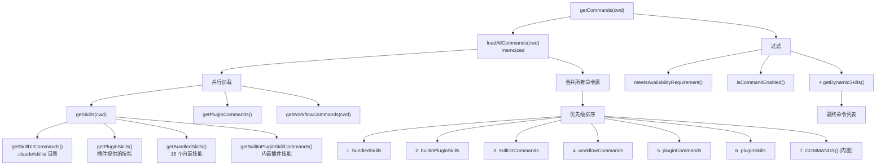
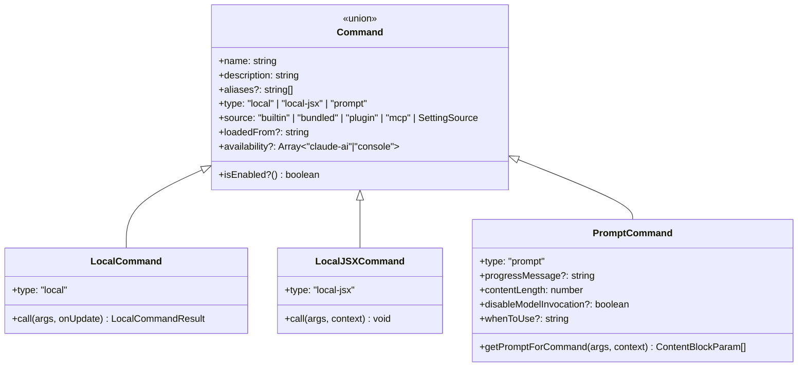
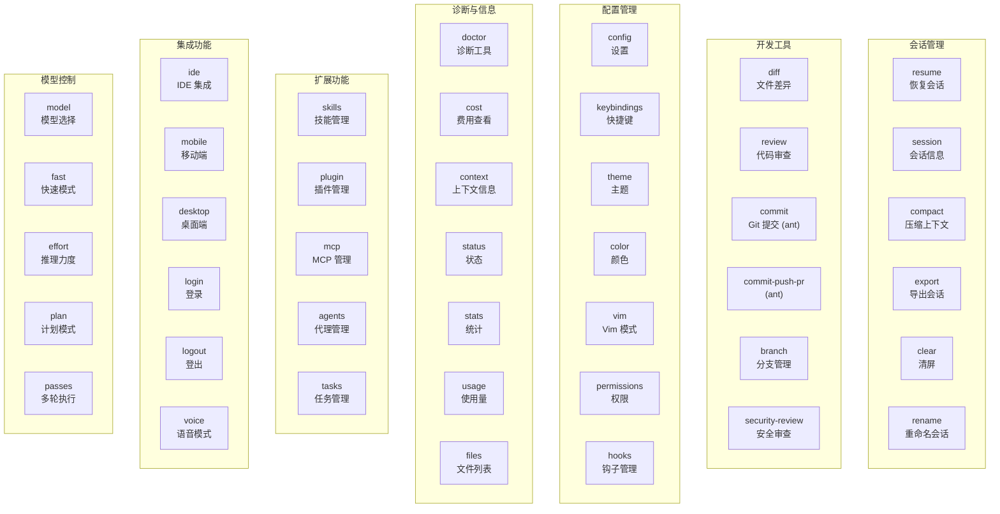
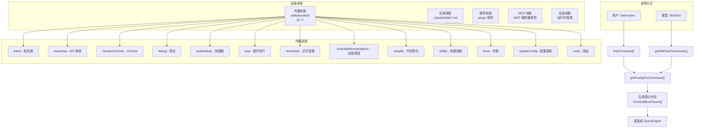
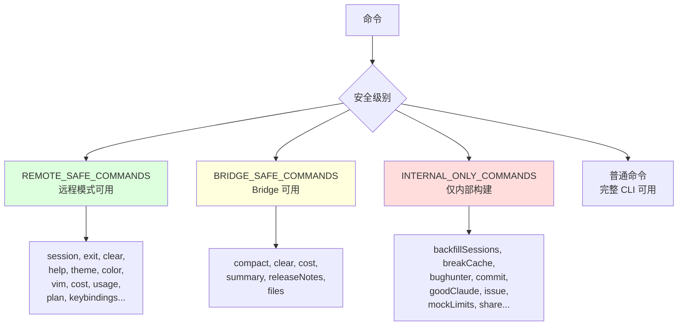

# 05 - 命令系统与技能/插件集成

## 命令加载架构

```mermaid
flowchart TD
    GET["getCommands(cwd)"]
    
    GET --> LOAD["loadAllCommands(cwd)<br/>memoized"]
    
    LOAD --> PAR["并行加载"]
    
    PAR --> SKILLS_LOAD["getSkills(cwd)"]
    PAR --> PLUGIN_LOAD["getPluginCommands()"]
    PAR --> WORKFLOW_LOAD["getWorkflowCommands(cwd)"]
    
    SKILLS_LOAD --> SKILL_DIR["getSkillDirCommands()<br/>.claude/skills/ 目录"]
    SKILLS_LOAD --> PLUGIN_SKILLS["getPluginSkills()<br/>插件提供的技能"]
    SKILLS_LOAD --> BUNDLED["getBundledSkills()<br/>16 个内置技能"]
    SKILLS_LOAD --> BUILTIN_P["getBuiltinPluginSkillCommands()<br/>内置插件技能"]
    
    LOAD --> MERGE["合并所有命令源"]
    
    MERGE --> ORDER["优先级排序"]
    ORDER --> O1["1. bundledSkills"]
    ORDER --> O2["2. builtinPluginSkills"]
    ORDER --> O3["3. skillDirCommands"]
    ORDER --> O4["4. workflowCommands"]
    ORDER --> O5["5. pluginCommands"]
    ORDER --> O6["6. pluginSkills"]
    ORDER --> O7["7. COMMANDS() (内置)"]
    
    GET --> FILTER["过滤"]
    FILTER --> AVAIL["meetsAvailabilityRequirement()"]
    FILTER --> ENABLED["isCommandEnabled()"]
    FILTER --> DYN["+ getDynamicSkills()"]
    
    DYN --> FINAL["最终命令列表"]
```

## 命令类型体系

```mermaid
classDiagram
    class Command {
        <<union>>
        +name: string
        +description: string
        +aliases?: string[]
        +type: "local" | "local-jsx" | "prompt"
        +source: "builtin" | "bundled" | "plugin" | "mcp" | SettingSource
        +loadedFrom?: string
        +availability?: Array~"claude-ai"|"console"~
        +isEnabled?() boolean
    }

    class LocalCommand {
        +type: "local"
        +call(args, onUpdate) LocalCommandResult
    }

    class LocalJSXCommand {
        +type: "local-jsx"
        +call(args, context) void
    }

    class PromptCommand {
        +type: "prompt"
        +getPromptForCommand(args, context) ContentBlockParam[]
        +progressMessage?: string
        +contentLength: number
        +disableModelInvocation?: boolean
        +whenToUse?: string
    }

    Command <|-- LocalCommand
    Command <|-- LocalJSXCommand
    Command <|-- PromptCommand
```

## 内置命令分类

```mermaid
graph TD
    subgraph 会话管理["会话管理"]
        RESUME["resume<br/>恢复会话"]
        SESSION["session<br/>会话信息"]
        COMPACT["compact<br/>压缩上下文"]
        EXPORT["export<br/>导出会话"]
        CLEAR["clear<br/>清屏"]
        RENAME["rename<br/>重命名会话"]
    end

    subgraph 开发工具["开发工具"]
        DIFF["diff<br/>文件差异"]
        REVIEW["review<br/>代码审查"]
        COMMIT["commit<br/>Git 提交 (ant)"]
        CPR["commit-push-pr<br/>(ant)"]
        BRANCH["branch<br/>分支管理"]
        SEC_REV["security-review<br/>安全审查"]
    end

    subgraph 配置管理["配置管理"]
        CONFIG["config<br/>设置"]
        KEYBIND["keybindings<br/>快捷键"]
        THEME["theme<br/>主题"]
        COLOR["color<br/>颜色"]
        VIM_CMD["vim<br/>Vim 模式"]
        PERM["permissions<br/>权限"]
        HOOKS_CMD["hooks<br/>钩子管理"]
    end

    subgraph 诊断信息["诊断与信息"]
        DOCTOR["doctor<br/>诊断工具"]
        COST["cost<br/>费用查看"]
        CONTEXT_CMD["context<br/>上下文信息"]
        STATUS["status<br/>状态"]
        STATS["stats<br/>统计"]
        USAGE["usage<br/>使用量"]
        FILES["files<br/>文件列表"]
    end

    subgraph 扩展功能["扩展功能"]
        SKILLS_CMD["skills<br/>技能管理"]
        PLUGIN_CMD["plugin<br/>插件管理"]
        MCP_CMD["mcp<br/>MCP 管理"]
        AGENTS_CMD["agents<br/>代理管理"]
        TASKS_CMD["tasks<br/>任务管理"]
    end

    subgraph 集成功能["集成功能"]
        IDE["ide<br/>IDE 集成"]
        MOBILE["mobile<br/>移动端"]
        DESKTOP["desktop<br/>桌面端"]
        LOGIN["login<br/>登录"]
        LOGOUT["logout<br/>登出"]
        VOICE_CMD["voice<br/>语音模式"]
    end

    subgraph 模型控制["模型控制"]
        MODEL["model<br/>模型选择"]
        FAST["fast<br/>快速模式"]
        EFFORT["effort<br/>推理力度"]
        PLAN["plan<br/>计划模式"]
        PASSES["passes<br/>多轮执行"]
    end
```

## 技能系统架构

```mermaid
flowchart TD
    subgraph 技能来源["技能来源"]
        BUNDLED["内置技能<br/>skills/bundled/<br/>16 个"]
        SKILL_DIR["目录技能<br/>.claude/skills/*.md"]
        PLUGIN_SK["插件技能<br/>plugin 提供"]
        MCP_SK["MCP 技能<br/>MCP 服务器提供"]
        DYNAMIC["动态技能<br/>运行时发现"]
    end

    subgraph 内置技能清单["内置技能"]
        S1["batch - 批处理"]
        S2["claudeApi - API 调用"]
        S3["claudeInChrome - Chrome"]
        S4["debug - 调试"]
        S5["keybindings - 快捷键"]
        S6["loop - 循环执行"]
        S7["remember - 记忆管理"]
        S8["scheduleRemoteAgents - 远程调度"]
        S9["simplify - 代码简化"]
        S10["skillify - 创建技能"]
        S11["stuck - 求助"]
        S12["updateConfig - 配置更新"]
        S13["verify - 验证"]
    end

    BUNDLED --> S1 & S2 & S3 & S4 & S5 & S6 & S7 & S8 & S9 & S10 & S11 & S12 & S13

    subgraph 调用方式["调用方式"]
        USER_SLASH["用户: /skill-name"]
        MODEL_SKILL["模型: SkillTool"]
    end

    USER_SLASH --> FIND["findCommand()"]
    MODEL_SKILL --> SK_TOOL["getSkillToolCommands()"]
    
    FIND --> EXEC["getPromptForCommand()"]
    SK_TOOL --> EXEC
    EXEC --> PROMPT["生成提示内容<br/>ContentBlockParam[]"]
    PROMPT --> QE["发送给 QueryEngine"]
```

## 命令安全分级

```mermaid
graph TD
    CMD["命令"] --> SAFE{"安全级别"}
    
    SAFE --> REMOTE_SAFE["REMOTE_SAFE_COMMANDS<br/>远程模式可用"]
    SAFE --> BRIDGE_SAFE["BRIDGE_SAFE_COMMANDS<br/>Bridge 可用"]
    SAFE --> INTERNAL["INTERNAL_ONLY_COMMANDS<br/>仅内部构建"]
    SAFE --> NORMAL["普通命令<br/>完整 CLI 可用"]
    
    REMOTE_SAFE --> RS1["session, exit, clear,<br/>help, theme, color,<br/>vim, cost, usage,<br/>plan, keybindings..."]
    
    BRIDGE_SAFE --> BS1["compact, clear, cost,<br/>summary, releaseNotes,<br/>files"]
    
    INTERNAL --> IS1["backfillSessions, breakCache,<br/>bughunter, commit,<br/>goodClaude, issue,<br/>mockLimits, share..."]

    style REMOTE_SAFE fill:#dfd
    style BRIDGE_SAFE fill:#ffd
    style INTERNAL fill:#fdd
```
