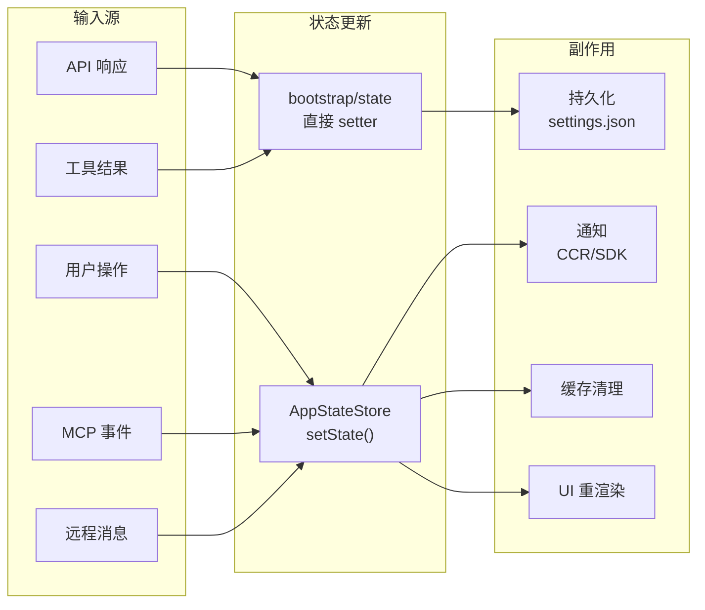
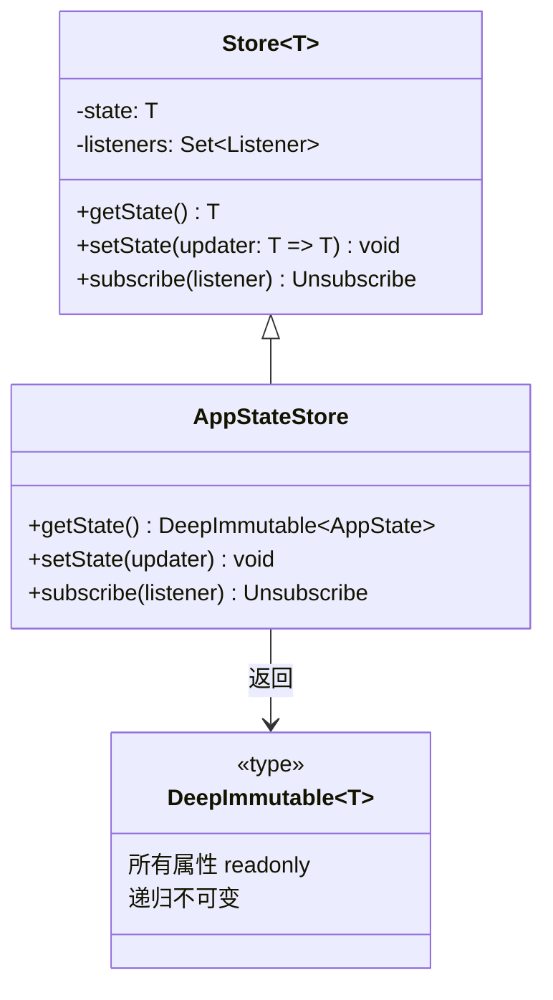
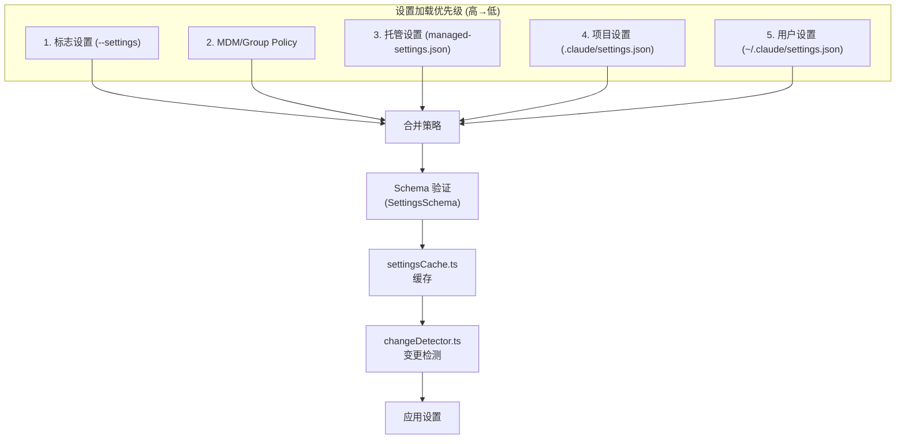
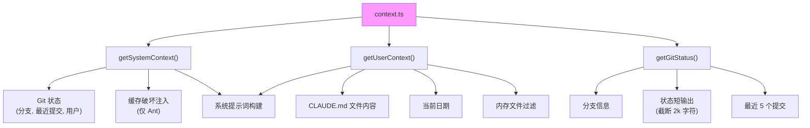

# 06 - 状态管理与数据流

## 双层状态架构

```mermaid
graph TB
    subgraph 引导层["引导层 (bootstrap/state.ts)"]
        direction TB
        BS["全局会话状态<br/>1758 行"]
        BS_META["会话元数据<br/>sessionId, projectRoot, cwd"]
        BS_COST["资源统计<br/>totalCostUSD, totalAPIDuration"]
        BS_MODEL["模型配置<br/>modelUsage, mainLoopModelOverride"]
        BS_TELE["遥测<br/>meter, counters, statsStore"]
        BS_AGENT["代理<br/>agentColorMap, sessionCreatedTeams"]
        BS_FLAGS["标志<br/>isInteractive, kairosActive"]
        
        BS --- BS_META
        BS --- BS_COST
        BS --- BS_MODEL
        BS --- BS_TELE
        BS --- BS_AGENT
        BS --- BS_FLAGS
    end

    subgraph 应用层["应用层 (state/AppStateStore.ts)"]
        direction TB
        AS["响应式应用状态<br/>DeepImmutable"]
        AS_SET["settings: SettingsJson"]
        AS_TASK["tasks: Map<TaskState>"]
        AS_MCP["mcp: { clients, tools,<br/>commands, resources }"]
        AS_PLUG["plugins: { enabled,<br/>disabled, errors }"]
        AS_PERM["toolPermissionContext"]
        AS_REMOTE["remoteSessionUrl,<br/>remoteConnectionStatus"]
        AS_COORD["coordinatorTaskIndex,<br/>viewSelectionMode"]
        AS_UI["expandedView,<br/>footerSelection"]
        
        AS --- AS_SET
        AS --- AS_TASK
        AS --- AS_MCP
        AS --- AS_PLUG
        AS --- AS_PERM
        AS --- AS_REMOTE
        AS --- AS_COORD
        AS --- AS_UI
    end

    BS -->|"初始化"| AS

    subgraph 变更层["变更处理 (onChangeAppState.ts)"]
        OC["状态变化监听器"]
        OC_PERM["权限模式变更<br/>→ notifyPermissionModeChanged"]
        OC_MODEL["模型变更<br/>→ updateSettingsForSource"]
        OC_UI["UI 偏好<br/>→ saveGlobalConfig"]
        OC_CACHE["缓存清理<br/>→ API 密钥/凭证"]
        
        OC --- OC_PERM
        OC --- OC_MODEL
        OC --- OC_UI
        OC --- OC_CACHE
    end

    AS -->|"subscribe"| OC

    subgraph 选择器["选择器 (selectors.ts)"]
        SEL["派生状态"]
        SEL_TASK["getViewedTeammateTask()"]
        SEL_AGENT["getActiveAgentForInput()"]
    end

    AS -->|"读取"| SEL

    style BS fill:#ffd
    style AS fill:#ddf
    style OC fill:#fdf
```

## 状态数据流

```mermaid
flowchart LR
    subgraph 输入["输入源"]
        USER["用户操作"]
        API_RESP["API 响应"]
        TOOL_RES["工具结果"]
        MCP_EVT["MCP 事件"]
        REMOTE_MSG["远程消息"]
    end

    subgraph 状态更新["状态更新"]
        BS_UPDATE["bootstrap/state<br/>直接 setter"]
        AS_UPDATE["AppStateStore<br/>setState()"]
    end

    subgraph 副作用["副作用"]
        PERSIST["持久化<br/>settings.json"]
        NOTIFY["通知<br/>CCR/SDK"]
        CLEAR["缓存清理"]
        RENDER["UI 重渲染"]
    end

    USER --> AS_UPDATE
    API_RESP --> BS_UPDATE
    TOOL_RES --> BS_UPDATE
    MCP_EVT --> AS_UPDATE
    REMOTE_MSG --> AS_UPDATE

    BS_UPDATE --> PERSIST
    AS_UPDATE --> NOTIFY
    AS_UPDATE --> CLEAR
    AS_UPDATE --> RENDER
```

## Store 模式实现

```mermaid
classDiagram
    class Store~T~ {
        -state: T
        -listeners: Set~Listener~
        +getState() T
        +setState(updater: T => T) void
        +subscribe(listener) Unsubscribe
    }

    class AppStateStore {
        +getState() DeepImmutable~AppState~
        +setState(updater) void
        +subscribe(listener) Unsubscribe
    }

    class DeepImmutable~T~ {
        <<type>>
        所有属性 readonly
        递归不可变
    }

    Store <|-- AppStateStore
    AppStateStore --> DeepImmutable : 返回
```

## 设置系统层级

```mermaid
flowchart TD
    subgraph 设置源["设置加载优先级 (高→低)"]
        S1["1. 标志设置 (--settings)"]
        S2["2. MDM/Group Policy"]
        S3["3. 托管设置 (managed-settings.json)"]
        S4["4. 项目设置 (.claude/settings.json)"]
        S5["5. 用户设置 (~/.claude/settings.json)"]
    end

    S1 --> MERGE["合并策略"]
    S2 --> MERGE
    S3 --> MERGE
    S4 --> MERGE
    S5 --> MERGE

    MERGE --> VALIDATE["Schema 验证<br/>(SettingsSchema)"]
    VALIDATE --> CACHE["settingsCache.ts<br/>缓存"]
    CACHE --> DETECT["changeDetector.ts<br/>变更检测"]
    DETECT --> APPLY["应用设置"]
```

## 上下文系统

```mermaid
flowchart TD
    CTX["context.ts"]
    
    CTX --> SYS["getSystemContext()"]
    CTX --> USR["getUserContext()"]
    CTX --> GIT["getGitStatus()"]
    
    SYS --> GIT_INFO["Git 状态<br/>(分支, 最近提交, 用户)"]
    SYS --> CACHE_BREAK["缓存破坏注入<br/>(仅 Ant)"]
    
    USR --> CLAUDE_MD["CLAUDE.md 文件内容"]
    USR --> DATE["当前日期"]
    USR --> MEM_FILTER["内存文件过滤"]
    
    GIT --> GIT_BRANCH["分支信息"]
    GIT --> GIT_STATUS["状态短输出<br/>(截断 2k 字符)"]
    GIT --> GIT_LOG["最近 5 个提交"]
    
    SYS & USR --> PROMPT["系统提示词构建"]
    
    style CTX fill:#f9f
```
