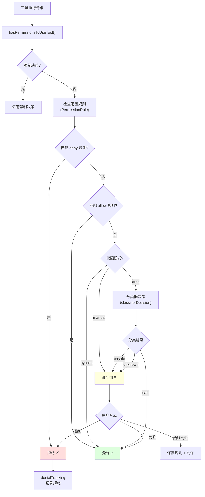
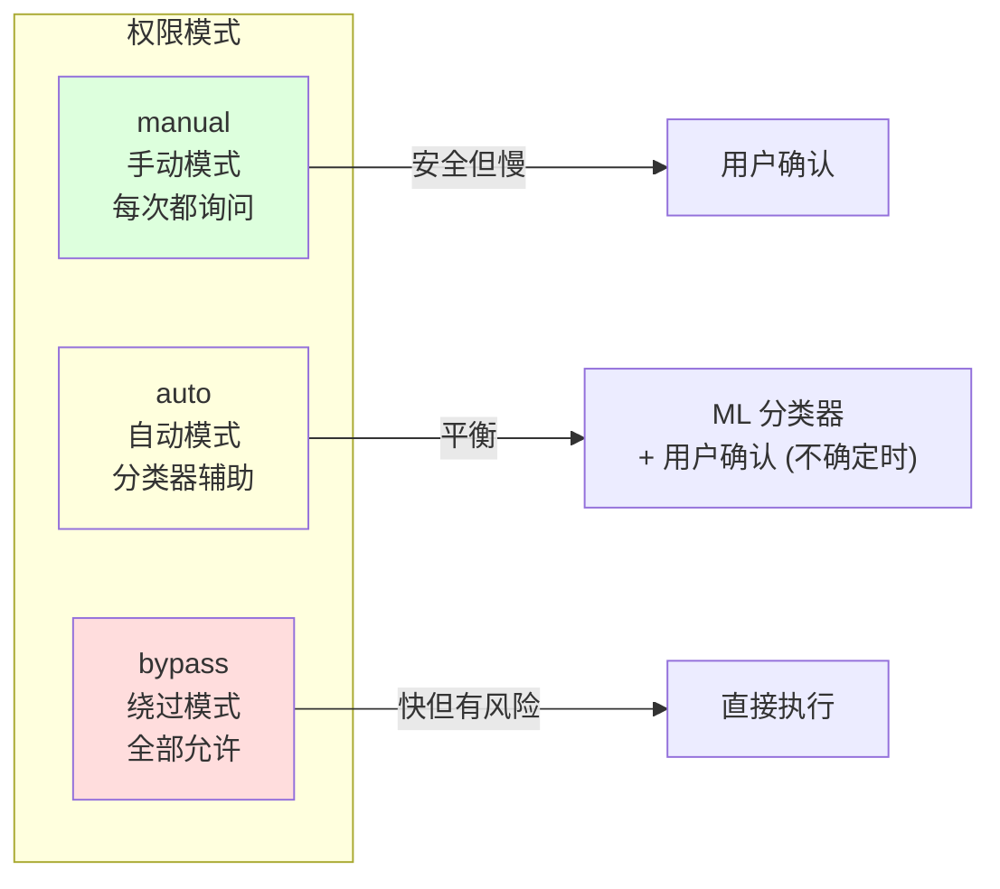
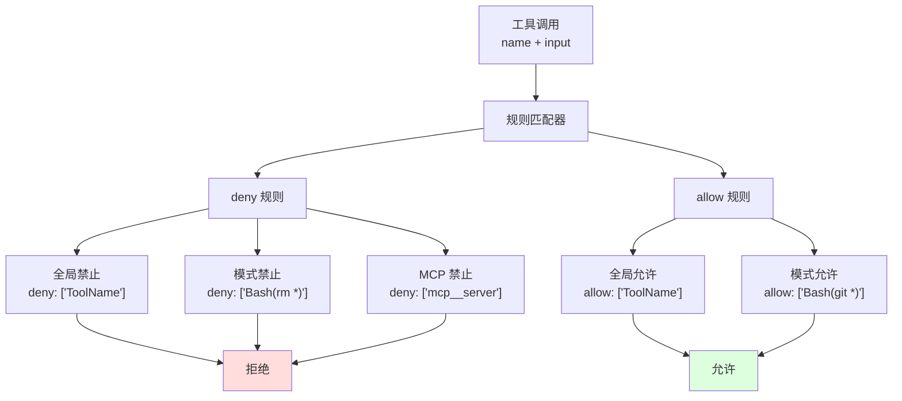
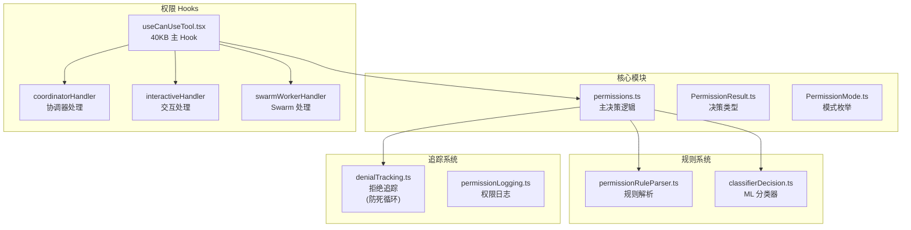
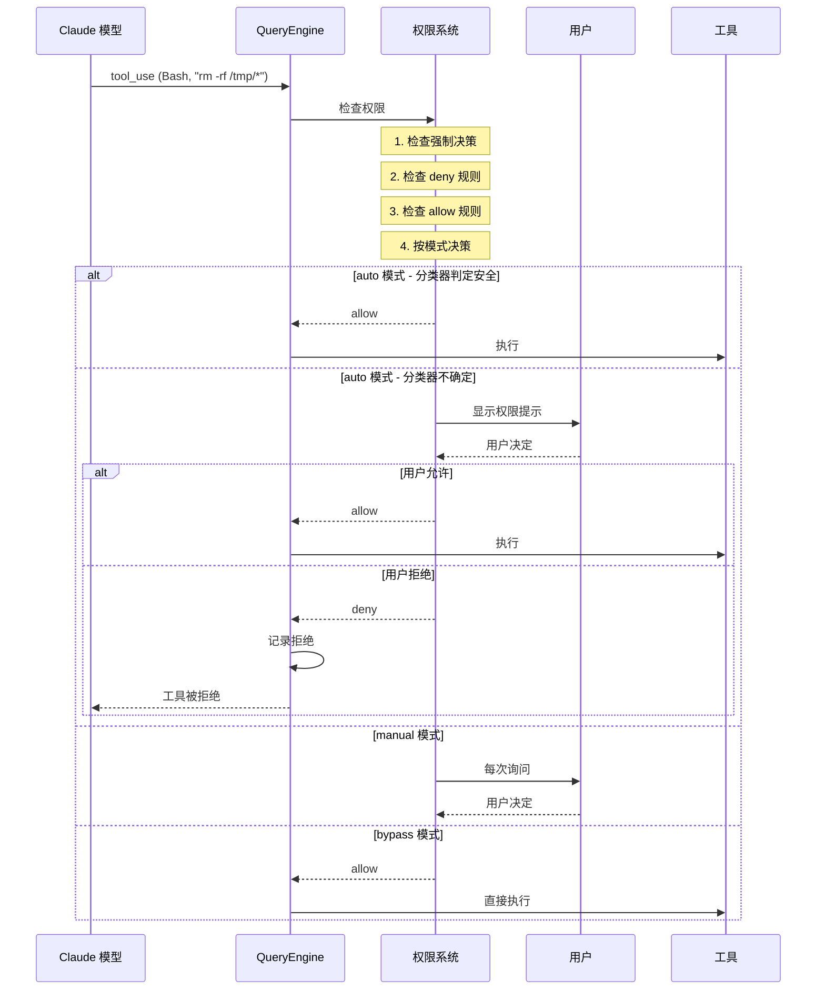

# 07 - 权限系统

## 权限决策总流程

```mermaid
flowchart TD
    REQ["工具执行请求"] --> CHECK["hasPermissionsToUseTool()"]
    
    CHECK --> FORCED{"强制决策?"}
    FORCED -->|"是"| USE_FORCED["使用强制决策"]
    
    FORCED -->|"否"| RULES["检查配置规则<br/>(PermissionRule)"]
    
    RULES --> DENY_RULE{"匹配 deny 规则?"}
    DENY_RULE -->|"是"| DENY["拒绝 ✗"]
    
    DENY_RULE -->|"否"| ALLOW_RULE{"匹配 allow 规则?"}
    ALLOW_RULE -->|"是"| ALLOW["允许 ✓"]
    
    ALLOW_RULE -->|"否"| MODE{"权限模式?"}
    
    MODE -->|"bypass"| ALLOW
    MODE -->|"auto"| CLASSIFIER["分类器决策<br/>(classifierDecision)"]
    MODE -->|"manual"| ASK["询问用户"]
    
    CLASSIFIER --> CLS_RESULT{"分类结果"}
    CLS_RESULT -->|"safe"| ALLOW
    CLS_RESULT -->|"unsafe"| ASK
    CLS_RESULT -->|"unknown"| ASK
    
    ASK --> USER_RESP{"用户响应"}
    USER_RESP -->|"允许"| ALLOW
    USER_RESP -->|"始终允许"| SAVE_ALLOW["保存规则 + 允许"]
    USER_RESP -->|"拒绝"| DENY
    
    DENY --> TRACK["denialTracking<br/>记录拒绝"]
    
    style ALLOW fill:#dfd
    style DENY fill:#fdd
    style ASK fill:#ffd
```

## 权限模式

```mermaid
graph LR
    subgraph 三种模式["权限模式"]
        MANUAL["manual<br/>手动模式<br/>每次都询问"]
        AUTO["auto<br/>自动模式<br/>分类器辅助"]
        BYPASS["bypass<br/>绕过模式<br/>全部允许"]
    end

    MANUAL -->|"安全但慢"| USER["用户确认"]
    AUTO -->|"平衡"| ML["ML 分类器<br/>+ 用户确认 (不确定时)"]
    BYPASS -->|"快但有风险"| DIRECT["直接执行"]

    style MANUAL fill:#dfd
    style AUTO fill:#ffd
    style BYPASS fill:#fdd
```

## 权限规则匹配

```mermaid
flowchart TD
    TOOL_CALL["工具调用<br/>name + input"]
    
    TOOL_CALL --> MATCH["规则匹配器"]
    
    MATCH --> DENY_R["deny 规则"]
    MATCH --> ALLOW_R["allow 规则"]
    
    DENY_R --> D_BLANKET["全局禁止<br/>deny: ['ToolName']"]
    DENY_R --> D_PATTERN["模式禁止<br/>deny: ['Bash(rm *)']"]
    DENY_R --> D_MCP["MCP 禁止<br/>deny: ['mcp__server']"]
    
    ALLOW_R --> A_BLANKET["全局允许<br/>allow: ['ToolName']"]
    ALLOW_R --> A_PATTERN["模式允许<br/>allow: ['Bash(git *)']"]
    
    D_BLANKET & D_PATTERN & D_MCP --> DENY_RES["拒绝"]
    A_BLANKET & A_PATTERN --> ALLOW_RES["允许"]

    style DENY_RES fill:#fdd
    style ALLOW_RES fill:#dfd
```

## 权限系统文件结构

```mermaid
graph TD
    subgraph 核心["核心模块"]
        PERM["permissions.ts<br/>主决策逻辑"]
        RESULT["PermissionResult.ts<br/>决策类型"]
        MODE["PermissionMode.ts<br/>模式枚举"]
    end

    subgraph 规则["规则系统"]
        PARSER["permissionRuleParser.ts<br/>规则解析"]
        CLASSIFIER["classifierDecision.ts<br/>ML 分类器"]
    end

    subgraph 追踪["追踪系统"]
        DENIAL["denialTracking.ts<br/>拒绝追踪<br/>(防死循环)"]
        LOGGING["permissionLogging.ts<br/>权限日志"]
    end

    subgraph 钩子["权限 Hooks"]
        CAN_USE["useCanUseTool.tsx<br/>40KB 主 Hook"]
        COORD_H["coordinatorHandler<br/>协调器处理"]
        INTER_H["interactiveHandler<br/>交互处理"]
        SWARM_H["swarmWorkerHandler<br/>Swarm 处理"]
    end

    CAN_USE --> PERM
    PERM --> PARSER
    PERM --> CLASSIFIER
    PERM --> DENIAL
    CAN_USE --> COORD_H & INTER_H & SWARM_H
```

## 权限检查在工具执行中的位置

```mermaid
sequenceDiagram
    participant Model as Claude 模型
    participant QE as QueryEngine
    participant Perm as 权限系统
    participant User as 用户
    participant Tool as 工具

    Model->>QE: tool_use (Bash, "rm -rf /tmp/*")
    QE->>Perm: 检查权限
    
    Note over Perm: 1. 检查强制决策
    Note over Perm: 2. 检查 deny 规则
    Note over Perm: 3. 检查 allow 规则
    Note over Perm: 4. 按模式决策
    
    alt auto 模式 - 分类器判定安全
        Perm-->>QE: allow
        QE->>Tool: 执行
    else auto 模式 - 分类器不确定
        Perm->>User: 显示权限提示
        User-->>Perm: 用户决定
        alt 用户允许
            Perm-->>QE: allow
            QE->>Tool: 执行
        else 用户拒绝
            Perm-->>QE: deny
            QE->>QE: 记录拒绝
            QE-->>Model: 工具被拒绝
        end
    else manual 模式
        Perm->>User: 每次询问
        User-->>Perm: 用户决定
    else bypass 模式
        Perm-->>QE: allow
        QE->>Tool: 直接执行
    end
```
