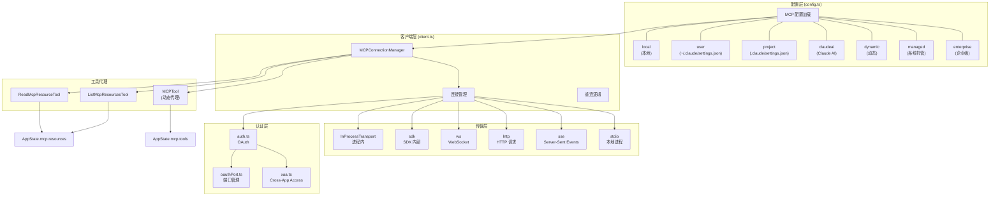
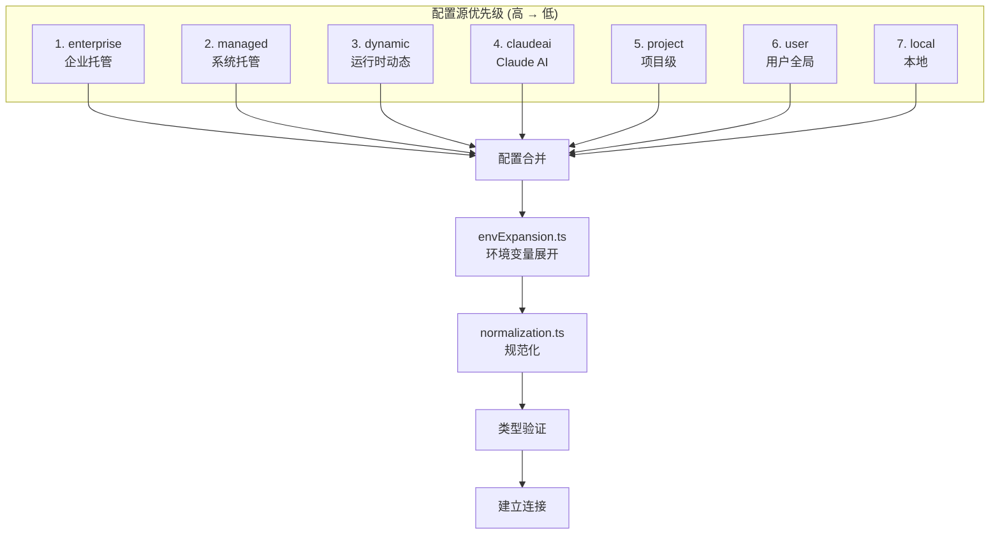
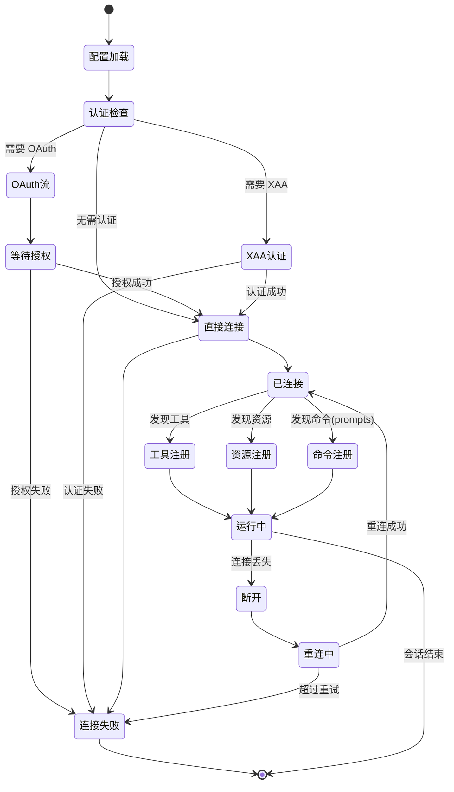
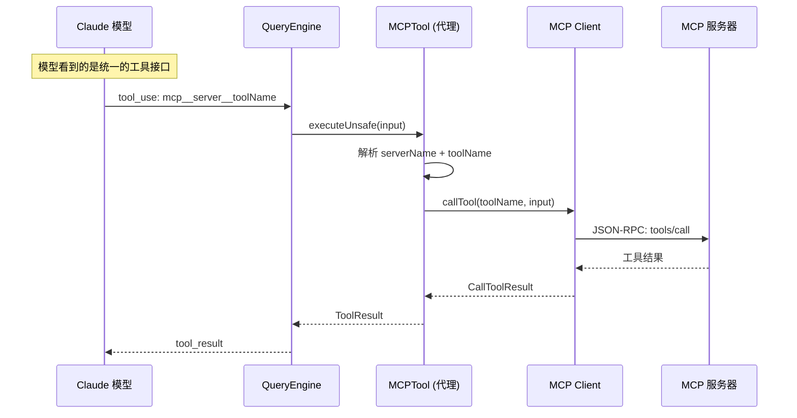
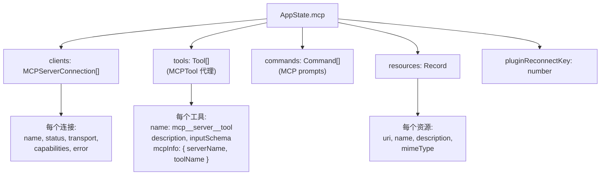

# 08 - MCP (Model Context Protocol) 集成

## MCP 整体架构

```mermaid
graph TB
    subgraph 配置层["配置层 (config.ts)"]
        direction TB
        CFG["MCP 配置加载"]
        CFG_ENT["enterprise<br/>(企业级)"]
        CFG_MAN["managed<br/>(系统托管)"]
        CFG_DYN["dynamic<br/>(动态)"]
        CFG_CAI["claudeai<br/>(Claude AI)"]
        CFG_PRJ["project<br/>(.claude/settings.json)"]
        CFG_USR["user<br/>(~/.claude/settings.json)"]
        CFG_LOC["local<br/>(本地)"]
        
        CFG --- CFG_ENT
        CFG --- CFG_MAN
        CFG --- CFG_DYN
        CFG --- CFG_CAI
        CFG --- CFG_PRJ
        CFG --- CFG_USR
        CFG --- CFG_LOC
    end

    subgraph 客户端层["客户端层 (client.ts)"]
        CLIENT["MCPConnectionManager"]
        CONN["连接管理"]
        RECONNECT["重连逻辑"]
    end

    subgraph 传输层["传输层"]
        STDIO["stdio<br/>本地进程"]
        SSE["sse<br/>Server-Sent Events"]
        HTTP["http<br/>HTTP 请求"]
        WS["ws<br/>WebSocket"]
        SDK_TR["sdk<br/>SDK 内部"]
        IN_PROC["InProcessTransport<br/>进程内"]
    end

    subgraph 认证层["认证层"]
        AUTH["auth.ts<br/>OAuth"]
        XAA["xaa.ts<br/>Cross-App Access"]
        OAUTH_PORT["oauthPort.ts<br/>端口管理"]
    end

    subgraph 工具层["工具代理"]
        MCP_TOOL["MCPTool<br/>(动态代理)"]
        LIST_RES["ListMcpResourcesTool"]
        READ_RES["ReadMcpResourceTool"]
    end

    CFG --> CLIENT
    CLIENT --> CONN
    CONN --> STDIO & SSE & HTTP & WS & SDK_TR & IN_PROC
    CONN --> AUTH
    AUTH --> XAA
    AUTH --> OAUTH_PORT
    CLIENT --> MCP_TOOL & LIST_RES & READ_RES

    MCP_TOOL --> APPSTATE["AppState.mcp.tools"]
    LIST_RES --> RESOURCES["AppState.mcp.resources"]
    READ_RES --> RESOURCES
```

## MCP 配置优先级

```mermaid
flowchart TD
    subgraph 优先级["配置源优先级 (高 → 低)"]
        E["1. enterprise<br/>企业托管"]
        M["2. managed<br/>系统托管"]
        D["3. dynamic<br/>运行时动态"]
        C["4. claudeai<br/>Claude AI"]
        P["5. project<br/>项目级"]
        U["6. user<br/>用户全局"]
        L["7. local<br/>本地"]
    end

    E --> MERGE["配置合并"]
    M --> MERGE
    D --> MERGE
    C --> MERGE
    P --> MERGE
    U --> MERGE
    L --> MERGE

    MERGE --> ENV_EXP["envExpansion.ts<br/>环境变量展开"]
    ENV_EXP --> NORM["normalization.ts<br/>规范化"]
    NORM --> VALIDATE["类型验证"]
    VALIDATE --> CONNECT["建立连接"]
```

## MCP 服务器连接生命周期

```mermaid
stateDiagram-v2
    [*] --> 配置加载
    配置加载 --> 认证检查
    
    认证检查 --> OAuth流 : 需要 OAuth
    认证检查 --> XAA认证 : 需要 XAA
    认证检查 --> 直接连接 : 无需认证
    
    OAuth流 --> 等待授权
    等待授权 --> 直接连接 : 授权成功
    等待授权 --> 连接失败 : 授权失败
    
    XAA认证 --> 直接连接 : 认证成功
    XAA认证 --> 连接失败 : 认证失败
    
    直接连接 --> 已连接
    直接连接 --> 连接失败
    
    已连接 --> 工具注册 : 发现工具
    已连接 --> 资源注册 : 发现资源
    已连接 --> 命令注册 : 发现命令(prompts)
    
    工具注册 --> 运行中
    资源注册 --> 运行中
    命令注册 --> 运行中
    
    运行中 --> 断开 : 连接丢失
    断开 --> 重连中
    重连中 --> 已连接 : 重连成功
    重连中 --> 连接失败 : 超过重试
    
    连接失败 --> [*]
    运行中 --> [*] : 会话结束
```

## MCP 工具代理机制

```mermaid
sequenceDiagram
    participant Model as Claude 模型
    participant QE as QueryEngine
    participant MCPTool as MCPTool (代理)
    participant Client as MCP Client
    participant Server as MCP 服务器

    Note over Model: 模型看到的是统一的工具接口
    Model->>QE: tool_use: mcp__server__toolName

    QE->>MCPTool: executeUnsafe(input)
    
    MCPTool->>MCPTool: 解析 serverName + toolName
    MCPTool->>Client: callTool(toolName, input)
    
    Client->>Server: JSON-RPC: tools/call
    Server-->>Client: 工具结果
    
    Client-->>MCPTool: CallToolResult
    MCPTool-->>QE: ToolResult
    QE-->>Model: tool_result
```

## MCP 在 AppState 中的数据结构

```mermaid
graph TD
    MCP_STATE["AppState.mcp"]
    
    MCP_STATE --> CLIENTS["clients: MCPServerConnection[]"]
    MCP_STATE --> MCP_TOOLS["tools: Tool[]<br/>(MCPTool 代理)"]
    MCP_STATE --> MCP_CMDS["commands: Command[]<br/>(MCP prompts)"]
    MCP_STATE --> MCP_RES["resources: Record<string, ServerResource[]>"]
    MCP_STATE --> RECONNECT["pluginReconnectKey: number"]
    
    CLIENTS --> CONN_INFO["每个连接:<br/>name, status, transport,<br/>capabilities, error"]
    
    MCP_TOOLS --> TOOL_INFO["每个工具:<br/>name: mcp__server__tool<br/>description, inputSchema<br/>mcpInfo: { serverName, toolName }"]
    
    MCP_RES --> RES_INFO["每个资源:<br/>uri, name, description,<br/>mimeType"]
```
