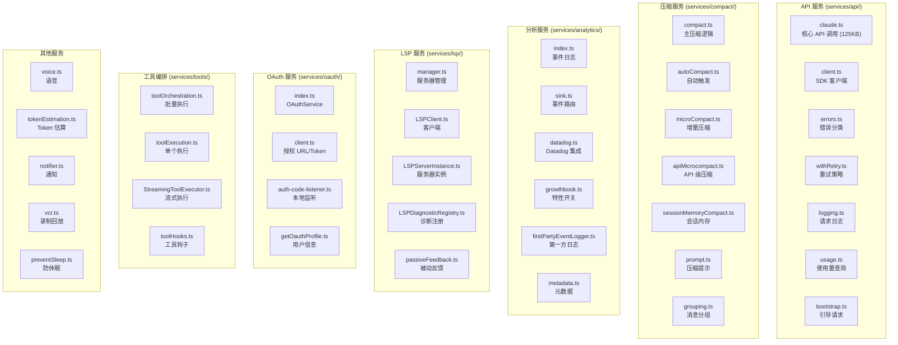
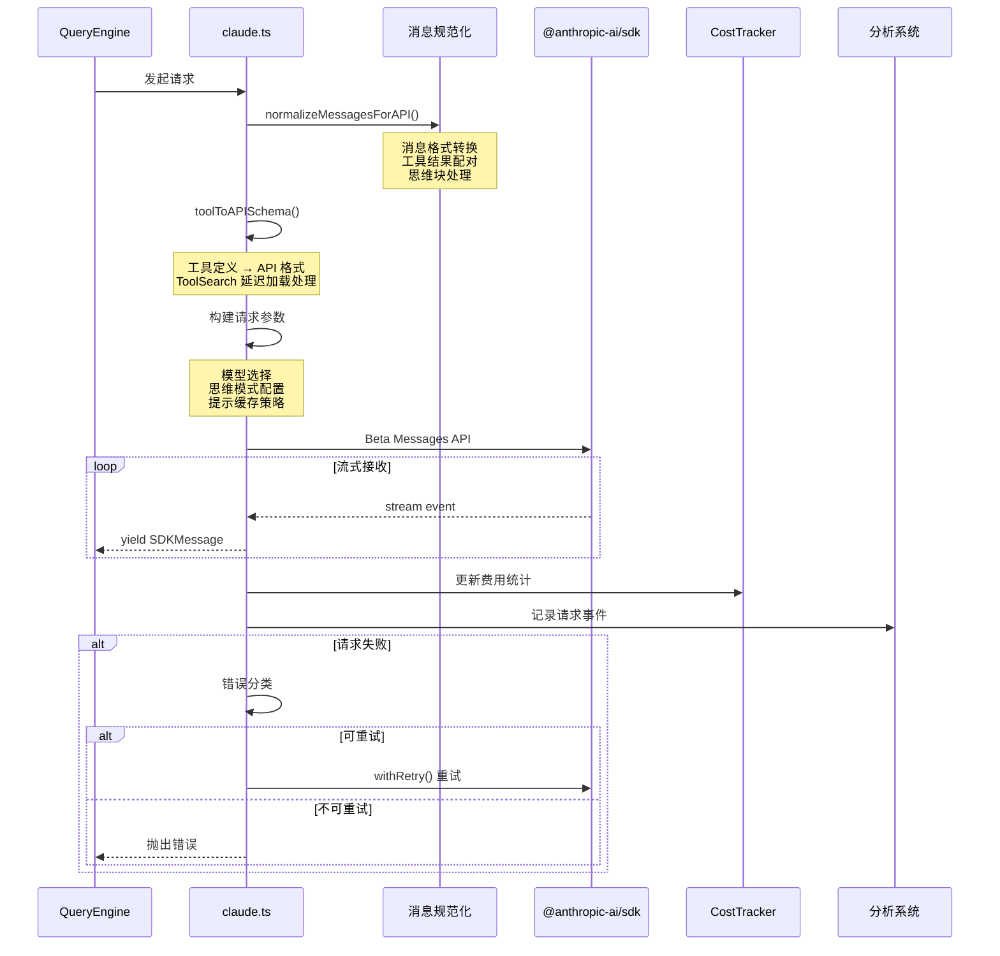
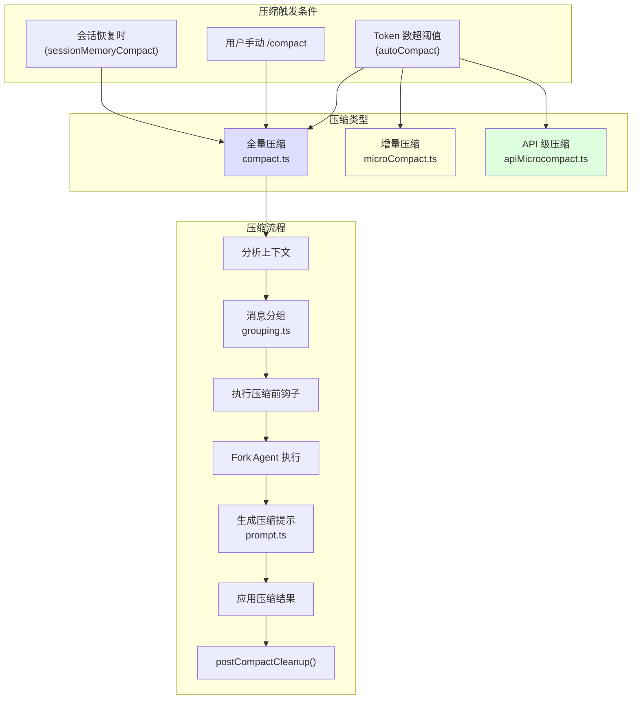
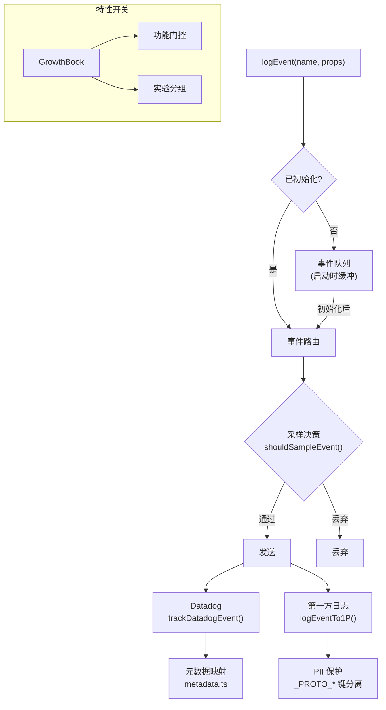
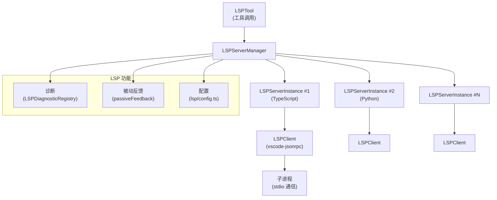
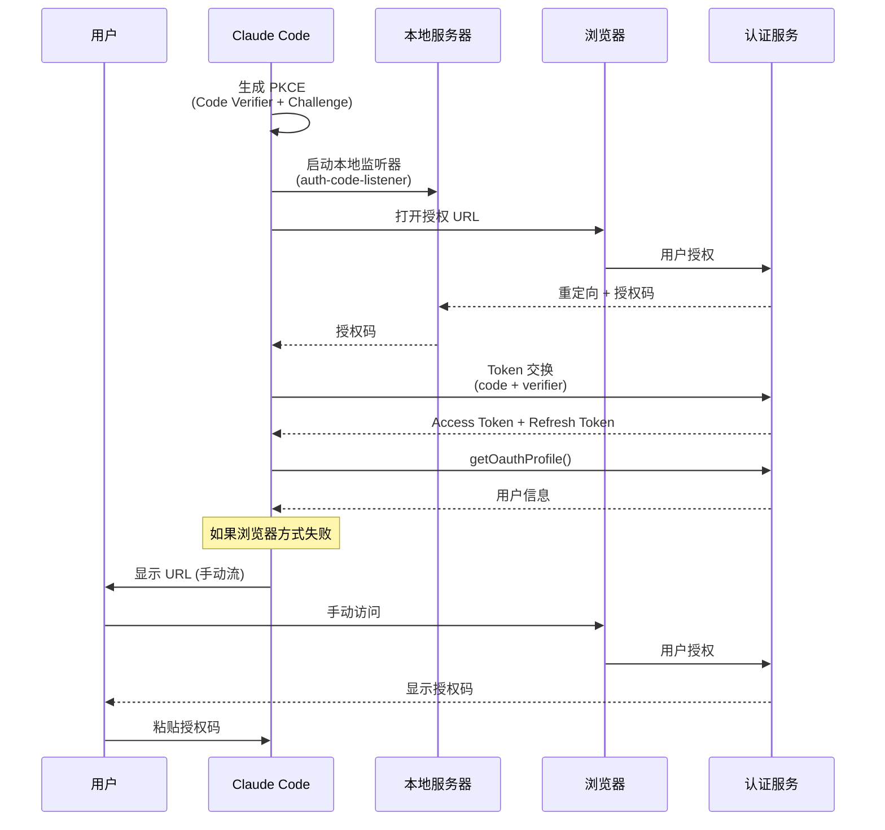
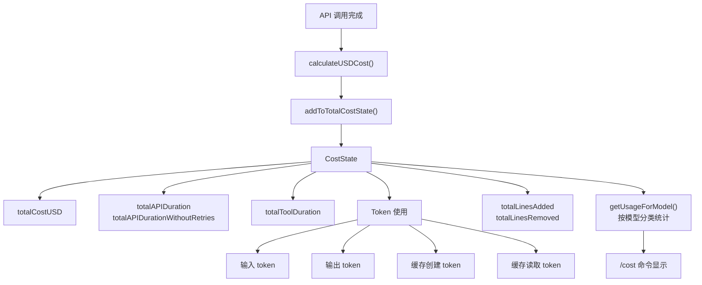

# 09 - 服务层架构

## 服务层总览

```mermaid
graph TB
    subgraph API服务["API 服务 (services/api/)"]
        CLAUDE["claude.ts<br/>核心 API 调用 (125KB)"]
        CLIENT["client.ts<br/>SDK 客户端"]
        ERRORS["errors.ts<br/>错误分类"]
        RETRY["withRetry.ts<br/>重试策略"]
        LOGGING["logging.ts<br/>请求日志"]
        USAGE["usage.ts<br/>使用量查询"]
        BOOTSTRAP["bootstrap.ts<br/>引导请求"]
    end

    subgraph 压缩服务["压缩服务 (services/compact/)"]
        COMPACT["compact.ts<br/>主压缩逻辑"]
        AUTO_COMPACT["autoCompact.ts<br/>自动触发"]
        MICRO["microCompact.ts<br/>增量压缩"]
        API_MICRO["apiMicrocompact.ts<br/>API 级压缩"]
        SESSION_MEM["sessionMemoryCompact.ts<br/>会话内存"]
        PROMPT_C["prompt.ts<br/>压缩提示"]
        GROUPING["grouping.ts<br/>消息分组"]
    end

    subgraph 分析服务["分析服务 (services/analytics/)"]
        ANALYTICS["index.ts<br/>事件日志"]
        SINK["sink.ts<br/>事件路由"]
        DATADOG["datadog.ts<br/>Datadog 集成"]
        GROWTHBOOK["growthbook.ts<br/>特性开关"]
        FIRST_PARTY["firstPartyEventLogger.ts<br/>第一方日志"]
        METADATA["metadata.ts<br/>元数据"]
    end

    subgraph LSP服务["LSP 服务 (services/lsp/)"]
        LSP_MGR["manager.ts<br/>服务器管理"]
        LSP_CLIENT["LSPClient.ts<br/>客户端"]
        LSP_INSTANCE["LSPServerInstance.ts<br/>服务器实例"]
        LSP_DIAG["LSPDiagnosticRegistry.ts<br/>诊断注册"]
        LSP_FEEDBACK["passiveFeedback.ts<br/>被动反馈"]
    end

    subgraph OAuth服务["OAuth 服务 (services/oauth/)"]
        OAUTH_IDX["index.ts<br/>OAuthService"]
        OAUTH_CLIENT["client.ts<br/>授权 URL/Token"]
        AUTH_LISTEN["auth-code-listener.ts<br/>本地监听"]
        OAUTH_PROFILE["getOauthProfile.ts<br/>用户信息"]
    end

    subgraph 工具服务["工具编排 (services/tools/)"]
        TOOL_ORCH["toolOrchestration.ts<br/>批量执行"]
        TOOL_EXEC["toolExecution.ts<br/>单个执行"]
        STREAM_EXEC["StreamingToolExecutor.ts<br/>流式执行"]
        TOOL_HOOKS["toolHooks.ts<br/>工具钩子"]
    end

    subgraph 其他服务["其他服务"]
        VOICE_SVC["voice.ts<br/>语音"]
        TOKEN_EST["tokenEstimation.ts<br/>Token 估算"]
        NOTIFIER["notifier.ts<br/>通知"]
        VCR["vcr.ts<br/>录制回放"]
        PREVENT_SLEEP["preventSleep.ts<br/>防休眠"]
    end
```

## API 调用流程

```mermaid
sequenceDiagram
    participant QE as QueryEngine
    participant Claude as claude.ts
    participant Norm as 消息规范化
    participant SDK as @anthropic-ai/sdk
    participant Cost as CostTracker
    participant Analytics as 分析系统

    QE->>Claude: 发起请求
    
    Claude->>Norm: normalizeMessagesForAPI()
    Note over Norm: 消息格式转换<br/>工具结果配对<br/>思维块处理
    
    Claude->>Claude: toolToAPISchema()
    Note over Claude: 工具定义 → API 格式<br/>ToolSearch 延迟加载处理
    
    Claude->>Claude: 构建请求参数
    Note over Claude: 模型选择<br/>思维模式配置<br/>提示缓存策略
    
    Claude->>SDK: Beta Messages API
    
    loop 流式接收
        SDK-->>Claude: stream event
        Claude-->>QE: yield SDKMessage
    end
    
    Claude->>Cost: 更新费用统计
    Claude->>Analytics: 记录请求事件
    
    alt 请求失败
        Claude->>Claude: 错误分类
        alt 可重试
            Claude->>SDK: withRetry() 重试
        else 不可重试
            Claude-->>QE: 抛出错误
        end
    end
```

## 对话压缩策略

```mermaid
flowchart TD
    subgraph 触发["压缩触发条件"]
        T1["Token 数超阈值<br/>(autoCompact)"]
        T2["用户手动 /compact"]
        T3["会话恢复时<br/>(sessionMemoryCompact)"]
    end

    subgraph 压缩类型["压缩类型"]
        FULL["全量压缩<br/>compact.ts"]
        MICRO_C["增量压缩<br/>microCompact.ts"]
        API_MC["API 级压缩<br/>apiMicrocompact.ts"]
    end

    subgraph 流程["压缩流程"]
        ANALYZE["分析上下文"]
        GROUP["消息分组<br/>grouping.ts"]
        PRE_HOOK["执行压缩前钩子"]
        FORK["Fork Agent 执行"]
        PROMPT_GEN["生成压缩提示<br/>prompt.ts"]
        APPLY["应用压缩结果"]
        POST["postCompactCleanup()"]
    end

    T1 & T2 & T3 --> FULL
    T1 --> MICRO_C
    T1 --> API_MC
    
    FULL --> ANALYZE --> GROUP --> PRE_HOOK --> FORK --> PROMPT_GEN --> APPLY --> POST

    style FULL fill:#ddf
    style MICRO_C fill:#ffd
    style API_MC fill:#dfd
```

## 分析系统数据流

```mermaid
flowchart TD
    EVENT["logEvent(name, props)"]
    
    EVENT --> QUEUE{"已初始化?"}
    QUEUE -->|"否"| BUFFER["事件队列<br/>(启动时缓冲)"]
    QUEUE -->|"是"| ROUTE["事件路由"]
    
    BUFFER -->|"初始化后"| ROUTE
    
    ROUTE --> SAMPLE{"采样决策<br/>shouldSampleEvent()"}
    SAMPLE -->|"通过"| SEND["发送"]
    SAMPLE -->|"丢弃"| DROP["丢弃"]
    
    SEND --> DD["Datadog<br/>trackDatadogEvent()"]
    SEND --> FP["第一方日志<br/>logEventTo1P()"]
    
    DD --> DD_META["元数据映射<br/>metadata.ts"]
    FP --> FP_PII["PII 保护<br/>_PROTO_* 键分离"]
    
    subgraph 特性开关["特性开关"]
        GB["GrowthBook"]
        GB --> GATE["功能门控"]
        GB --> EXP["实验分组"]
    end
```

## LSP 集成架构

```mermaid
graph TD
    LSP_TOOL["LSPTool<br/>(工具调用)"]
    
    LSP_TOOL --> MGR["LSPServerManager"]
    
    MGR --> INST1["LSPServerInstance #1<br/>(TypeScript)"]
    MGR --> INST2["LSPServerInstance #2<br/>(Python)"]
    MGR --> INST_N["LSPServerInstance #N"]
    
    INST1 --> CLIENT1["LSPClient<br/>(vscode-jsonrpc)"]
    INST2 --> CLIENT2["LSPClient"]
    INST_N --> CLIENT_N["LSPClient"]
    
    CLIENT1 --> PROC1["子进程<br/>(stdio 通信)"]
    
    subgraph 功能["LSP 功能"]
        DIAG["诊断<br/>(LSPDiagnosticRegistry)"]
        FEEDBACK["被动反馈<br/>(passiveFeedback)"]
        CONFIG_LSP["配置<br/>(lsp/config.ts)"]
    end
    
    MGR --> DIAG
    MGR --> FEEDBACK
    MGR --> CONFIG_LSP
```

## OAuth 认证流程

```mermaid
sequenceDiagram
    participant User as 用户
    participant CLI as Claude Code
    participant Server as 本地服务器
    participant Browser as 浏览器
    participant Auth as 认证服务

    CLI->>CLI: 生成 PKCE<br/>(Code Verifier + Challenge)
    CLI->>Server: 启动本地监听器<br/>(auth-code-listener)
    CLI->>Browser: 打开授权 URL

    Browser->>Auth: 用户授权
    Auth-->>Server: 重定向 + 授权码
    Server-->>CLI: 授权码

    CLI->>Auth: Token 交换<br/>(code + verifier)
    Auth-->>CLI: Access Token + Refresh Token

    CLI->>Auth: getOauthProfile()
    Auth-->>CLI: 用户信息

    Note over CLI: 如果浏览器方式失败
    CLI->>User: 显示 URL (手动流)
    User->>Browser: 手动访问
    Browser->>Auth: 用户授权
    Auth-->>User: 显示授权码
    User->>CLI: 粘贴授权码
```

## 费用追踪系统

```mermaid
graph TD
    API_CALL["API 调用完成"]
    
    API_CALL --> CALC["calculateUSDCost()"]
    
    CALC --> ADD["addToTotalCostState()"]
    
    ADD --> STATE["CostState"]
    STATE --> TOTAL["totalCostUSD"]
    STATE --> DURATION["totalAPIDuration<br/>totalAPIDurationWithoutRetries"]
    STATE --> TOOL_DUR["totalToolDuration"]
    STATE --> TOKENS["Token 使用"]
    STATE --> LOC["totalLinesAdded<br/>totalLinesRemoved"]
    
    TOKENS --> INPUT["输入 token"]
    TOKENS --> OUTPUT["输出 token"]
    TOKENS --> CACHE_W["缓存创建 token"]
    TOKENS --> CACHE_R["缓存读取 token"]
    
    STATE --> MODEL_USAGE["getUsageForModel()<br/>按模型分类统计"]
    
    MODEL_USAGE --> DISPLAY["/cost 命令显示"]
```
