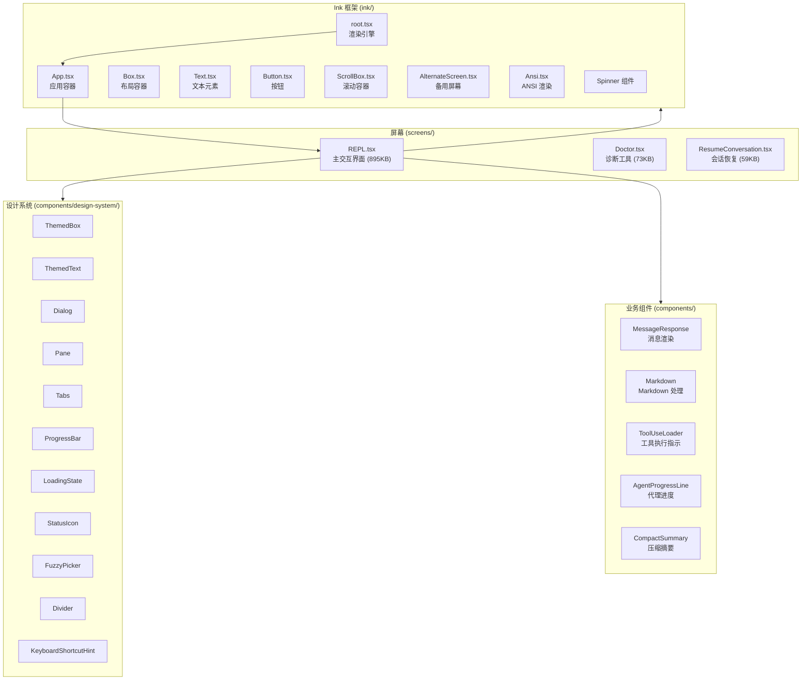
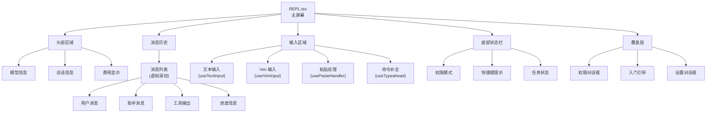
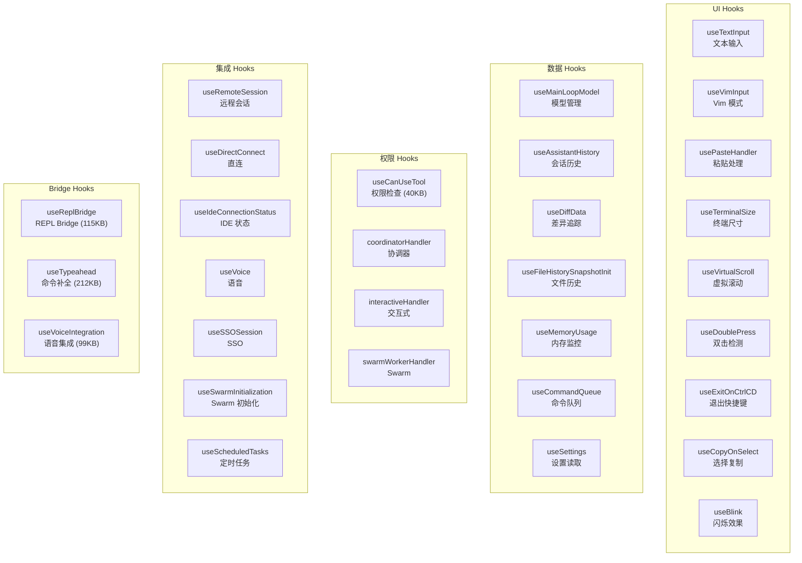
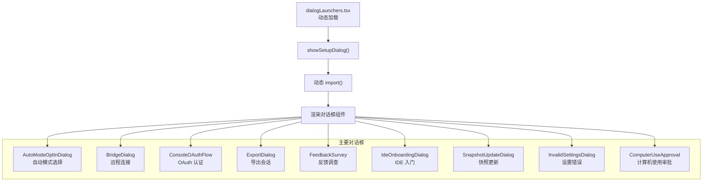
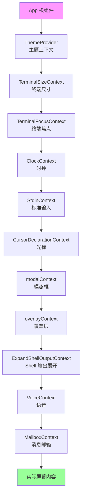
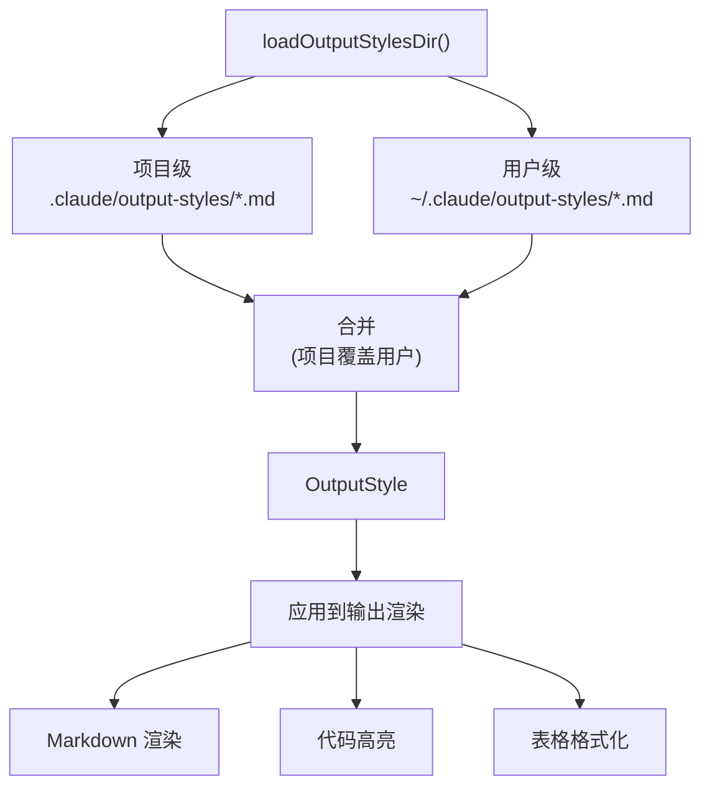

# 10 - UI 层架构

## UI 层总览

```mermaid
graph TB
    subgraph Ink框架["Ink 框架 (ink/)"]
        ROOT["root.tsx<br/>渲染引擎"]
        APP["App.tsx<br/>应用容器"]
        BOX["Box.tsx<br/>布局容器"]
        TEXT["Text.tsx<br/>文本元素"]
        BUTTON["Button.tsx<br/>按钮"]
        SCROLL["ScrollBox.tsx<br/>滚动容器"]
        ALT_SCR["AlternateScreen.tsx<br/>备用屏幕"]
        ANSI["Ansi.tsx<br/>ANSI 渲染"]
        SPINNER["Spinner 组件"]
    end

    subgraph 屏幕["屏幕 (screens/)"]
        REPL["REPL.tsx<br/>主交互界面 (895KB)"]
        DOCTOR["Doctor.tsx<br/>诊断工具 (73KB)"]
        RESUME_SCR["ResumeConversation.tsx<br/>会话恢复 (59KB)"]
    end

    subgraph 设计系统["设计系统 (components/design-system/)"]
        THEMED_BOX["ThemedBox"]
        THEMED_TEXT["ThemedText"]
        DIALOG["Dialog"]
        PANE["Pane"]
        TABS["Tabs"]
        PROGRESS["ProgressBar"]
        LOADING["LoadingState"]
        STATUS_ICON["StatusIcon"]
        FUZZY["FuzzyPicker"]
        DIVIDER["Divider"]
        KB_HINT["KeyboardShortcutHint"]
    end

    subgraph 组件["业务组件 (components/)"]
        MSG_RESP["MessageResponse<br/>消息渲染"]
        MARKDOWN["Markdown<br/>Markdown 处理"]
        TOOL_LOADER["ToolUseLoader<br/>工具执行指示"]
        AGENT_PROG["AgentProgressLine<br/>代理进度"]
        COMPACT_SUM["CompactSummary<br/>压缩摘要"]
    end

    ROOT --> APP --> REPL
    REPL --> 设计系统
    REPL --> 组件
    REPL --> Ink框架
```

## REPL 主屏幕结构

```mermaid
graph TD
    REPL["REPL.tsx<br/>主屏幕"]
    
    REPL --> HEADER["头部区域"]
    REPL --> MESSAGES["消息历史"]
    REPL --> INPUT["输入区域"]
    REPL --> FOOTER["底部状态栏"]
    REPL --> OVERLAYS["覆盖层"]
    
    HEADER --> MODEL_INFO["模型信息"]
    HEADER --> SESSION_INFO["会话信息"]
    HEADER --> COST_INFO["费用显示"]
    
    MESSAGES --> MSG_LIST["消息列表<br/>(虚拟滚动)"]
    MSG_LIST --> USER_MSG["用户消息"]
    MSG_LIST --> ASST_MSG["助手消息"]
    MSG_LIST --> TOOL_OUTPUT["工具输出"]
    MSG_LIST --> PROGRESS_MSG["进度信息"]
    
    INPUT --> TEXT_INPUT["文本输入<br/>(useTextInput)"]
    INPUT --> VIM_INPUT["Vim 输入<br/>(useVimInput)"]
    INPUT --> PASTE["粘贴处理<br/>(usePasteHandler)"]
    INPUT --> TYPEAHEAD["命令补全<br/>(useTypeahead)"]
    
    FOOTER --> PERM_MODE["权限模式"]
    FOOTER --> SHORTCUTS["快捷键提示"]
    FOOTER --> TASKS_STATUS["任务状态"]
    
    OVERLAYS --> PERMISSION_DIALOG["权限对话框"]
    OVERLAYS --> ONBOARDING["入门引导"]
    OVERLAYS --> SETTINGS_DIALOG["设置对话框"]
```

## React Hooks 分类

```mermaid
graph TD
    subgraph UI_Hooks["UI Hooks"]
        H_TEXT["useTextInput<br/>文本输入"]
        H_VIM["useVimInput<br/>Vim 模式"]
        H_PASTE["usePasteHandler<br/>粘贴处理"]
        H_TERM["useTerminalSize<br/>终端尺寸"]
        H_VSCROLL["useVirtualScroll<br/>虚拟滚动"]
        H_DOUBLE["useDoublePress<br/>双击检测"]
        H_EXIT["useExitOnCtrlCD<br/>退出快捷键"]
        H_COPY["useCopyOnSelect<br/>选择复制"]
        H_BLINK["useBlink<br/>闪烁效果"]
    end

    subgraph Data_Hooks["数据 Hooks"]
        H_MODEL["useMainLoopModel<br/>模型管理"]
        H_HISTORY["useAssistantHistory<br/>会话历史"]
        H_DIFF["useDiffData<br/>差异追踪"]
        H_FILE["useFileHistorySnapshotInit<br/>文件历史"]
        H_MEM["useMemoryUsage<br/>内存监控"]
        H_QUEUE["useCommandQueue<br/>命令队列"]
        H_SETTINGS["useSettings<br/>设置读取"]
    end

    subgraph Perm_Hooks["权限 Hooks"]
        H_CAN_USE["useCanUseTool<br/>权限检查 (40KB)"]
        H_COORD["coordinatorHandler<br/>协调器"]
        H_INTER["interactiveHandler<br/>交互式"]
        H_SWARM["swarmWorkerHandler<br/>Swarm"]
    end

    subgraph Integration_Hooks["集成 Hooks"]
        H_REMOTE["useRemoteSession<br/>远程会话"]
        H_DIRECT["useDirectConnect<br/>直连"]
        H_IDE["useIdeConnectionStatus<br/>IDE 状态"]
        H_VOICE["useVoice<br/>语音"]
        H_SSO["useSSOSession<br/>SSO"]
        H_SWARM_INIT["useSwarmInitialization<br/>Swarm 初始化"]
        H_SCHED["useScheduledTasks<br/>定时任务"]
    end

    subgraph Bridge_Hooks["Bridge Hooks"]
        H_REPL_BR["useReplBridge<br/>REPL Bridge (115KB)"]
        H_TYPEAHEAD["useTypeahead<br/>命令补全 (212KB)"]
        H_VOICE_INT["useVoiceIntegration<br/>语音集成 (99KB)"]
    end
```

## 对话框系统

```mermaid
flowchart TD
    LAUNCH["dialogLaunchers.tsx<br/>动态加载"]
    
    LAUNCH --> SHOW["showSetupDialog()"]
    
    SHOW --> DYN_IMPORT["动态 import()"]
    DYN_IMPORT --> RENDER["渲染对话框组件"]
    
    subgraph 对话框类型["主要对话框"]
        D1["AutoModeOptInDialog<br/>自动模式选择"]
        D2["BridgeDialog<br/>远程连接"]
        D3["ConsoleOAuthFlow<br/>OAuth 认证"]
        D4["ExportDialog<br/>导出会话"]
        D5["FeedbackSurvey<br/>反馈调查"]
        D6["IdeOnboardingDialog<br/>IDE 入门"]
        D7["SnapshotUpdateDialog<br/>快照更新"]
        D8["InvalidSettingsDialog<br/>设置错误"]
        D9["ComputerUseApproval<br/>计算机使用审批"]
    end
    
    RENDER --> D1 & D2 & D3 & D4 & D5 & D6 & D7 & D8 & D9
```

## Ink 上下文提供者

```mermaid
graph TD
    APP["App 根组件"]
    
    APP --> THEME["ThemeProvider<br/>主题上下文"]
    THEME --> TERM_SIZE["TerminalSizeContext<br/>终端尺寸"]
    TERM_SIZE --> TERM_FOCUS["TerminalFocusContext<br/>终端焦点"]
    TERM_FOCUS --> CLOCK["ClockContext<br/>时钟"]
    CLOCK --> STDIN["StdinContext<br/>标准输入"]
    STDIN --> CURSOR["CursorDeclarationContext<br/>光标"]
    CURSOR --> MODAL["modalContext<br/>模态框"]
    MODAL --> OVERLAY["overlayContext<br/>覆盖层"]
    OVERLAY --> EXPAND["ExpandShellOutputContext<br/>Shell 输出展开"]
    EXPAND --> VOICE_CTX["VoiceContext<br/>语音"]
    VOICE_CTX --> MAILBOX["MailboxContext<br/>消息邮箱"]
    MAILBOX --> SCREEN["实际屏幕内容"]

    style APP fill:#f9f
    style SCREEN fill:#9f9
```

## 输出风格系统

```mermaid
flowchart TD
    LOAD["loadOutputStylesDir()"]
    
    LOAD --> PRJ["项目级<br/>.claude/output-styles/*.md"]
    LOAD --> USR["用户级<br/>~/.claude/output-styles/*.md"]
    
    PRJ --> MERGE["合并<br/>(项目覆盖用户)"]
    USR --> MERGE
    
    MERGE --> STYLE["OutputStyle"]
    STYLE --> APPLY["应用到输出渲染"]
    
    APPLY --> MARKDOWN_R["Markdown 渲染"]
    APPLY --> CODE_R["代码高亮"]
    APPLY --> TABLE_R["表格格式化"]
```
