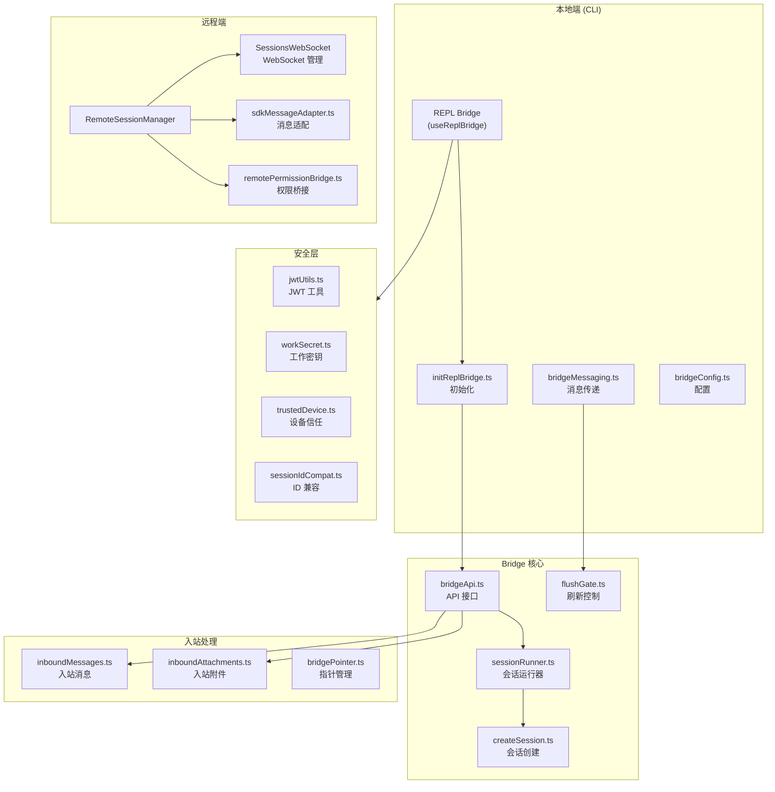
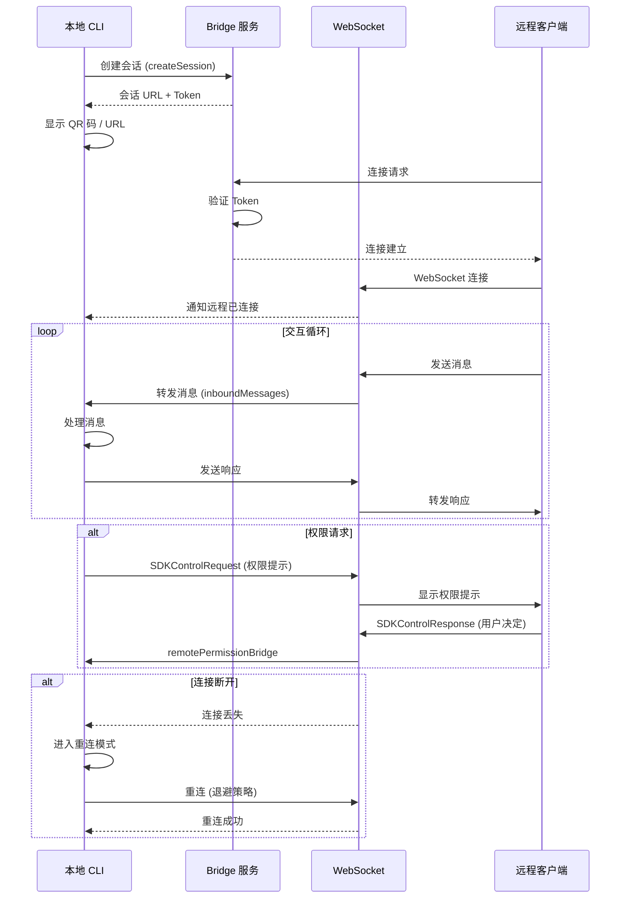
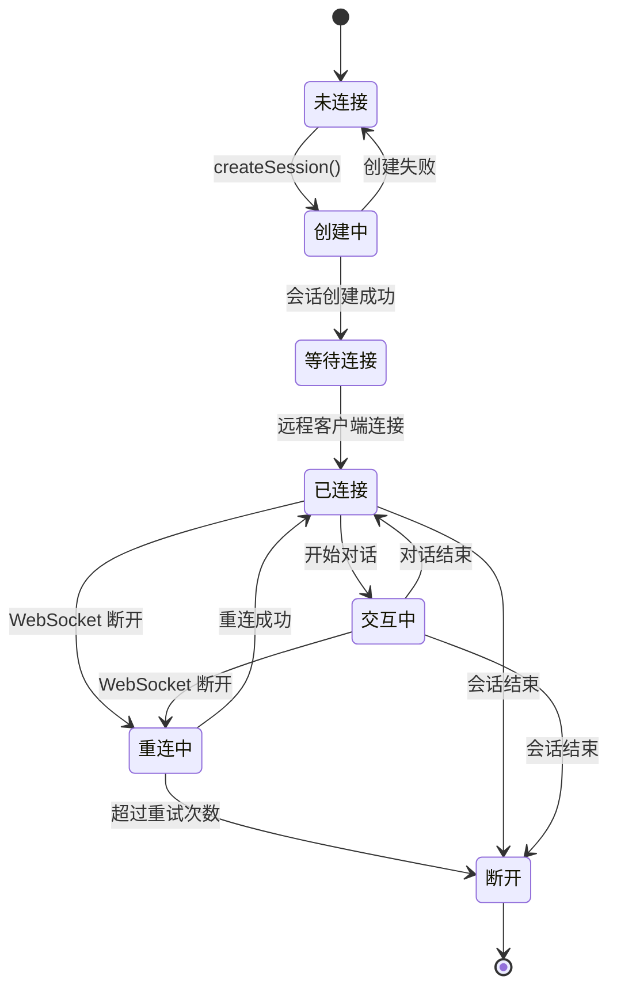
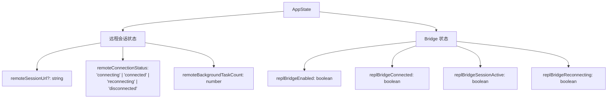
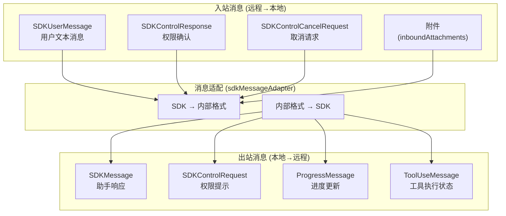

# 11 - Bridge 远程控制与会话管理

## Bridge 系统架构

```mermaid
graph TB
    subgraph 本地端["本地端 (CLI)"]
        REPL_BR["REPL Bridge<br/>(useReplBridge)"]
        INIT_BR["initReplBridge.ts<br/>初始化"]
        BR_MSG["bridgeMessaging.ts<br/>消息传递"]
        BR_CONFIG["bridgeConfig.ts<br/>配置"]
    end

    subgraph Bridge核心["Bridge 核心"]
        BR_API["bridgeApi.ts<br/>API 接口"]
        SESSION_RUN["sessionRunner.ts<br/>会话运行器"]
        CREATE_SESSION["createSession.ts<br/>会话创建"]
        FLUSH["flushGate.ts<br/>刷新控制"]
    end

    subgraph 安全层["安全层"]
        JWT["jwtUtils.ts<br/>JWT 工具"]
        SECRET["workSecret.ts<br/>工作密钥"]
        TRUSTED["trustedDevice.ts<br/>设备信任"]
        SESSION_COMPAT["sessionIdCompat.ts<br/>ID 兼容"]
    end

    subgraph 远程端["远程端"]
        REMOTE_MGR["RemoteSessionManager"]
        WS["SessionsWebSocket<br/>WebSocket 管理"]
        ADAPTER["sdkMessageAdapter.ts<br/>消息适配"]
        PERM_BRIDGE["remotePermissionBridge.ts<br/>权限桥接"]
    end

    subgraph 入站["入站处理"]
        IN_MSG["inboundMessages.ts<br/>入站消息"]
        IN_ATT["inboundAttachments.ts<br/>入站附件"]
        BR_PTR["bridgePointer.ts<br/>指针管理"]
    end

    REPL_BR --> INIT_BR
    INIT_BR --> BR_API
    BR_API --> SESSION_RUN
    SESSION_RUN --> CREATE_SESSION
    
    BR_MSG --> FLUSH
    
    REPL_BR --> 安全层
    
    REMOTE_MGR --> WS
    REMOTE_MGR --> ADAPTER
    REMOTE_MGR --> PERM_BRIDGE
    
    BR_API --> IN_MSG
    BR_API --> IN_ATT
```

## 远程会话连接流程

```mermaid
sequenceDiagram
    participant Local as 本地 CLI
    participant Bridge as Bridge 服务
    participant WS as WebSocket
    participant Remote as 远程客户端

    Local->>Bridge: 创建会话 (createSession)
    Bridge-->>Local: 会话 URL + Token
    
    Local->>Local: 显示 QR 码 / URL
    
    Remote->>Bridge: 连接请求
    Bridge->>Bridge: 验证 Token
    Bridge-->>Remote: 连接建立
    
    Remote->>WS: WebSocket 连接
    WS-->>Local: 通知远程已连接
    
    loop 交互循环
        Remote->>WS: 发送消息
        WS->>Local: 转发消息 (inboundMessages)
        Local->>Local: 处理消息
        Local->>WS: 发送响应
        WS->>Remote: 转发响应
    end
    
    alt 权限请求
        Local->>WS: SDKControlRequest (权限提示)
        WS->>Remote: 显示权限提示
        Remote->>WS: SDKControlResponse (用户决定)
        WS->>Local: remotePermissionBridge
    end
    
    alt 连接断开
        WS-->>Local: 连接丢失
        Local->>Local: 进入重连模式
        Local->>WS: 重连 (退避策略)
        WS-->>Local: 重连成功
    end
```

## 远程会话状态机

```mermaid
stateDiagram-v2
    [*] --> 未连接

    未连接 --> 创建中 : createSession()
    创建中 --> 等待连接 : 会话创建成功
    创建中 --> 未连接 : 创建失败
    
    等待连接 --> 已连接 : 远程客户端连接
    
    已连接 --> 交互中 : 开始对话
    交互中 --> 已连接 : 对话结束
    
    已连接 --> 重连中 : WebSocket 断开
    交互中 --> 重连中 : WebSocket 断开
    
    重连中 --> 已连接 : 重连成功
    重连中 --> 断开 : 超过重试次数
    
    已连接 --> 断开 : 会话结束
    交互中 --> 断开 : 会话结束
    
    断开 --> [*]
```

## AppState 中的远程状态

```mermaid
graph TD
    STATE["AppState"]
    
    STATE --> REMOTE["远程会话状态"]
    REMOTE --> URL["remoteSessionUrl?: string"]
    REMOTE --> CONN_STATUS["remoteConnectionStatus:<br/>'connecting' | 'connected' |<br/>'reconnecting' | 'disconnected'"]
    REMOTE --> BG_TASKS["remoteBackgroundTaskCount: number"]
    
    STATE --> BRIDGE["Bridge 状态"]
    BRIDGE --> ENABLED["replBridgeEnabled: boolean"]
    BRIDGE --> CONNECTED["replBridgeConnected: boolean"]
    BRIDGE --> SESSION_ACTIVE["replBridgeSessionActive: boolean"]
    BRIDGE --> RECONNECTING["replBridgeReconnecting: boolean"]
```

## 消息协议

```mermaid
graph TD
    subgraph 入站消息["入站消息 (远程→本地)"]
        IN1["SDKUserMessage<br/>用户文本消息"]
        IN2["SDKControlResponse<br/>权限确认"]
        IN3["SDKControlCancelRequest<br/>取消请求"]
        IN4["附件<br/>(inboundAttachments)"]
    end

    subgraph 出站消息["出站消息 (本地→远程)"]
        OUT1["SDKMessage<br/>助手响应"]
        OUT2["SDKControlRequest<br/>权限提示"]
        OUT3["ProgressMessage<br/>进度更新"]
        OUT4["ToolUseMessage<br/>工具执行状态"]
    end

    subgraph 适配["消息适配 (sdkMessageAdapter)"]
        SDK_TO_INT["SDK → 内部格式"]
        INT_TO_SDK["内部格式 → SDK"]
    end

    IN1 & IN2 & IN3 & IN4 --> SDK_TO_INT
    INT_TO_SDK --> OUT1 & OUT2 & OUT3 & OUT4
```
