# 12 - 辅助子系统

## 内存系统 (memdir/)

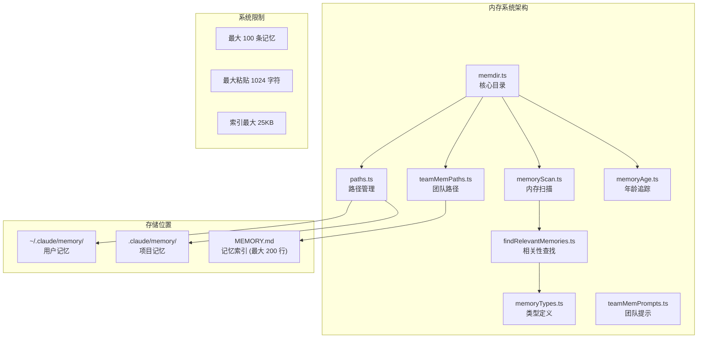

## 协调器模式 (coordinator/)

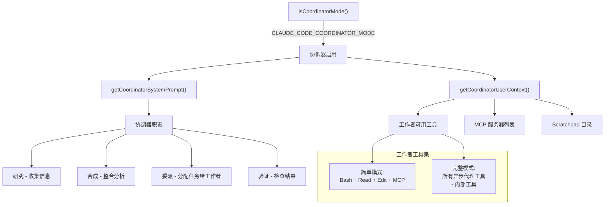

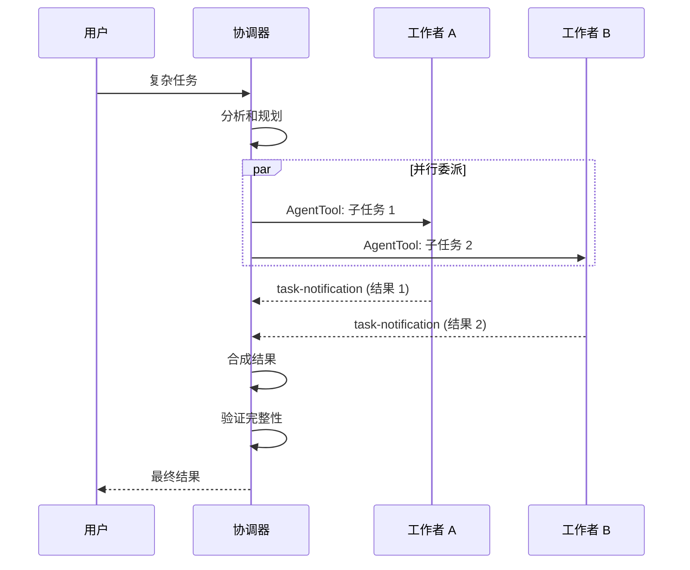

## 钩子系统 (schemas/hooks.ts)

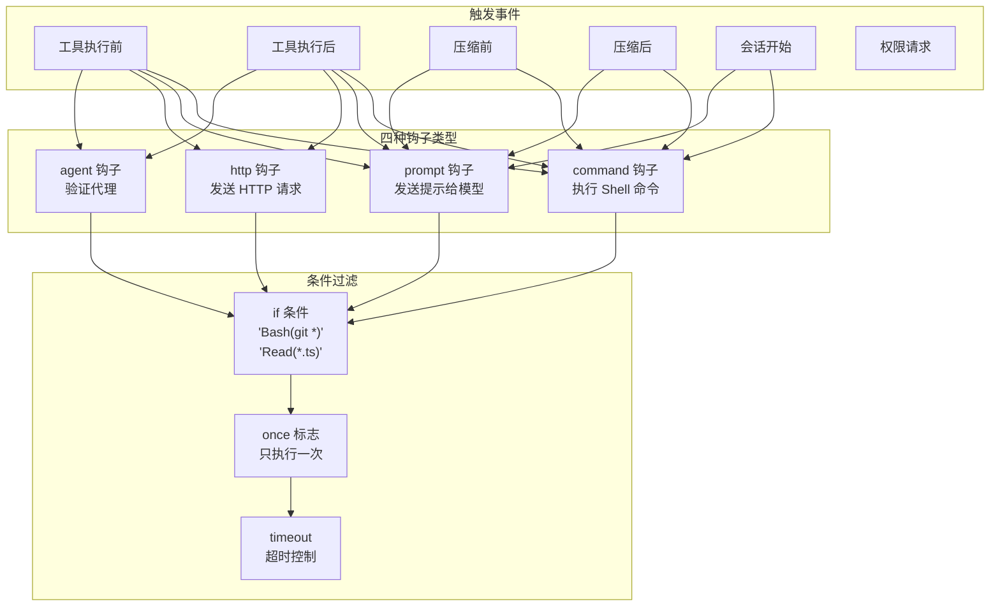

## 语音系统 (voice/)

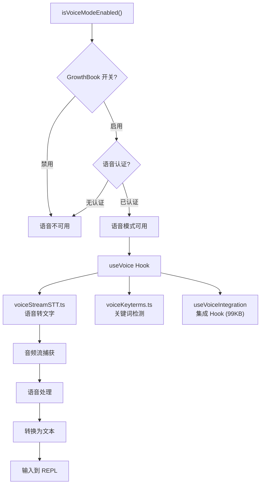

## Buddy 伴侣系统 (buddy/)

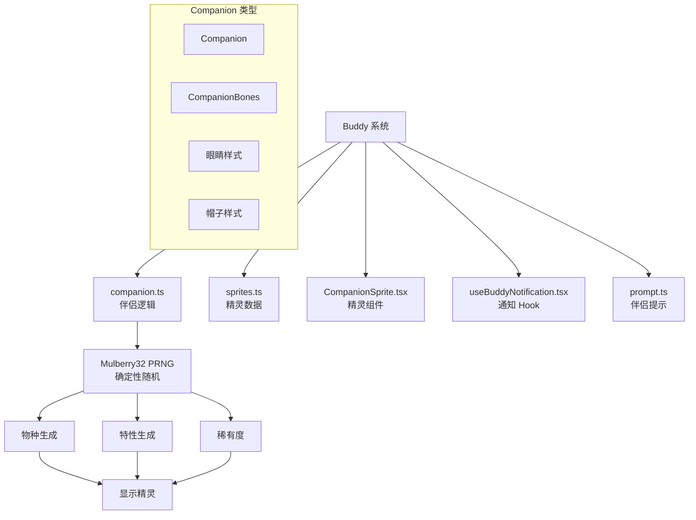

## 插件系统 (plugins/)

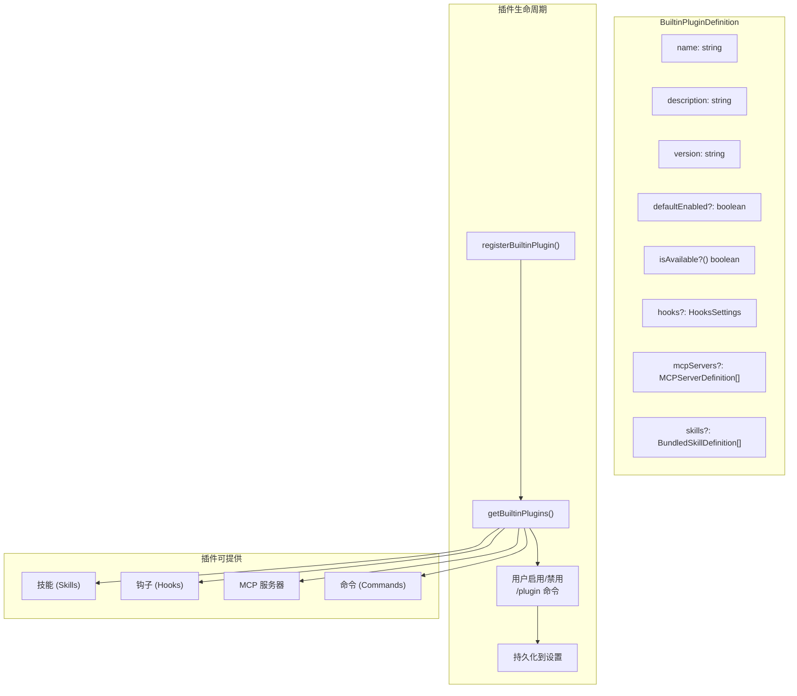

## 输入处理管道 (utils/processUserInput/)

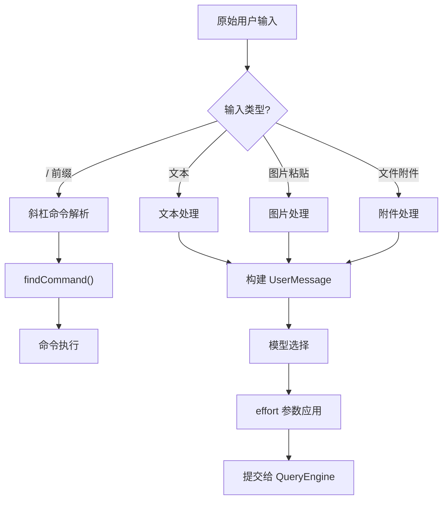

## 迁移系统 (migrations/)

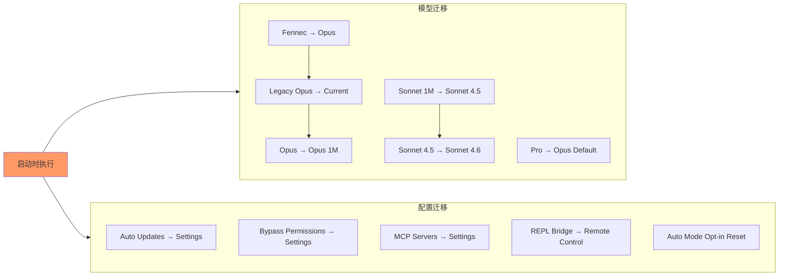

## 上游代理 (upstreamproxy/)

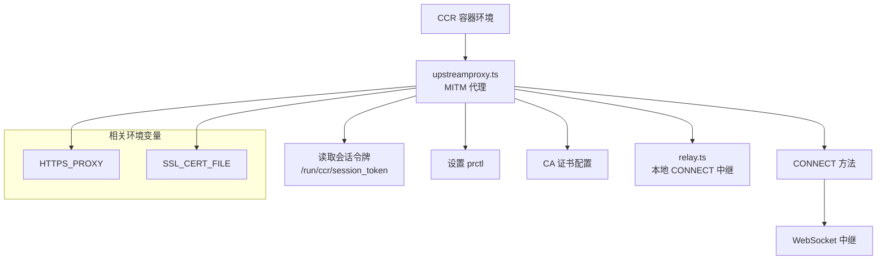

## 文件状态缓存

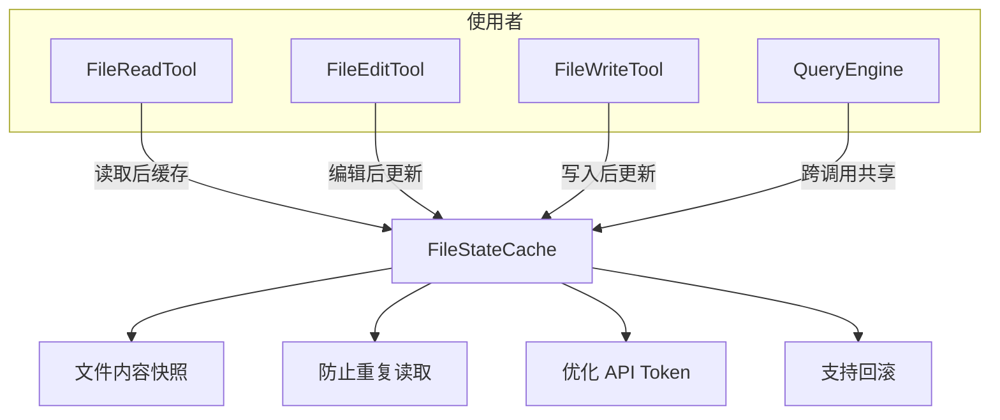
