# 13 - 隐藏功能与未公开特性

## 隐藏功能总览

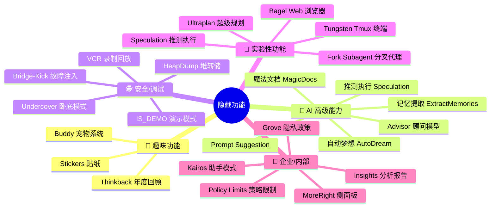

---

## 1. 推测执行 (Speculation) — 最隐蔽的功能

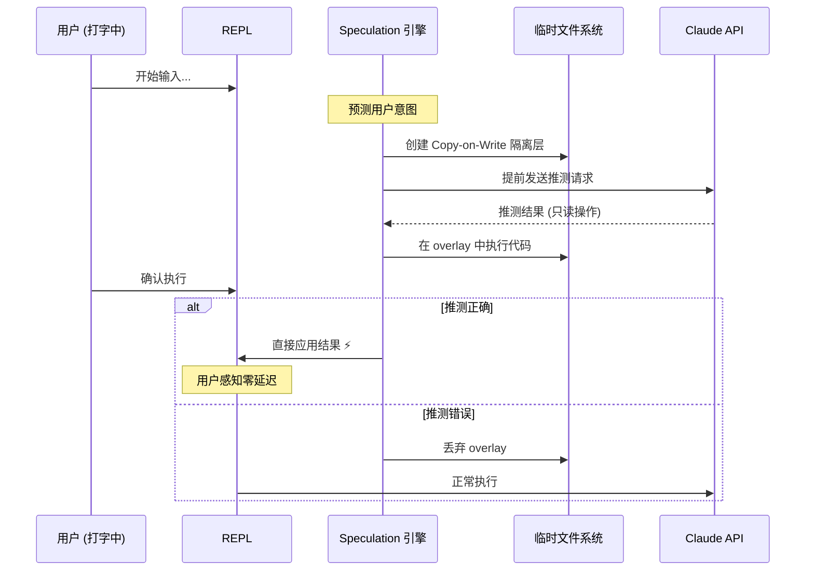

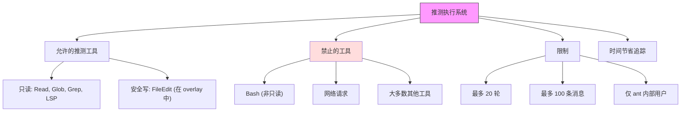

---

## 2. Buddy 宠物系统

```mermaid
graph TD
    BUDDY["Buddy 伴侣系统<br/>feature('BUDDY')"]
    
    BUDDY --> SEED["用户标识符 → Mulberry32 PRNG"]
    
    SEED --> SPECIES["16 种物种"]
    SPECIES --> S1["🦆 鸭子"]
    SPECIES --> S2["🪿 鹅"]
    SPECIES --> S3["🫧 Blob"]
    SPECIES --> S4["🐱 猫"]
    SPECIES --> S5["🐉 龙"]
    SPECIES --> S6["🐙 章鱼"]
    SPECIES --> S7["🦉 猫头鹰"]
    SPECIES --> S8["🐧 企鹅"]
    SPECIES --> S9["🐢 乌龟"]
    SPECIES --> S10["🐌 蜗牛"]
    SPECIES --> S11["👻 幽灵"]
    SPECIES --> S12["🦎 美西螈"]
    SPECIES --> S13["🐹 水豚"]
    SPECIES --> S14["🌵 仙人掌"]
    SPECIES --> S15["🤖 机器人"]
    SPECIES --> S16["🐰 兔子"]
    
    SEED --> RARITY["5 个稀有度"]
    RARITY --> R1["Common 普通"]
    RARITY --> R2["Uncommon 非凡"]
    RARITY --> R3["Rare 稀有"]
    RARITY --> R4["Epic 史诗"]
    RARITY --> R5["Legendary 传说"]
    
    SEED --> DECOR["装饰属性"]
    DECOR --> EYES["眼睛样式"]
    DECOR --> HATS["帽子样式"]
    DECOR --> TRAITS["性格特征"]
    
    BUDDY --> RENDER["CompanionSprite.tsx<br/>终端精灵渲染"]
    BUDDY --> NOTIFY["useBuddyNotification<br/>伴侣通知"]

    style BUDDY fill:#fef,stroke:#f0f
```

---

## 3. 自动梦想 (AutoDream) — 后台记忆巩固

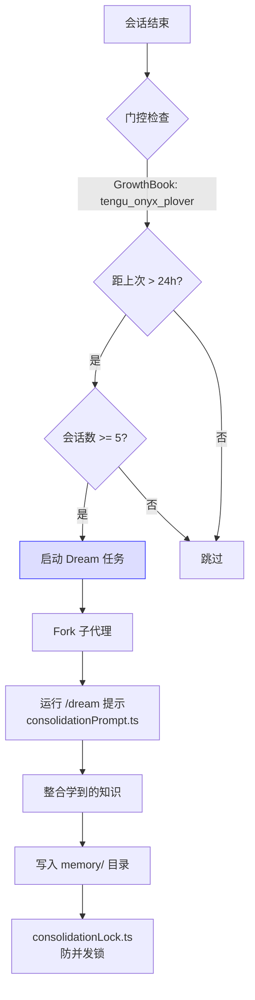

---

## 4. 魔法文档 (Magic Docs)

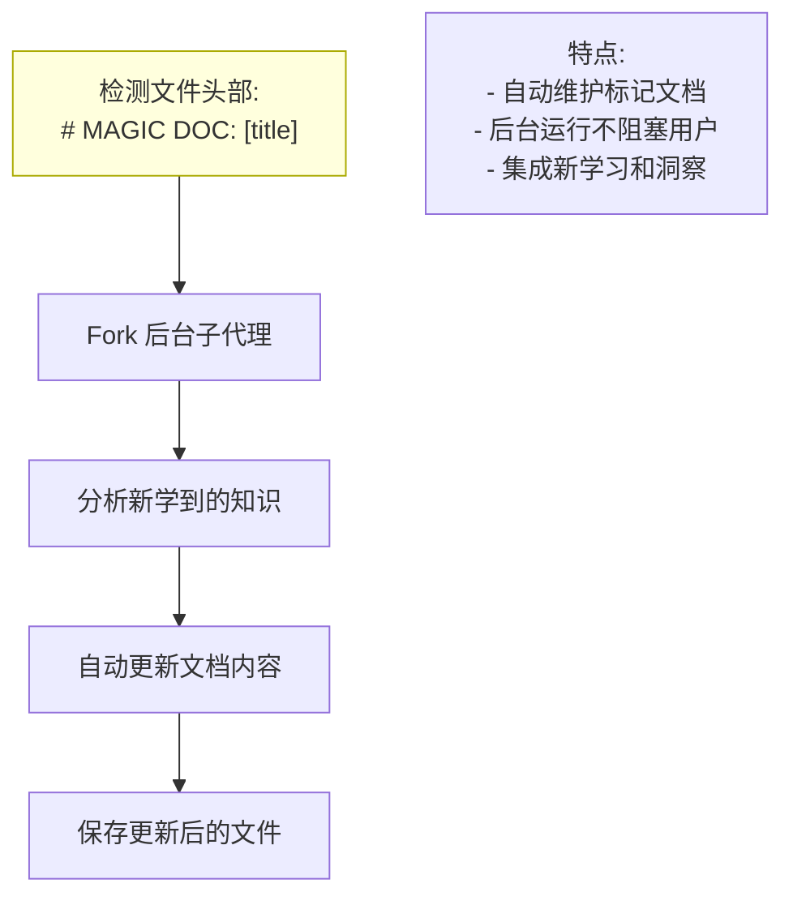

---

## 5. 卧底模式 (Undercover)

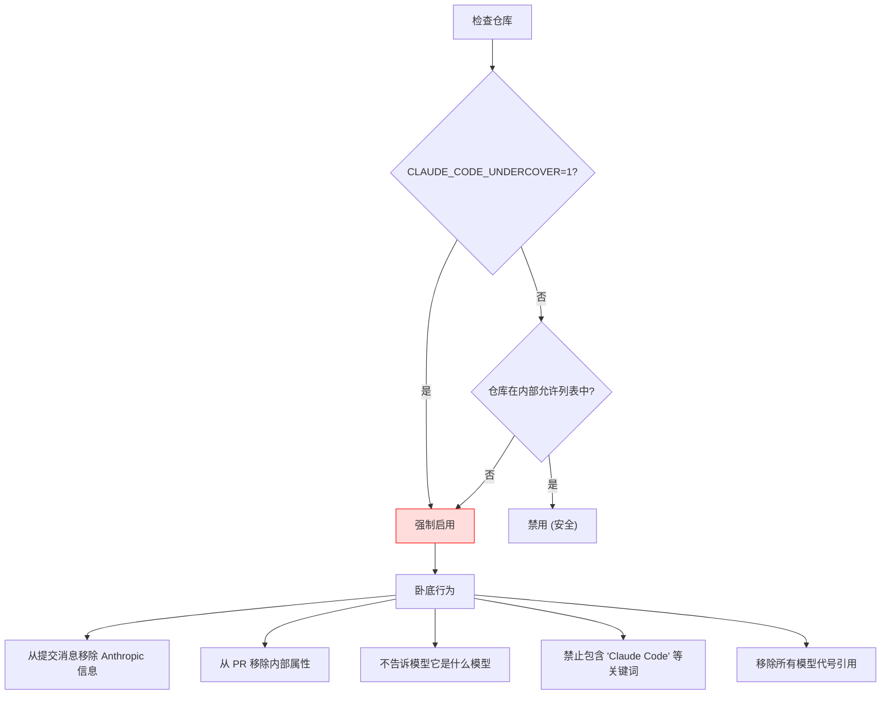

---

## 6. VCR 录制/回放

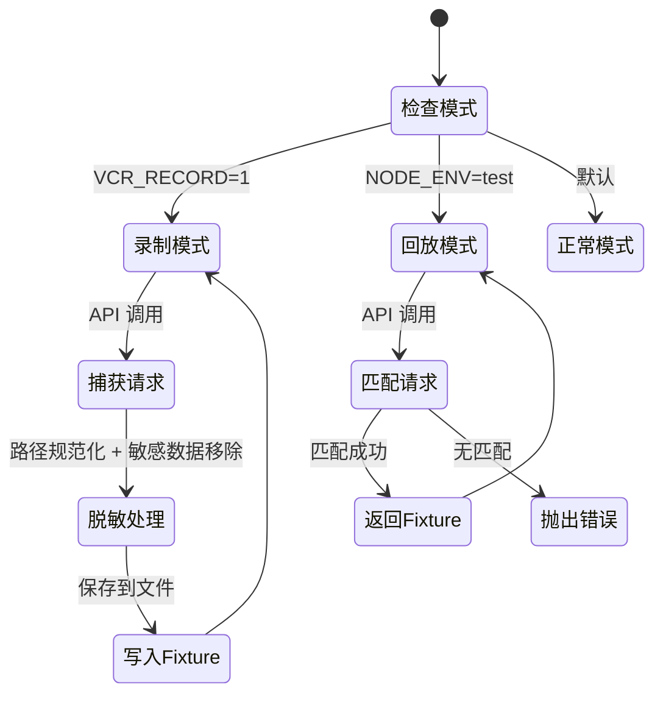

---

## 7. Grove 隐私政策框架

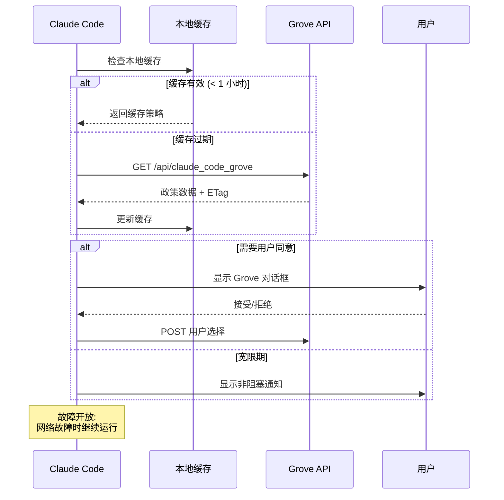

---

## 8. IS_DEMO 演示模式

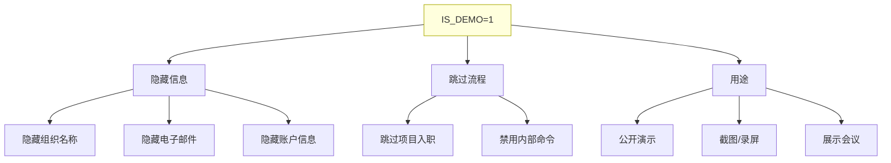

---

## 9. 防休眠服务

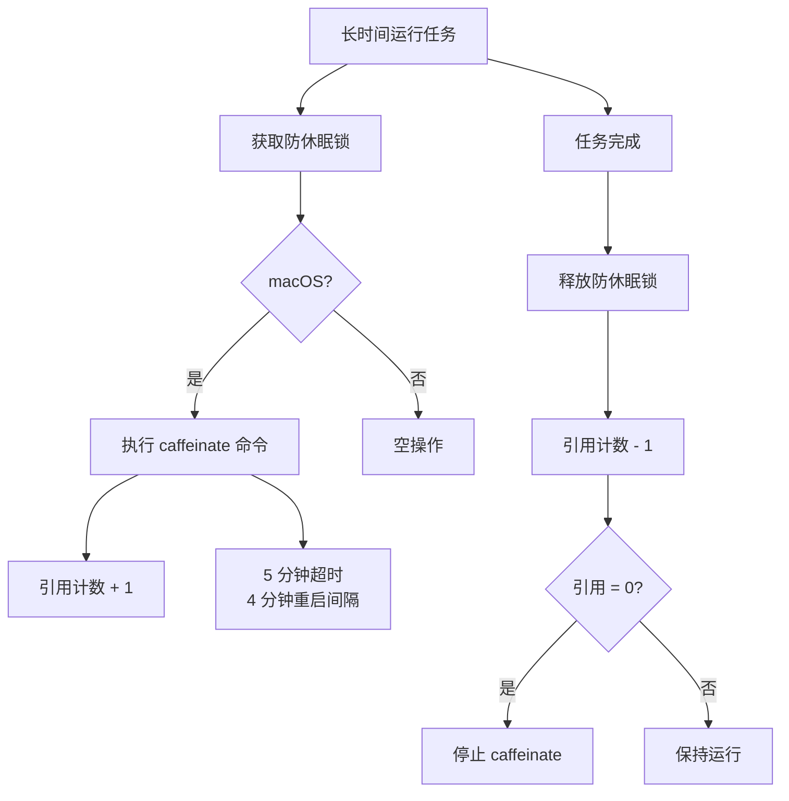

---

## 10. 离开摘要生成

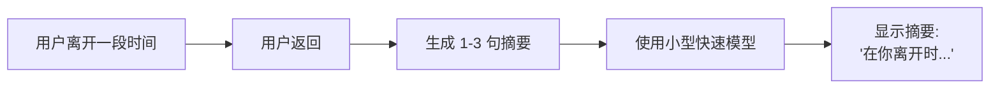

---

## 11. 完整特性标志地图

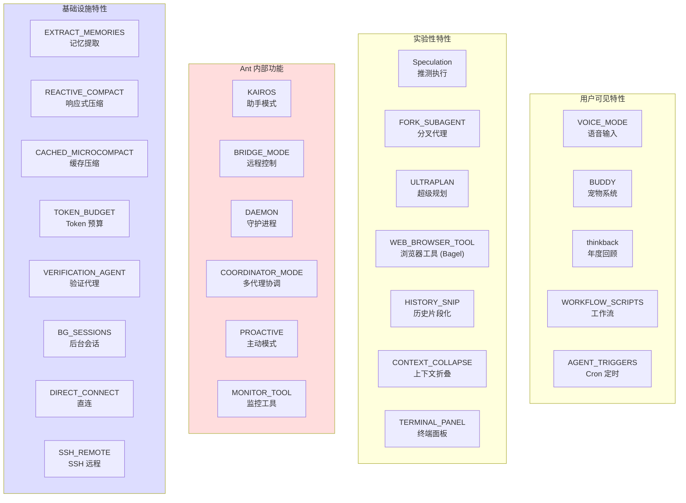

---

## 12. 隐藏斜杠命令

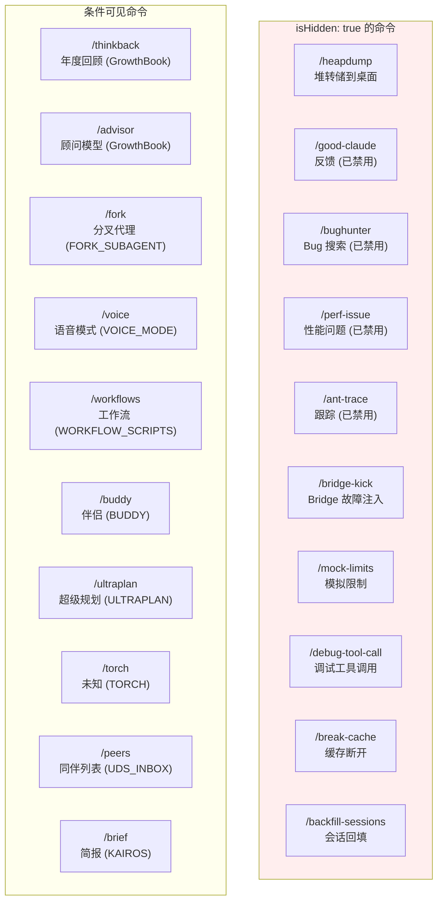

---

## 13. 关键隐藏环境变量

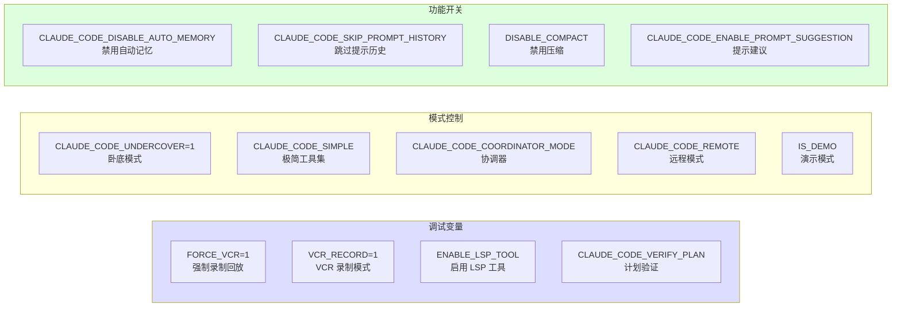

---

## 14. 任务系统 — 后台任务类型

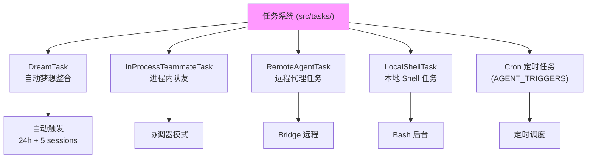

---

## 总结：最值得关注的隐藏功能

| 功能 | 隐蔽程度 | 类型 | 备注 |
|------|----------|------|------|
| **推测执行** | ★★★★★ | AI | 预测用户意图，提前执行 |
| **自动梦想** | ★★★★☆ | AI | 后台自动整合记忆 |
| **魔法文档** | ★★★★☆ | AI | 自动维护标记文档 |
| **卧底模式** | ★★★★☆ | 安全 | 公开仓库信息隐藏 |
| **Buddy 宠物** | ★★★☆☆ | 趣味 | 16 种物种 + 5 稀有度 |
| **VCR 录制** | ★★★☆☆ | 调试 | API 请求录制回放 |
| **Grove 隐私** | ★★★☆☆ | 企业 | 隐私政策框架 |
| **Bagel 浏览器** | ★★★☆☆ | 实验 | 内嵌 Web 浏览器 |
| **Tungsten 终端** | ★★★☆☆ | 内部 | 虚拟 Tmux |
| **演示模式** | ★★☆☆☆ | 工具 | 公开演示信息隐藏 |
| **防休眠** | ★★☆☆☆ | 系统 | macOS caffeinate |
| **离开摘要** | ★★☆☆☆ | UX | 离开后回来时的摘要 |
