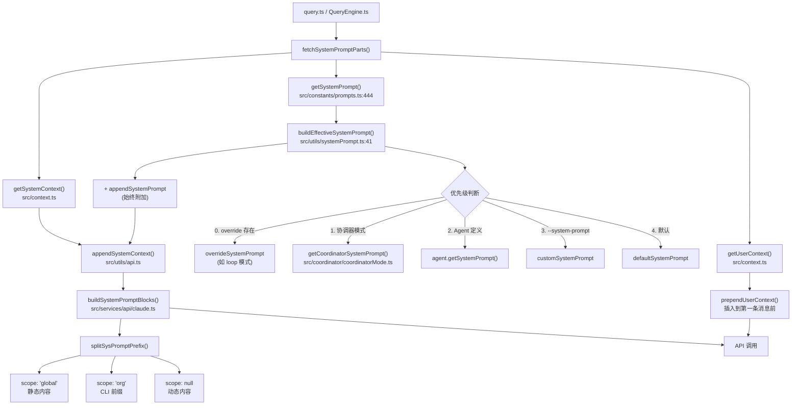
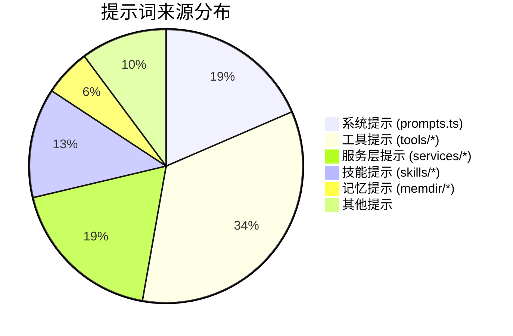

# 14 - 提示词完整目录

> 本文档收录了 Claude Code 源代码中的**所有提示词**，标注了功能、引用位置和用途。

---

## 一、系统提示词组装流程



## 二、默认系统提示词结构 (`getSystemPrompt()`)

```
文件: src/constants/prompts.ts:444

┌──────────────────────────────────────────────────────┐
│              静态内容 (scope: 'global')               │
├──────────────────────────────────────────────────────┤
│ 1. getSimpleIntroSection()          ← 身份声明       │
│ 2. getSimpleSystemSection()         ← # System       │
│ 3. getSimpleDoingTasksSection()     ← # Doing tasks  │
│ 4. getActionsSection()              ← # Executing..  │
│ 5. getUsingYourToolsSection()       ← # Using tools  │
│ 6. getSimpleToneAndStyleSection()   ← # Tone/style   │
│ 7. getOutputEfficiencySection()     ← # Output       │
├─ ─ ─ SYSTEM_PROMPT_DYNAMIC_BOUNDARY ─ ─ ─ ─ ─ ─ ─ ──┤
│              动态内容 (每会话不同)                      │
├──────────────────────────────────────────────────────┤
│ 8.  session_guidance    ← 会话特定指导               │
│ 9.  memory              ← 记忆系统提示               │
│ 10. ant_model_override  ← Ant 模型覆盖 (内部)        │
│ 11. env_info_simple     ← # Environment              │
│ 12. language            ← # Language (可选)           │
│ 13. output_style        ← # Output Style (可选)      │
│ 14. mcp_instructions    ← # MCP Server Instructions  │
│ 15. scratchpad          ← Scratchpad 指令             │
│ 16. frc                 ← Function Result Clearing    │
│ 17. summarize_tool_results ← 工具结果总结            │
│ 18. numeric_length_anchors ← 长度限制 (Ant)          │
│ 19. token_budget        ← Token 预算 (可选)           │
│ 20. brief               ← Kairos Brief (可选)        │
└──────────────────────────────────────────────────────┘
```

---

## 三、核心系统提示词详细目录

### 3.1 主系统提示

| # | 提示词名称 | 文件位置 | 行号 | 功能 | 用途 |
|---|-----------|---------|------|------|------|
| 1 | `getSystemPrompt()` | `src/constants/prompts.ts` | 444 | 主入口 | 构建完整的系统提示词数组 |
| 2 | `getSimpleIntroSection()` | `src/constants/prompts.ts` | 175 | 身份声明 | "You are an interactive agent that helps users with software engineering tasks..." |
| 3 | `CYBER_RISK_INSTRUCTION` | `src/constants/cyberRiskInstruction.ts` | - | 安全指令 | 授权安全测试、拒绝恶意请求 |
| 4 | `getSimpleSystemSection()` | `src/constants/prompts.ts` | 186 | `# System` | 工具执行、权限模式、标签说明、钩子、自动压缩 |
| 5 | `getSimpleDoingTasksSection()` | `src/constants/prompts.ts` | 199 | `# Doing tasks` | 编码风格、安全要求、不过度工程化、验证工作 |
| 6 | `getActionsSection()` | `src/constants/prompts.ts` | 255 | `# Executing actions with care` | 可逆性考量、破坏性操作确认、风险操作列表 |
| 7 | `getUsingYourToolsSection()` | `src/constants/prompts.ts` | 269 | `# Using your tools` | 专用工具优于 Bash、并行调用、TodoWrite |
| 8 | `getSimpleToneAndStyleSection()` | `src/constants/prompts.ts` | 430 | `# Tone and style` | 无 emoji、简洁、引用格式 |
| 9 | `getOutputEfficiencySection()` | `src/constants/prompts.ts` | 403 | `# Output efficiency` (外部) / `# Communicating with user` (Ant) | 简洁输出 / 散文式沟通 |
| 10 | `SYSTEM_PROMPT_DYNAMIC_BOUNDARY` | `src/constants/prompts.ts` | 114 | 缓存分界线 | 分隔静态（全局可缓存）和动态内容 |

### 3.2 动态部分

| # | Section ID | 文件位置 | 功能 | 用途 |
|---|-----------|---------|------|------|
| 11 | `session_guidance` | `prompts.ts:352` → `getSessionSpecificGuidanceSection()` | `# Session-specific guidance` | Agent 工具使用、Explore 代理、Skill 使用、验证代理 |
| 12 | `memory` | `prompts.ts:495` → `loadMemoryPrompt()` | 记忆系统 | 四种记忆类型、MEMORY.md 索引、保存/访问指导 |
| 13 | `env_info_simple` | `prompts.ts:499` → `computeSimpleEnvInfo()` | `# Environment` | 工作目录、Git 状态、平台、模型 ID、知识截止日期 |
| 14 | `language` | `prompts.ts:503` → `getLanguageSection()` | `# Language` | 响应语言偏好设置 |
| 15 | `output_style` | `prompts.ts:505` → `getOutputStyleSection()` | `# Output Style` | 自定义输出格式 |
| 16 | `mcp_instructions` | `prompts.ts:513` → `getMcpInstructions()` | `# MCP Server Instructions` | 已连接 MCP 服务器的使用说明 |
| 17 | `frc` | `prompts.ts:522` | Function Result Clearing | 工具结果自动清理说明 |
| 18 | `token_budget` | `prompts.ts:545` | Token 预算 | 用户指定 token 目标时的行为指导 |

### 3.3 系统提示构建与缓存

| # | 名称 | 文件位置 | 功能 |
|---|------|---------|------|
| 19 | `buildEffectiveSystemPrompt()` | `src/utils/systemPrompt.ts:41` | 按优先级选择最终系统提示 |
| 20 | `systemPromptSection()` | `src/constants/systemPromptSections.ts` | 创建可缓存的动态部分 |
| 21 | `DANGEROUS_uncachedSystemPromptSection()` | `src/constants/systemPromptSections.ts` | 创建每次重新计算的动态部分 |
| 22 | `splitSysPromptPrefix()` | `src/utils/api.ts` | 分割系统提示为缓存段 |
| 23 | `prependUserContext()` | `src/utils/api.ts` | 在首条消息前注入 CLAUDE.md + 日期 + Git 状态 |

### 3.4 替代系统提示

| # | 名称 | 文件位置 | 触发条件 | 用途 |
|---|------|---------|---------|------|
| 24 | Proactive 提示 | `prompts.ts:470` | `feature('PROACTIVE')` 且激活 | "You are an autonomous agent. Use the available tools to do useful work." |
| 25 | Simple 提示 | `prompts.ts:450` | `CLAUDE_CODE_SIMPLE=1` | 仅 CWD + 日期的极简提示 |
| 26 | 协调器提示 | `src/coordinator/coordinatorMode.ts` | `CLAUDE_CODE_COORDINATOR_MODE=true` | 多代理协调指导：研究→合成→实现→验证 |
| 27 | 默认 Agent 提示 | `prompts.ts:758` | Agent 子代理 | `DEFAULT_AGENT_PROMPT`: "You are an agent for Claude Code..." |
| 28 | `enhanceSystemPromptWithEnvDetails()` | `prompts.ts:760` | 子代理增强 | 为 Agent 子代理追加环境信息、绝对路径要求 |

---

## 四、工具提示词目录 (39 个工具)

### 4.1 文件操作工具

| # | 工具名 | 文件位置 | 导出 | 提示词概要 |
|---|--------|---------|------|-----------|
| 29 | **Read** | `src/tools/FileReadTool/prompt.ts` | `FILE_READ_TOOL_NAME`, `DESCRIPTION`, `renderPromptTemplate()` | 从文件系统读取文件。支持 PDF(pages 参数)、图片、Jupyter、行号偏移。最多 2000 行 |
| 30 | **Edit** | `src/tools/FileEditTool/prompt.ts` | `getEditToolDescription()` | 精确字符串替换。**必须先 Read**，保留缩进，`replace_all` 批量替换 |
| 31 | **Write** | `src/tools/FileWriteTool/prompt.ts` | `FILE_WRITE_TOOL_NAME`, `getWriteToolDescription()` | 写入/覆盖文件。必须先 Read 现有文件。优先用 Edit。不创建文档文件 |
| 32 | **NotebookEdit** | `src/tools/NotebookEditTool/prompt.ts` | `DESCRIPTION`, `PROMPT` | 替换 Jupyter 单元内容。0 索引 cell_number，insert/delete 模式 |

### 4.2 搜索工具

| # | 工具名 | 文件位置 | 导出 | 提示词概要 |
|---|--------|---------|------|-----------|
| 33 | **Glob** | `src/tools/GlobTool/prompt.ts` | `GLOB_TOOL_NAME`, `DESCRIPTION` | 快速文件模式匹配。支持 `**/*.js`，按修改时间排序 |
| 34 | **Grep** | `src/tools/GrepTool/prompt.ts` | `GREP_TOOL_NAME`, `getDescription()` | 基于 ripgrep 的搜索。正则、glob 过滤、多行匹配、content/files/count 模式 |
| 35 | **WebSearch** | `src/tools/WebSearchTool/prompt.ts` | `WEB_SEARCH_TOOL_NAME`, `getWebSearchPrompt()` | 网络搜索。**强制要求**：答案后必须包含 "Sources:" 部分 |
| 36 | **WebFetch** | `src/tools/WebFetchTool/prompt.ts` | `WEB_FETCH_TOOL_NAME`, `DESCRIPTION` | 从 URL 获取内容。自动 HTTP→HTTPS 升级，15 分钟缓存 |
| 37 | **ToolSearch** | `src/tools/ToolSearchTool/prompt.ts` | `PROMPT_HEAD` | 获取延迟工具的完整 schema。`select:` 精确匹配或关键词搜索 |

### 4.3 代码执行工具

| # | 工具名 | 文件位置 | 导出 | 提示词概要 |
|---|--------|---------|------|-----------|
| 38 | **Bash** | `src/tools/BashTool/prompt.ts` | `getDefaultTimeoutMs()`, `getSimplePrompt()` | **最大提示词 (4000+ 行)**。Shell 执行、Git 操作指南(提交/PR)、沙盒、超时、工具偏好 |
| 39 | **PowerShell** | `src/tools/PowerShellTool/prompt.ts` | `getDefaultTimeoutMs()`, `getMaxTimeoutMs()` | PowerShell 执行，后台任务支持 |
| 40 | **LSP** | `src/tools/LSPTool/prompt.ts` | `LSP_TOOL_NAME`, `DESCRIPTION` | 语言服务器交互：goto definition、find references、hover、diagnostics |

### 4.4 代理与任务工具

| # | 工具名 | 文件位置 | 导出 | 提示词概要 |
|---|--------|---------|------|-----------|
| 41 | **Agent** | `src/tools/AgentTool/prompt.ts` | `getToolsDescription()` | **第二大提示词 (3000+ 行)**。子代理启动、Fork 语义、并发、Worktree 隔离、后台/前台 |
| 42 | **SendMessage** | `src/tools/SendMessageTool/prompt.ts` | `DESCRIPTION`, `getPrompt()` | 向其他代理发送消息。按名称寻址、广播、跨会话 |
| 43 | **TaskCreate** | `src/tools/TaskCreateTool/prompt.ts` | `DESCRIPTION`, `getPrompt()` | 创建任务列表项。subject/description/activeForm 字段 |
| 44 | **TaskUpdate** | `src/tools/TaskUpdateTool/prompt.ts` | `DESCRIPTION`, `PROMPT` | 更新任务状态和详情 |
| 45 | **TaskGet** | `src/tools/TaskGetTool/prompt.ts` | `DESCRIPTION`, `PROMPT` | 按 ID 检索任务详情 |
| 46 | **TaskList** | `src/tools/TaskListTool/prompt.ts` | `DESCRIPTION`, `getPrompt()` | 列出所有任务 |
| 47 | **TaskStop** | `src/tools/TaskStopTool/prompt.ts` | `TASK_STOP_TOOL_NAME`, `DESCRIPTION` | 按 ID 停止后台任务 |
| 48 | **TaskOutput** | (定义在工具文件中) | - | 获取任务输出 |
| 49 | **TeamCreate** | `src/tools/TeamCreateTool/prompt.ts` | `getPrompt()` | 创建团队协调多代理。Teams 与 task lists 1:1 对应 |
| 50 | **TeamDelete** | `src/tools/TeamDeleteTool/prompt.ts` | `getPrompt()` | 删除团队和任务目录 |

### 4.5 交互与规划工具

| # | 工具名 | 文件位置 | 导出 | 提示词概要 |
|---|--------|---------|------|-----------|
| 51 | **AskUserQuestion** | `src/tools/AskUserQuestionTool/prompt.ts` | `ASK_USER_QUESTION_TOOL_NAME`, `DESCRIPTION`, `ASK_USER_QUESTION_TOOL_PROMPT` | 多选问题、预览功能(图片/代码) |
| 52 | **Skill** | `src/tools/SkillTool/prompt.ts` | `SKILL_BUDGET_CONTEXT_PERCENT` | 执行技能。上下文 1% 用于技能列表 |
| 53 | **EnterPlanMode** | `src/tools/EnterPlanModeTool/prompt.ts` | `getEnterPlanModeToolPromptExternal()` | 非平凡任务进入计划模式。含何时使用/不使用示例 |
| 54 | **ExitPlanMode** | `src/tools/ExitPlanModeTool/prompt.ts` | `EXIT_PLAN_MODE_V2_TOOL_PROMPT` | 完成计划请求用户批准 |
| 55 | **TodoWrite** | `src/tools/TodoWriteTool/prompt.ts` | `PROMPT` | 创建管理结构化任务列表。7 个使用场景、4 个详细示例 |
| 56 | **Config** | `src/tools/ConfigTool/prompt.ts` | `DESCRIPTION`, `generatePrompt()` | 获取/设置配置。从 SUPPORTED_SETTINGS 动态生成文档 |

### 4.6 Worktree 与 MCP 工具

| # | 工具名 | 文件位置 | 导出 | 提示词概要 |
|---|--------|---------|------|-----------|
| 57 | **EnterWorktree** | `src/tools/EnterWorktreeTool/prompt.ts` | `getEnterWorktreeToolPrompt()` | 创建隔离 Git worktree 并切换到其中 |
| 58 | **ExitWorktree** | `src/tools/ExitWorktreeTool/prompt.ts` | `getExitWorktreeToolPrompt()` | 退出 worktree，保留或删除 |
| 59 | **ListMcpResources** | `src/tools/ListMcpResourcesTool/prompt.ts` | `LIST_MCP_RESOURCES_TOOL_NAME`, `PROMPT` | 列出 MCP 服务器资源 |
| 60 | **ReadMcpResource** | `src/tools/ReadMcpResourceTool/prompt.ts` | `DESCRIPTION`, `PROMPT` | 读取 MCP 服务器特定资源 |
| 61 | **MCPTool** | `src/tools/MCPTool/prompt.ts` | `PROMPT=''`, `DESCRIPTION=''` | 空占位符，实际由 mcpClient 覆盖 |

### 4.7 特殊功能工具

| # | 工具名 | 文件位置 | 导出 | 提示词概要 |
|---|--------|---------|------|-----------|
| 62 | **Sleep** | `src/tools/SleepTool/prompt.ts` | `SLEEP_TOOL_NAME`, `SLEEP_TOOL_PROMPT` | 等待指定时间。接收 TICK 标签 |
| 63 | **ScheduleCron** | `src/tools/ScheduleCronTool/prompt.ts` | `buildCronCreatePrompt()` 等 | Cron 定时任务。表达式、一次性/递归、时区 |
| 64 | **RemoteTrigger** | `src/tools/RemoteTriggerTool/prompt.ts` | `REMOTE_TRIGGER_TOOL_NAME`, `PROMPT` | 远程触发 API：list/get/create/update/run |
| 65 | **Brief/SendUserMessage** | `src/tools/BriefTool/prompt.ts` | `BRIEF_TOOL_NAME='SendUserMessage'`, `BRIEF_TOOL_PROMPT`, `BRIEF_PROACTIVE_SECTION` | 发送消息给用户。Markdown + 附件 |

---

## 五、服务层提示词

### 5.1 对话压缩

| # | 名称 | 文件位置 | 导出 | 用途 |
|---|------|---------|------|------|
| 66 | `NO_TOOLS_PREAMBLE` | `src/services/compact/prompt.ts:19` | (内部常量) | "CRITICAL: Respond with TEXT ONLY. Do NOT call any tools." |
| 67 | `DETAILED_ANALYSIS_INSTRUCTION_BASE` | `compact/prompt.ts:31` | (内部常量) | 全对话压缩的分析指导：按时间顺序分析每条消息 |
| 68 | `DETAILED_ANALYSIS_INSTRUCTION_PARTIAL` | `compact/prompt.ts:46` | (内部常量) | 部分压缩的分析指导：仅分析近期消息 |
| 69 | `getCompactPrompt()` | `compact/prompt.ts:293` | 导出函数 | 完整压缩提示：9 个总结部分 |
| 70 | `getPartialCompactPrompt()` | `compact/prompt.ts:274` | 导出函数 | 部分压缩提示 |

### 5.2 记忆系统

| # | 名称 | 文件位置 | 导出 | 用途 |
|---|------|---------|------|------|
| 71 | `loadMemoryPrompt()` | `src/memdir/memdir.ts` | 导出函数 | 加载记忆提示：`# auto memory` 标题 + 类型指导 + MEMORY.md |
| 72 | `TYPES_SECTION_INDIVIDUAL` | `src/memdir/memoryTypes.ts` | 导出常量 | 四种记忆类型定义：user/feedback/project/reference |
| 73 | `WHAT_NOT_TO_SAVE_SECTION` | `src/memdir/memoryTypes.ts` | 导出常量 | 不保存规则：代码模式、Git 历史、调试方案、CLAUDE.md 已有内容 |
| 74 | `WHEN_TO_ACCESS_SECTION` | `src/memdir/memoryTypes.ts` | 导出常量 | 何时访问记忆 |
| 75 | `TRUSTING_RECALL_SECTION` | `src/memdir/memoryTypes.ts` | 导出常量 | 记忆信任与回忆指导 |
| 76 | `MEMORY_FRONTMATTER_EXAMPLE` | `src/memdir/memoryTypes.ts` | 导出常量 | 记忆文件 frontmatter 格式示例 |

### 5.3 记忆提取

| # | 名称 | 文件位置 | 导出 | 用途 |
|---|------|---------|------|------|
| 77 | `buildExtractAutoOnlyPrompt()` | `src/services/extractMemories/prompts.ts` | 导出函数 | 自动记忆提取代理提示。分析最近消息并更新持久记忆 |
| 78 | `buildExtractCombinedPrompt()` | `src/services/extractMemories/prompts.ts` | 导出函数 | 联合提取(私有 + 团队)记忆 |

### 5.4 自动梦想

| # | 名称 | 文件位置 | 导出 | 用途 |
|---|------|---------|------|------|
| 79 | `buildConsolidationPrompt()` | `src/services/autoDream/consolidationPrompt.ts:10` | 导出函数 | "# Dream: Memory Consolidation"。四阶段：定向→收集→巩固→修剪 |

### 5.5 魔法文档

| # | 名称 | 文件位置 | 导出 | 用途 |
|---|------|---------|------|------|
| 80 | `getUpdatePromptTemplate()` | `src/services/MagicDocs/prompts.ts:8` | 内部函数 | Magic Doc 更新指导。保留头部、就地更新、删除过时部分 |

### 5.6 会话记忆

| # | 名称 | 文件位置 | 导出 | 用途 |
|---|------|---------|------|------|
| 81 | `DEFAULT_SESSION_MEMORY_TEMPLATE` | `src/services/SessionMemory/prompts.ts` | 导出常量 | 会话记忆模板：Title/State/Task/Files/Architecture 等 9 个部分 |
| 82 | `MAX_SECTION_LENGTH=2000` | `src/services/SessionMemory/prompts.ts` | 导出常量 | 单部分最大 token 数 |
| 83 | `MAX_TOTAL_SESSION_MEMORY_TOKENS=12000` | `src/services/SessionMemory/prompts.ts` | 导出常量 | 总记忆最大 token 数 |

### 5.7 工具/代理总结

| # | 名称 | 文件位置 | 导出 | 用途 |
|---|------|---------|------|------|
| 84 | `TOOL_USE_SUMMARY_SYSTEM_PROMPT` | `src/services/toolUseSummary/toolUseSummaryGenerator.ts` | 导出常量 | Git-commit-subject 风格的单行工具使用总结 |
| 85 | `buildSummaryPrompt()` | `src/services/AgentSummary/agentSummary.ts` | 导出函数 | 3-5 词现在进行式代理进度总结 (每 30 秒) |

---

## 六、技能提示词 (Bundled Skills)

| # | 技能名 | 文件位置 | 导出 | 用途 |
|---|--------|---------|------|------|
| 86 | **simplify** | `src/skills/bundled/simplify.ts` | `SIMPLIFY_PROMPT` | 三并行代理审查：代码重用/质量/效率 |
| 87 | **batch** | `src/skills/bundled/batch.ts` | `buildPrompt()` | 三阶段大规模变更：研究→计划→并行执行(5-30 worker) |
| 88 | **loop** | `src/skills/bundled/loop.ts` | `buildPrompt()` | 定期间隔运行命令。区间→cron 映射 |
| 89 | **debug** | `src/skills/bundled/debug.ts` | `getPromptForCommand()` | 诊断 Claude Code 会话问题 |
| 90 | **stuck** | `src/skills/bundled/stuck.ts` | `STUCK_PROMPT` | 诊断冻结/缓慢会话 (Ant) |
| 91 | **skillify** | `src/skills/bundled/skillify.ts` | `SKILLIFY_PROMPT` | 4 轮采访 → SKILL.md 可重用技能 (Ant) |
| 92 | **remember** | `src/skills/bundled/remember.ts` | `SKILL_PROMPT` | 审查自动记忆 → 提升到 CLAUDE.md (Ant) |
| 93 | **verify** | `src/skills/bundled/verify.ts` | (从 `verifyContent.ts` 加载) | 从 SKILL.md 加载验证工作流 (Ant) |
| 94 | **claudeApi** | `src/skills/bundled/claudeApiContent.ts` | `SKILL_PROMPT`, `SKILL_MODEL_VARS`, `SKILL_FILES` | Claude API/Agent SDK 文档与示例。含模型变量替换 |
| 95 | **claudeInChrome** | `src/skills/bundled/claudeInChrome.ts` | `BASE_CHROME_PROMPT` | Chrome 浏览器自动化交互 |
| 96 | **updateConfig** | `src/skills/bundled/updateConfig.ts` | `UPDATE_CONFIG_PROMPT`, `HOOKS_DOCS`, `HOOK_VERIFICATION_FLOW` | 修改 settings.json。权限规则语法、Hook 配置、6 步验证 |
| 97 | **scheduleRemoteAgents** | `src/skills/bundled/scheduleRemoteAgents.ts` | - | 远程代理调度设置 |
| 98 | **keybindings** | `src/skills/bundled/keybindings.ts` | - | 快捷键配置指导 |
| 99 | **loremIpsum** | `src/skills/bundled/loremIpsum.ts` | - | 填充文本生成用于长上下文测试 (Ant) |

---

## 七、其他提示词

| # | 名称 | 文件位置 | 导出 | 用途 |
|---|------|---------|------|------|
| 100 | `companionIntroText()` | `src/buddy/prompt.ts` | 导出函数 | Buddy 伴侣系统。伴侣坐在输入框旁观察，被叫名时回答 |
| 101 | `BASE_CHROME_PROMPT` | `src/utils/claudeInChrome/prompt.ts` | 导出常量 | Chrome 浏览器自动化基础说明：GIF 录制、Console 调试 |
| 102 | `buildCombinedMemoryPrompt()` | `src/memdir/teamMemPrompts.ts` | 导出函数 | 联合私有 + 团队记忆提示 |
| 103 | `getHooksSection()` | `src/constants/prompts.ts:127` | 内部函数 | 钩子系统说明：`<user-prompt-submit-hook>` 处理 |
| 104 | `getSystemRemindersSection()` | `src/constants/prompts.ts:131` | 内部函数 | `<system-reminder>` 标签说明 + 无限上下文 |
| 105 | `getLanguageSection()` | `src/constants/prompts.ts:142` | 内部函数 | "Always respond in {language}" |
| 106 | `getOutputStyleSection()` | `src/constants/prompts.ts:151` | 内部函数 | "# Output Style: {name}" |
| 107 | `getMcpInstructions()` | `src/constants/prompts.ts:579` | 内部函数 | 已连接 MCP 服务器使用说明 |
| 108 | `getCoordinatorUserContext()` | `src/coordinator/coordinatorMode.ts` | 导出函数 | 协调器工作者可用工具 + MCP 服务器列表 |

---

## 八、统计总览



| 维度 | 数量 |
|------|------|
| 提示词文件总数 | 43+ |
| 导出的常量/函数 | 150+ |
| 工具描述提示 | 37 |
| 内置技能提示 | 14 |
| 服务层提示 | 20 |
| 系统提示组件 | 20 |
| 最大单个提示 | BashTool (~4000 行) |
| 第二大提示 | AgentTool (~3000 行) |
| 第三大提示 | updateConfig Skill (~3000 行) |
