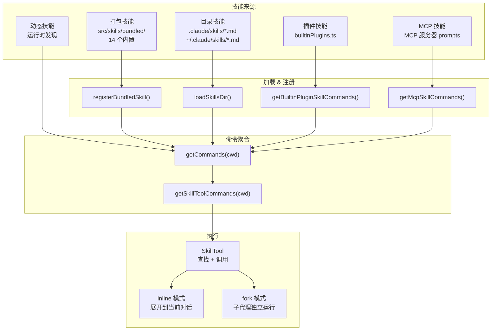
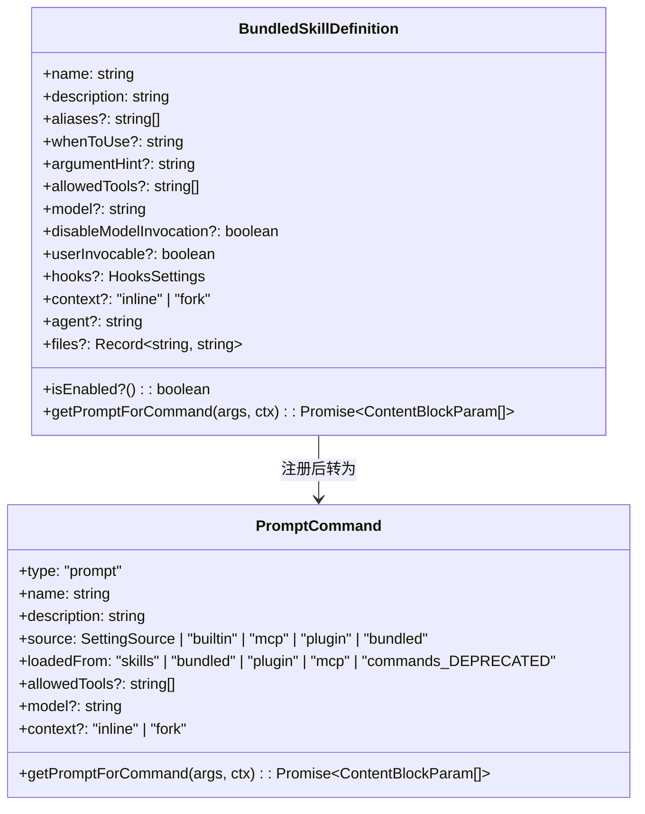
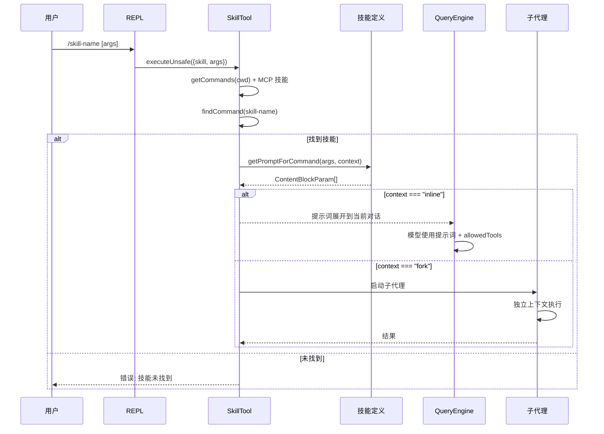
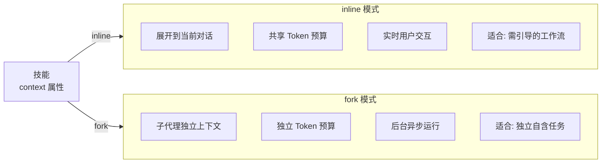
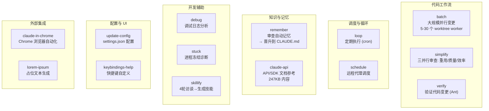
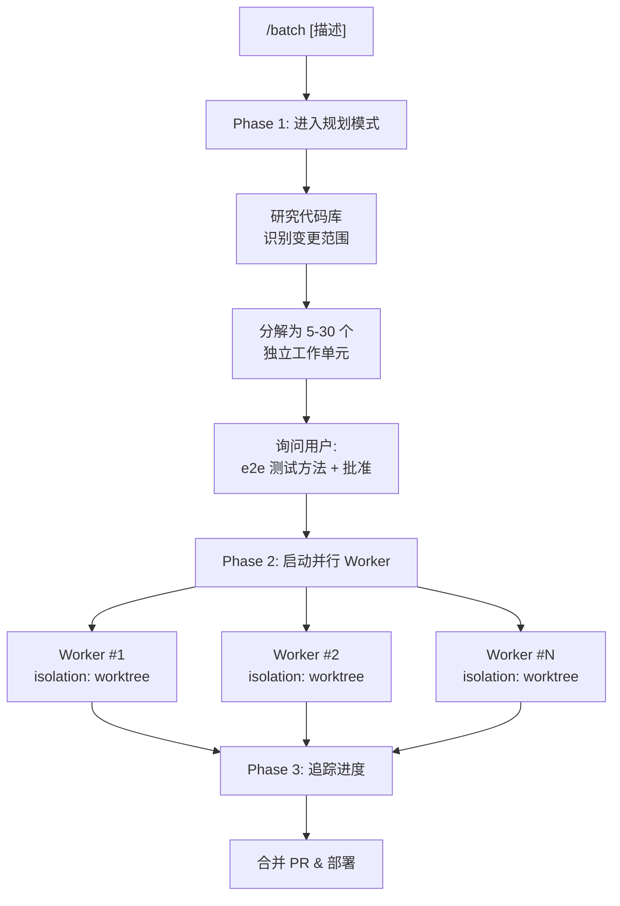
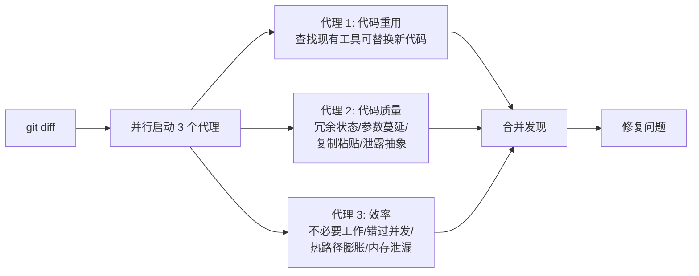
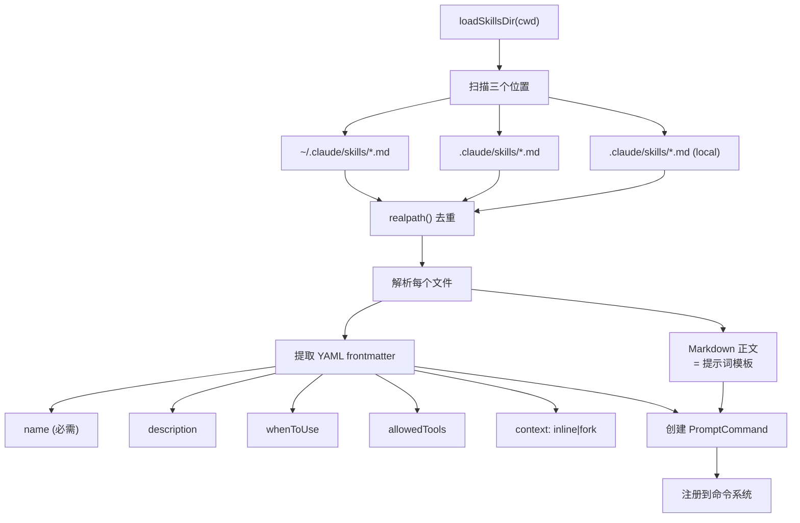
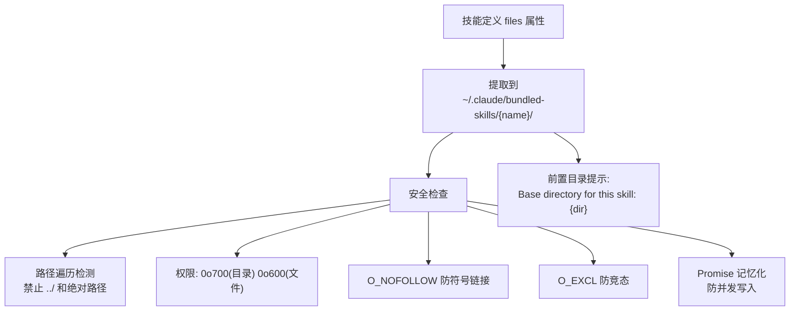

# 15 - 技能系统 (Skills System)

## 架构总览

## 技能定义类型

## 执行流程

## inline vs fork 执行上下文

## 14 个打包技能完整参考

### 每个技能详细参数

| 技能 | 别名 | 启用条件 | allowedTools | context | 模型调用 |
|------|------|---------|-------------|---------|---------|
| **batch** | - | `getIsGit()` | Agent, AskUser, EnterPlan, ExitPlan, Skill | fork | 模型可调用 |
| **simplify** | - | 始终 | (三个子代理各有工具) | inline | 模型可调用 |
| **verify** | - | `USER_TYPE=ant` | (由 SKILL_FILES 定义) | inline | 用户可调用 |
| **loop** | - | `isKairosCronEnabled()` | CronCreate, CronDelete | 组合 | 模型可调用 |
| **schedule** | - | `feature('AGENT_TRIGGERS_REMOTE')` | RemoteTrigger, AskUser | 组合 | 模型可调用 |
| **remember** | - | `isAutoMemoryEnabled()` | (纯文本) | inline | 用户可调用 |
| **claude-api** | - | `feature('BUILDING_CLAUDE_APPS')` | Read, Grep, Glob, WebFetch | inline | 模型可调用 |
| **debug** | - | 始终 | Read, Grep, Glob | inline | `disableModelInvocation` |
| **stuck** | - | 始终 | Bash | inline | 用户可调用 |
| **skillify** | - | 始终 | AskUserQuestion | inline | 模型可调用 |
| **update-config** | - | `feature('CONFIGURE_CLAUDE')` | Read | inline | 模型可调用 |
| **keybindings-help** | - | `isKeybindingCustomizationEnabled()` | Read | inline | 模型可调用 |
| **claude-in-chrome** | - | `shouldAutoEnableClaudeInChrome()` | mcp__claude-in-chrome__* | inline | 模型可调用 |
| **lorem-ipsum** | - | 始终 | (纯文本) | inline | 用户可调用 |

### batch 技能工作流

### simplify 技能三代理审查

## 技能目录加载

## 文件提取安全机制

