# 16 - 子代理系统 (Subagent System)

## 架构总览

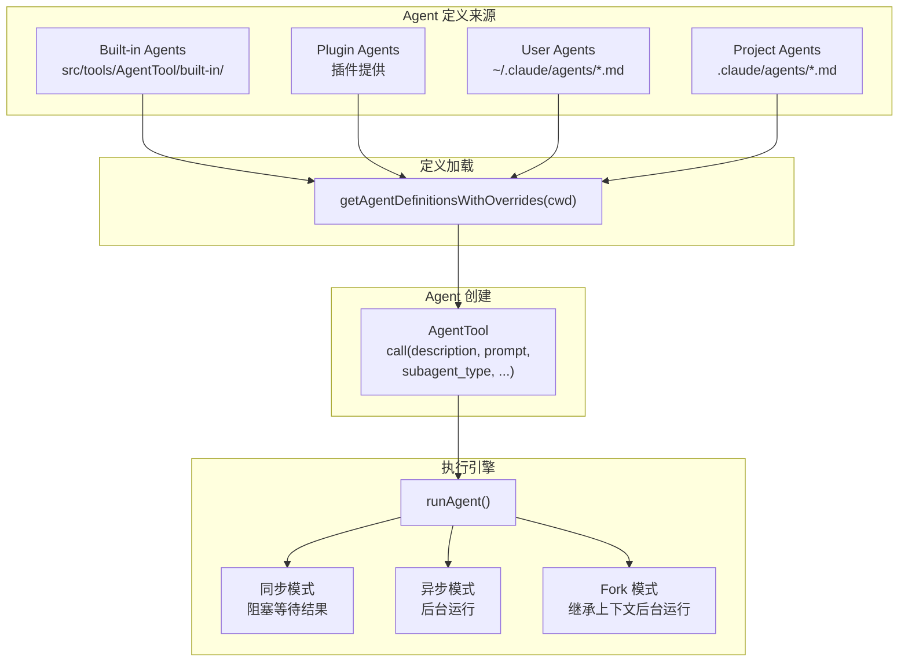

## Built-in Agent 类型

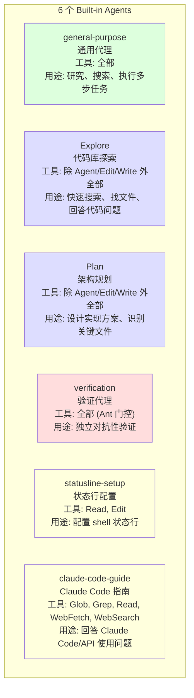

## Agent 定义加载优先级

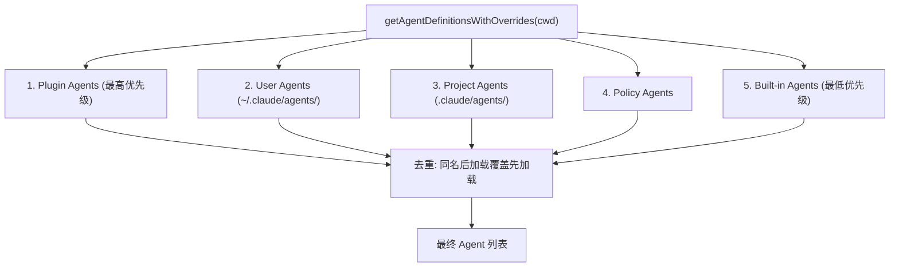

## Agent 执行生命周期

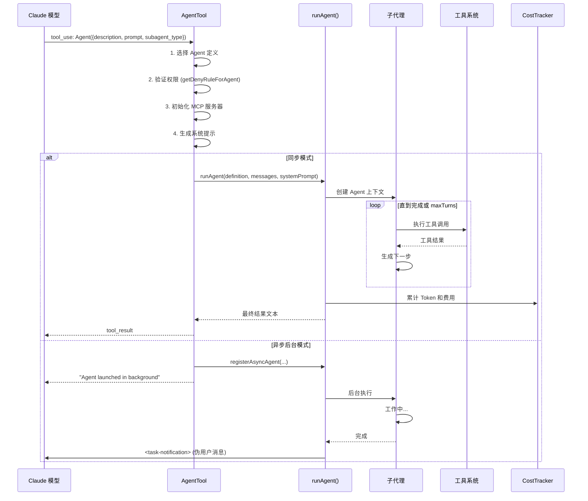

## 执行模式决策

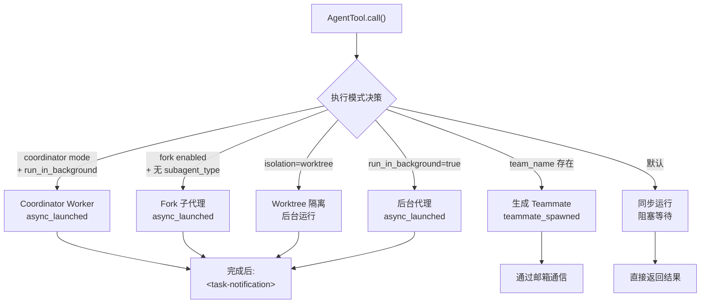

## Fork 子代理 vs 常规子代理

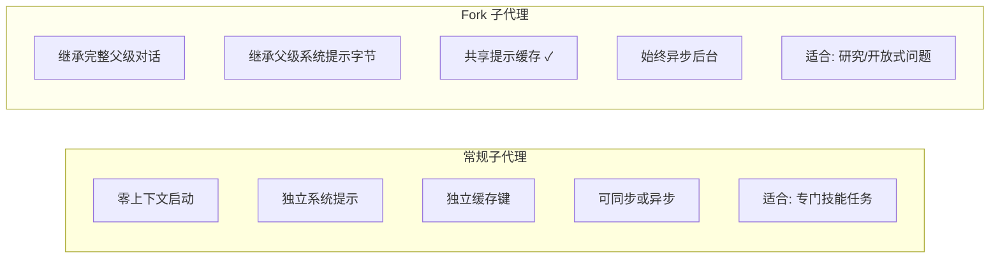

### Fork 消息构建

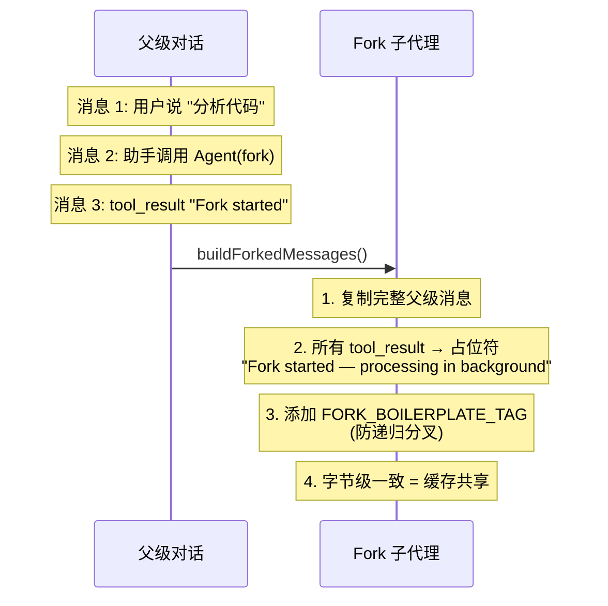

### Fork 防护机制

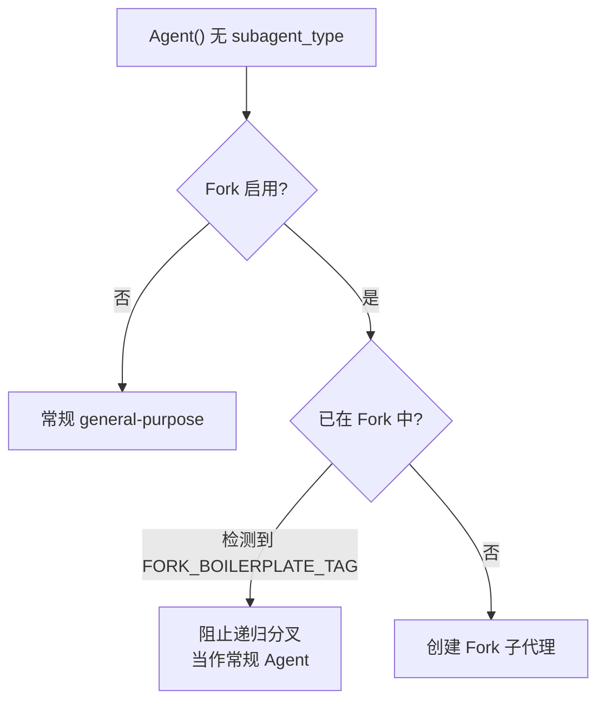

## 工具池组装

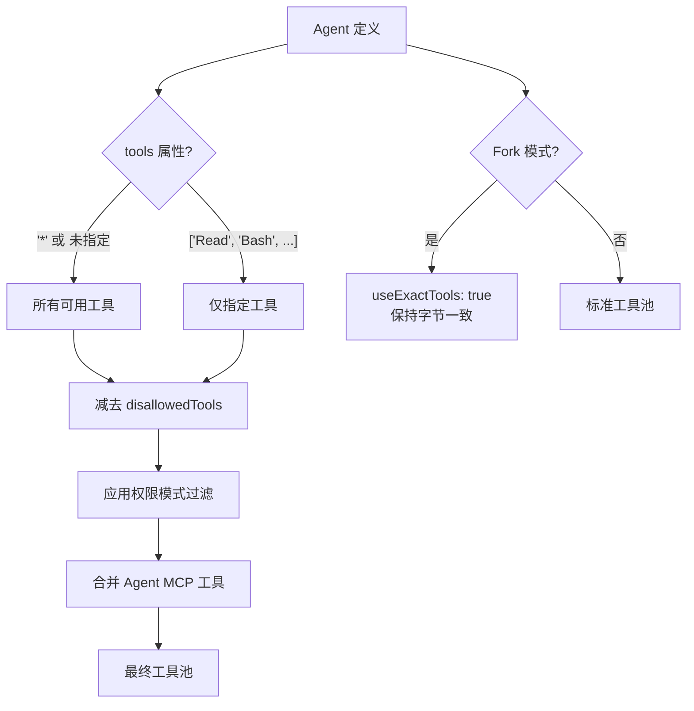

## Worktree 隔离

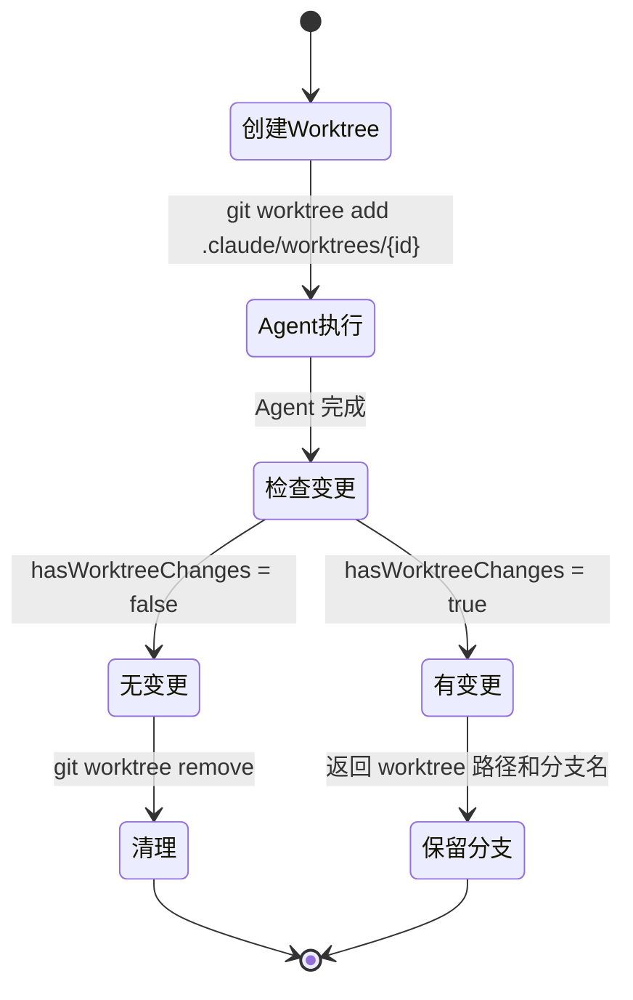

## 异步 Agent 通知流

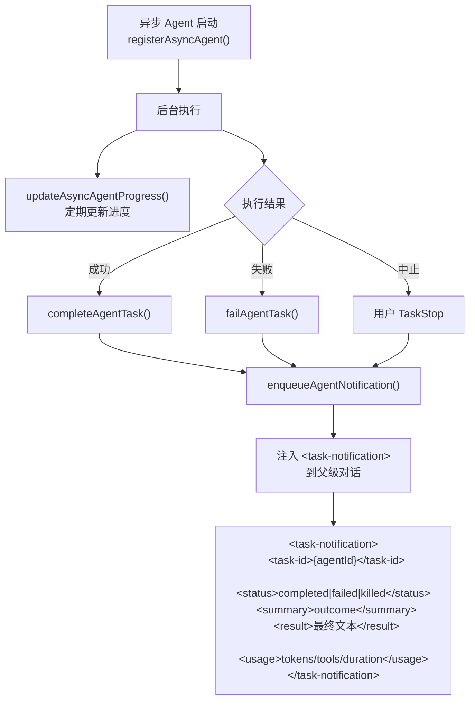

## 自定义 Agent 示例

```markdown
# .claude/agents/code-reviewer.md

---
name: code-reviewer
description: "Reviews code for quality and security"
tools: [Read, Grep, Glob, Bash]
model: opus
effort: 4
permissionMode: bubble
maxTurns: 20
mcpServers:
  - github
memory: project
omitClaudeMd: false
---

You are a code review specialist. Analyze code changes for:
1. Security vulnerabilities (OWASP top 10)
2. Performance issues
3. Code style consistency
4. Test coverage gaps

Always provide actionable feedback with file:line references.
```

## 门控条件

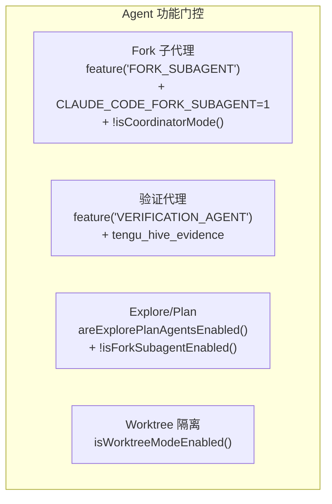
