# 17 - Agent Team 协作系统

## 三种多代理模式对比

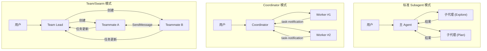

| 维度 | Subagent | Coordinator | Team/Swarm |
|------|----------|-------------|------------|
| 通信方向 | 单向 (主→子→主) | 主→Worker→主 | 双向 (任意成员间) |
| Worker 生命周期 | 单次任务 | 单次任务 | 持续存在 |
| 任务管理 | 无 | 无形式化 | TaskList 系统 |
| 成员发现 | 不可 | 不可 | config.json |
| 适用场景 | 简单并行查询 | 复杂编排 | 大型协作项目 |

---

## Coordinator 模式

### 架构

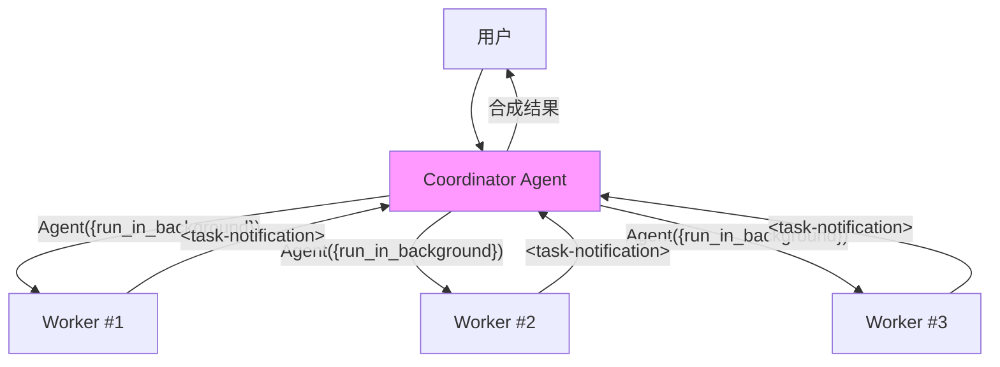

### 启用方式

```bash
export CLAUDE_CODE_COORDINATOR_MODE=1
# 且需要 feature('COORDINATOR_MODE') 编译时启用
```

### Coordinator 系统提示关键原则

```
## 你的角色
你是协调器。你的工作是：
- 帮用户实现目标
- 指导 Worker 研究、实现、验证代码
- 合成结果并与用户交流
- 能处理的问题直接处理（不用委派）

## Worker 管理工具
- Agent({...}) — 启动新 Worker
- SendMessage({to: agentId, ...}) — 继续现有 Worker
- TaskStop({agent_id: ...}) — 停止 Worker

## 约束
✗ 不要用一个 Worker 检查另一个 Worker 的状态
✗ 不要用 Worker 来报告文件内容（低价值）
✗ 不要设置 model 参数
✓ 启动后简要告诉用户在做什么
✓ 永远不要猜测或编造 Worker 结果
```

### Coordinator 工作流

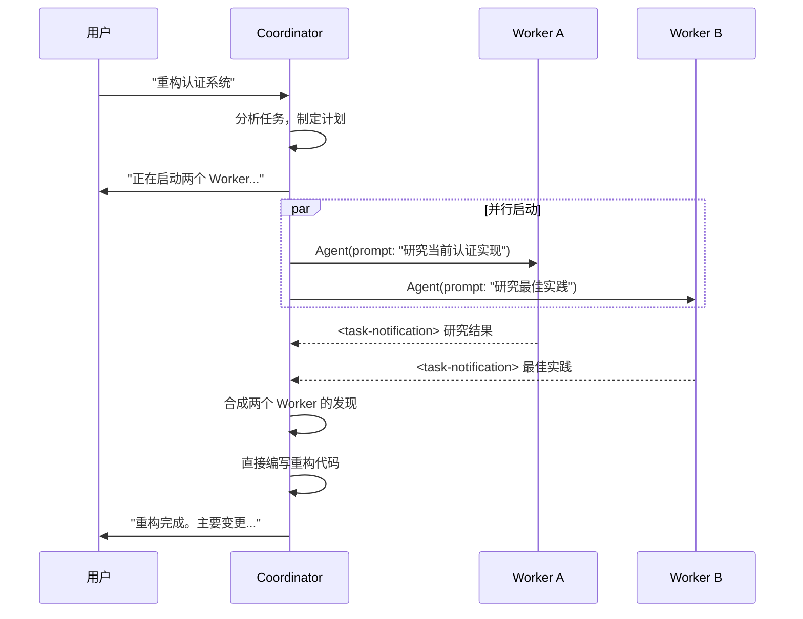

---

## Team/Swarm 模式

### 完整架构

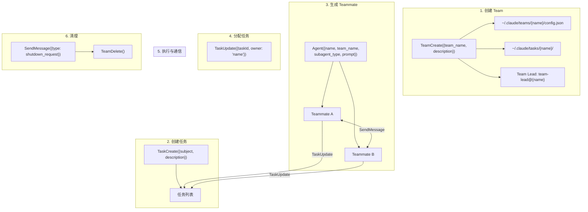

### Team 配置文件结构

```json
{
  "name": "backend-team",
  "createdAt": "2026-04-08T...",
  "leadAgentId": "team-lead@backend-team",
  "members": [
    {
      "agentId": "researcher@backend-team",
      "name": "researcher",
      "agentType": "Explore",
      "color": "blue",
      "joinedAt": "2026-04-08T..."
    },
    {
      "agentId": "implementer@backend-team",
      "name": "implementer",
      "agentType": "general-purpose",
      "color": "green",
      "joinedAt": "2026-04-08T..."
    }
  ],
  "teamAllowedPaths": []
}
```

### Teammate 生成后端

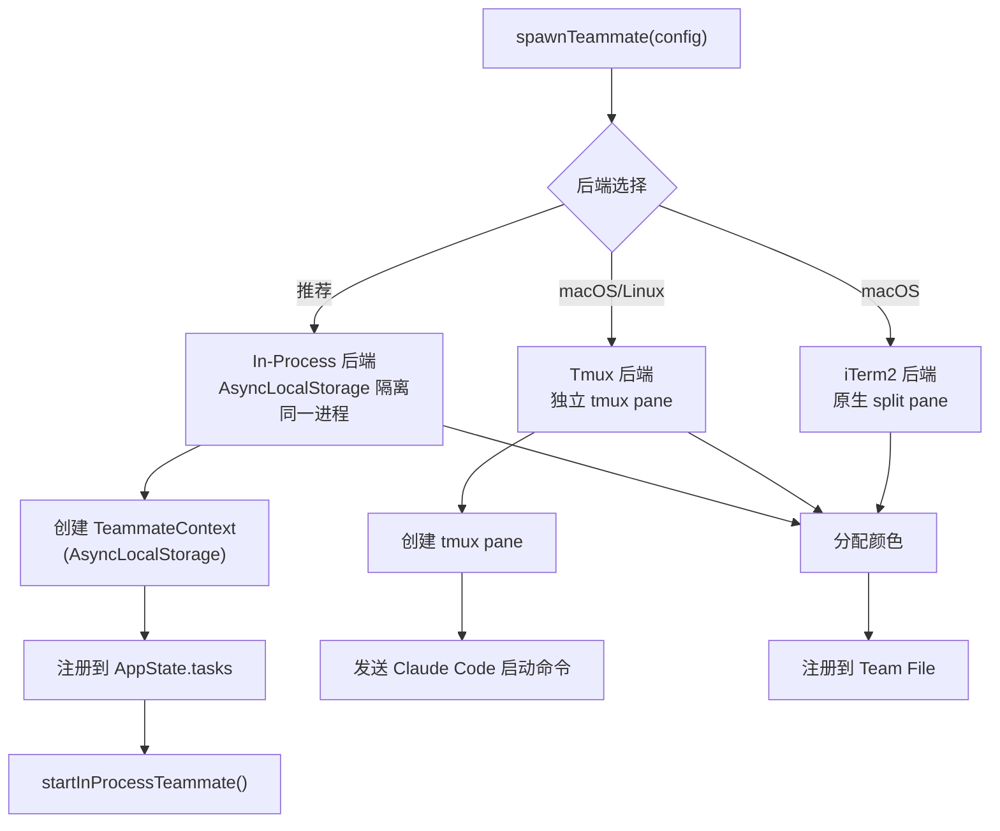

### Teammate 间通信

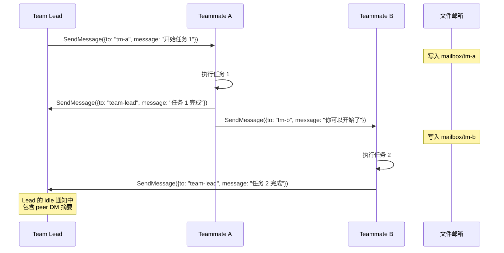

### 特殊消息类型

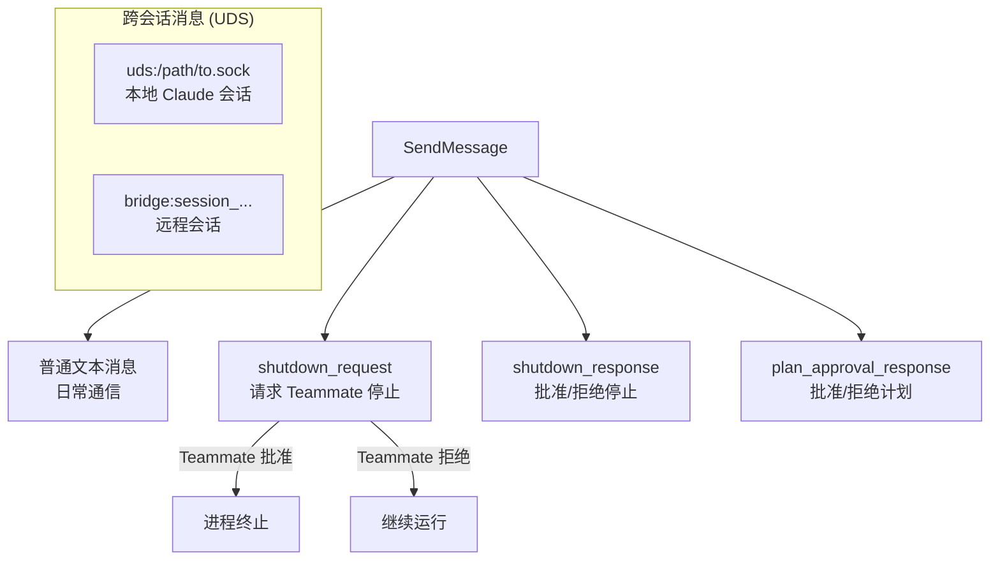

### 任务管理完整流程

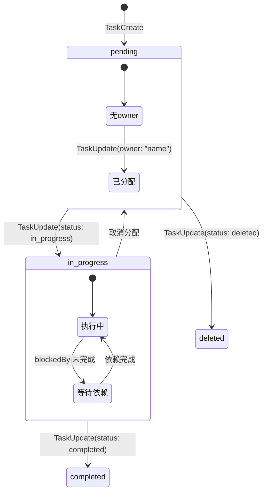

### 任务依赖

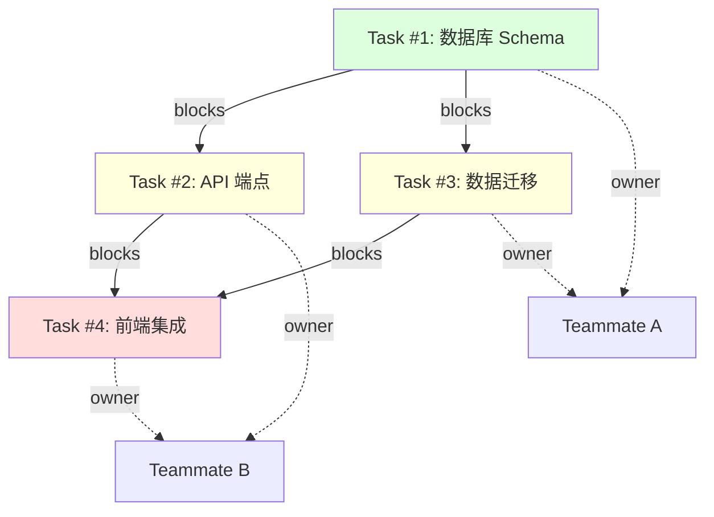

### Teammate 空闲状态

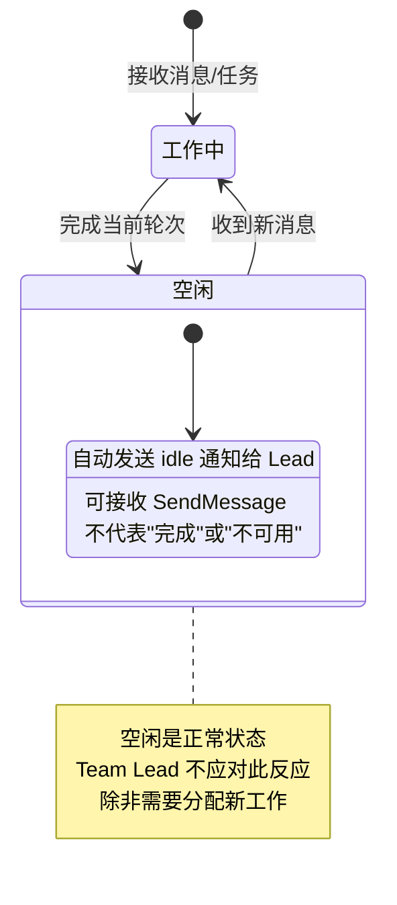

---

## Team 完整工作流示例

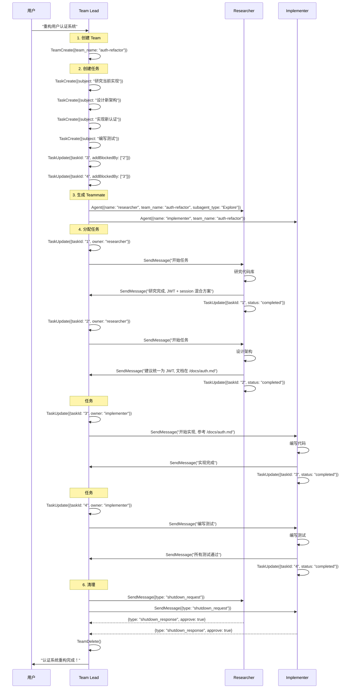

## 门控条件

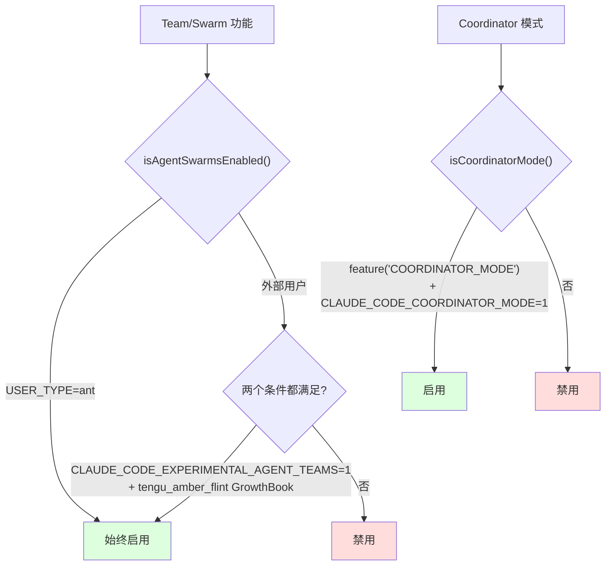
