# 18 - 应用场景分析

> 从源码中归类出的 20 个核心应用场景，覆盖智能后台系统、知识管理、上下文优化、安全控制等。

---

## 场景总览

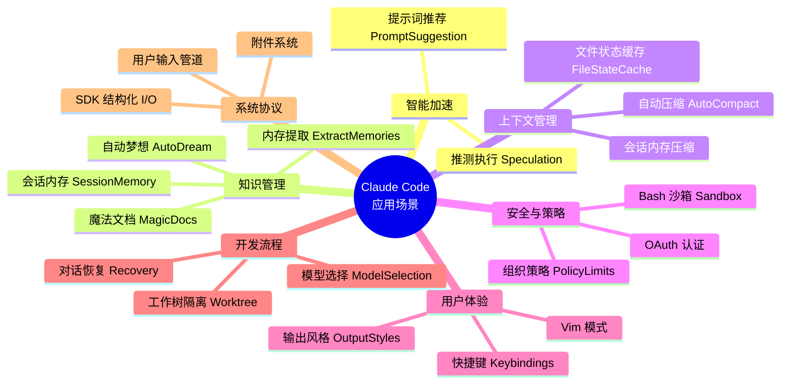

---

## 1. 推测执行 (Speculation)

**文件**: `src/services/PromptSuggestion/speculation.ts`

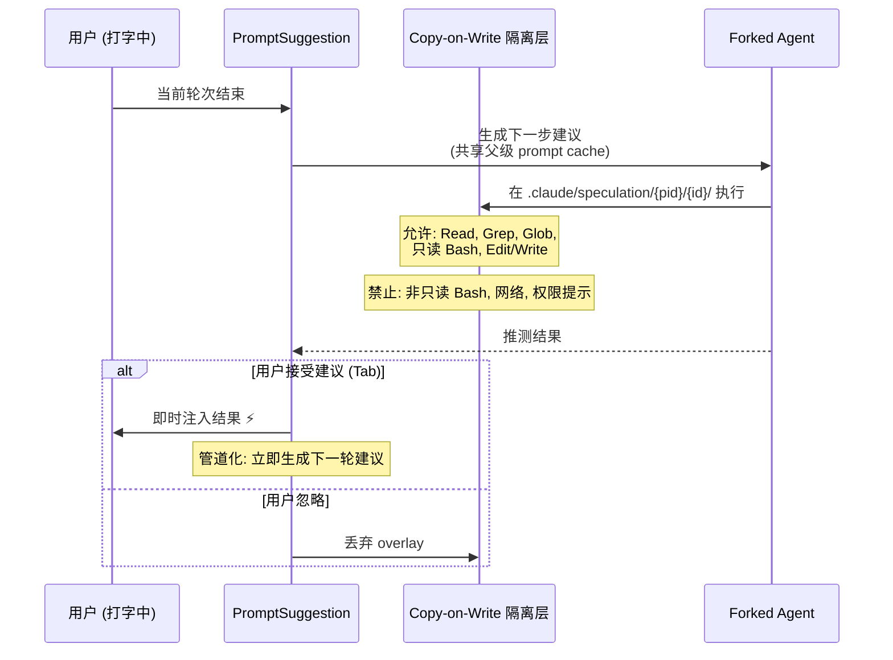

**限制**: 最多 20 轮 / 100 条消息，仅 Ant 内部用户

---

## 2. 自动梦想 (AutoDream)

**文件**: `src/services/autoDream/`

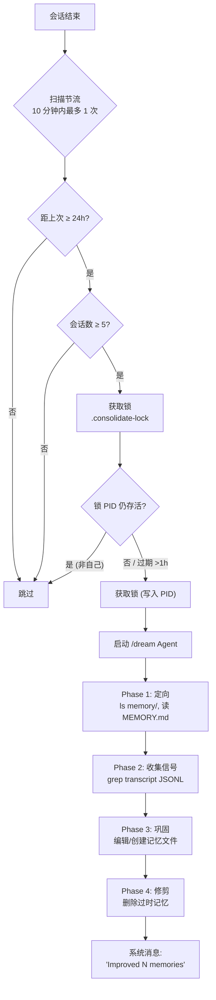

---

## 3. 内存提取 (ExtractMemories)

**文件**: `src/services/extractMemories/`

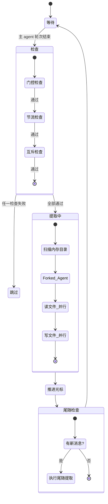

**关键状态**: `lastMemoryMessageUuid` (光标)、`inFlightExtractions` (并发追踪)、`turnsSinceLastExtraction` (节流计数器)

---

## 4. 魔法文档 (MagicDocs)

**文件**: `src/services/MagicDocs/`

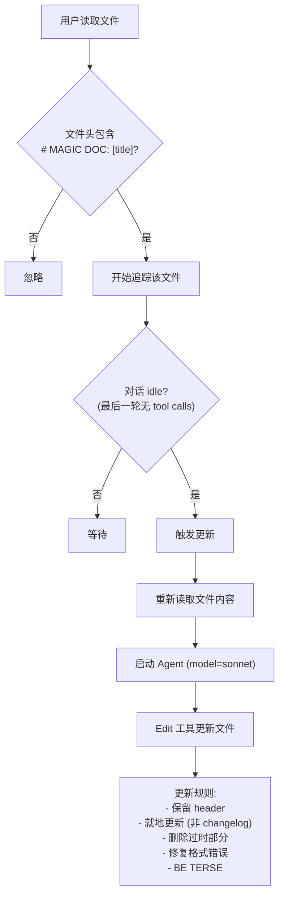

---

## 5. 自动压缩 (AutoCompact)

**文件**: `src/services/compact/autoCompact.ts`

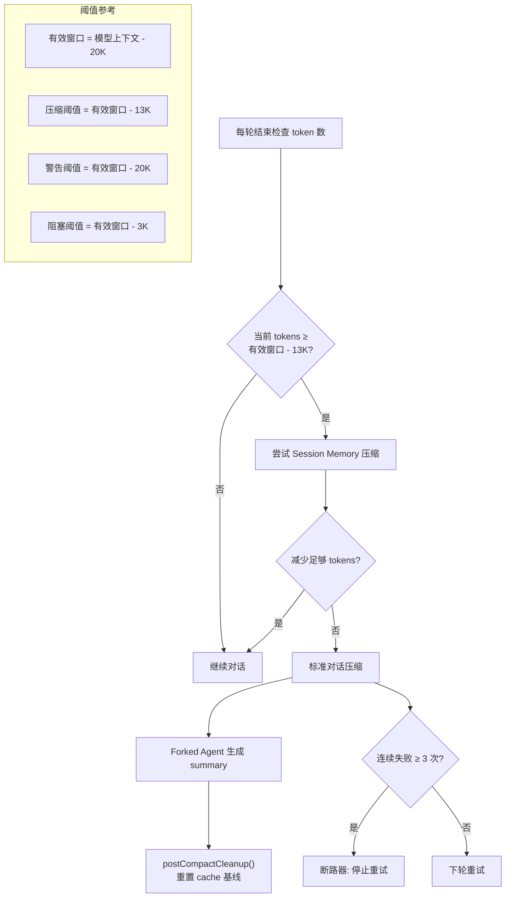

---

## 6. 组织策略限制 (PolicyLimits)

**文件**: `src/services/policyLimits/`

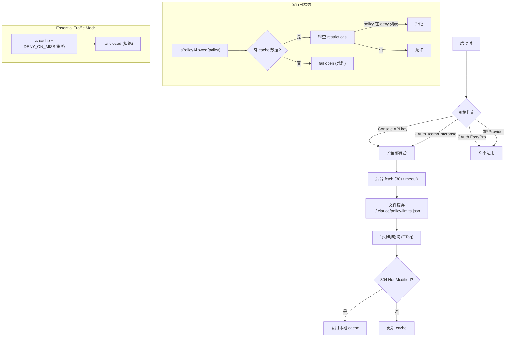

---

## 7. Bash 沙箱 (Sandbox)

**文件**: `src/utils/sandbox/`

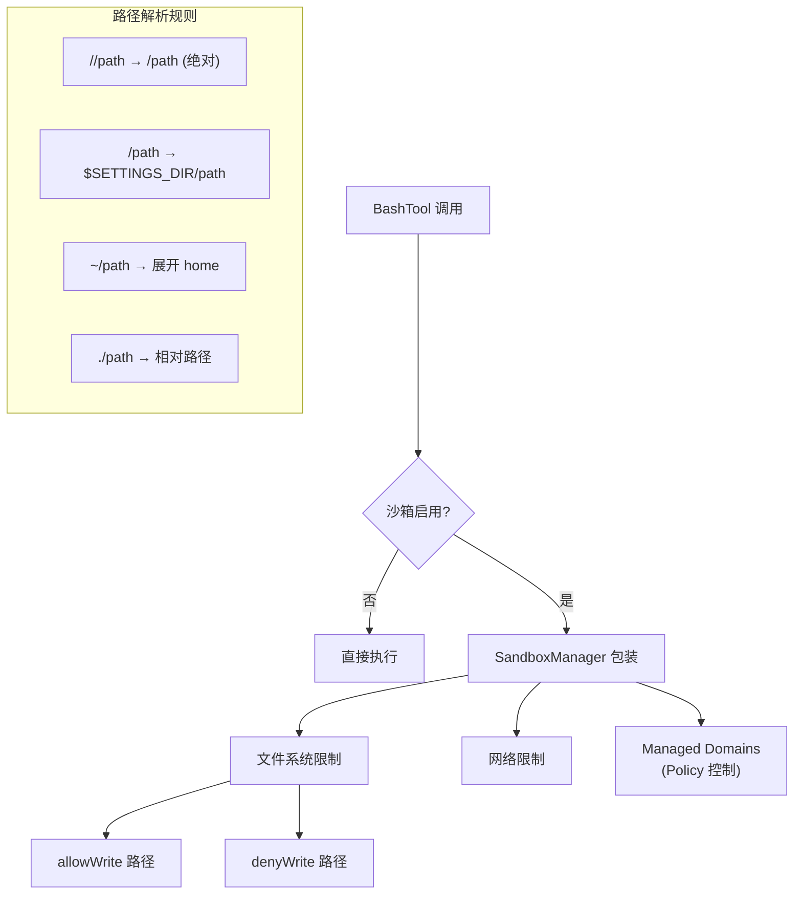

---

## 8. 文件状态缓存 (FileStateCache)

**文件**: `src/utils/fileStateCache.ts`

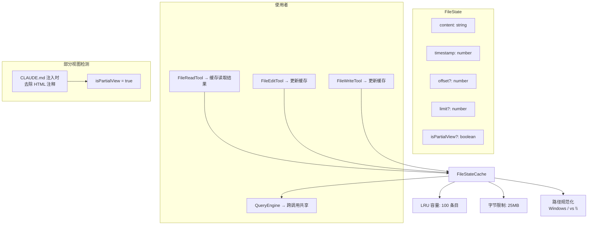

---

## 9. 对话恢复 (Conversation Recovery)

**文件**: `src/utils/conversationRecovery.ts`

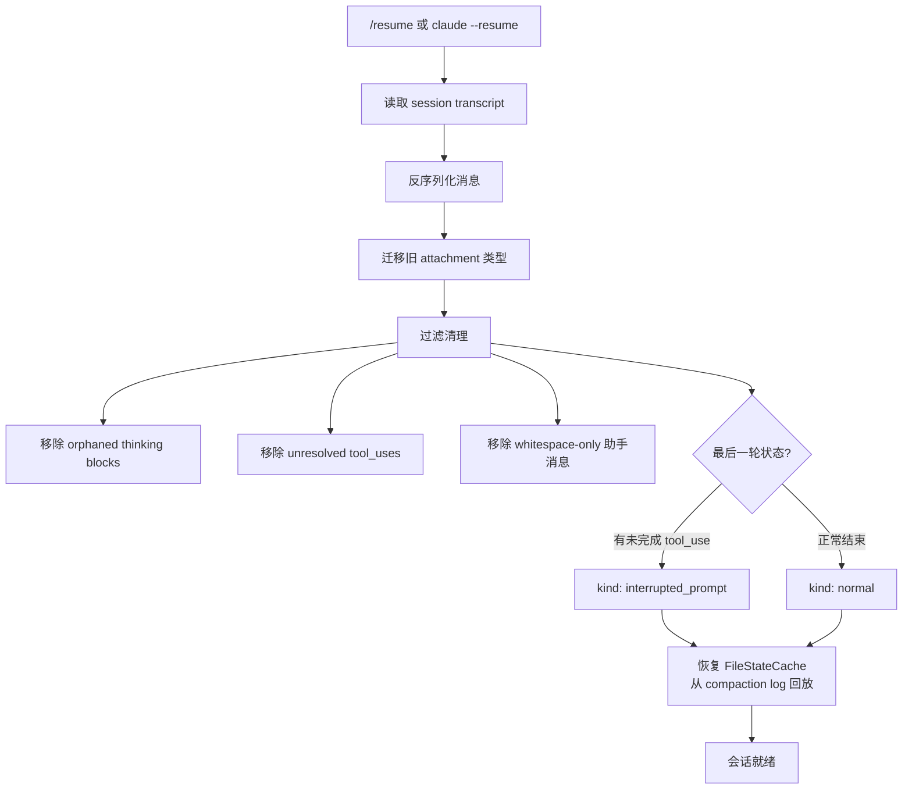

---

## 10. 模型选择 (Model Selection)

**文件**: `src/utils/model/`

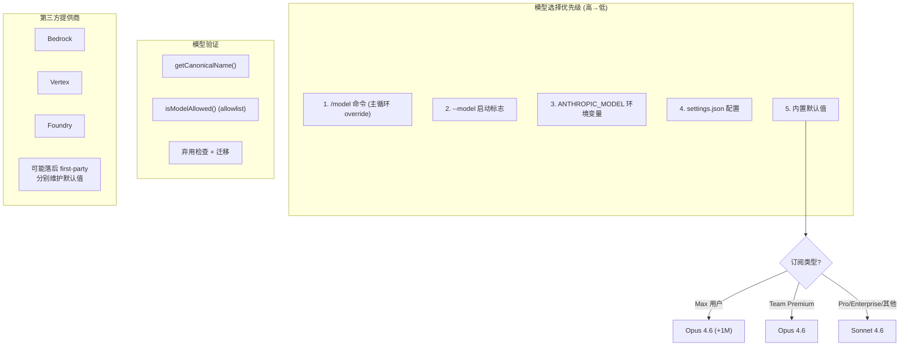

---

## 11. 用户输入处理管道

**文件**: `src/utils/processUserInput/`

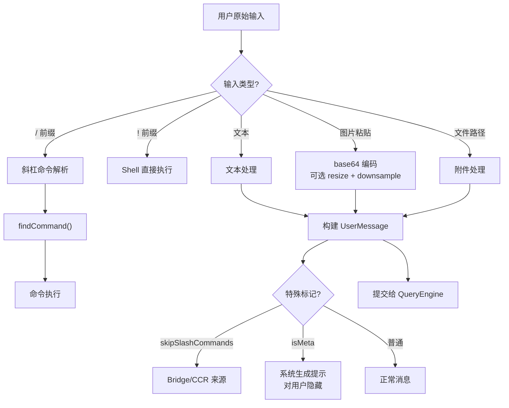

---

## 12. 会话内存 (Session Memory)

**文件**: `src/services/SessionMemory/`

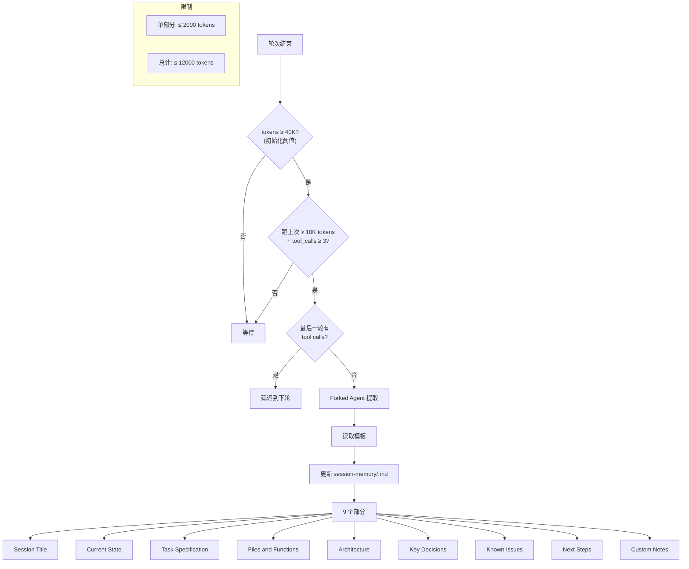

---

## 13. OAuth 认证流程

**文件**: `src/services/oauth/`

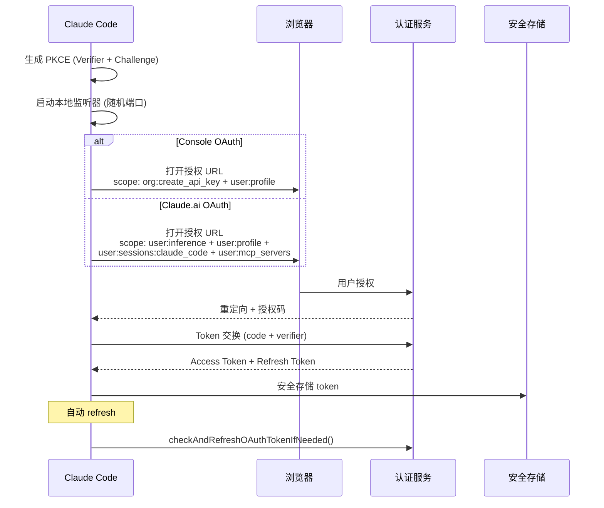

---

## 14. 工作树隔离 (Worktree)

**文件**: `src/utils/worktree.ts`

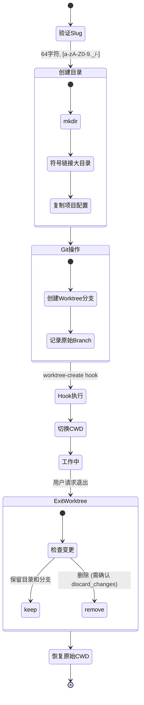

---

## 15. 输出风格定制 (Output Styles)

**文件**: `src/outputStyles/`

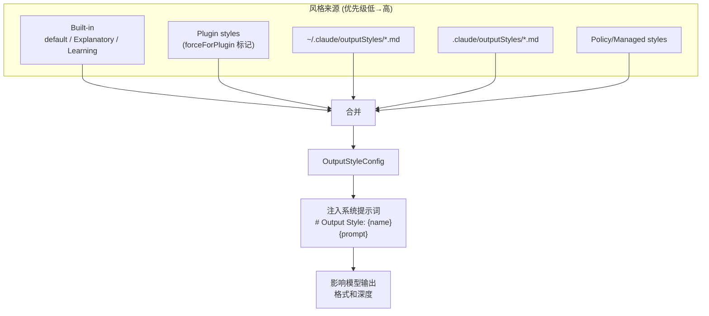

---

## 设计原则总结

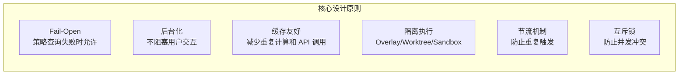

| 场景 | 使用原则 |
|------|---------|
| PolicyLimits | Fail-Open + 缓存 + 定期轮询 |
| AutoDream | 后台化 + 节流 + 互斥锁 |
| Speculation | 隔离执行 (Overlay) + 缓存共享 |
| ExtractMemories | 后台化 + 互斥 + 游标推进 |
| AutoCompact | 节流 + 断路器 (3 次失败) |
| MagicDocs | 后台化 + idle 检测 |
| FileStateCache | LRU + 字节限制 + 路径规范化 |
