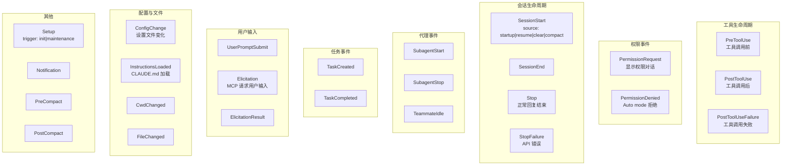
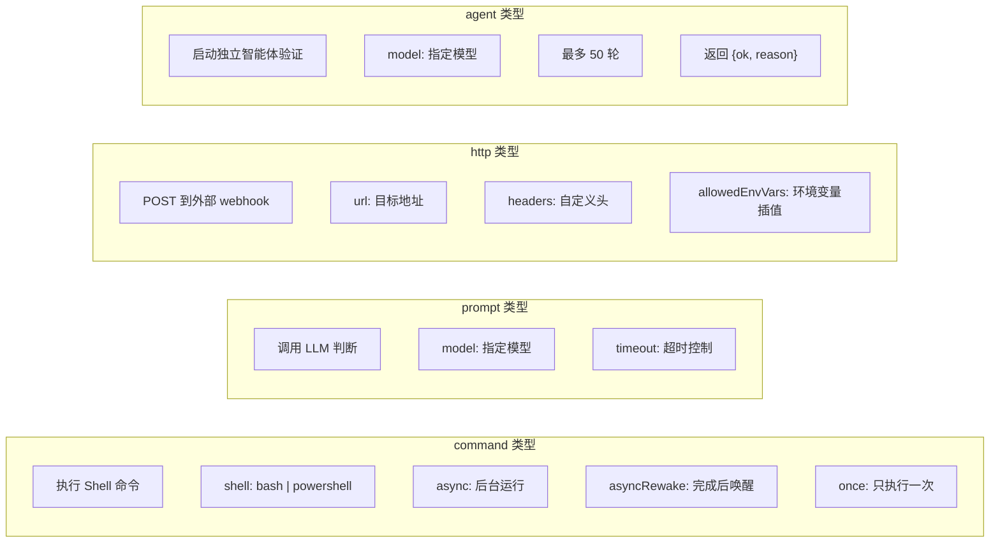
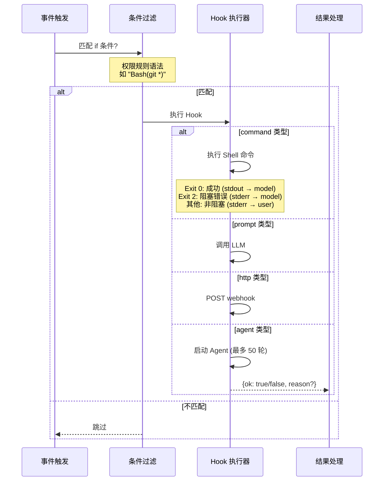
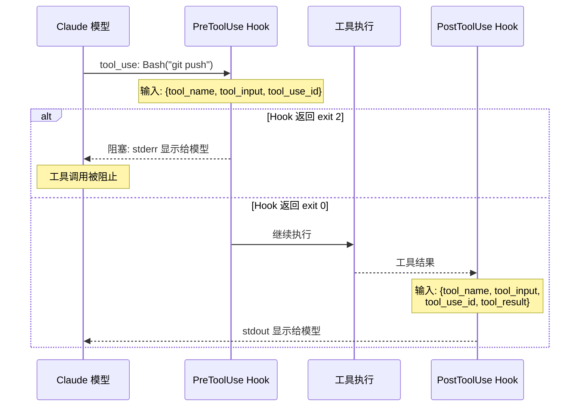
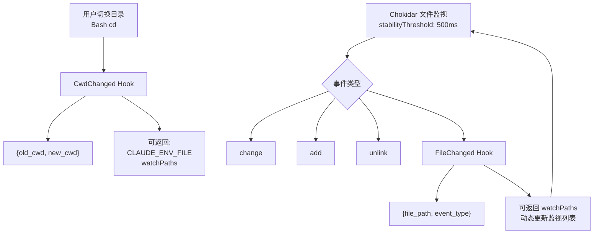
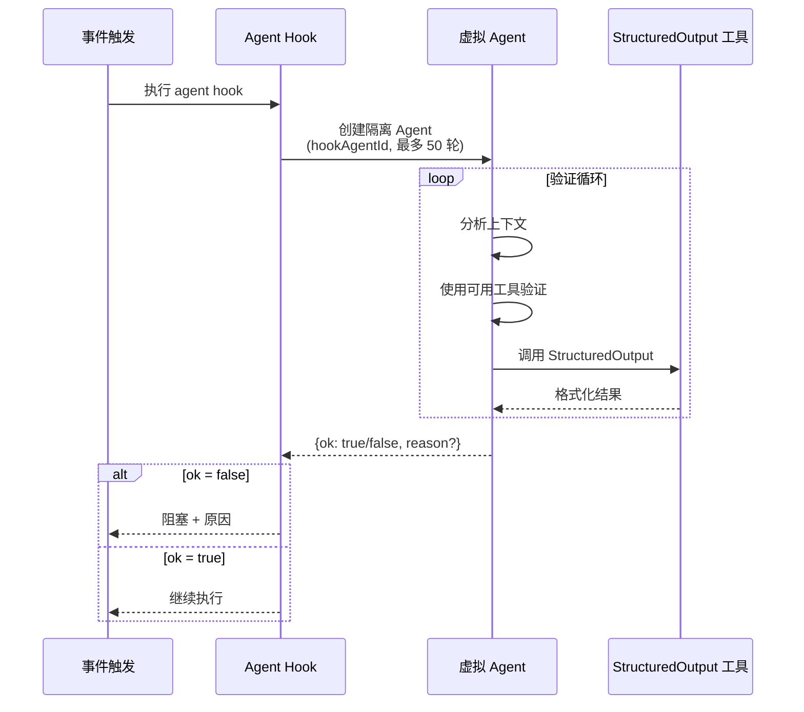

# 19 - Hook 生命周期系统

## 25 个 Hook 事件完整参考



## 4 种 Hook 类型



## Hook 执行流程



## PreToolUse / PostToolUse 详细流程



## PermissionRequest Hook 自动决策

```mermaid
flowchart TD
    PERM["权限对话触发"] --> HOOK["执行 PermissionRequest Hook"]
    HOOK --> RESULT{"Hook 返回?"}

    RESULT -->|'exit 0 + JSON {decision: "allow"}'| ALLOW["自动允许"]
    RESULT -->|'exit 0 + JSON {decision: "deny"}'| DENY["自动拒绝"]
    RESULT -->|'exit 2'| BLOCK["阻塞 (显示 stderr)"]
    RESULT -->|'其他'| ASK["正常询问用户"]

    DENY --> DENIED_HOOK["触发 PermissionDenied Hook"]
    DENIED_HOOK --> RETRY{"Hook 返回 {retry: true}?"}
    RETRY -->|是| MODEL["告知模型可重试"]
    RETRY -->|否| FINAL["最终拒绝"]
```

## 文件监视 Hook (FileChanged + CwdChanged)



## Agent Hook 多轮验证



## 完整 Hook 事件参考表

| 事件 | 输入 | Exit 0 | Exit 2 | 用途 |
|------|------|--------|--------|------|
| **PreToolUse** | tool_name, tool_input, tool_use_id | stdout→model | 阻塞工具调用 | 工具调用前拦截 |
| **PostToolUse** | tool_name, tool_input, tool_use_id, tool_result | stdout→model | stderr→model | 工具完成后处理 |
| **PostToolUseFailure** | tool_name, tool_input, error | stdout→model | 忽略 | 工具失败后处理 |
| **PermissionRequest** | tool_name, tool_input, tool_use_id | JSON{decision} | 阻塞 | 自动权限决策 |
| **PermissionDenied** | tool_name, tool_input, reason | JSON{retry} | 忽略 | 拒绝后重试 |
| **UserPromptSubmit** | prompt_text | stdout→model | 阻塞提交 | 输入预处理 |
| **SessionStart** | source | stdout→model | 忽略 | 会话初始化 |
| **SessionEnd** | (空) | 忽略 | 忽略 | 会话清理 |
| **Stop** | (空) | 忽略 | stderr→model,继续 | 回复结束后 |
| **StopFailure** | error_type | 忽略 | 忽略 | API 错误观测 |
| **SubagentStart** | agent_id, agent_type | stdout→subagent | 忽略 | 代理启动 |
| **SubagentStop** | agent_id, agent_type, transcript_path | 忽略 | stderr→继续 | 代理停止 |
| **PreCompact** | details | stdout→自定义指令 | 阻止压缩 | 压缩前拦截 |
| **PostCompact** | details, summary | stdout→user | 忽略 | 压缩后通知 |
| **TeammateIdle** | teammate_name, team_name | 忽略 | 阻止空闲 | 队友管理 |
| **TaskCreated** | task_id, subject, description | 忽略 | 阻止创建 | 任务追踪 |
| **TaskCompleted** | task_id, subject | 忽略 | 阻止完成 | 任务验证 |
| **Elicitation** | mcp_server, message, schema | JSON{action,content} | 忽略 | MCP 自动应答 |
| **ElicitationResult** | mcp_server, result | JSON 可修改 | 忽略 | 结果处理 |
| **ConfigChange** | source, file_path | 忽略 | 阻止应用 | 配置监控 |
| **InstructionsLoaded** | file_path, memory_type, load_reason | 忽略 | 忽略 | 观测性 |
| **CwdChanged** | old_cwd, new_cwd | CLAUDE_ENV_FILE, watchPaths | 忽略 | 目录切换 |
| **FileChanged** | file_path, event_type | watchPaths | 忽略 | 文件变化 |
| **Setup** | trigger: init\|maintenance | 忽略 | 忽略 | 仓库初始化 |
| **Notification** | notification_details | 忽略 | 忽略 | 通知分发 |
