# 20 - 更多应用场景分析（第二批）

> 从源码中发掘的第二批应用场景，涵盖输入处理、缓存诊断、限流、通知、安全存储等。

---

## 1. Shell 命令内嵌执行 (`!` 前缀)

**文件**: `src/utils/promptShellExecution.ts`

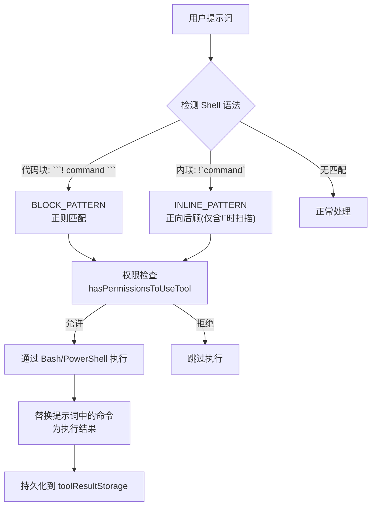
```mermaid
flowchart TD
    INPUT["用户提示词"] --> DETECT{"检测 Shell 语法"}

    DETECT -->|"代码块: ```! command ```"| BLOCK["BLOCK_PATTERN<br/>正则匹配"]
    DETECT -->|"内联: !`command`"| INLINE["INLINE_PATTERN<br/>正向后顾(仅含!`时扫描)"]
    DETECT -->|"无匹配"| NORMAL["正常处理"]

    BLOCK & INLINE --> PERM["权限检查<br/>hasPermissionsToUseTool"]
    PERM -->|允许| EXEC["通过 Bash/PowerShell 执行"]
    PERM -->|拒绝| SKIP["跳过执行"]

    EXEC --> REPLACE["替换提示词中的命令<br/>为执行结果"]
    REPLACE --> PERSIST["持久化到 toolResultStorage"]
```

---

## 2. 提示词缓存破裂检测

**文件**: `src/services/api/promptCacheBreakDetection.ts`

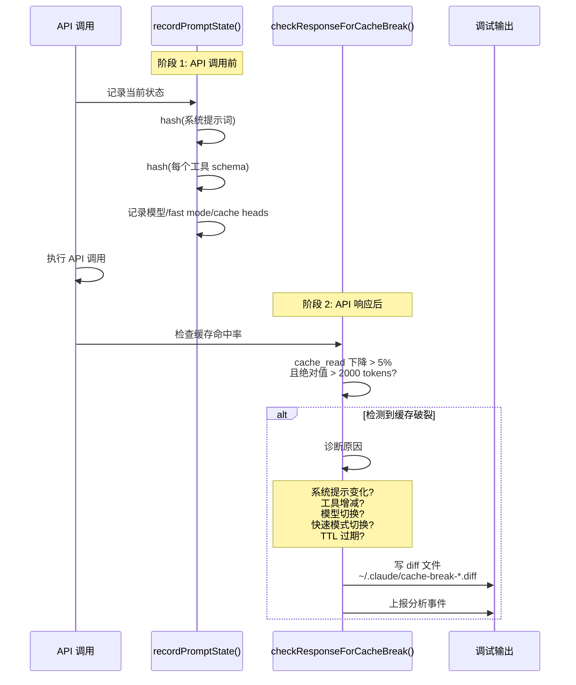
```mermaid
sequenceDiagram
    participant API as API 调用
    participant Record as recordPromptState()
    participant Check as checkResponseForCacheBreak()
    participant Debug as 调试输出

    Note over Record: 阶段 1: API 调用前
    API->>Record: 记录当前状态
    Record->>Record: hash(系统提示词)
    Record->>Record: hash(每个工具 schema)
    Record->>Record: 记录模型/fast mode/cache heads

    API->>API: 执行 API 调用

    Note over Check: 阶段 2: API 响应后
    API->>Check: 检查缓存命中率
    Check->>Check: cache_read 下降 > 5%<br/>且绝对值 > 2000 tokens?

    alt 检测到缓存破裂
        Check->>Check: 诊断原因
        Note over Check: 系统提示变化?<br/>工具增减?<br/>模型切换?<br/>快速模式切换?<br/>TTL 过期?
        Check->>Debug: 写 diff 文件<br/>~/.claude/cache-break-*.diff
        Check->>Debug: 上报分析事件
    end
```

**隔离追踪**: 不同 querySource 和 agentId 使用独立追踪键，最多 10 个源

---

## 3. 限流消息与分层警告

**文件**: `src/services/rateLimitMessages.ts` + `src/services/claudeAiLimits.ts`

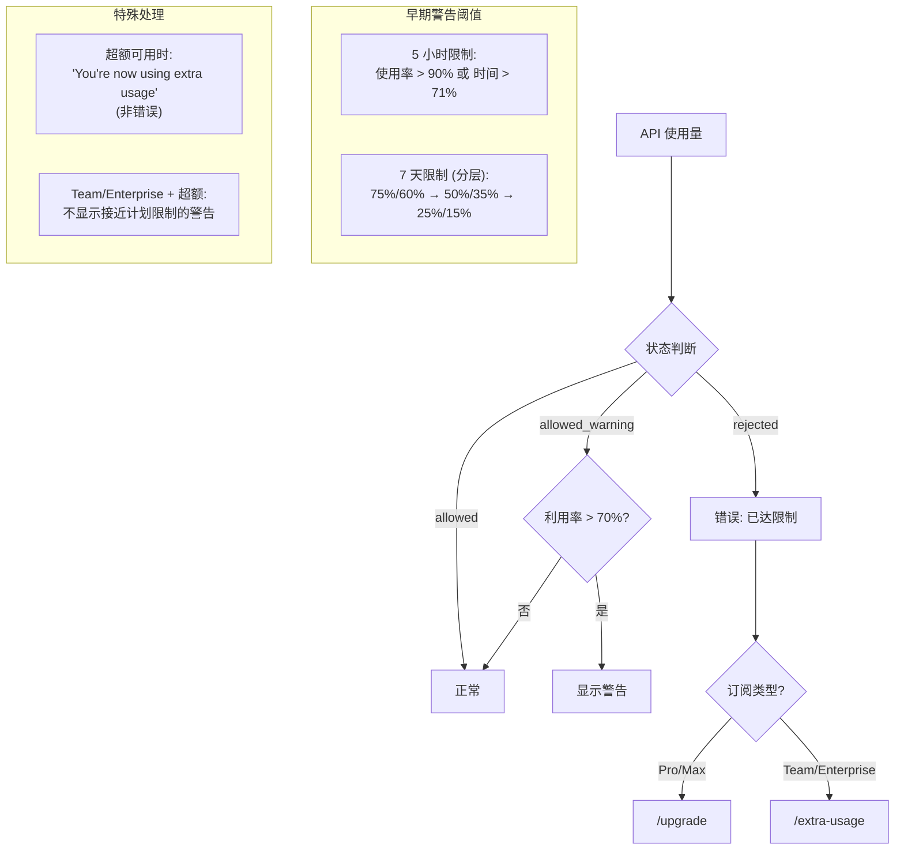
```mermaid
flowchart TD
    USAGE["API 使用量"] --> STATUS{"状态判断"}

    STATUS -->|"rejected"| ERROR["错误: 已达限制"]
    STATUS -->|"allowed_warning"| WARN_CHECK{"利用率 > 70%?"}
    STATUS -->|"allowed"| OK["正常"]

    WARN_CHECK -->|否| OK
    WARN_CHECK -->|是| WARN["显示警告"]

    ERROR --> UPSELL{"订阅类型?"}
    UPSELL -->|"Pro/Max"| SUGGEST_UPGRADE["/upgrade"]
    UPSELL -->|"Team/Enterprise"| SUGGEST_EXTRA["/extra-usage"]

    subgraph 早期警告阈值["早期警告阈值"]
        FIVE_H["5 小时限制:<br/>使用率 > 90% 或 时间 > 71%"]
        SEVEN_D["7 天限制 (分层):<br/>75%/60% → 50%/35% → 25%/15%"]
    end

    subgraph 特殊处理["特殊处理"]
        OVERAGE["超额可用时:<br/>'You're now using extra usage'<br/>(非错误)"]
        TEAM["Team/Enterprise + 超额:<br/>不显示接近计划限制的警告"]
    end
```

---

## 4. 早期输入捕获

**文件**: `src/utils/earlyInput.ts`

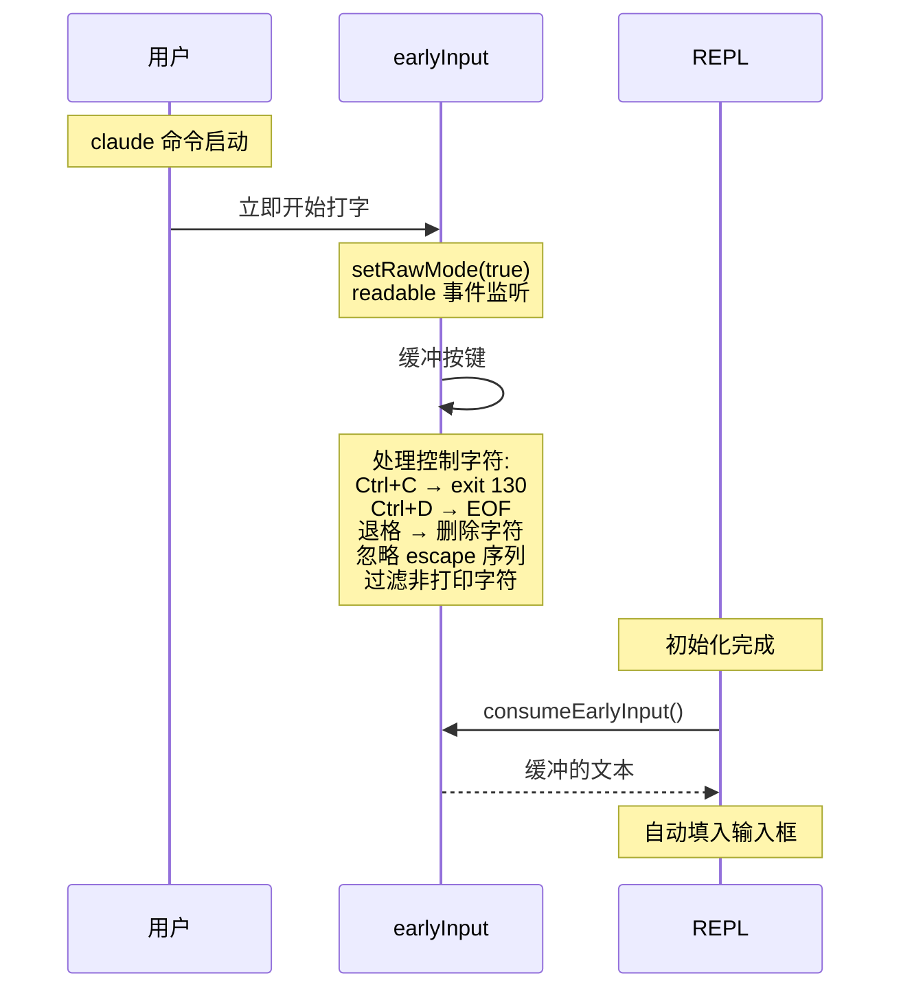
```mermaid
sequenceDiagram
    participant User as 用户
    participant Capture as earlyInput
    participant REPL as REPL

    Note over User: claude 命令启动
    User->>Capture: 立即开始打字

    Note over Capture: setRawMode(true)<br/>readable 事件监听
    Capture->>Capture: 缓冲按键
    Note over Capture: 处理控制字符:<br/>Ctrl+C → exit 130<br/>Ctrl+D → EOF<br/>退格 → 删除字符<br/>忽略 escape 序列<br/>过滤非打印字符

    Note over REPL: 初始化完成
    REPL->>Capture: consumeEarlyInput()
    Capture-->>REPL: 缓冲的文本
    Note over REPL: 自动填入输入框
```

---

## 5. 通知系统 — 多端点自动检测

**文件**: `src/services/notifier.ts`

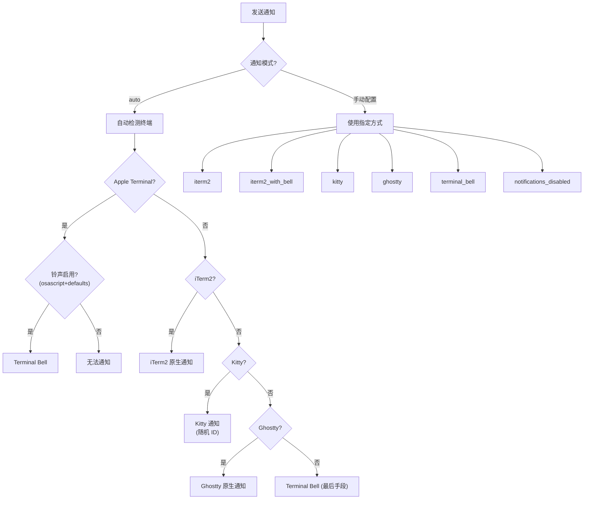
```mermaid
flowchart TD
    NOTIFY["发送通知"] --> MODE{"通知模式?"}

    MODE -->|"auto"| DETECT["自动检测终端"]
    MODE -->|"手动配置"| MANUAL["使用指定方式"]

    DETECT --> APPLE{"Apple Terminal?"}
    APPLE -->|是| BELL_CHECK{"铃声启用?<br/>(osascript+defaults)"}
    BELL_CHECK -->|是| BELL["Terminal Bell"]
    BELL_CHECK -->|否| NONE["无法通知"]

    APPLE -->|否| ITERM{"iTerm2?"}
    ITERM -->|是| ITERM_NOTIFY["iTerm2 原生通知"]
    ITERM -->|否| KITTY{"Kitty?"}
    KITTY -->|是| KITTY_NOTIFY["Kitty 通知<br/>(随机 ID)"]
    KITTY -->|否| GHOSTTY{"Ghostty?"}
    GHOSTTY -->|是| GHOSTTY_NOTIFY["Ghostty 原生通知"]
    GHOSTTY -->|否| FALLBACK["Terminal Bell (最后手段)"]

    MANUAL --> M_ITERM["iterm2"]
    MANUAL --> M_ITERM_BELL["iterm2_with_bell"]
    MANUAL --> M_KITTY["kitty"]
    MANUAL --> M_GHOSTTY["ghostty"]
    MANUAL --> M_BELL["terminal_bell"]
    MANUAL --> M_DISABLED["notifications_disabled"]
```

---

## 6. 成本追踪与会话恢复

**文件**: `src/cost-tracker.ts`

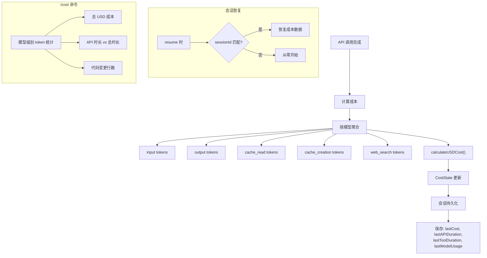
```mermaid
graph TD
    API_CALL["API 调用完成"] --> CALC["计算成本"]

    CALC --> AGGREGATE["按模型聚合"]
    AGGREGATE --> INPUT_T["input tokens"]
    AGGREGATE --> OUTPUT_T["output tokens"]
    AGGREGATE --> CACHE_R["cache_read tokens"]
    AGGREGATE --> CACHE_W["cache_creation tokens"]
    AGGREGATE --> WEB_S["web_search tokens"]

    AGGREGATE --> USD["calculateUSDCost()"]
    USD --> STATE["CostState 更新"]

    STATE --> PERSIST["会话持久化"]
    PERSIST --> SAVE["保存: lastCost, lastAPIDuration,<br/>lastToolDuration, lastModelUsage"]

    subgraph 恢复["会话恢复"]
        RESUME["resume 时"] --> MATCH{"sessionId 匹配?"}
        MATCH -->|是| RESTORE["恢复成本数据"]
        MATCH -->|否| FRESH["从零开始"]
    end

    subgraph 显示["/cost 命令"]
        DISPLAY["模型级别 token 统计"]
        DISPLAY --> USD_TOTAL["总 USD 成本"]
        DISPLAY --> DURATION["API 时长 vs 总时长"]
        DISPLAY --> LOC["代码变更行数"]
    end
```

---

## 7. 安全凭证存储

**文件**: `src/utils/secureStorage/`

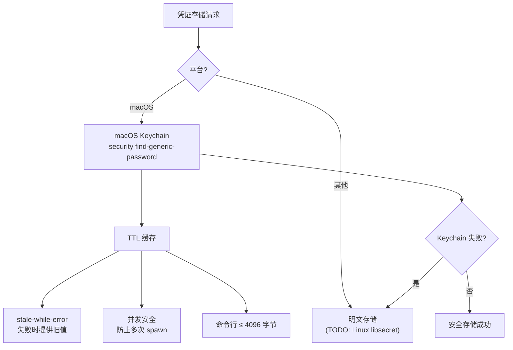
```mermaid
flowchart TD
    STORE["凭证存储请求"] --> PLATFORM{"平台?"}

    PLATFORM -->|macOS| KEYCHAIN["macOS Keychain<br/>security find-generic-password"]
    PLATFORM -->|其他| PLAINTEXT["明文存储<br/>(TODO: Linux libsecret)"]

    KEYCHAIN --> CACHE["TTL 缓存"]
    CACHE --> STALE["stale-while-error<br/>失败时提供旧值"]
    CACHE --> CONCURRENT["并发安全<br/>防止多次 spawn"]
    CACHE --> LIMIT["命令行 ≤ 4096 字节"]
    KEYCHAIN --> FALLBACK{"Keychain 失败?"}
    FALLBACK -->|是| PLAINTEXT
    FALLBACK -->|否| OK["安全存储成功"]
```

---

## 8. 文件历史与检查点

**文件**: `src/utils/fileHistory.ts`

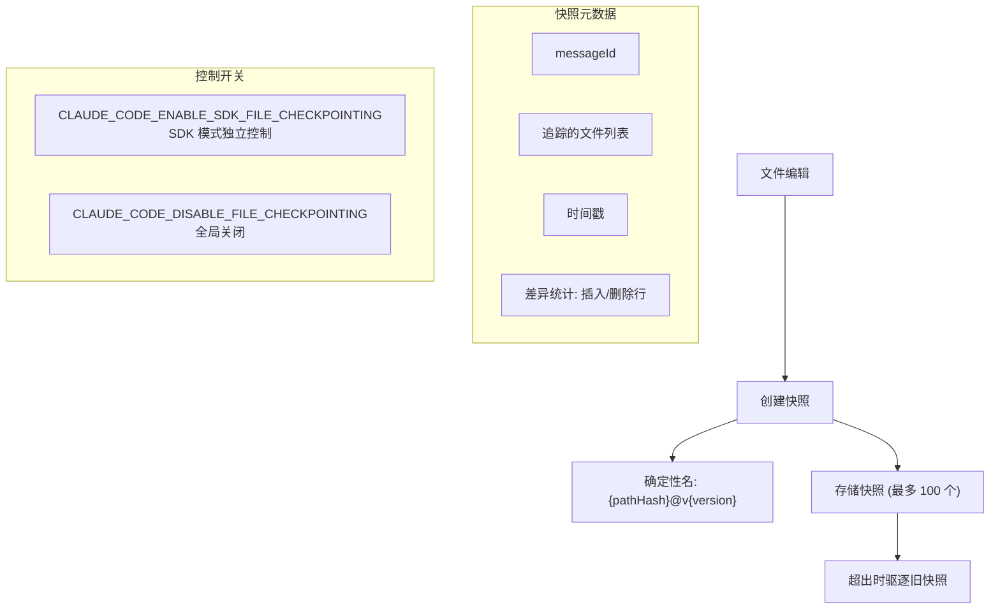
```mermaid
flowchart TD
    EDIT["文件编辑"] --> SNAPSHOT["创建快照"]
    SNAPSHOT --> NAME["确定性名: {pathHash}@v{version}"]
    SNAPSHOT --> STORE["存储快照 (最多 100 个)"]
    STORE --> EVICT["超出时驱逐旧快照"]

    subgraph 元数据["快照元数据"]
        MSG_ID["messageId"]
        FILES["追踪的文件列表"]
        TS["时间戳"]
        DIFF["差异统计: 插入/删除行"]
    end

    subgraph 控制["控制开关"]
        SDK_ENV["CLAUDE_CODE_ENABLE_SDK_FILE_CHECKPOINTING<br/>SDK 模式独立控制"]
        DISABLE["CLAUDE_CODE_DISABLE_FILE_CHECKPOINTING<br/>全局关闭"]
    end
```

---

## 9. 提交署名系统 (Attribution)

**文件**: `src/utils/attribution.ts`

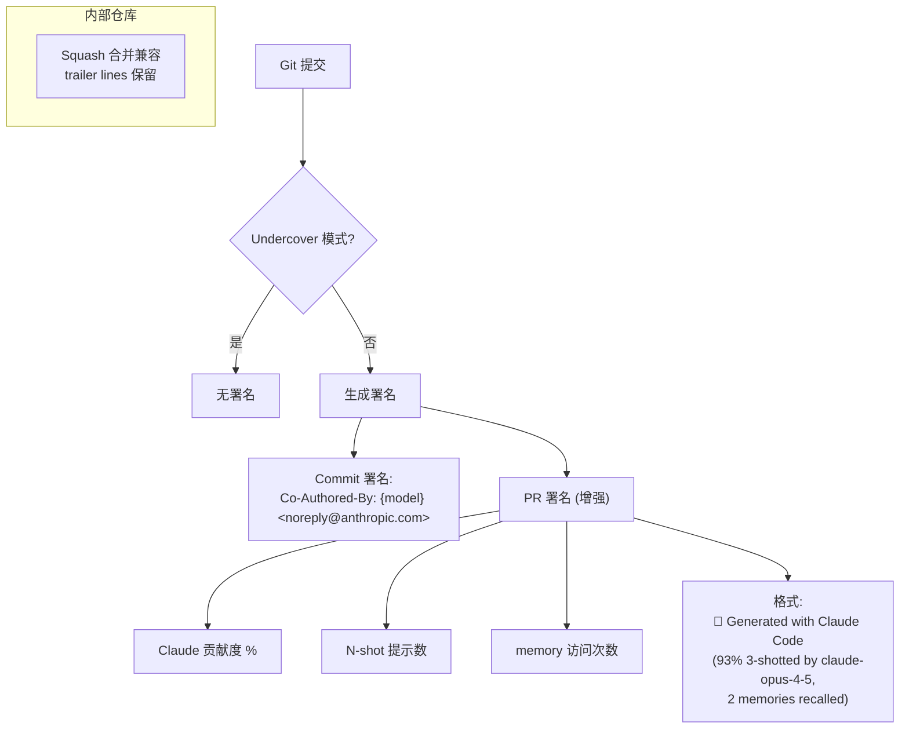
```mermaid
flowchart TD
    COMMIT["Git 提交"] --> MODE{"Undercover 模式?"}

    MODE -->|是| NO_ATTR["无署名"]
    MODE -->|否| GENERATE["生成署名"]

    GENERATE --> COMMIT_ATTR["Commit 署名:<br/>Co-Authored-By: {model} &lt;noreply@anthropic.com&gt;"]
    GENERATE --> PR_ATTR["PR 署名 (增强)"]

    PR_ATTR --> PERCENT["Claude 贡献度 %"]
    PR_ATTR --> NSHOT["N-shot 提示数"]
    PR_ATTR --> MEMORIES["memory 访问次数"]

    PR_ATTR --> FORMAT["格式:<br/>🤖 Generated with Claude Code<br/>(93% 3-shotted by claude-opus-4-5,<br/>2 memories recalled)"]

    subgraph 内部仓库["内部仓库"]
        SQUASH["Squash 合并兼容<br/>trailer lines 保留"]
    end
```

---

## 10. 工具结果持久化

**文件**: `src/utils/toolResultStorage.ts`

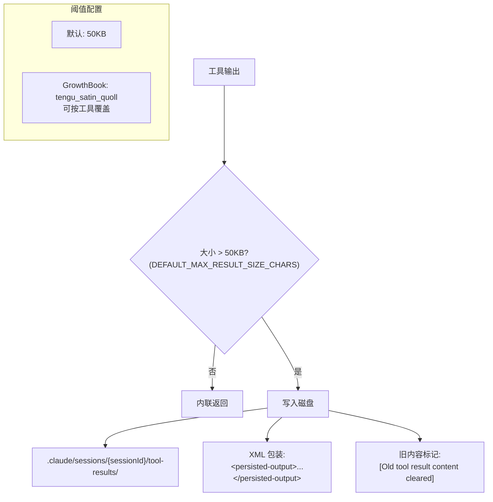
```mermaid
flowchart TD
    TOOL_OUTPUT["工具输出"] --> SIZE_CHECK{"大小 > 50KB?<br/>(DEFAULT_MAX_RESULT_SIZE_CHARS)"}

    SIZE_CHECK -->|否| INLINE["内联返回"]
    SIZE_CHECK -->|是| PERSIST["写入磁盘"]

    PERSIST --> PATH[".claude/sessions/{sessionId}/tool-results/"]
    PERSIST --> XML["XML 包装:<br/>&lt;persisted-output&gt;...&lt;/persisted-output&gt;"]
    PERSIST --> CLEAR["旧内容标记:<br/>[Old tool result content cleared]"]

    subgraph 阈值["阈值配置"]
        DEFAULT["默认: 50KB"]
        GB["GrowthBook: tengu_satin_quoll<br/>可按工具覆盖"]
    end
```

---

## 11. 项目入门流程

**文件**: `src/projectOnboardingState.ts`

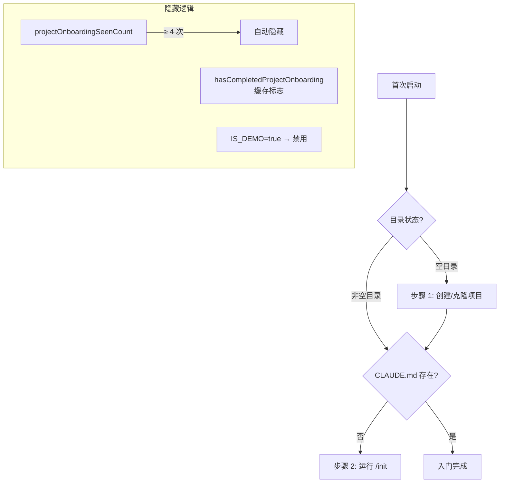
```mermaid
flowchart TD
    START["首次启动"] --> CHECK{"目录状态?"}

    CHECK -->|"空目录"| WORKSPACE["步骤 1: 创建/克隆项目"]
    CHECK -->|"非空目录"| CLAUDE_MD{"CLAUDE.md 存在?"}

    CLAUDE_MD -->|否| INIT["步骤 2: 运行 /init"]
    CLAUDE_MD -->|是| DONE["入门完成"]

    WORKSPACE --> CLAUDE_MD

    subgraph 隐藏逻辑["隐藏逻辑"]
        COUNT["projectOnboardingSeenCount"]
        COUNT -->|"≥ 4 次"| HIDE["自动隐藏"]
        CACHE["hasCompletedProjectOnboarding<br/>缓存标志"]
        DEMO["IS_DEMO=true → 禁用"]
    end
```

---

## 12. 模型能力检测与 Beta 管理

**文件**: `src/utils/betas.ts`

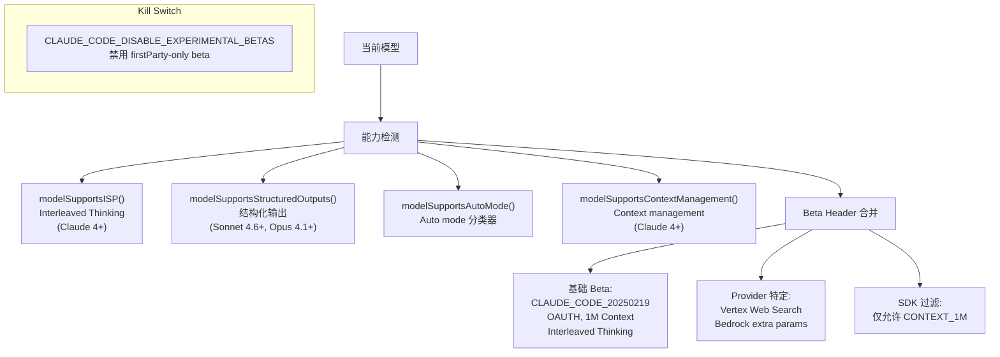
```mermaid
graph TD
    MODEL["当前模型"] --> DETECT["能力检测"]

    DETECT --> ISP["modelSupportsISP()<br/>Interleaved Thinking<br/>(Claude 4+)"]
    DETECT --> SO["modelSupportsStructuredOutputs()<br/>结构化输出<br/>(Sonnet 4.6+, Opus 4.1+)"]
    DETECT --> AUTO["modelSupportsAutoMode()<br/>Auto mode 分类器"]
    DETECT --> CTX["modelSupportsContextManagement()<br/>Context management<br/>(Claude 4+)"]

    DETECT --> BETAS["Beta Header 合并"]
    BETAS --> BASE["基础 Beta:<br/>CLAUDE_CODE_20250219<br/>OAUTH, 1M Context<br/>Interleaved Thinking"]
    BETAS --> PROVIDER["Provider 特定:<br/>Vertex Web Search<br/>Bedrock extra params"]
    BETAS --> SDK_FILTER["SDK 过滤:<br/>仅允许 CONTEXT_1M"]

    subgraph Kill_Switch["Kill Switch"]
        KS1["CLAUDE_CODE_DISABLE_EXPERIMENTAL_BETAS<br/>禁用 firstParty-only beta"]
    end
```

---

## 13. 输出样式: Learning 模式

**文件**: `src/constants/outputStyles.ts`

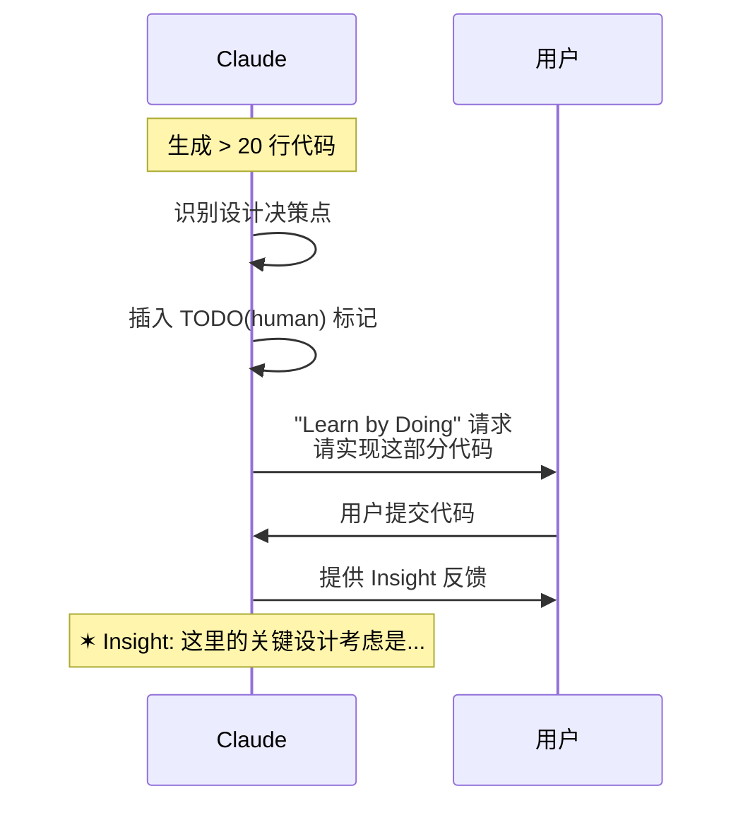
```mermaid
sequenceDiagram
    participant Claude as Claude
    participant User as 用户

    Note over Claude: 生成 > 20 行代码
    Claude->>Claude: 识别设计决策点
    Claude->>Claude: 插入 TODO(human) 标记
    Claude->>User: "Learn by Doing" 请求<br/>请实现这部分代码

    User->>Claude: 用户提交代码

    Claude->>User: 提供 Insight 反馈
    Note over Claude: ✶ Insight: 这里的关键设计考虑是...
```

| 内置风格 | 描述 | 特性 |
|---------|------|------|
| **default** | 标准模式 | 无额外指令 |
| **Explanatory** | 教育模式 | 自动添加 `✶ Insight` 块 (2-3 个) |
| **Learning** | 互动学习 | TODO(human) + 用户代码贡献 |

---

## 14. macOS 防休眠

**文件**: `src/services/preventSleep.ts`

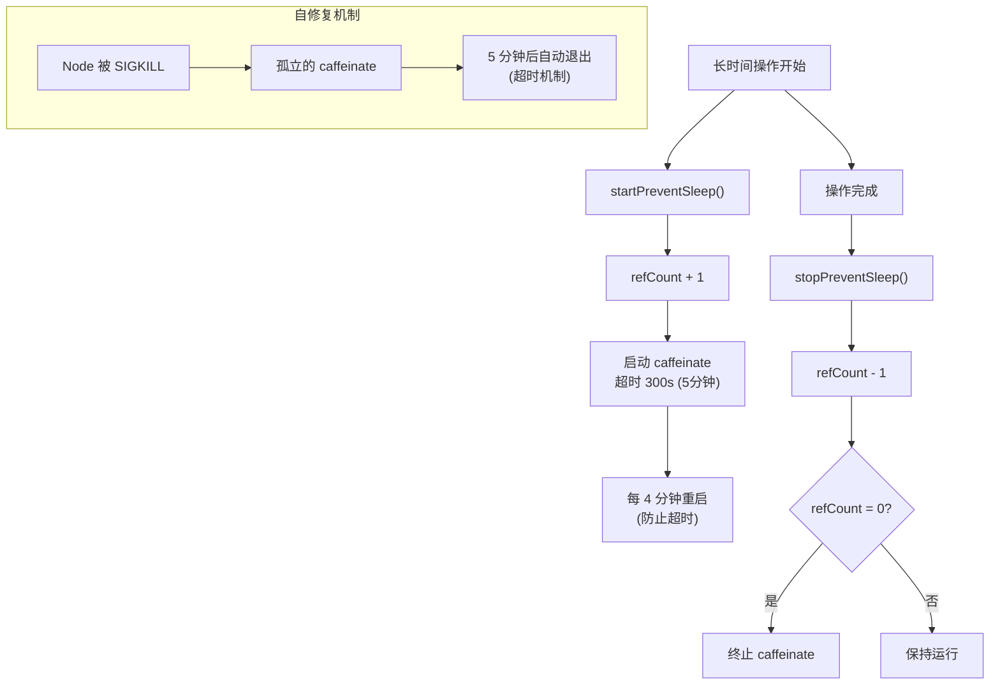
```mermaid
flowchart TD
    LONG_OP["长时间操作开始"] --> ACQUIRE["startPreventSleep()"]
    ACQUIRE --> REFCOUNT["refCount + 1"]
    REFCOUNT --> CAFFEINATE["启动 caffeinate<br/>超时 300s (5分钟)"]

    CAFFEINATE --> RESTART["每 4 分钟重启<br/>(防止超时)"]

    LONG_OP --> DONE["操作完成"]
    DONE --> RELEASE["stopPreventSleep()"]
    RELEASE --> DEC["refCount - 1"]
    DEC --> ZERO{"refCount = 0?"}
    ZERO -->|是| KILL["终止 caffeinate"]
    ZERO -->|否| KEEP["保持运行"]

    subgraph 自修复["自修复机制"]
        SIGKILL["Node 被 SIGKILL"]
        SIGKILL --> ORPHAN["孤立的 caffeinate"]
        ORPHAN --> AUTO_EXIT["5 分钟后自动退出<br/>(超时机制)"]
    end
```

---

## 15. 会话存储与导出

**文件**: `src/utils/sessionStorage.ts`

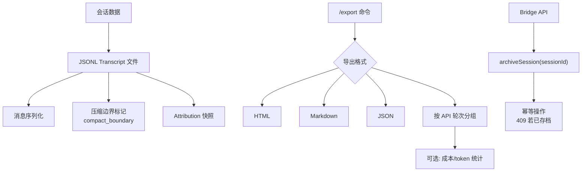
```mermaid
flowchart TD
    SESSION["会话数据"] --> TRANSCRIPT["JSONL Transcript 文件"]

    TRANSCRIPT --> CONTENT["消息序列化"]
    TRANSCRIPT --> BOUNDARY["压缩边界标记<br/>compact_boundary"]
    TRANSCRIPT --> ATTR_SNAP["Attribution 快照"]

    EXPORT["/export 命令"] --> FORMAT{"导出格式"}
    FORMAT --> HTML["HTML"]
    FORMAT --> MD["Markdown"]
    FORMAT --> JSON["JSON"]

    FORMAT --> GROUP["按 API 轮次分组"]
    GROUP --> STATS["可选: 成本/token 统计"]

    ARCHIVE["Bridge API"] --> ARCHIVE_OP["archiveSession(sessionId)"]
    ARCHIVE_OP --> IDEM["幂等操作<br/>409 若已存档"]
```

---

## 16. MCP Elicitation Hook 集成

**文件**: `src/services/mcp/elicitationHandler.ts`

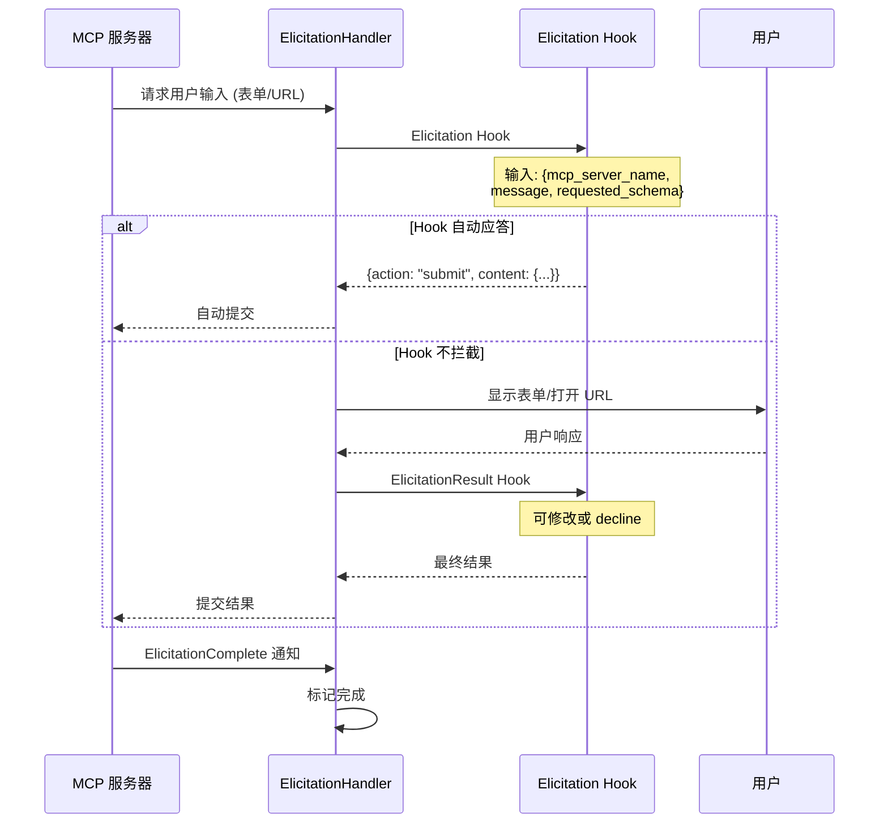
```mermaid
sequenceDiagram
    participant MCP as MCP 服务器
    participant Handler as ElicitationHandler
    participant Hook as Elicitation Hook
    participant User as 用户

    MCP->>Handler: 请求用户输入 (表单/URL)

    Handler->>Hook: Elicitation Hook
    Note over Hook: 输入: {mcp_server_name,<br/>message, requested_schema}

    alt Hook 自动应答
        Hook-->>Handler: {action: "submit", content: {...}}
        Handler-->>MCP: 自动提交
    else Hook 不拦截
        Handler->>User: 显示表单/打开 URL
        User-->>Handler: 用户响应
        Handler->>Hook: ElicitationResult Hook
        Note over Hook: 可修改或 decline
        Hook-->>Handler: 最终结果
        Handler-->>MCP: 提交结果
    end

    MCP->>Handler: ElicitationComplete 通知
    Handler->>Handler: 标记完成
```

---

## 17. 启动性能分析

**文件**: `src/utils/profilerBase.ts`

```
启用: CLAUDE_CODE_PROFILE_STARTUP=1

输出格式:
[+ total.ms] (+ delta.ms) name [extra] | RSS: ..MB, Heap: ..MB

示例:
[+   0.0] (+  0.0) cli_start                    | RSS: 45MB, Heap: 12MB
[+  23.4] (+ 23.4) main_loaded                  | RSS: 78MB, Heap: 34MB
[+  45.1] (+ 21.7) auth_complete                | RSS: 82MB, Heap: 38MB
[+ 123.6] (+ 78.5) plugins_loaded               | RSS: 95MB, Heap: 45MB
[+ 156.2] (+ 32.6) repl_rendered                | RSS: 102MB, Heap: 52MB
```

---

## 18. 模型迁移自动升级

**文件**: `src/migrations/migrateSonnet45ToSonnet46.ts`

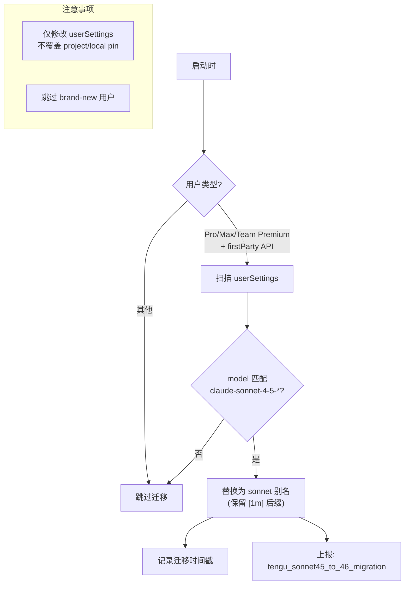
```mermaid
flowchart TD
    BOOT["启动时"] --> CHECK{"用户类型?"}

    CHECK -->|"Pro/Max/Team Premium<br/>+ firstParty API"| SCAN["扫描 userSettings"]
    CHECK -->|"其他"| SKIP["跳过迁移"]

    SCAN --> MATCH{"model 匹配<br/>claude-sonnet-4-5-*?"}
    MATCH -->|是| REPLACE["替换为 sonnet 别名<br/>(保留 [1m] 后缀)"]
    MATCH -->|否| SKIP

    REPLACE --> RECORD["记录迁移时间戳"]
    REPLACE --> ANALYTICS["上报: tengu_sonnet45_to_46_migration"]

    subgraph 注意["注意事项"]
        N1["仅修改 userSettings<br/>不覆盖 project/local pin"]
        N2["跳过 brand-new 用户"]
    end
```

---

## 19. API 错误智能分类

**文件**: `src/services/api/errors.ts`

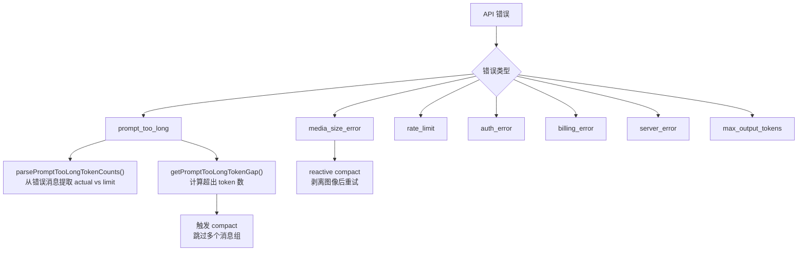
```mermaid
flowchart TD
    ERROR["API 错误"] --> CLASSIFY{"错误类型"}

    CLASSIFY --> TOO_LONG["prompt_too_long"]
    CLASSIFY --> MEDIA["media_size_error"]
    CLASSIFY --> RATE["rate_limit"]
    CLASSIFY --> AUTH["auth_error"]
    CLASSIFY --> BILLING["billing_error"]
    CLASSIFY --> SERVER["server_error"]
    CLASSIFY --> MAX_OUT["max_output_tokens"]

    TOO_LONG --> PARSE["parsePromptTooLongTokenCounts()<br/>从错误消息提取 actual vs limit"]
    TOO_LONG --> GAP["getPromptTooLongTokenGap()<br/>计算超出 token 数"]
    GAP --> COMPACT["触发 compact<br/>跳过多个消息组"]

    MEDIA --> STRIP["reactive compact<br/>剥离图像后重试"]
```

---

## 20. 响应式信号系统

**文件**: `src/utils/signal.ts`

```typescript
// 轻量级事件原语 (无状态存储)
const { subscribe, emit, clear } = createSignal<[string, unknown]>()

// 用途: 设置变化、权限改变等纯事件通知
// 与 Store 不同: 无 getState() 快照
```

---

## 场景统计

本批新增 **20 个场景**，加上前三批共计 **60+ 个应用场景**，基本覆盖了 Claude Code 源码中所有核心功能路径。
