# 21 - 高级应用场景（第三批）

> 从源码深层挖掘的高级场景：API 子系统、渲染引擎、IDE 集成、语音、Swarm 协调等。

---

## 1. 会话持久化与远程同步 (Session Ingress)

**文件**: `src/services/api/sessionIngress.ts`

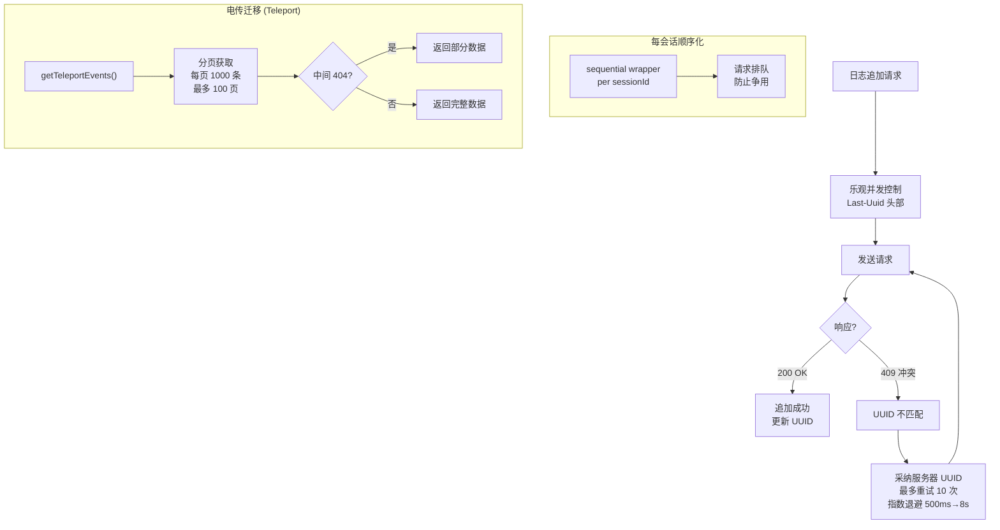

---

## 2. 推荐码与访客通行证

**文件**: `src/services/api/referral.ts`

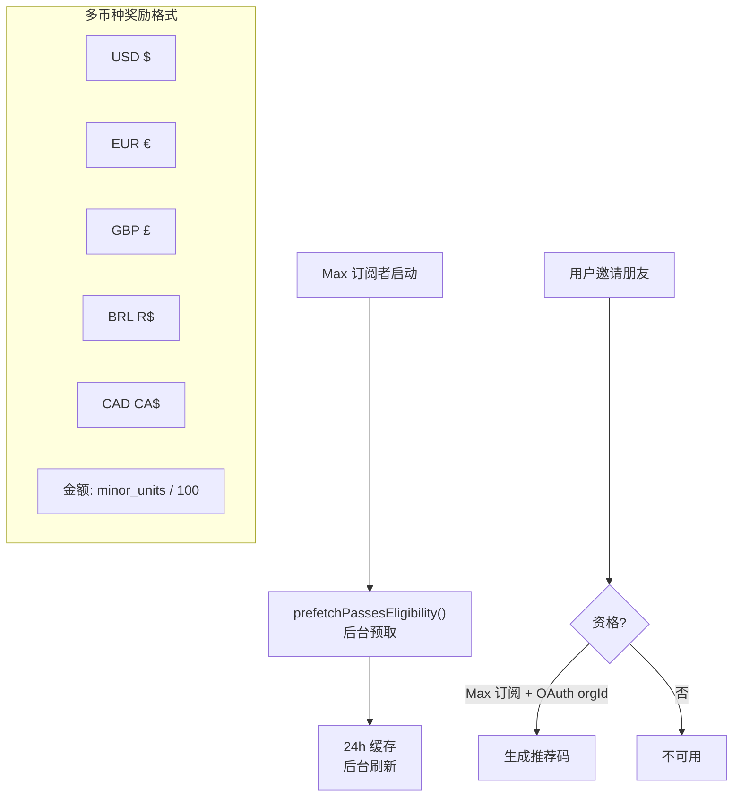

---

## 3. 超额使用额度 (Overage Credit)

**文件**: `src/services/api/overageCreditGrant.ts`

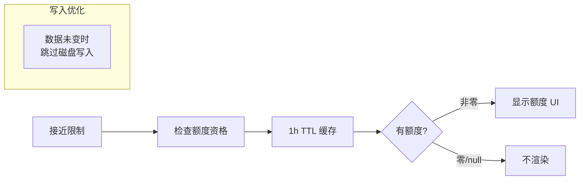

---

## 4. 指标选择退出 (Metrics Opt-Out)

**文件**: `src/services/api/metricsOptOut.ts`

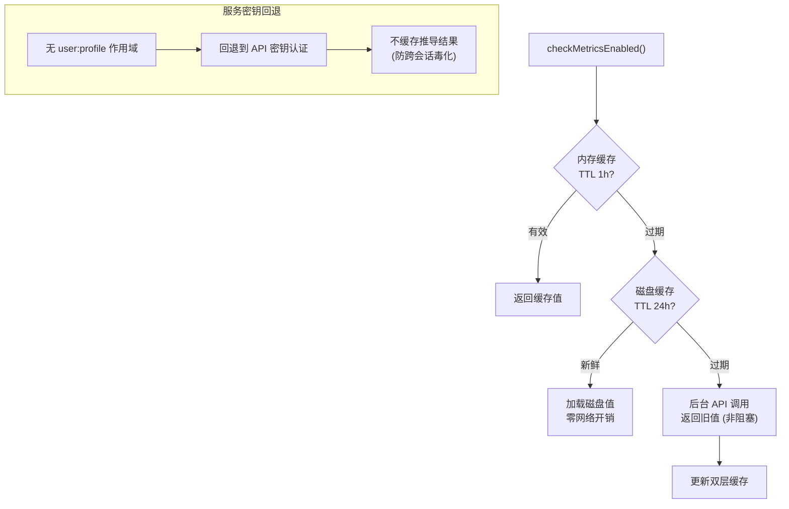

---

## 5. 文件上传 API

**文件**: `src/services/api/filesApi.ts`

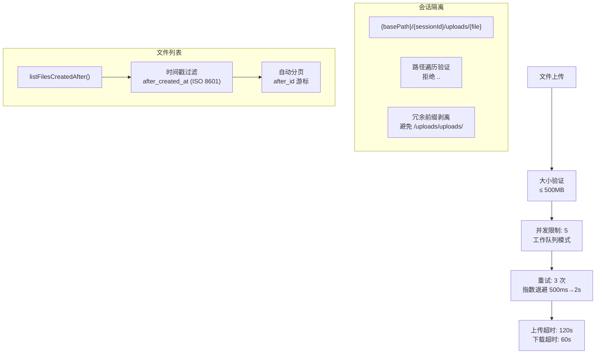

---

## 6. 思考/推理模式 (Thinking)

**文件**: `src/utils/thinking.ts`

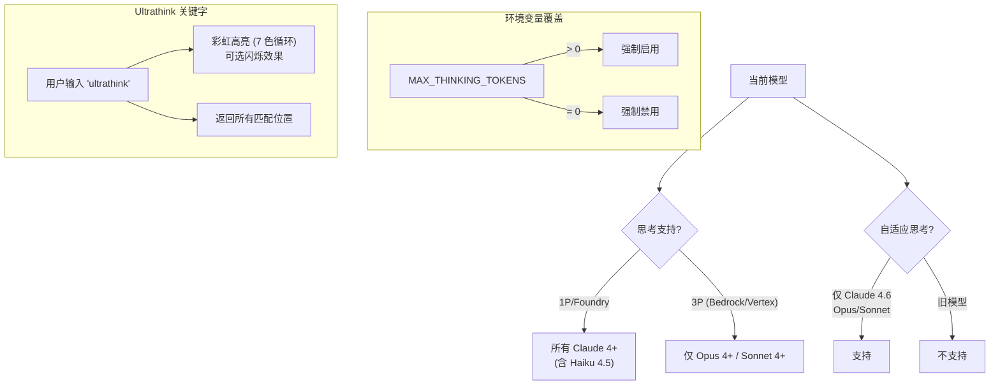

---

## 7. 终端 Ink 渲染引擎

**文件**: `src/ink/output.ts`, `src/ink/dom.ts`, `src/ink/reconciler.ts`

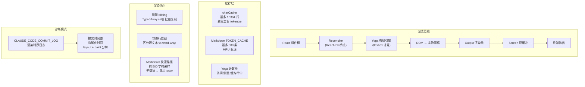

---

## 8. 命令自动完成 (Typeahead)

**文件**: `src/hooks/useTypeahead.tsx`

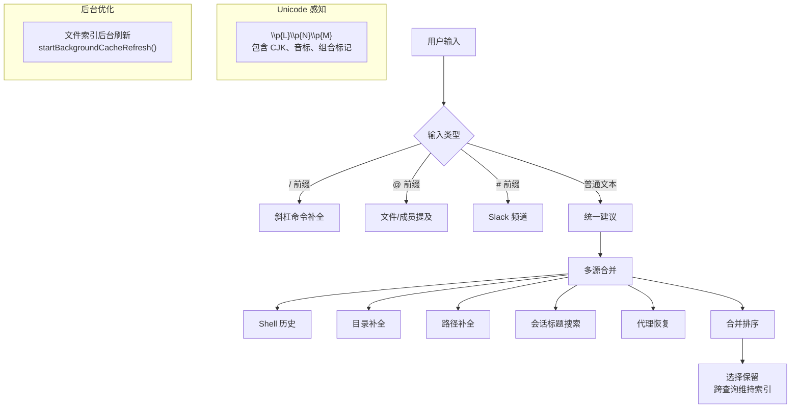

---

## 9. IDE 集成与选择上下文

**文件**: `src/hooks/useIdeConnectionStatus.ts`, `src/hooks/useIdeSelection.ts`

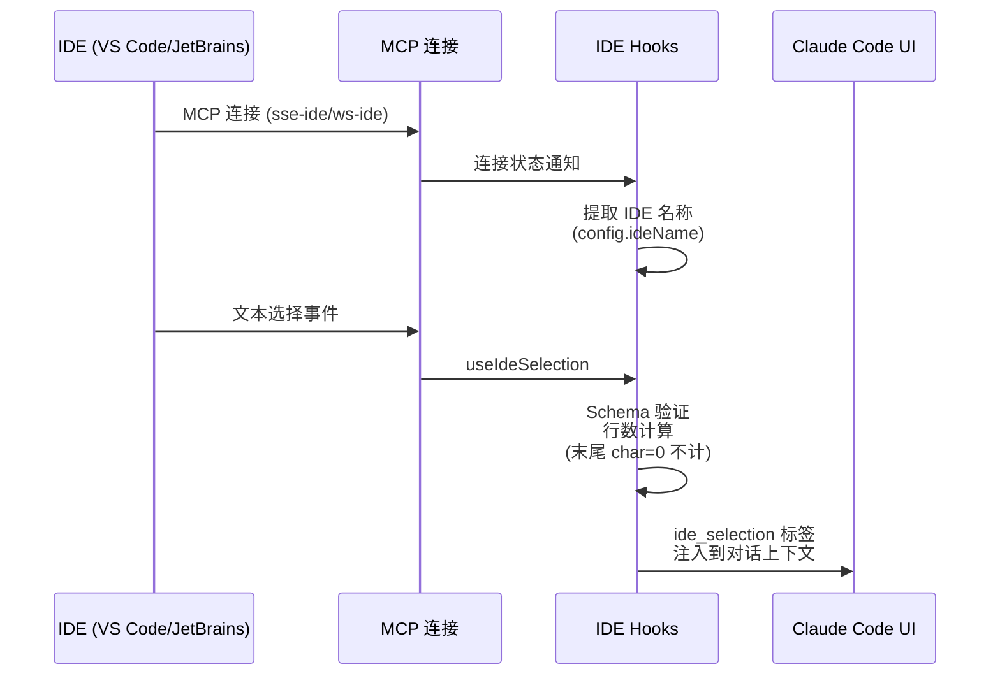

---

## 10. 语音模式

**文件**: `src/voice/voiceModeEnabled.ts`, `src/services/voice.ts`

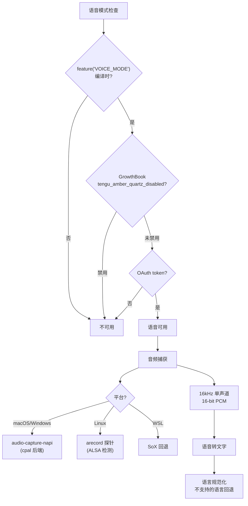

---

## 11. 模型弃用警告

**文件**: `src/utils/model/deprecation.ts`

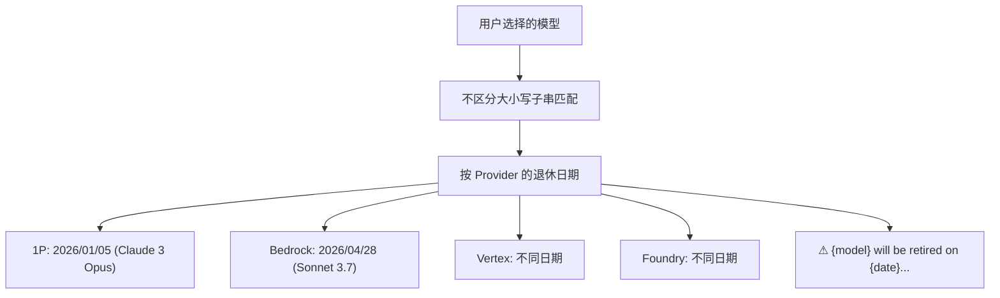

---

## 12. Swarm 权限同步

**文件**: `src/utils/swarm/permissionSync.ts`

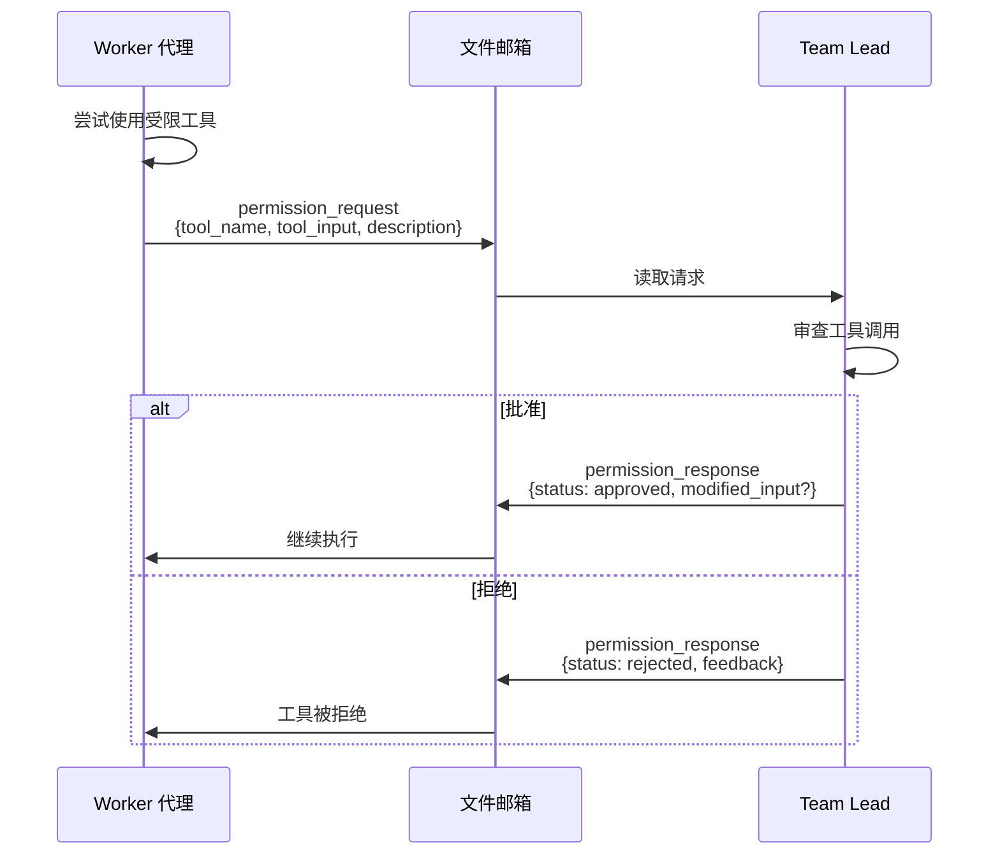

---

## 13. Team 允许路径 (共享编辑权限)

**文件**: `src/utils/swarm/teamHelpers.ts`

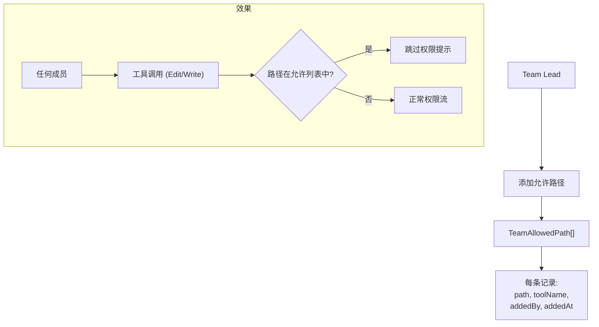

---

## 14. 进程内 Teammate 隔离

**文件**: `src/utils/swarm/spawnInProcess.ts`

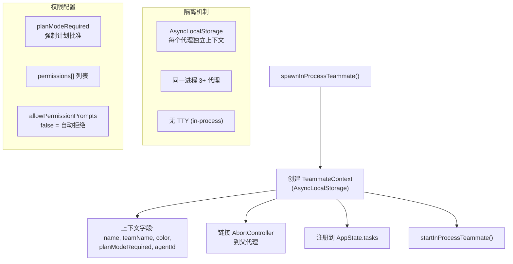

---

## 15. Grove 隐私通知系统

**文件**: `src/services/api/grove.ts`

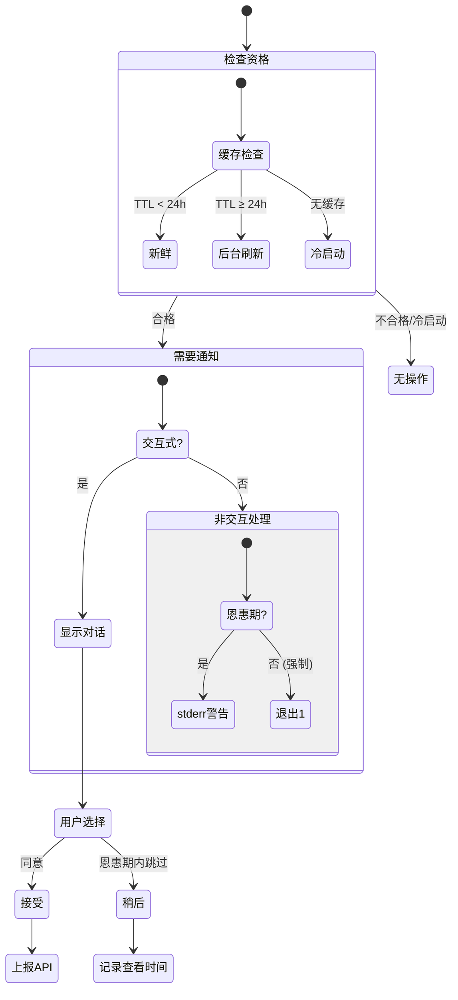

---

## 16. 插件命令加载

**文件**: `src/utils/plugins/loadPluginCommands.ts`

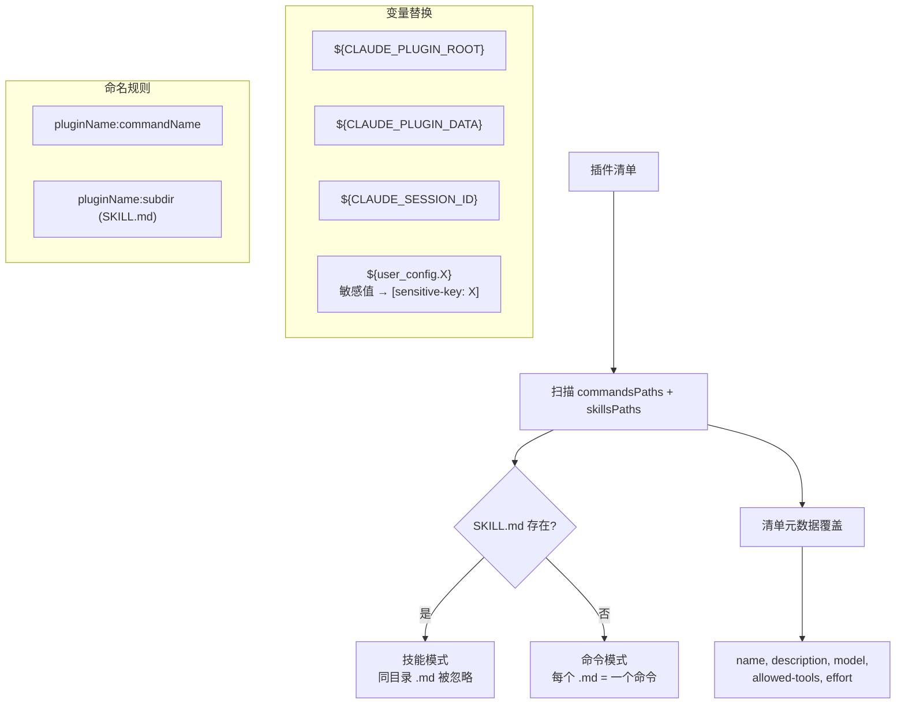

---

## 17. 首个 Token 日期追踪

**文件**: `src/services/api/firstTokenDate.ts`

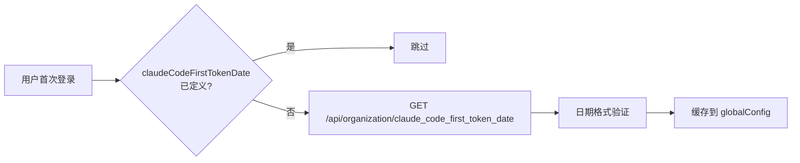

---

## 18. 虚拟滚动优化

**文件**: `src/hooks/useVirtualScroll.ts`

```
关键参数:
- SCROLL_QUANTUM = 40 行 (减少 React commit 频率)
- PESSIMISTIC_HEIGHT = 1 (确保装载范围到达底部)
- COLD_START_COUNT = 30 (ViewportHeight=0 前装载 30 项)
- MAX_MOUNTED_ITEMS = 300 (防止纤维爆炸)
```

---

## 19. 选择与复制

**文件**: `src/ink/selection.ts`, `src/hooks/useCopyOnSelect.ts`

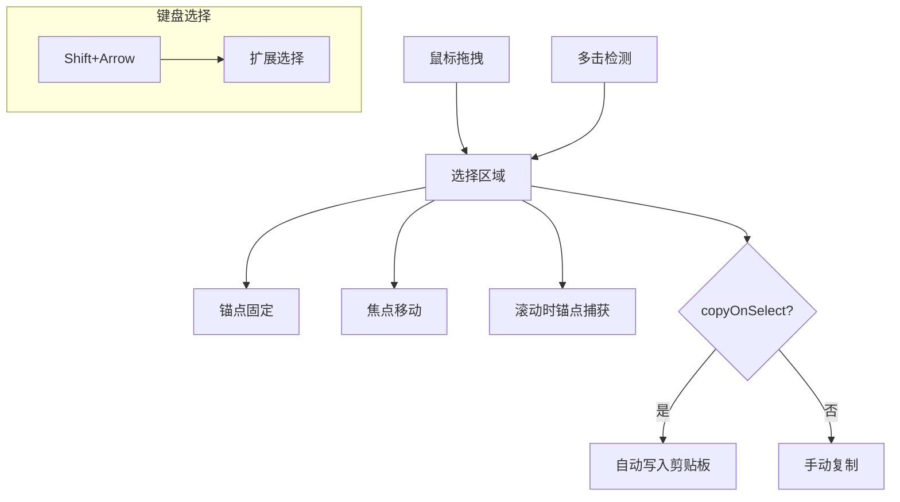

---

## 20. API Bootstrap 预加载

**文件**: `src/services/api/bootstrap.ts`

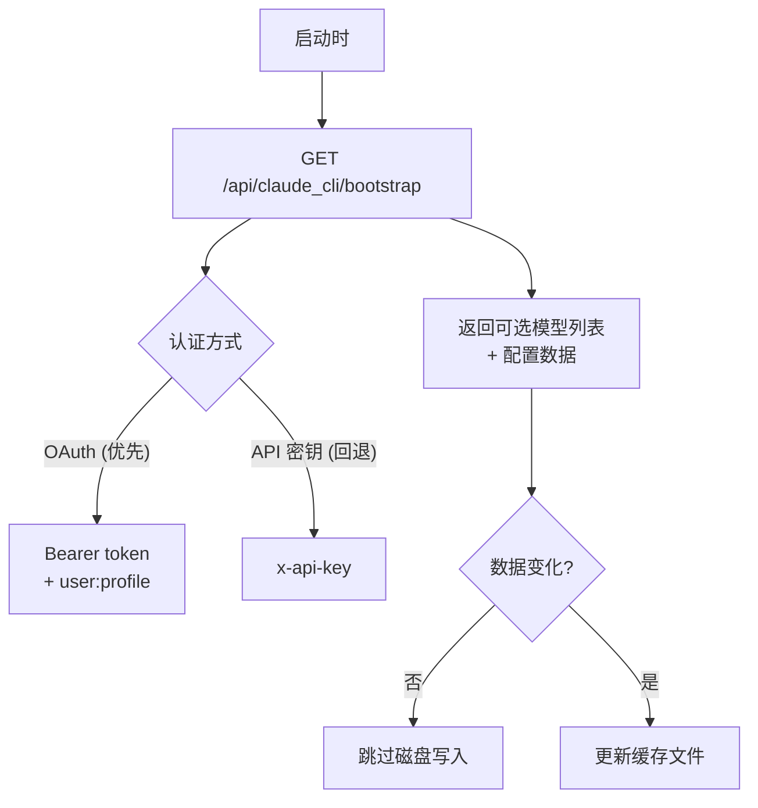

---

## 场景统计

| 批次 | 文档 | 新增场景 | 累计 |
|------|------|---------|------|
| 第一批 | 18-application-scenarios.md | 20 | 20 |
| 第二批 | 19-hooks-lifecycle.md + 20-more-scenarios.md | 20 + 25 | 65 |
| 第三批 | 本文档 | 20 | **85+** |

覆盖层面：API 子系统（会话同步/推荐/超额/指标/文件/配额/Bootstrap）、渲染引擎（Ink 缓存/布局/选择）、IDE 集成（连接/选择/直连）、语音模式（平台检测/音频捕获）、Swarm 高级（权限同步/共享路径/进程隔离）、隐私合规（Grove 完整流程）。
