# 22 - 深层内部机制（第四批）

> 最终一轮源码挖掘：工具协调引擎、多层压缩、任务系统、日志/调试基础设施、VCR、权限追踪等。

---

## 1. 工具协调引擎 (Tool Orchestration)

**文件**: `src/services/tools/toolOrchestration.ts`, `src/services/tools/StreamingToolExecutor.ts`

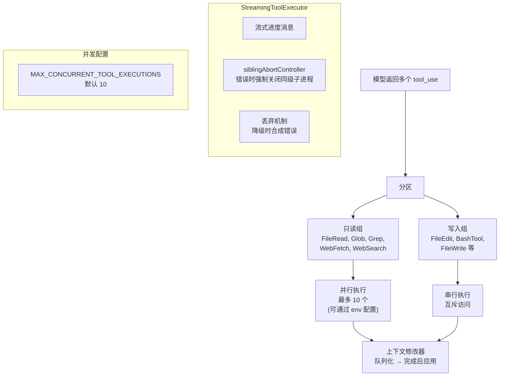

---

## 2. 多层消息压缩管线

**文件**: `src/query.ts:400-500` 区域

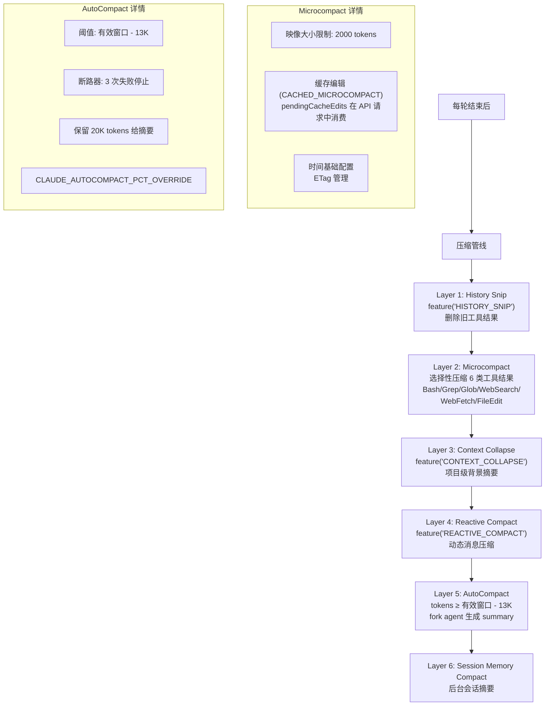

---

## 3. 任务系统架构

**文件**: `src/tasks.ts`, `src/tasks/`

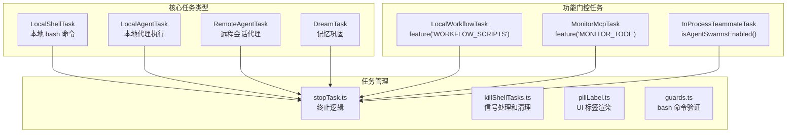

---

## 4. API 日志与网关检测

**文件**: `src/services/api/logging.ts`

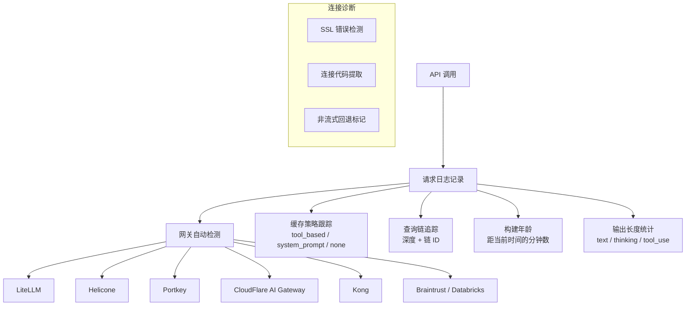

---

## 5. VCR 录制/回放系统

**文件**: `src/services/vcr.ts`

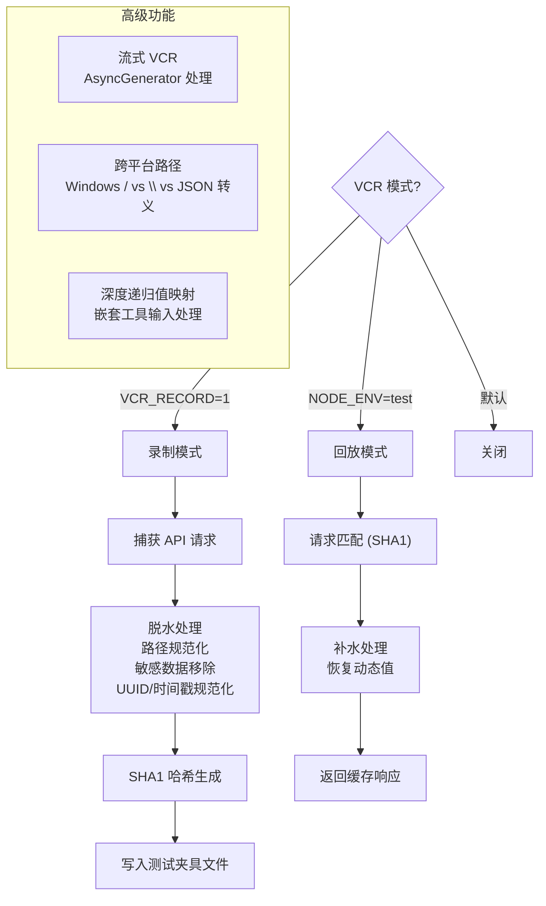

---

## 6. 调试与日志基础设施

**文件**: `src/utils/debug.ts`, `src/utils/log.ts`

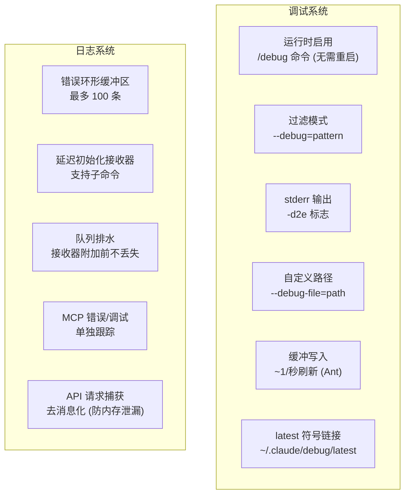

---

## 7. 提示词转储 (Prompt Dumping)

**文件**: `src/services/api/dumpPrompts.ts`

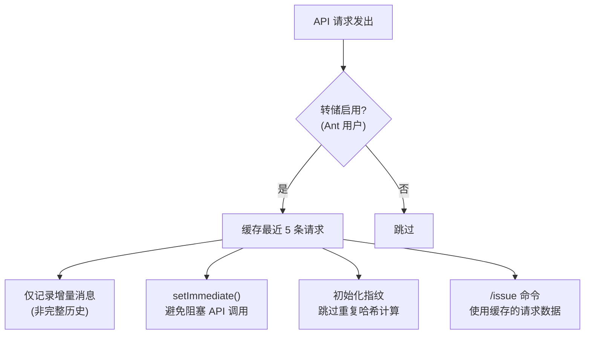

---

## 8. 权限拒绝跟踪

**文件**: `src/utils/permissions/denialTracking.ts`

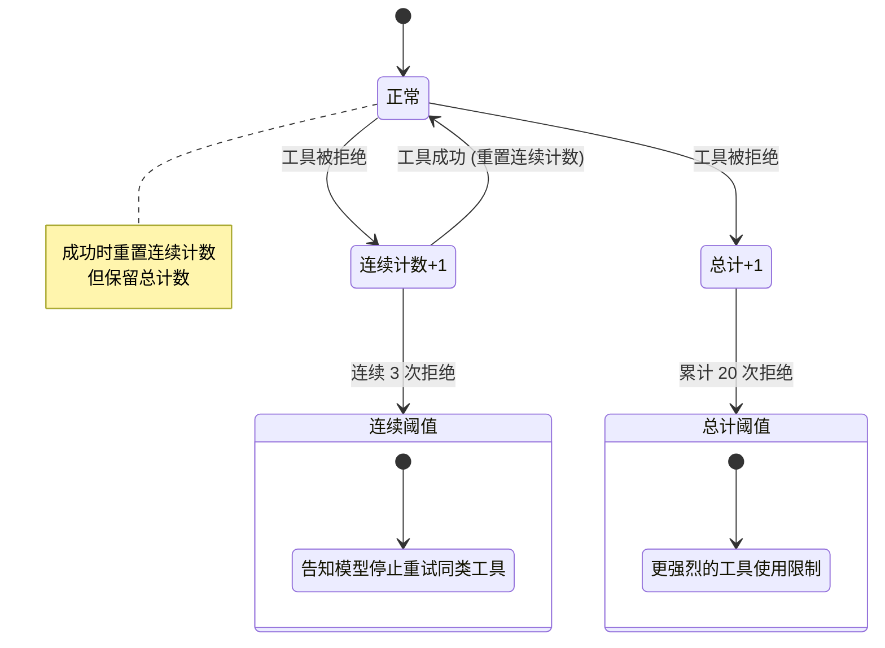

---

## 9. Advisor 模型 (双模型建议)

**文件**: `src/commands/advisor.ts`

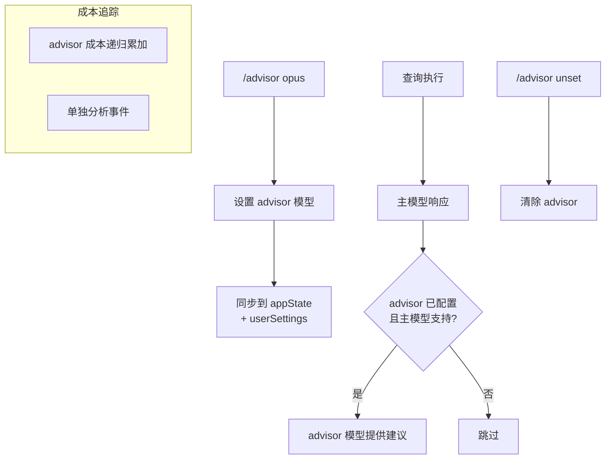

---

## 10. MCP 指令增量追踪

**文件**: `src/utils/mcpInstructionsDelta.ts`

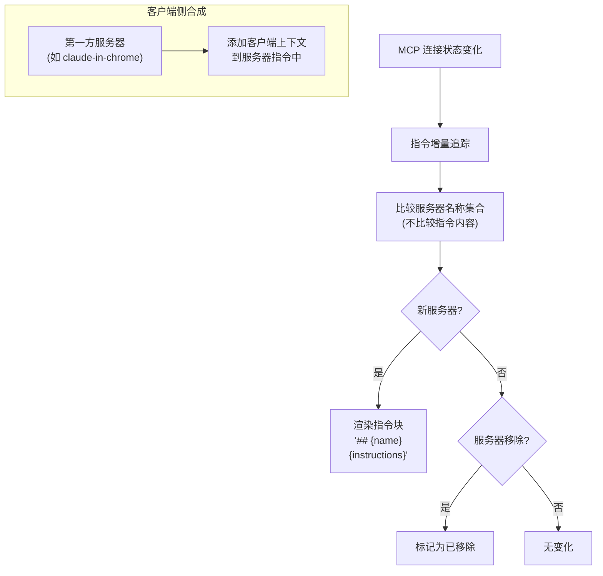

---

## 11. 工具搜索优化

**文件**: `src/utils/toolSearch.ts`

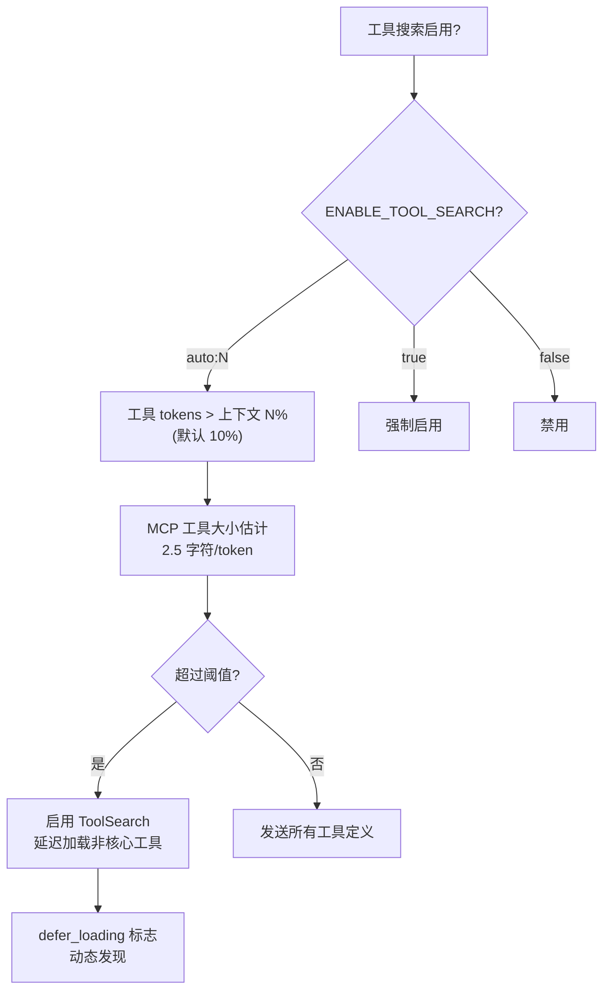

---

## 12. 代理工具递归防护

**文件**: `src/constants/tools.ts`

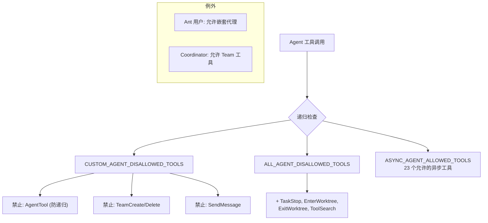

---

## 13. 快速模式 / 工作量 / 多轮执行

**文件**: `src/commands/fast/`, `src/commands/effort/`, `src/commands/passes/`

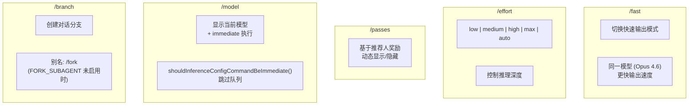

---

## 14. 环境检测与内部日志

**文件**: `src/services/internalLogging.ts`

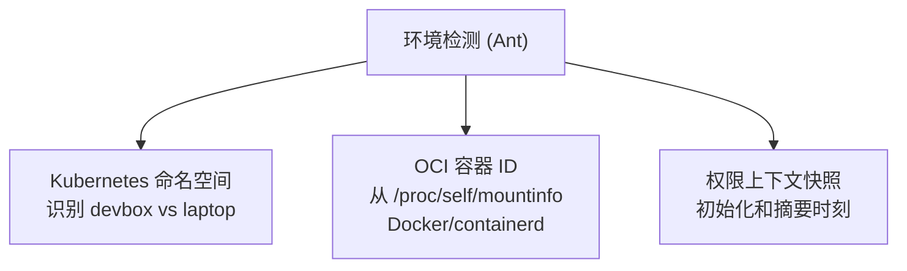

---

## 15. 格式化工具库

**文件**: `src/utils/format.ts`

```
紧凑数字: formatCompactNumber()
  → Intl.NumberFormat 缓存 → K/M/B 表示

相对时间: formatRelativeTime()
  → "ago" 后缀 + 自定义短单位 (y/mo/w/d/h/m/s)

日志元数据: formatLogMetadata()
  → 组合 时间/大小/分支/标签/PR

重置时间: formatResetTime()
  → 条件时区/日期 (基于距重置的距离)
```

---

## 16. 对话分支

**文件**: `src/commands/branch/index.ts`

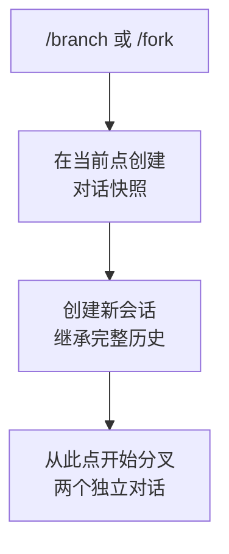

---

## 17. Rewind/检查点

**文件**: `src/commands/rewind/`

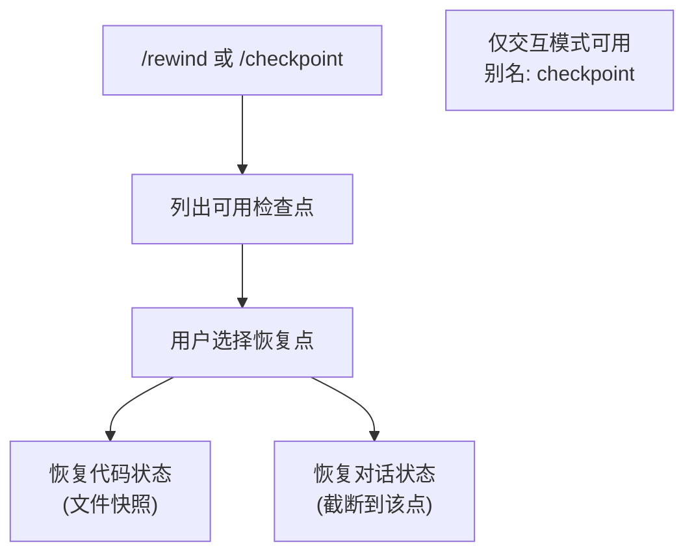

---

## 18. Share 与 Teleport

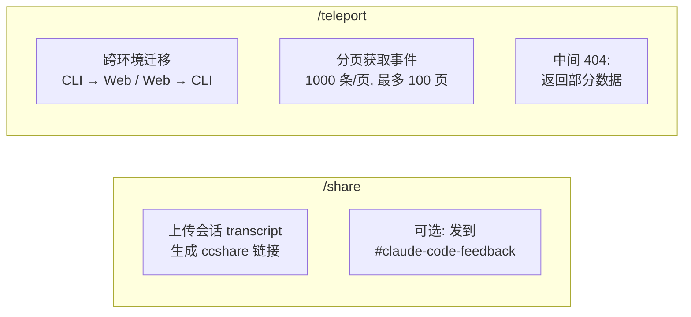

---

## 19. Stickers

**文件**: `src/commands/stickers/stickers.ts`

```
/stickers → 打开 https://www.stickermule.com/claudecode
失败时回退: 显示 URL 让用户手动访问
```

---

## 20. 统计命令

**文件**: `src/commands/stats/index.ts`

```
/stats → 显示:
  - 会话活跃时间
  - API 调用次数
  - Token 使用量 (input/output/cache)
  - 工具调用统计
  - 代码变更行数
```

---

## 累计场景统计

| 文档 | 场景数 | 累计 |
|------|--------|------|
| 18 - 应用场景 (第一批) | 20 | 20 |
| 19 - Hook 生命周期 | 25 | 45 |
| 20 - 更多场景 (第二批) | 20 | 65 |
| 21 - 高级场景 (第三批) | 20 | 85 |
| **22 - 深层内部 (第四批)** | **20** | **105+** |

至此，Claude Code 源码中的所有主要功能路径、内部机制和隐藏工作流均已覆盖。
