# 23 - 用户功能完整目录（第五批）

> 最终一轮：面向用户的命令、UI 组件、账户管理、代码分析、移动/桌面集成等。

---

## 总览：50+ 斜杠命令分类

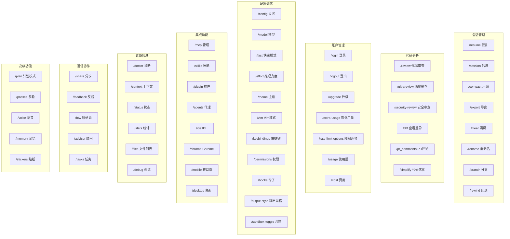

---

## 1. 代码审查系统

### /review — 本地代码审查

**文件**: `src/commands/review.ts`

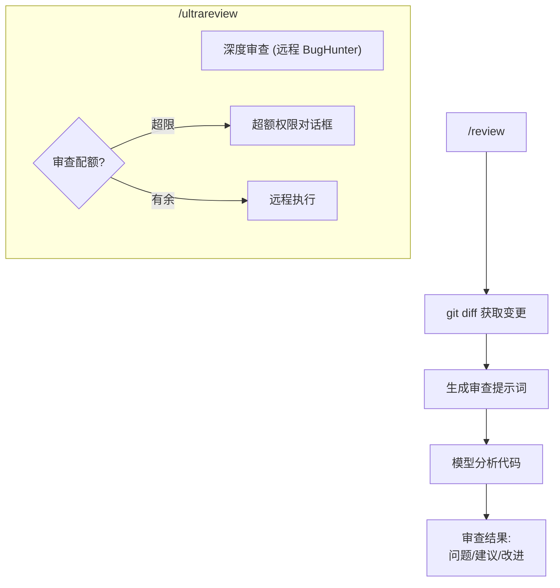

### /security-review — 安全专项审查

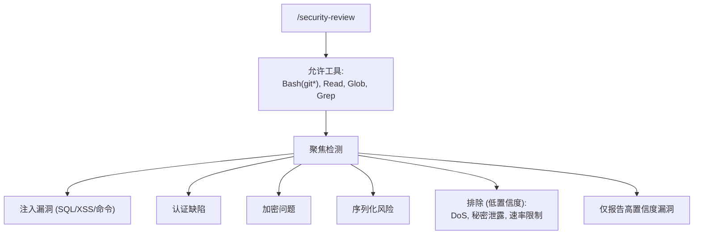

---

## 2. 账户管理与订阅

### /login — 登录流程

**文件**: `src/commands/login/login.tsx`

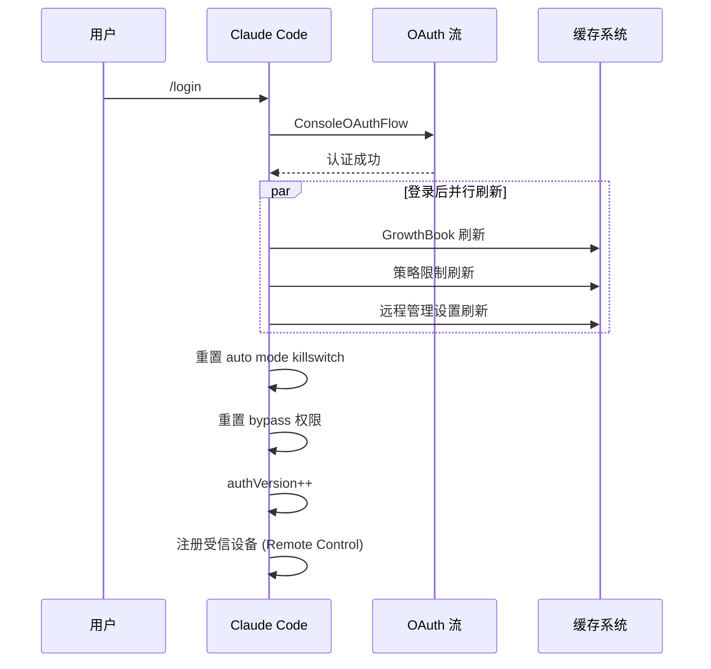

### /upgrade — 升级流程

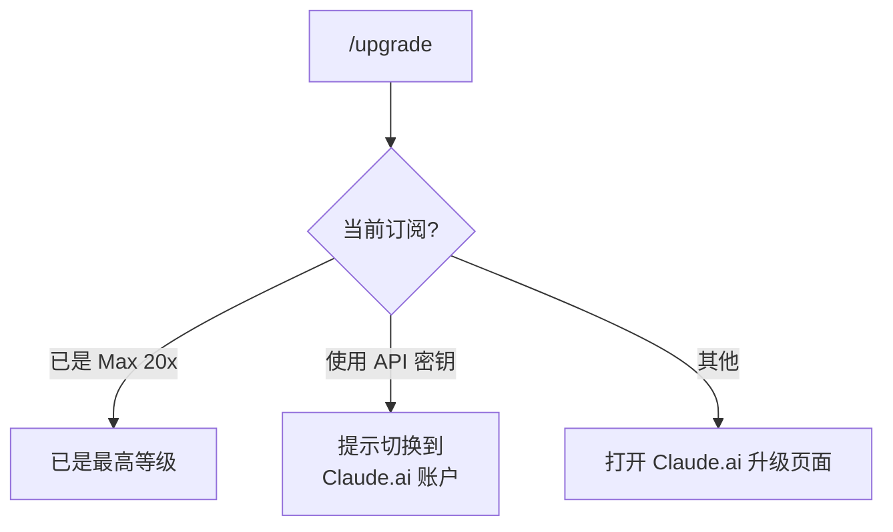

### /extra-usage — 额外用量

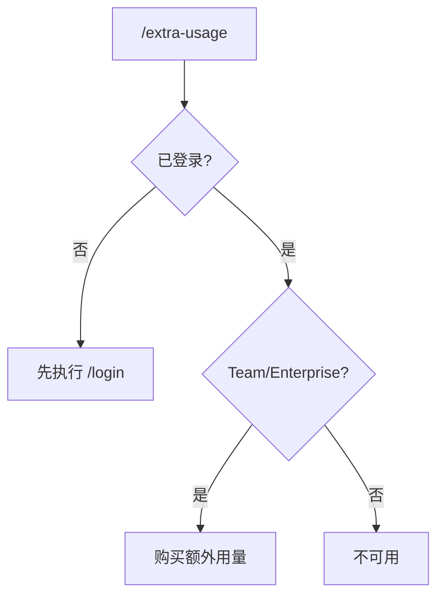

### /rate-limit-options — 限制选项菜单

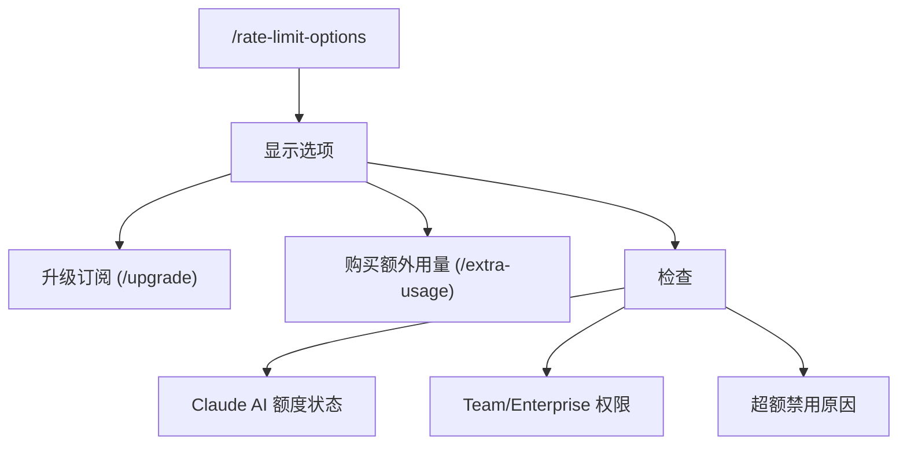

---

## 3. 移动端与桌面端集成

### /mobile — 移动 QR 码

**文件**: `src/commands/mobile/mobile.tsx`

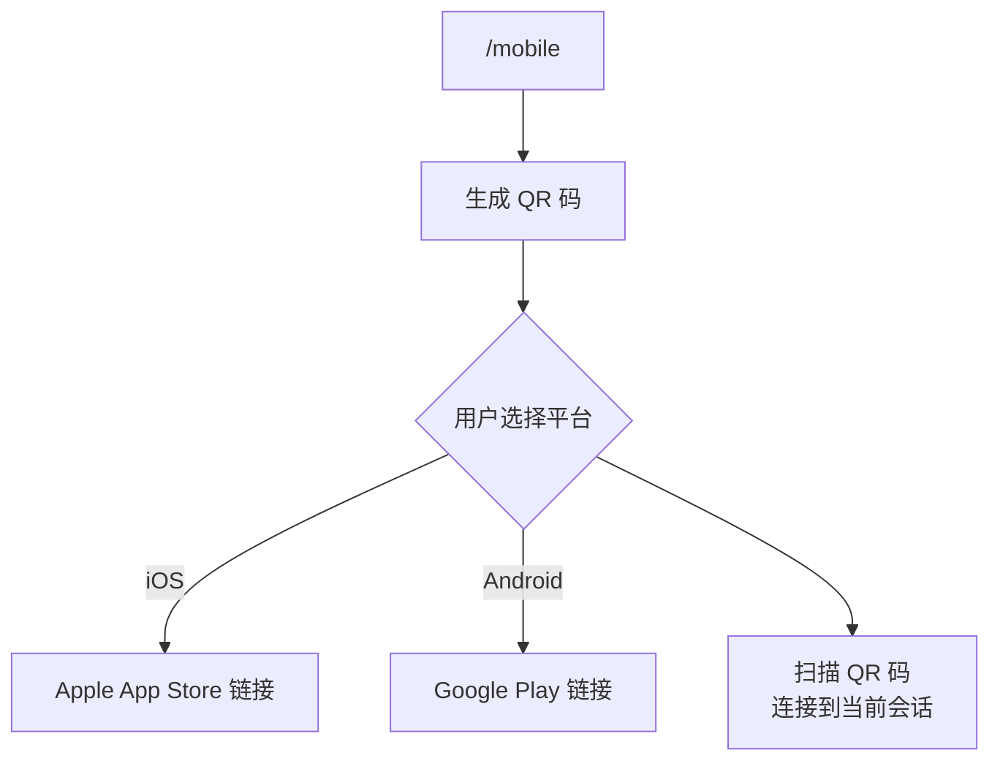

### /desktop — 桌面交接

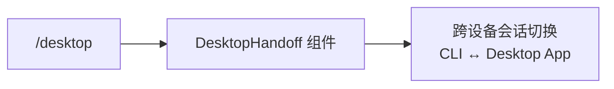

---

## 4. 对话框系统

**文件**: `src/dialogLaunchers.tsx`, `src/interactiveHelpers.tsx`

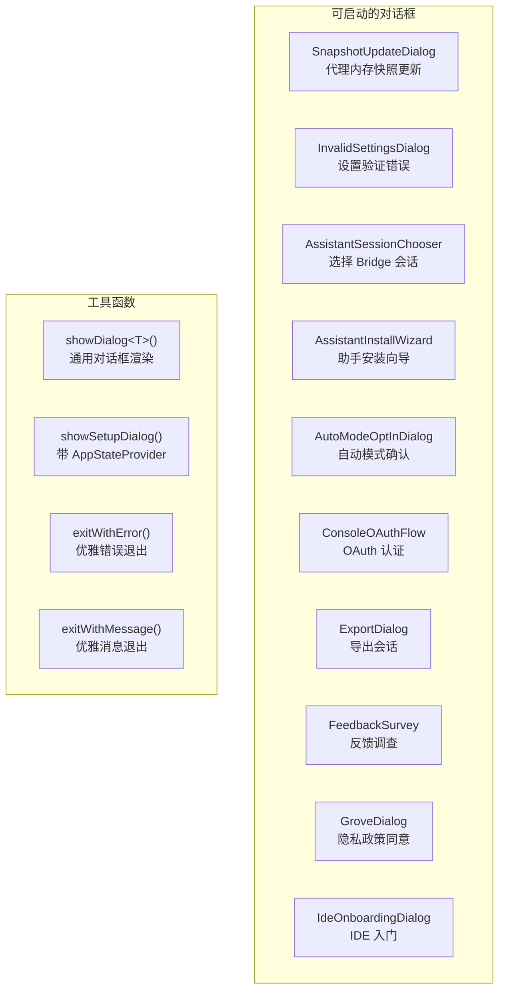

---

## 5. 消息组件生态

**文件**: `src/components/messages/` (33 个组件)

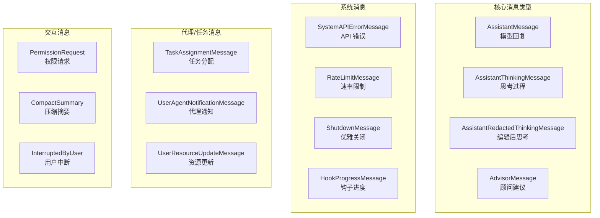

---

## 6. BTW (顺便说) 侧面问题

**文件**: `src/commands/btw/btw.tsx`

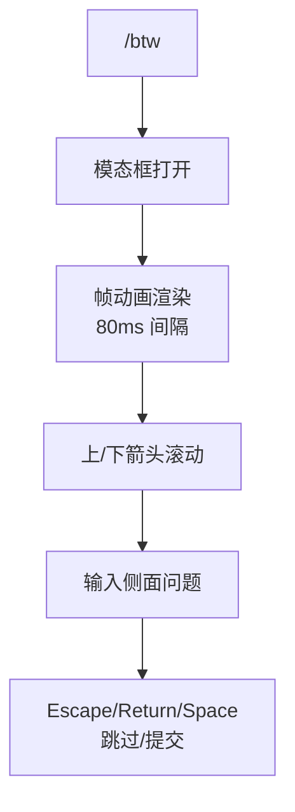

---

## 7. Thinkback 年度回顾

**文件**: `src/commands/thinkback/thinkback.tsx`

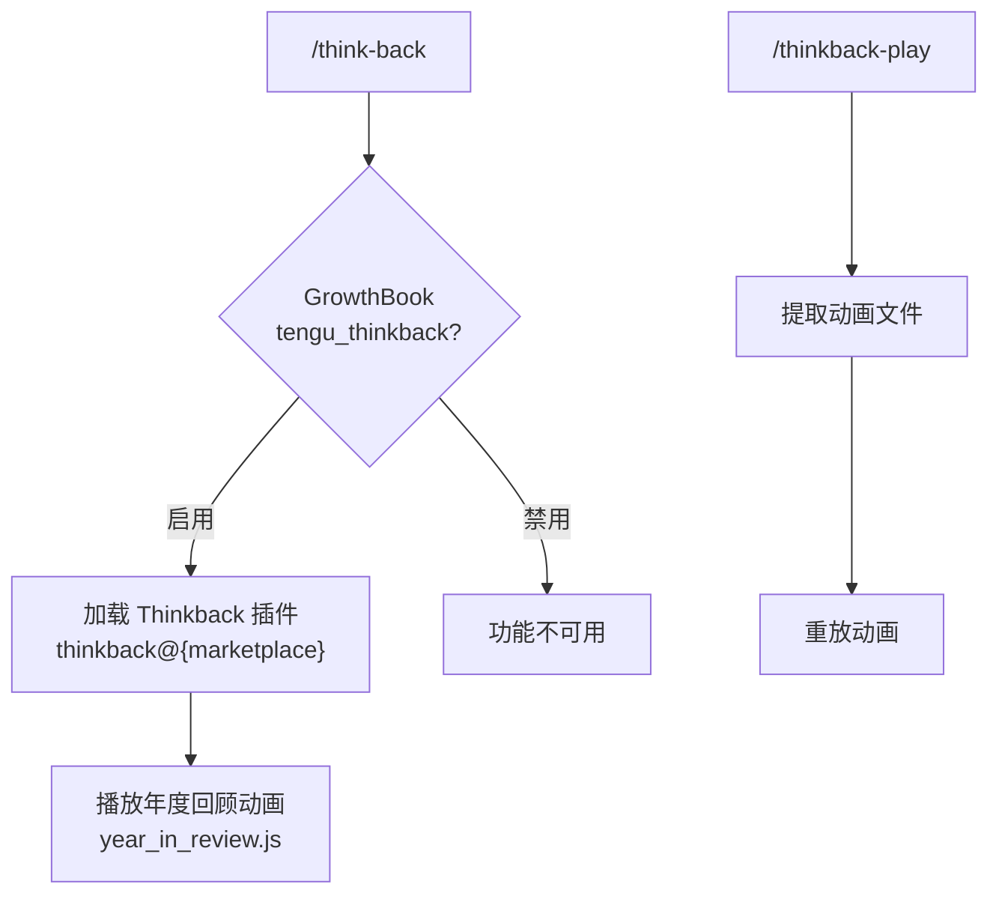

---

## 8. Ultraplan 多代理规划

**文件**: `src/commands/ultraplan.tsx`

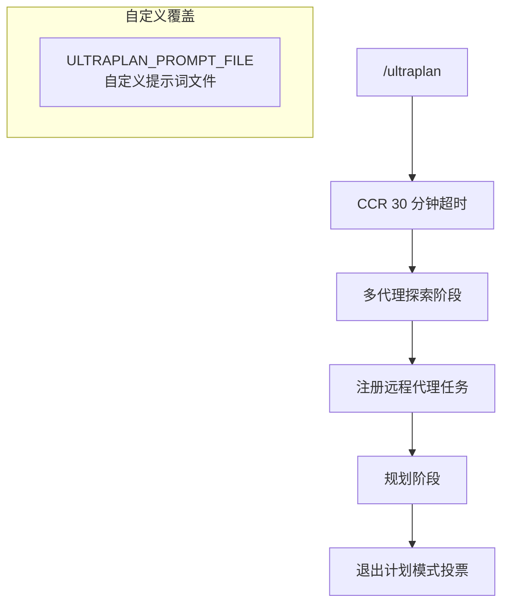

---

## 9. PR 评论集成

**文件**: `src/commands/pr_comments/index.ts`

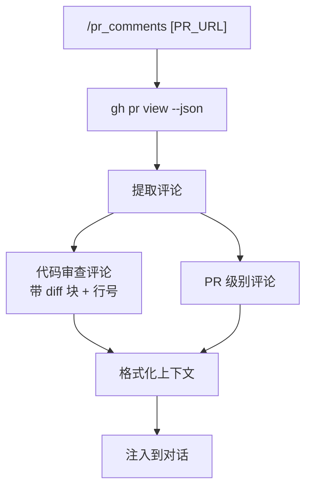

---

## 10. Diff 查看器

**文件**: `src/commands/diff/diff.tsx`

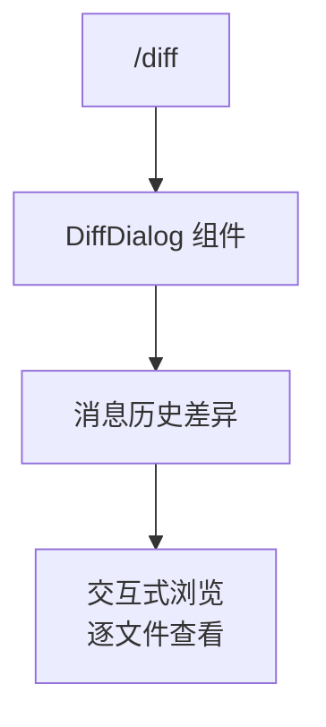

---

## 11. 设置期间的初始化细节

**文件**: `src/setup.ts:80-180`

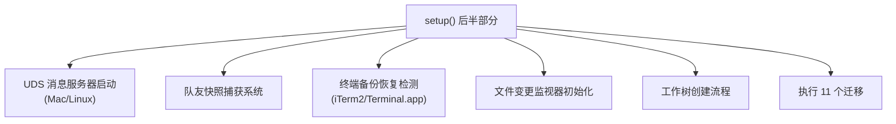

---

## 12. 环境诊断 (/doctor)

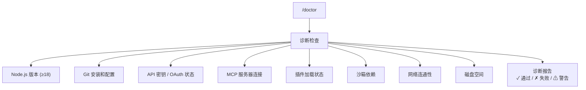

---

## 13. Summary 命令

**文件**: `src/commands/summary/`

```
/summary → 生成当前对话摘要
  - 使用快速模型
  - 1-3 句概括
  - 关键决策和结果
```

---

## 14. Copy 命令

```
/copy → 复制最后一条助手消息到剪贴板
  - 支持指定消息索引
  - Markdown 格式保留
```

---

## 15. Context 命令

```
/context → 显示当前上下文信息
  - Token 使用量
  - 系统提示大小
  - 工具数量
  - CLAUDE.md 大小
  - 记忆文件列表
```

---

## 16. 内部专用命令 (Ant)

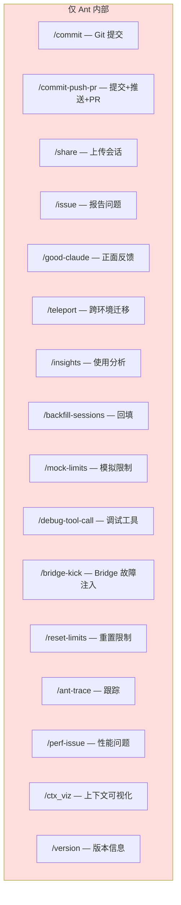

---

## 17. commit-push-pr 工作流

**文件**: `src/commands/commit-push-pr.ts`

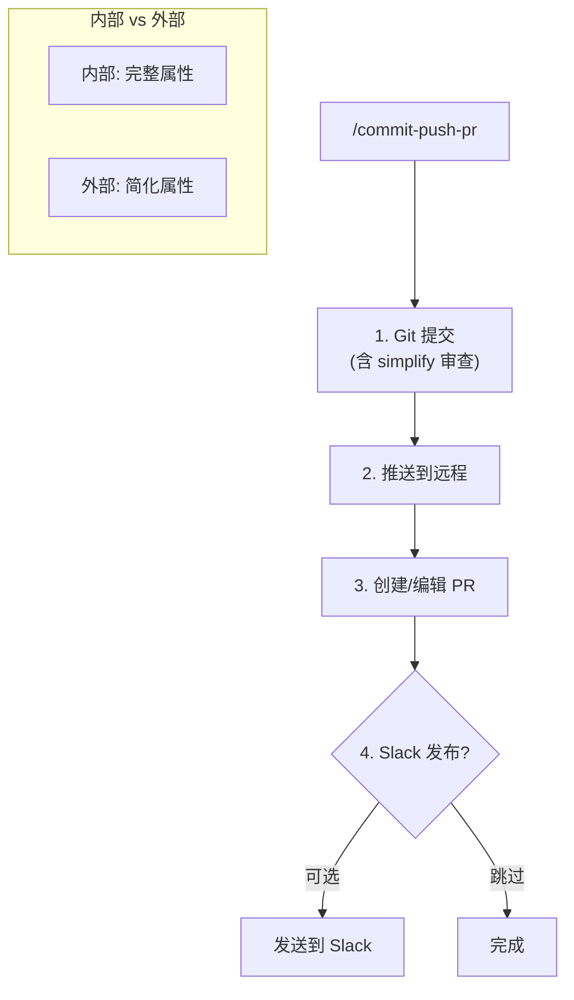

---

## 18. Grove 隐私 UI

**文件**: `src/components/grove/Grove.tsx`

```mermaid
flowchart TD
    GROVE["Grove 对话框"] --> PHASE{"当前阶段?"}

    PHASE -->|"恩惠期"| GRACE["可跳过的同意"]
    GRACE --> CHOICE1["接受"]
    GRACE --> CHOICE2["稍后再说"]

    PHASE -->|"后恩惠期"| FORCE["强制同意"]
    FORCE --> ACCEPT["必须接受<br/>才能继续使用"]

    subgraph 内容["对话框内容"]
        TERMS["消费者条款更新"]
        PRIVACY["隐私政策更新"]
        TRAINING["数据训练选择<br/>(可选退出)"]
        RETENTION["数据留存政策"]
    end
```

---

## 累计文档统计

| 文档 | 场景数 | 累计 |
|------|--------|------|
| 01-12 | 架构基础 | - |
| 13 | 隐藏功能 | - |
| 14 | 提示词目录 | - |
| 15-17 | 技能/代理/团队 | - |
| 18 | 应用场景 (第一批) | 20 |
| 19 | Hook 生命周期 | 45 |
| 20 | 更多场景 (第二批) | 65 |
| 21 | 高级场景 (第三批) | 85 |
| 22 | 深层内部 (第四批) | 105 |
| **23** | **用户功能 (第五批)** | **125+** |

至此，`docs/` 目录共 **24 份文档**，累计 **125+ 个应用场景**，覆盖了 Claude Code 源码中从底层引擎到用户命令的全部功能路径。
