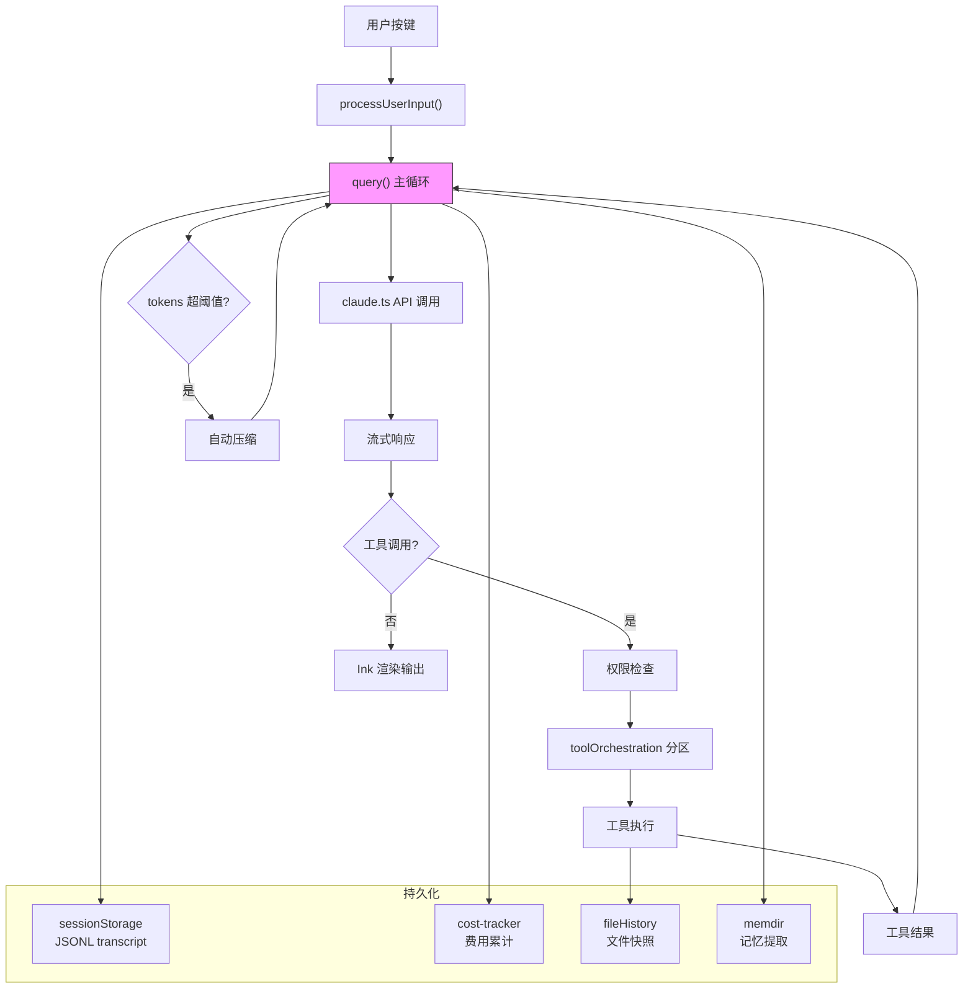
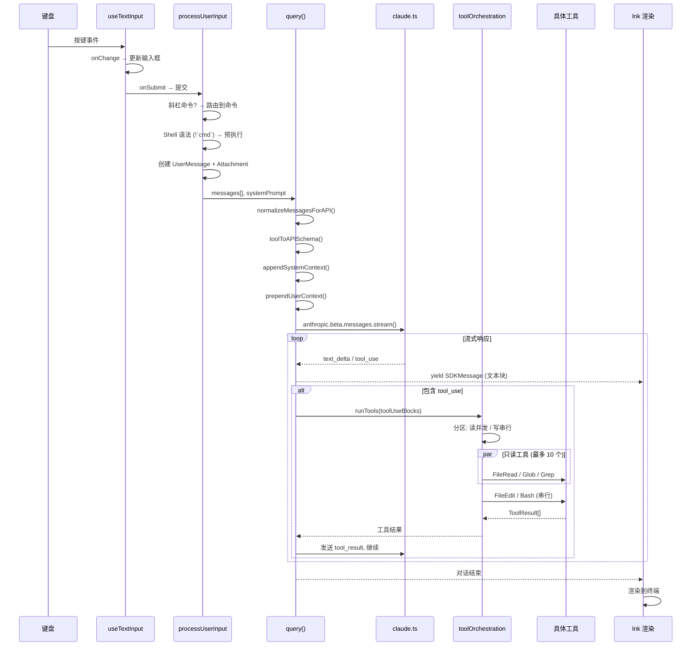
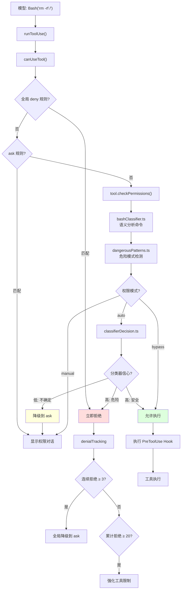
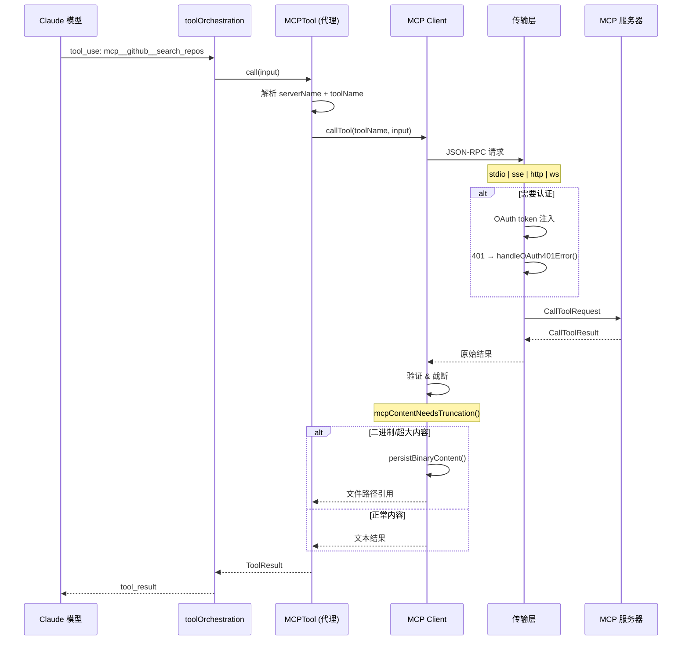
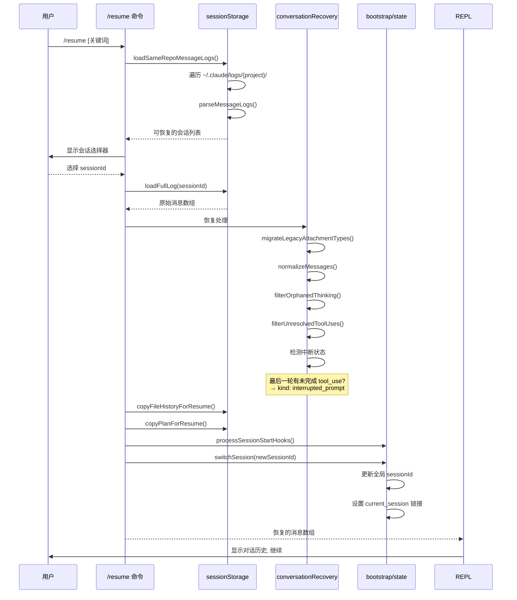
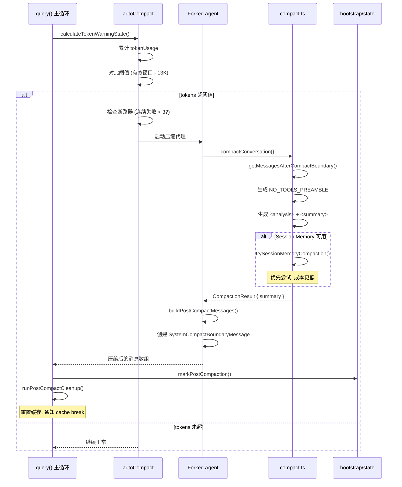
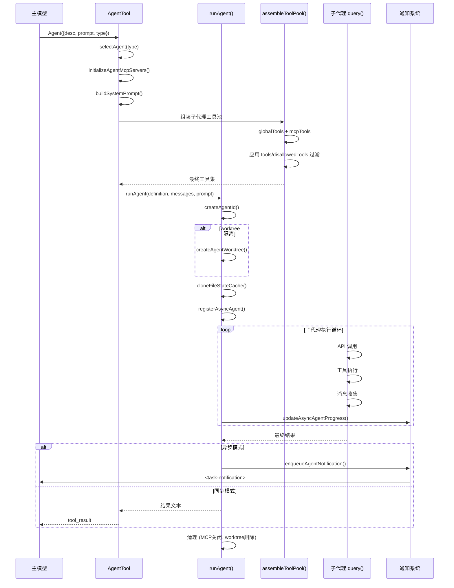
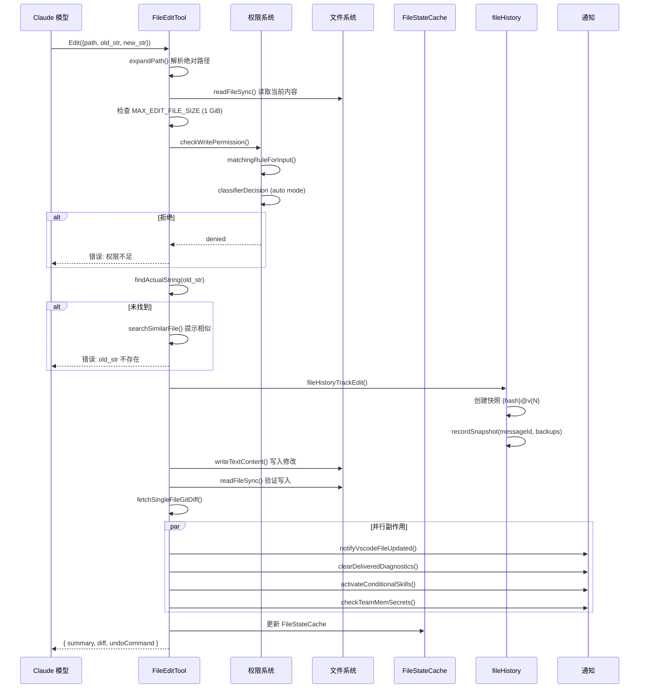
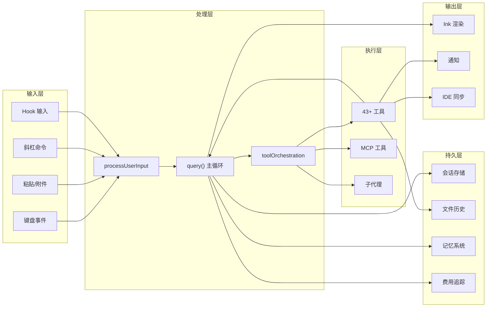

# 24 - 端到端数据流分析

> 7 个跨模块的完整用户流程追踪，将之前分散在各文档中的 125+ 场景串联成完整链路。

---

## 总览：核心数据通路



---

## 流程 1：用户输入 → 模型响应



### 关键数据结构

```
Message = UserMessage | AssistantMessage | SystemMessage
        | ProgressMessage | AttachmentMessage

ProcessUserInputResult = {
  messages: Message[]
  shouldQuery: boolean
  model?: string
  effort?: EffortValue
}

ToolUseBlock = {
  type: "tool_use"
  id: string
  name: string
  input: Record<string, unknown>
}
```

---

## 流程 2：Auto Mode 权限决策



---

## 流程 3：MCP 工具调用



---

## 流程 4：会话恢复 (/resume)



---

## 流程 5：自动压缩



### 压缩后消息结构

```
压缩前: [msg1, msg2, ..., msg50, msg51, ..., msg100]
                    ↓ 压缩范围 ↓
压缩后: [msg1, msg2, CompactBoundaryMessage{summary}, msg97, msg98, msg99, msg100]
```

---

## 流程 6：子代理生命周期



---

## 流程 7：文件编辑完整链路



---

## 跨模块数据流矩阵



---

## 关键跨模块数据传递

| 数据类型 | 来源 | 流向 | 目标 |
|---------|------|------|------|
| `Message[]` | processUserInput | query() | API + sessionStorage |
| `ToolUseBlock` | API 流 | toolOrchestration | Tool.call() |
| `PermissionDecision` | permissions.ts | useCanUseTool | UI + denialTracking |
| `ToolUseContext` | QueryEngine | runAgent | 子代理隔离上下文 |
| `FileStateCache` | FileReadTool | FileEditTool | 跨工具共享 |
| `FileHistorySnapshot` | fileHistory | sessionStorage | /resume 恢复 |
| `MCPServerConnection` | mcp/client | MCPTool | MCP 执行 |
| `CostState` | cost-tracker | bootstrap/state | /cost 显示 |
| `CompactBoundaryMessage` | compact.ts | query() | 消息数组替换 |
| `SDKMessage` | QueryEngine | Ink 渲染 | 终端输出 |
