# 25 - 跨模块设计模式与工程原则

> 从 125+ 场景中提炼出 10 个反复出现的架构模式，附源码验证数据。

---

## 模式总览

```mermaid
mindmap
  root((设计模式))
    缓存策略
      TTL 写透缓存
      LRU 驱逐
      多源分层
    分叉代理
      CacheSafeParams
      6 个核心场景
      隔离机制
    特性门控
      feature() 960次
      GrowthBook 284次
      死代码消除
    错误处理
      toError() 159次
      logError() 908次
      AbortError 检测
    懒加载
      条件 require()
      启动时间优化
    权限规则
      Tool(content) 语法
      通配符匹配
    分析事件
      logEvent() 1041次
      PII 保护
      零依赖排队
    Signal/Store
      事件信号 (无状态)
      响应式存储 (有状态)
    顺序执行
      FIFO 队列
      33 个使用点
    优雅降级
      fail-open
      graceful shutdown
```

---

## 1. 三层缓存架构

**核心文件**: `src/utils/memoize.ts` (270 行)

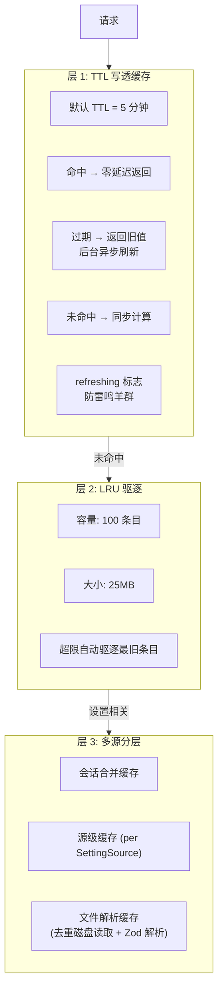

### TTL 值一览

| 组件 | TTL | 用途 |
|------|-----|------|
| `memoizeWithTTL` 默认 | 5 分钟 | 通用缓存 |
| 时间基础微压缩 | 60 分钟 | API 缓存过期对齐 |
| 策略限制 | 1 小时 | 组织策略轮询 |
| 指标选择退出 (内存) | 1 小时 | API 调用去重 |
| 指标选择退出 (磁盘) | 24 小时 | 跨进程持久化 |
| Grove 配置 | 24 小时 | 隐私策略 |
| 推荐码资格 | 24 小时 | 后台刷新 |
| 设置缓存 | 无限期 | 事件驱动清除 |

---

## 2. 分叉代理模式

**核心文件**: `src/utils/forkedAgent.ts` (690 行), 22 个文件使用

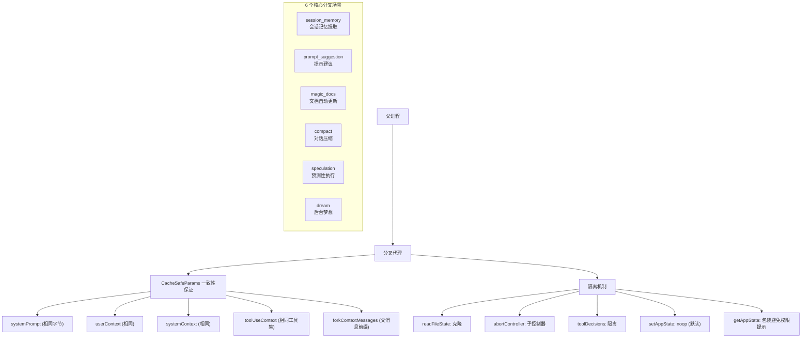

**Why CacheSafeParams?** — Anthropic API 缓存键 = `system prompt + tools + model + messages prefix + thinking config`。任何不匹配 → 整个提示缓存失效 → 额外 token 开销。

---

## 3. 特性门控体系

**统计**: `feature()` 960 次 (212 文件), `getFeatureValue()` 284 次 (109 文件)

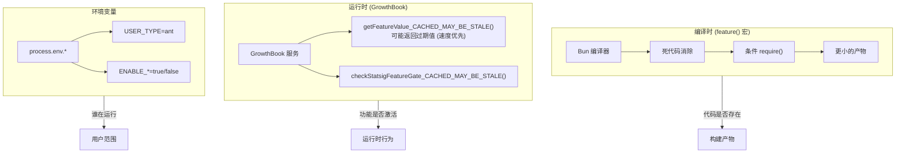

---

## 4. 错误处理策略

**统计**: `logError()` 908 次 (241 文件), `toError()` 159 次 (59 文件)

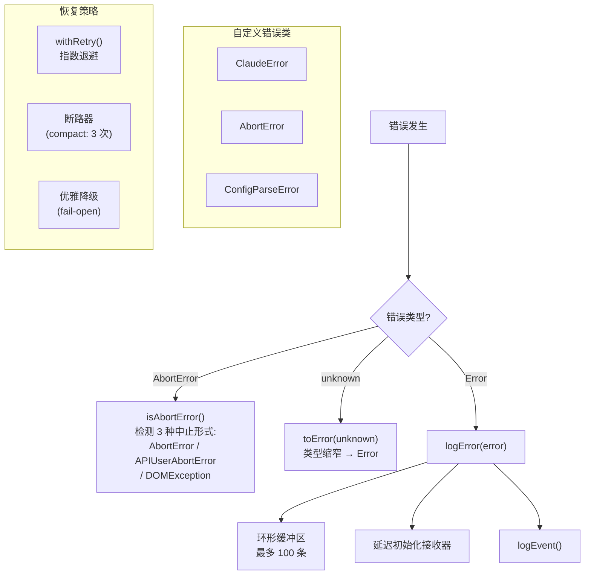

---

## 5. 懒加载与死代码消除

**统计**: `src/tools.ts` 25 次 `require()`, `src/commands.ts` 18 次 `require()`

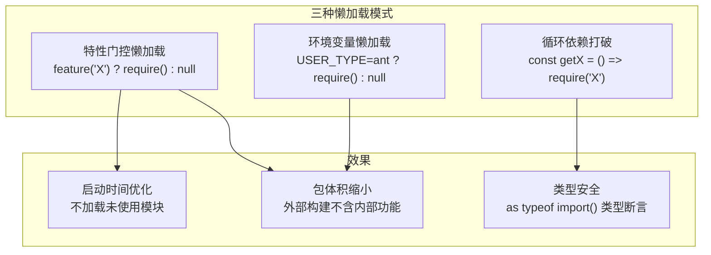

---

## 6. 权限规则解析

**文件**: `src/utils/permissions/permissionRuleParser.ts`

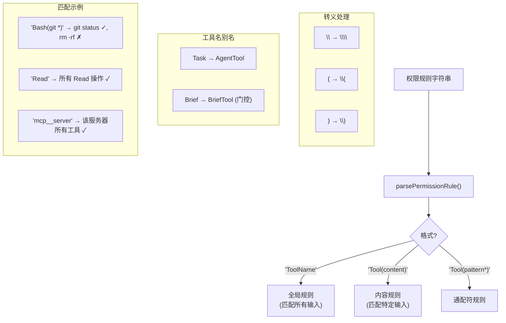

---

## 7. 分析事件模式

**统计**: `logEvent()` 1041 次 (250 文件)

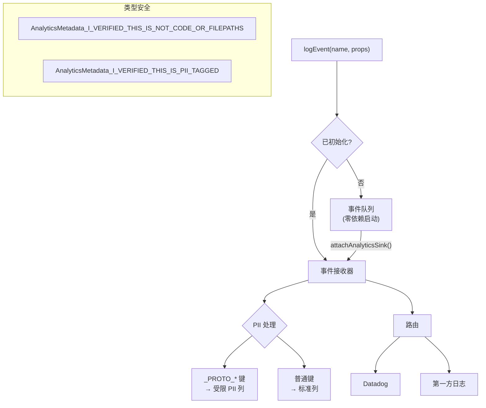

---

## 8. Signal / Store 双模式

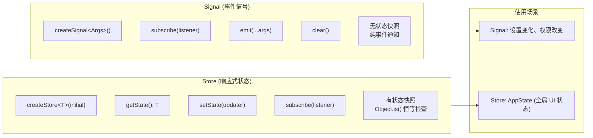

---

## 9. 顺序执行包装

**文件**: `src/utils/sequential.ts` (57 行), 33 个文件使用

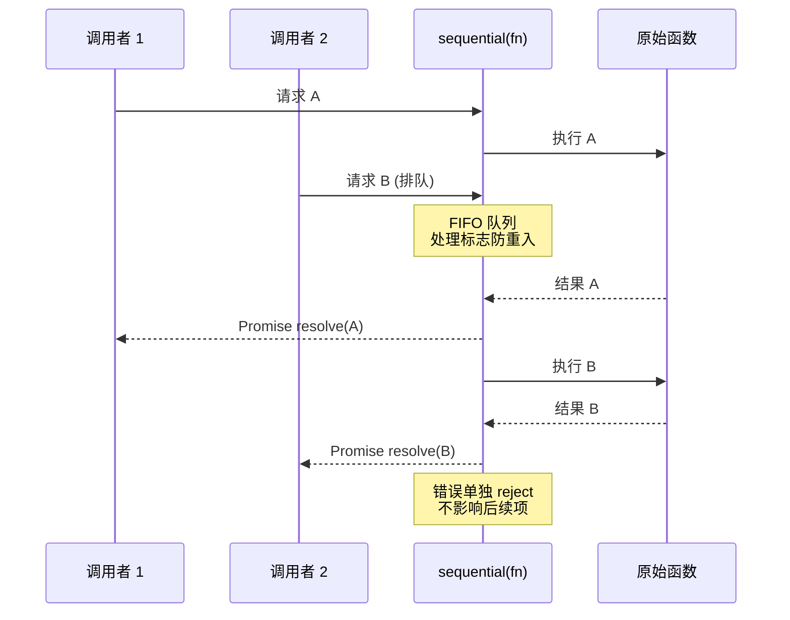

**使用场景**: 文件写入、日志追加、会话持久化、MCP 客户端操作

---

## 10. 优雅降级

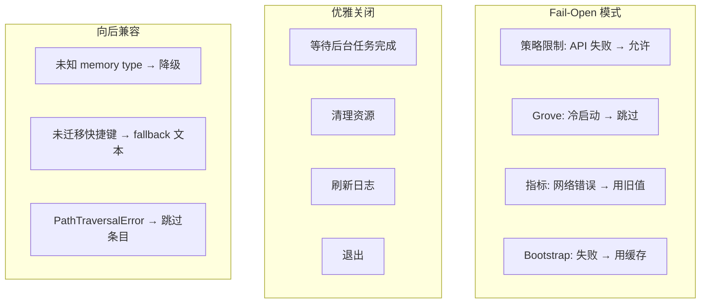

---

## 工程原则总结

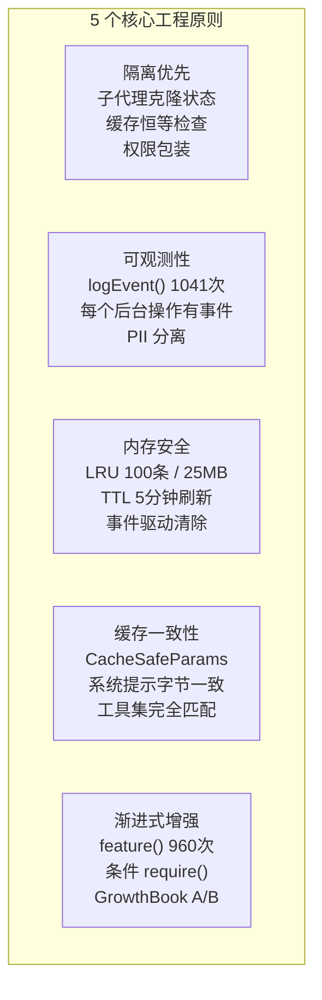

### 数量统计

| 模式 | 使用文件数 | 核心实现 | 调用次数 |
|------|-----------|---------|---------|
| TTL/LRU 缓存 | 7 | memoize.ts (270行) | - |
| 分叉代理 | 22 | forkedAgent.ts (690行) | - |
| `feature()` | 212 | bun:bundle 宏 | 960 |
| `getFeatureValue()` | 109 | growthbook.ts | 284 |
| `logError()` | 241 | errors.ts | 908 |
| `logEvent()` | 250 | analytics/index.ts | 1041 |
| `toError()` | 59 | errors.ts | 159 |
| `sequential()` | 33 | sequential.ts (57行) | - |
| `require()` 懒加载 | 2 核心 | tools.ts + commands.ts | 43 |
