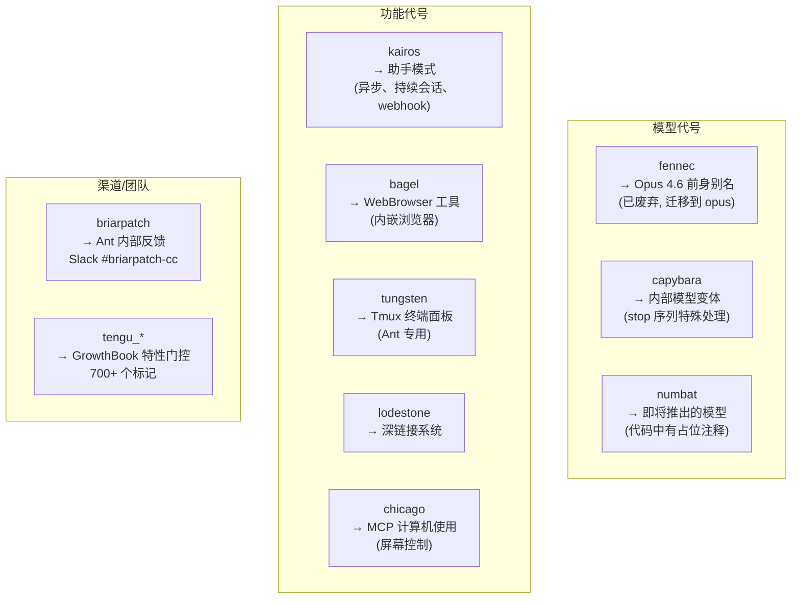

# 26 - 配置参考手册与内部代号术语表

> 从源码提取的完整配置参考：473 个环境变量、用户设置项、CLI 标志、700+ 个特性门控、9 个内部代号。

---

## 一、内部代号术语表



### 代号详细映射

| 代号 | 类型 | 实际含义 | 出现位置 |
|------|------|---------|---------|
| **kairos** | 功能 | 异步助手模式（持续会话、webhook、推送通知） | `feature('KAIROS')`, `getKairosActive()` |
| **fennec** | 模型 | Opus 4.6 前身别名，已迁移 | `migrateFennecToOpus.ts` |
| **capybara** | 模型 | 内部模型变体 | stop 序列处理、注释 `@[MODEL LAUNCH]` |
| **numbat** | 模型 | 下一代模型（未发布） | 注释: "Remove this section when we launch numbat" |
| **bagel** | 功能 | WebBrowser 工具 | `bagelActive`, `bagelUrl`, `bagelPanelVisible` |
| **tungsten** | 功能 | Tmux 终端面板 | `tungstenActiveSession`, `TungstenTool` |
| **lodestone** | 功能 | 深链接注册/处理系统 | `tengu_lodestone_enabled` |
| **chicago** | 功能 | MCP 计算机使用（屏幕控制） | `feature('CHICAGO_MCP')` |
| **briarpatch** | 渠道 | Ant 内部反馈 Slack 频道 | `#briarpatch-cc` |
| **tengu** | 前缀 | GrowthBook 特性门控命名空间 | 700+ 个 `tengu_*` 标记 |

---

## 二、环境变量完整分类

**统计**: 473 个独特环境变量

### API 和认证

| 变量 | 用途 |
|------|------|
| `ANTHROPIC_API_KEY` | API 密钥 |
| `ANTHROPIC_AUTH_TOKEN` | 认证令牌 |
| `ANTHROPIC_BASE_URL` | API 基础 URL |
| `ANTHROPIC_MODEL` | 默认模型 |
| `ANTHROPIC_SMALL_FAST_MODEL` | 快速小模型（用于工具摘要等） |
| `ANTHROPIC_BEDROCK_BASE_URL` | AWS Bedrock 端点 |
| `ANTHROPIC_FOUNDRY_API_KEY` | Foundry API 密钥 |
| `ANTHROPIC_FOUNDRY_BASE_URL` | Foundry 端点 |
| `ANTHROPIC_VERTEX_PROJECT_ID` | Vertex AI 项目 ID |
| `CLAUDE_CODE_API_KEY_FILE_DESCRIPTOR` | FD 传递 API 密钥 |
| `CLAUDE_CODE_OAUTH_TOKEN` | OAuth 令牌 |

### 模型与能力

| 变量 | 用途 |
|------|------|
| `CLAUDE_CODE_DISABLE_THINKING` | 禁用扩展思考 |
| `CLAUDE_CODE_SUBAGENT_MODEL` | 子代理模型覆盖 |
| `CLAUDE_CODE_AUTO_MODE_MODEL` | 自动模式分类器模型 |
| `MAX_THINKING_TOKENS` | 最大思考 token 数 |
| `CLAUDE_CODE_MAX_CONTEXT_TOKENS` | 最大上下文 token |
| `CLAUDE_CODE_MAX_OUTPUT_TOKENS` | 最大输出 token |
| `CLAUDE_CODE_EFFORT_LEVEL` | 推理力度级别 |

### Bridge 和远程

| 变量 | 用途 |
|------|------|
| `CLAUDE_BRIDGE_BASE_URL` | Bridge 基础 URL |
| `CLAUDE_BRIDGE_SESSION_INGRESS_URL` | 会话 ingress URL |
| `CLAUDE_CODE_REMOTE` | 远程模式 |
| `CLAUDE_CODE_REMOTE_SESSION_ID` | 远程会话 ID |
| `CLAUDE_CODE_USE_CCR_V2` | CCR v2 传输 |

### 性能和资源

| 变量 | 用途 |
|------|------|
| `CLAUDE_CODE_MAX_TOOL_USE_CONCURRENCY` | 工具并发数（默认 10） |
| `CLAUDE_CODE_ASYNC_BACKGROUND_TASKS` | 后台任务模式 |
| `CLAUDE_CODE_DISABLE_BACKGROUND_TASKS` | 禁用后台任务 |
| `CLAUDE_CODE_AUTOCOMPACT_PCT_OVERRIDE` | 压缩阈值覆盖 |

### 调试和分析

| 变量 | 用途 |
|------|------|
| `CLAUDE_CODE_DEBUG_LOGS_DIR` | 调试日志目录 |
| `CLAUDE_CODE_DEBUG_LOG_LEVEL` | 日志级别 |
| `CLAUDE_CODE_PROFILE_STARTUP` | 启动性能分析 |
| `CLAUDE_CODE_COMMIT_LOG` | Ink 渲染时序日志 |
| `CLAUDE_CODE_PERFETTO_TRACE` | Perfetto 追踪 |
| `VCR_RECORD` | VCR 录制模式 |
| `FORCE_VCR` | 强制 VCR |

### 安全和权限

| 变量 | 用途 |
|------|------|
| `CLAUDE_CODE_UNDERCOVER` | 卧底模式 (=1 强制) |
| `CLAUDE_CODE_SIMPLE` | 极简工具集模式 |
| `CLAUDE_CODE_COORDINATOR_MODE` | 协调器模式 |
| `CLAUDE_CODE_VERIFY_PLAN` | 计划验证 |
| `CLAUDE_CODE_DISABLE_AUTO_MEMORY` | 禁用自动记忆 |

### 第三方提供商

| 变量 | 用途 |
|------|------|
| `CLAUDE_CODE_USE_BEDROCK` | 使用 AWS Bedrock |
| `CLAUDE_CODE_USE_VERTEX` | 使用 Google Vertex AI |
| `CLAUDE_CODE_USE_FOUNDRY` | 使用 Anthropic Foundry |
| `AWS_REGION` | AWS 区域 |
| `AWS_ACCESS_KEY_ID` | AWS 密钥 |
| `CLOUD_ML_REGION` | Vertex AI 区域 |

### 特殊模式

| 变量 | 用途 |
|------|------|
| `USER_TYPE` | 用户类型 (`ant` = 内部) |
| `IS_DEMO` | 演示模式（隐藏账户信息） |
| `ENABLE_LSP_TOOL` | 启用 LSP 工具 |
| `CLAUDE_CODE_ENABLE_PROMPT_SUGGESTION` | 启用提示建议 |
| `CLAUDE_CODE_FORK_SUBAGENT` | 启用 Fork 子代理 |
| `CLAUDE_CODE_EXPERIMENTAL_AGENT_TEAMS` | 启用实验性代理团队 |

---

## 三、用户可配置设置 (settings.json)

### 全局设置 (~/.claude/settings.json)

| 设置项 | 类型 | 描述 |
|--------|------|------|
| `theme` | string | UI 配色方案 |
| `editorMode` | `"normal"` \| `"vim"` | 键盘绑定模式 |
| `verbose` | boolean | 详细调试输出 |
| `preferredNotifChannel` | string | 通知渠道 (auto/iterm2/kitty/ghostty/bell/disabled) |
| `autoCompactEnabled` | boolean | 自动压缩 |
| `fileCheckpointingEnabled` | boolean | 文件检查点（代码回卷） |
| `showTurnDuration` | boolean | 显示轮次耗时 |
| `terminalProgressBarEnabled` | boolean | 终端进度条 (OSC 9;4) |
| `todoFeatureEnabled` | boolean | 任务跟踪 |
| `remoteControlAtStartup` | boolean | 启动时启用远程控制 |

### 项目设置 (.claude/settings.json)

| 设置项 | 类型 | 描述 |
|--------|------|------|
| `model` | string | 模型覆盖 (sonnet/opus/haiku) |
| `alwaysThinkingEnabled` | boolean | 始终启用扩展思考 |
| `autoMemoryEnabled` | boolean | 自动记忆 |
| `autoDreamEnabled` | boolean | 后台记忆整合 |
| `permissions.defaultMode` | string | 权限模式 (default/plan/acceptEdits/dontAsk/auto) |
| `language` | string | 响应语言 |
| `teammateMode` | string | 队友生成方式 (tmux/in-process/auto) |
| `classifierPermissionsEnabled` | boolean | Bash 权限 AI 分类 (Ant) |
| `voiceEnabled` | boolean | 语音听写 |

### 权限规则 (settings.json 内)

```json
{
  "permissions": {
    "allow": ["Read", "Bash(git *)", "mcp__github__*"],
    "deny": ["Bash(rm *)", "Bash(curl *)"]
  }
}
```

### Hook 配置 (settings.json 内)

```json
{
  "hooks": {
    "PreToolUse": [
      {
        "type": "command",
        "command": "echo checking...",
        "if": "Bash(git *)",
        "timeout": 5000
      }
    ],
    "PostToolUse": [...],
    "UserPromptSubmit": [...],
    "SessionStart": [...]
  }
}
```

---

## 四、CLI 标志完整参考

### 快速路径（不加载完整模块）

| 标志 | 描述 |
|------|------|
| `--version`, `-v`, `-V` | 输出版本号 |
| `--dump-system-prompt` | 输出渲染的系统提示 (Ant) |

### 运行模式

| 标志 | 描述 |
|------|------|
| `--bare` | 极简模式 |
| `--tmux` | Tmux 模式 |
| `--worktree`, `-w` | Worktree 隔离 |
| `--bg`, `--background` | 后台会话 |
| `--mcp` | MCP 服务器模式 |
| `--remote` | 远程模式 |

### 会话管理

| 标志 | 描述 |
|------|------|
| `--session-id` | 指定会话 ID |
| `--resume` | 恢复会话 |
| `--resume-session-at` | 从特定点恢复 |
| `--fork-session` | Fork 会话 |
| `--no-session-persistence` | 禁用会话持久化 |

### 模型与推理

| 标志 | 描述 |
|------|------|
| `--model` | 指定模型 |
| `--thinking` | 启用扩展思考 |
| `--max-thinking-tokens` | 最大思考 token |
| `--effort` | 推理力度 (low/medium/high/max/auto) |
| `--max-turns` | 最大轮次 |

### 权限

| 标志 | 描述 |
|------|------|
| `--dangerously-skip-permissions` | 跳过权限检查 |
| `--permission-mode` | 权限模式 |
| `--tools` | 启用/禁用工具 |
| `--allowed-tools` | 允许的工具列表 |
| `--disallowed-tools` | 禁止的工具列表 |

### 系统提示

| 标志 | 描述 |
|------|------|
| `--system-prompt` | 自定义系统提示 |
| `--append-system-prompt` | 追加系统提示 |
| `--append-system-prompt-file` | 从文件追加 |

### 配置

| 标志 | 描述 |
|------|------|
| `--settings` | 覆盖设置文件 |
| `--mcp-config` | MCP 配置文件 |
| `--plugin-dir` | 插件目录 |
| `--add-dir` | 添加工作目录 |

### 输入输出

| 标志 | 描述 |
|------|------|
| `-p`, `--print` | 非交互模式（打印并退出） |
| `--prefill` | 预填充消息 |
| `--text` | 直接输入文本 |
| `--output-format` | 输出格式 (text/json/stream-json) |
| `--verbose` | 详细输出 |

### 调试

| 标志 | 描述 |
|------|------|
| `--debug` | 调试模式 |
| `--debug=pattern` | 选择性日志过滤 |
| `--debug-file` | 调试文件输出 |
| `-d2e` | 调试输出到 stderr |
| `--dry-run` | 干运行 |

---

## 五、GrowthBook 特性门控前缀分类

| 前缀 | 含义 | 示例 |
|------|------|------|
| `tengu_amber_*` | Amber 特性族 | `tengu_amber_flint` (团队), `tengu_amber_stoat` (协调器) |
| `tengu_slate_*` | Slate 特性族 | `tengu_slate_prism` (summarization) |
| `tengu_harbor_*` | Harbor 权限系统 | `tengu_harbor_permissions` |
| `tengu_cobalt_*` | Cobalt 特性族 | `tengu_cobalt_frost` |
| `tengu_glacier_*` | Glacier 冷存储/缓存 | `tengu_glacier_2xr` |
| `tengu_grove_*` | Grove 隐私策略 | `tengu_grove_policy_*` |
| `tengu_marble_*` | Marble UI 特性 | UI 美化 |
| `tengu_hive_*` | Hive 验证系统 | `tengu_hive_evidence` (验证代理) |
| `tengu_onyx_*` | Onyx 自动化 | `tengu_onyx_plover` (AutoDream 配置) |
| `tengu_chomp_*` | Chomp 推荐 | `tengu_chomp_inflection` (提示建议) |
| `tengu_kairos_*` | Kairos 助手 | `tengu_kairos_brief_config` |
| `tengu_passport_*` | Passport 提取 | `tengu_passport_quail` (记忆提取) |

---

## 六、文件路径约定

| 路径 | 用途 |
|------|------|
| `~/.claude/settings.json` | 用户全局设置 |
| `~/.claude/keybindings.json` | 自定义快捷键 |
| `~/.claude/agents/*.md` | 用户自定义代理 |
| `~/.claude/skills/*.md` | 用户自定义技能 |
| `~/.claude/memory/` | 自动记忆目录 |
| `~/.claude/debug/` | 调试日志 |
| `~/.claude/logs/` | 会话日志 |
| `~/.claude/teams/` | Team 配置 |
| `~/.claude/tasks/` | 任务列表 |
| `~/.claude/bundled-skills/` | 打包技能文件提取 |
| `~/.claude/policy-limits.json` | 策略限制缓存 |
| `.claude/settings.json` | 项目设置 |
| `.claude/settings.local.json` | 项目本地设置 |
| `.claude/agents/*.md` | 项目代理 |
| `.claude/skills/*.md` | 项目技能 |
| `.claude/CLAUDE.md` | 项目指导 (等同根目录 CLAUDE.md) |
| `.claude/worktrees/` | Worktree 隔离目录 |
| `CLAUDE.md` | 项目指导文件 |
| `CLAUDE.local.md` | 本地指导文件 (不提交) |
