# 27 - 安全模型全景

> 从源码提取的完整安全防护体系：路径验证 7 层、Bash 检查 23 项、Unicode 净化、权限追踪。

---

## 纵深防御总览

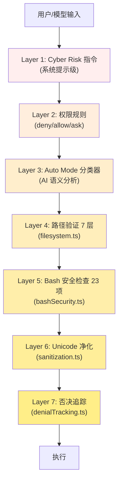

---

## 1. 路径验证 7 层模型

**文件**: `src/utils/permissions/pathValidation.ts`

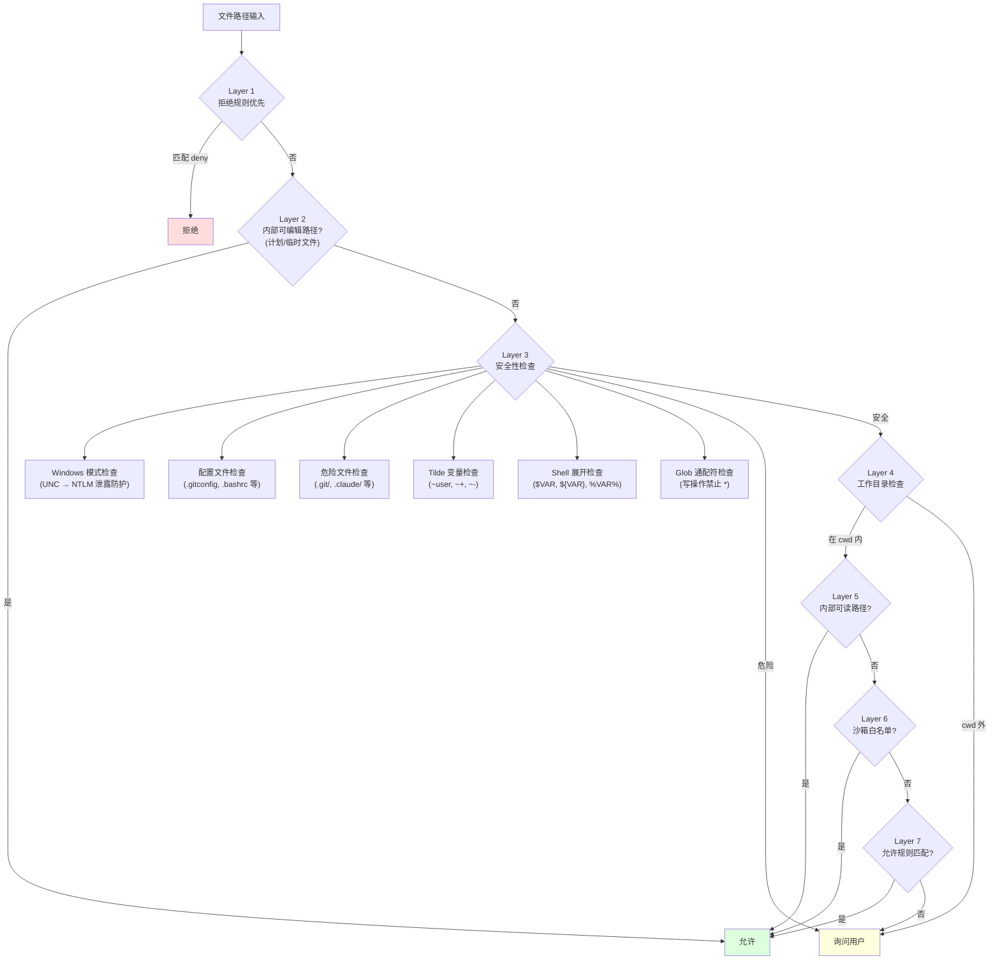

### 受保护文件 (8 个)

```
.gitconfig, .gitmodules, .bashrc, .bash_profile,
.zshrc, .zprofile, .profile, .ripgreprc
```

### 受保护目录 (4 个)

```
.git/, .vscode/, .idea/, .claude/
```

---

## 2. Bash 命令安全检查 (23 项)

**文件**: `src/tools/BashTool/bashSecurity.ts`

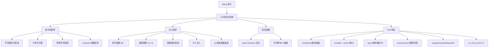

### 危险删除操作阻止

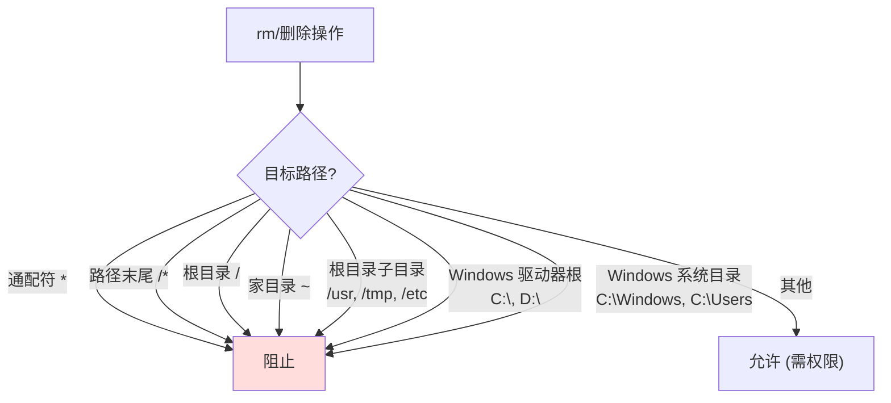

---

## 3. Unicode 隐藏字符防护

**文件**: `src/utils/sanitization.ts`

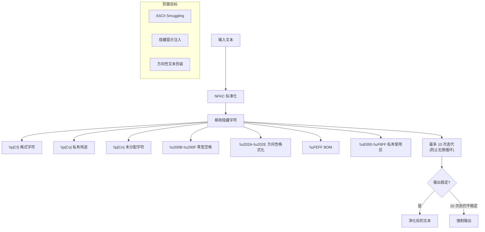

---

## 4. 权限否决追踪

**文件**: `src/utils/permissions/denialTracking.ts`

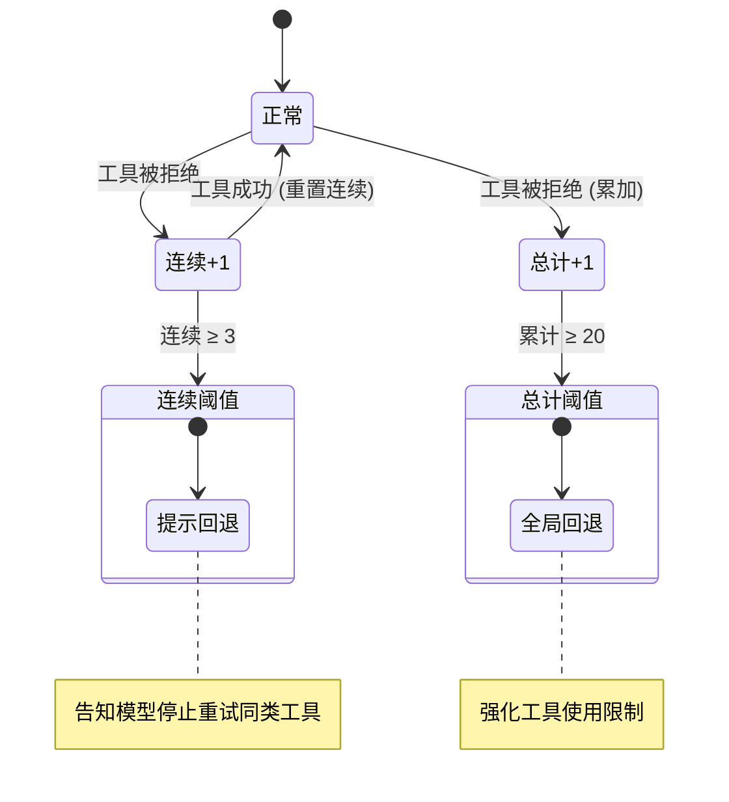

---

## 5. Undercover 模式

**文件**: `src/utils/undercover.ts`

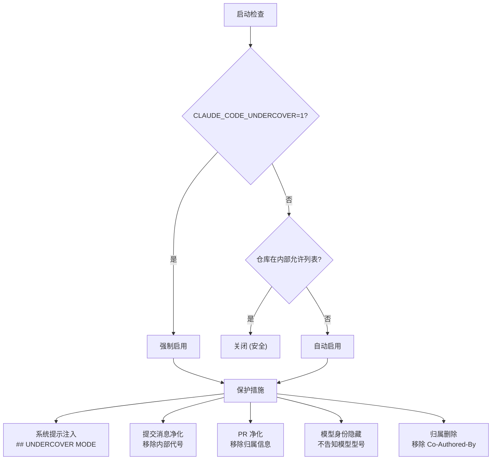

---

## 6. 沙箱系统

**文件**: `src/utils/sandbox/sandbox-adapter.ts`

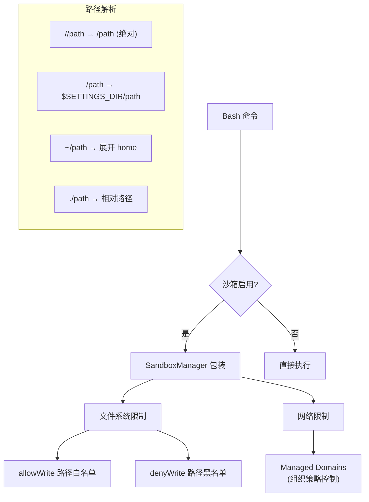

---

## 7. 安全文件操作

### 符号链接防护

```mermaid
flowchart TD
    FILE_OP["文件操作"] --> RESOLVE["getPathsForPermissionCheck()"]
    RESOLVE --> REAL["realpath() 解析"]
    REAL --> SYMLINK{"符号链接?"}
    SYMLINK -->|是| BOTH["检查原始路径 + 目标路径"]
    SYMLINK -->|否| SINGLE["检查原始路径"]

    subgraph 打包技能["打包技能文件安全"]
        NOFOLLOW["O_NOFOLLOW 标志<br/>(阻止符号链接跟踪)"]
        EXCL["O_EXCL 标志<br/>(防止 TOCTOU 竞态)"]
        PERM_DIR["目录权限: 0o700"]
        PERM_FILE["文件权限: 0o600"]
    end
```

### 路径遍历检测

```
正则: /(?:^|[\\/])\.\.(?:[\\/]|$)/
↓
匹配: ../file, ..\file, path/../file
不匹配: ..filename, file..txt
```

---

## 8. 策略限制 (组织级)

**文件**: `src/services/policyLimits/types.ts`

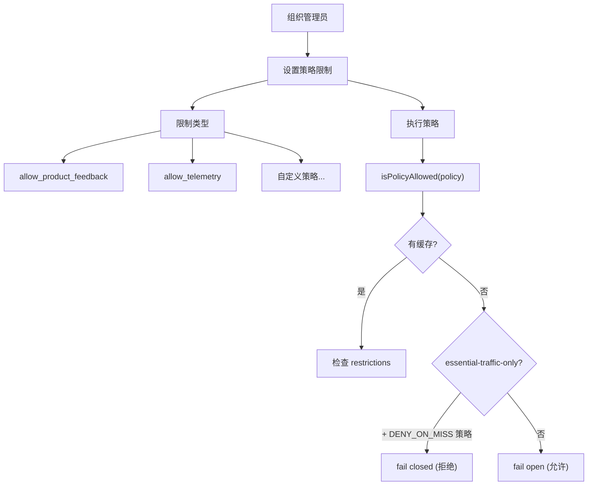

---

## 9. 敏感数据处理

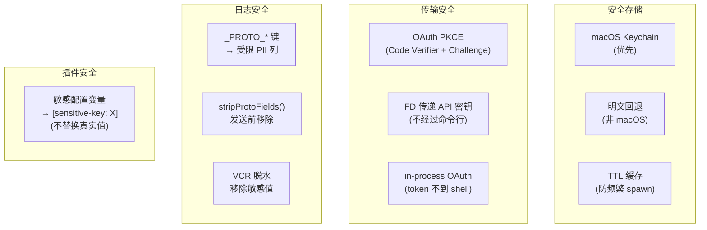

---

## 安全设计原则

| 原则 | 实现 |
|------|------|
| **纵深防御** | 7 层路径验证 + 23 项 Bash 检查 |
| **故障安全** | 不确定时 ask，不自动 allow |
| **白名单优先** | 显式 allow 而非 deny |
| **尽早验证** | 路径处理前检测遍历/展开/特殊字符 |
| **符号链接感知** | realpath + O_NOFOLLOW + 双路径检查 |
| **跨平台** | Windows UNC/驱动器 + POSIX 统一处理 |
| **最小权限** | 文件 0o600, 目录 0o700 |
| **防重放** | 否决追踪 (连续 3 + 累计 20) |
