# 28 - 性能优化技术目录

> 从源码提取的所有性能优化技术，附具体阈值参数和文件位置。

---

## 优化技术总览

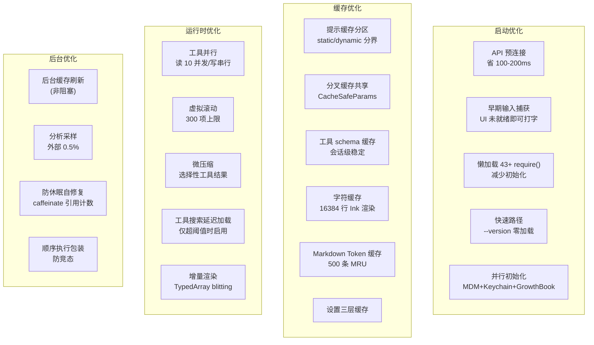

---

## 1. 启动时间优化

### API 预连接

**文件**: `src/utils/apiPreconnect.ts`

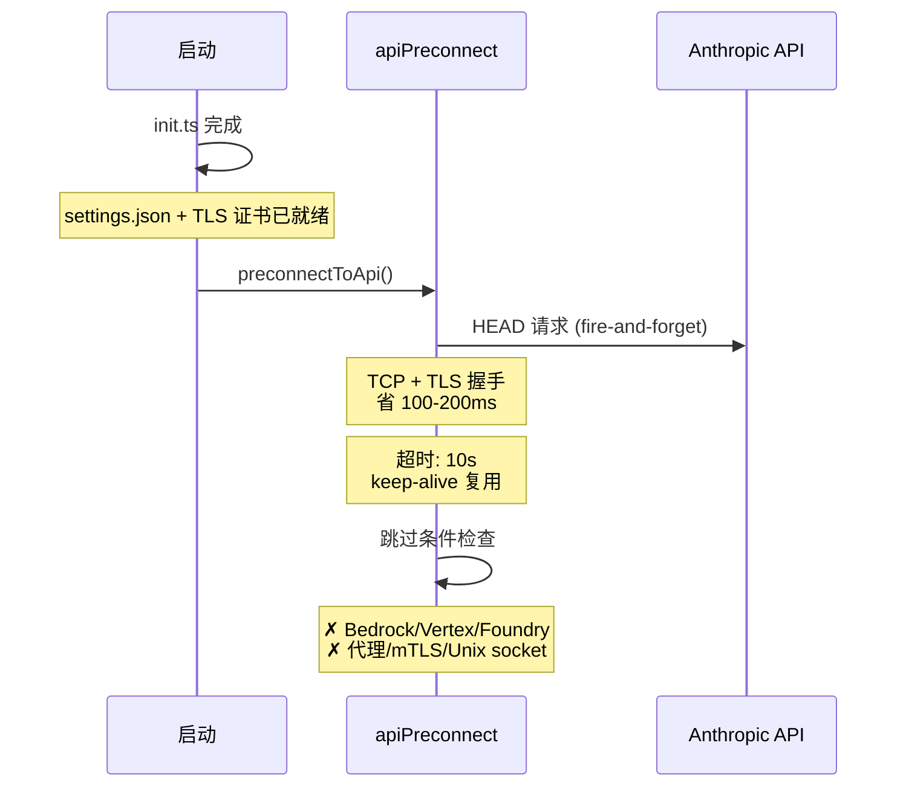

### 快速路径

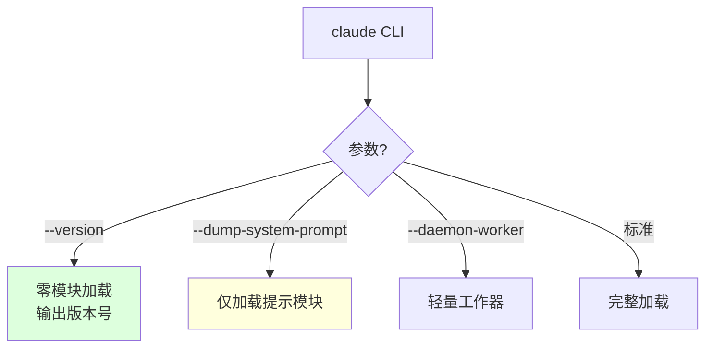

### 并行初始化

```mermaid
gantt
    title 启动并行初始化 (示意)
    dateFormat X
    axisFormat %s

    section 串行
    参数解析           :a1, 0, 2

    section 并行 (第一波)
    MDM 设置读取       :b1, 2, 5
    钥匙串预取         :b2, 2, 4
    GrowthBook 初始化  :b3, 2, 6

    section 串行
    全局状态初始化      :c1, 6, 8

    section 并行 (第二波)
    MCP 服务器连接     :d1, 8, 14
    插件加载           :d2, 8, 12
    API 预连接         :d3, 8, 9

    section 串行
    Ink 渲染           :e1, 14, 16
```

---

## 2. 提示缓存优化

### 系统提示分区

**文件**: `src/constants/prompts.ts`, `src/utils/api.ts`

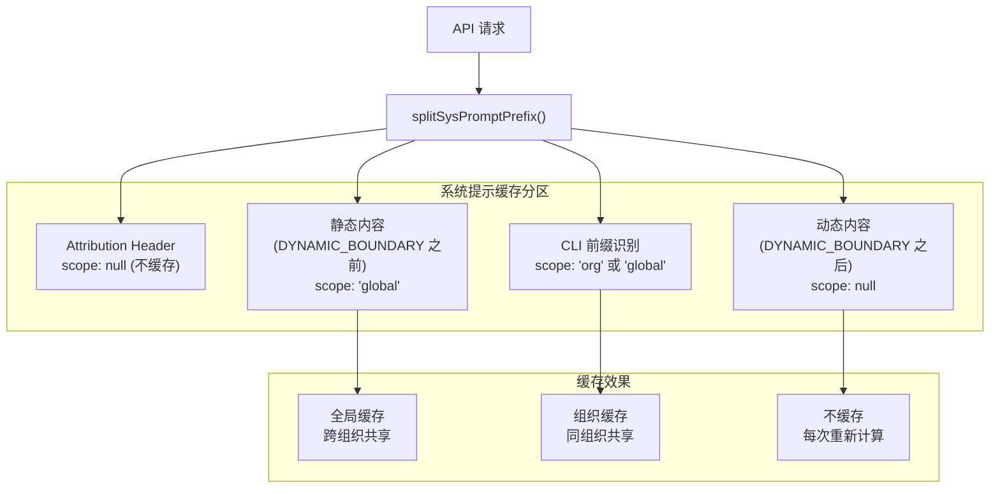

### 分叉代理缓存共享

```
CacheSafeParams 保证:
  系统提示 (相同字节) ✓
  工具集 (相同 schema) ✓
  模型 (相同) ✓
  消息前缀 (相同) ✓
  思考配置 (相同) ✓
  → 父子代理共享提示缓存
  → 避免重复 cache_creation token
```

### 缓存破裂检测

```
检测条件: cache_read 下降 > 5% 且绝对值 > 2000 tokens
诊断原因: 系统提示变化 | 工具增减 | 模型切换 | 快速模式 | TTL 过期
输出: ~/.claude/cache-break-*.diff
```

---

## 3. 工具执行优化

### 并发执行模型

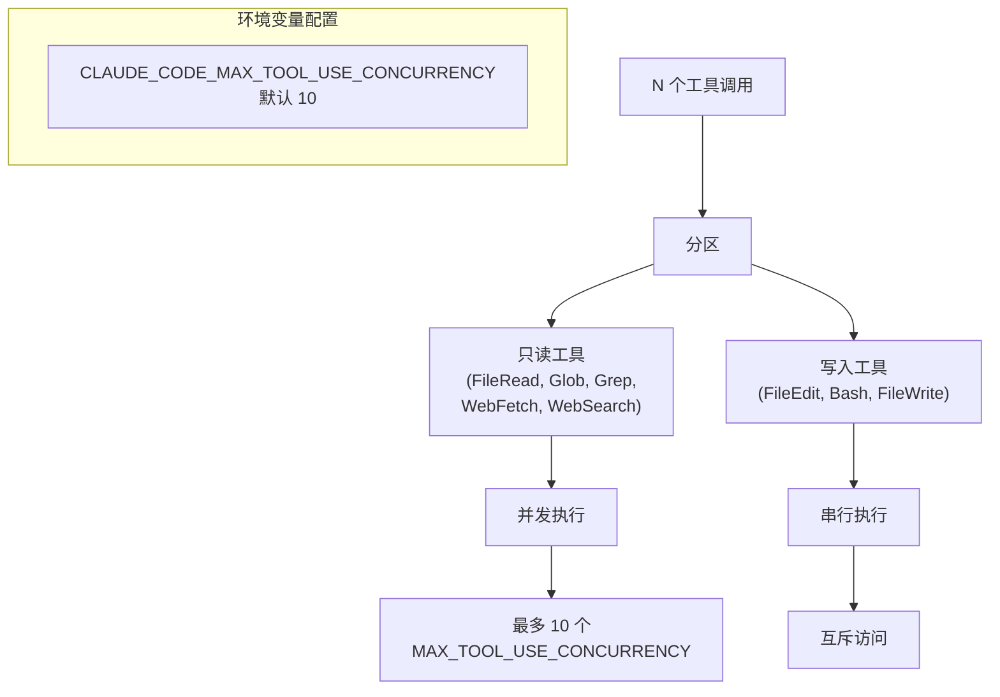

### 工具搜索延迟加载

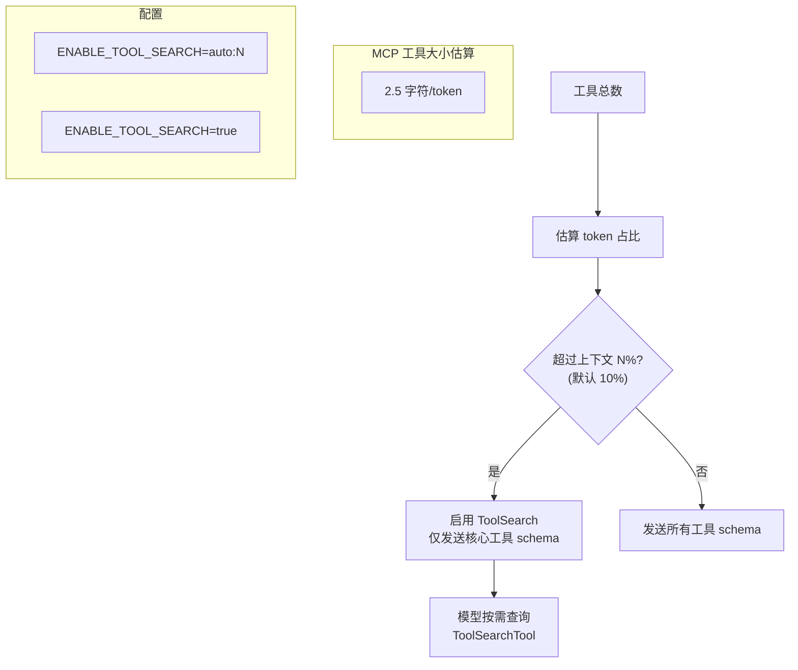

---

## 4. 渲染优化

### 虚拟滚动

**文件**: `src/hooks/useVirtualScroll.ts`

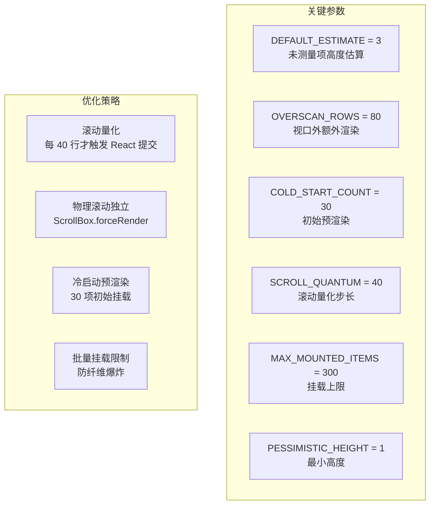

### Ink 渲染引擎

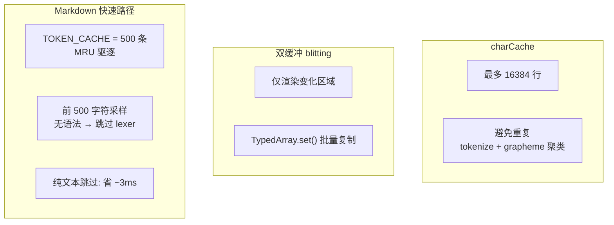

---

## 5. 压缩优化

### 六层压缩管线

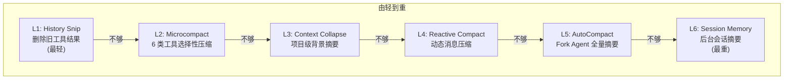

### Microcompact 参数

```
覆盖工具: Bash, Grep, Glob, WebSearch, WebFetch, FileEdit/Write
图像 token 限制: IMAGE_MAX_TOKEN_SIZE = 2000
时间基础阈值: gapThresholdMinutes = 60 (1 小时)
保留最近: keepRecent = 5
```

### AutoCompact 参数

```
触发阈值: 有效窗口 - 13K tokens
警告阈值: 有效窗口 - 20K tokens
阻塞阈值: 有效窗口 - 3K tokens
断路器: 连续失败 ≥ 3 次停止
摘要保留: 20K tokens
```

---

## 6. 内存管理

### LRU 缓存控制

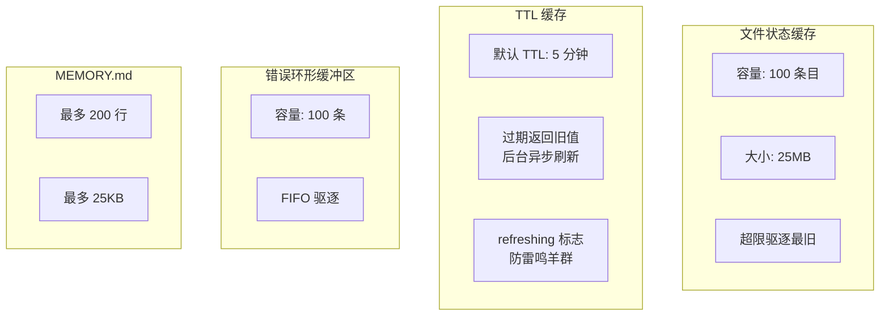

---

## 7. 分析采样

**文件**: `src/utils/startupProfiler.ts`

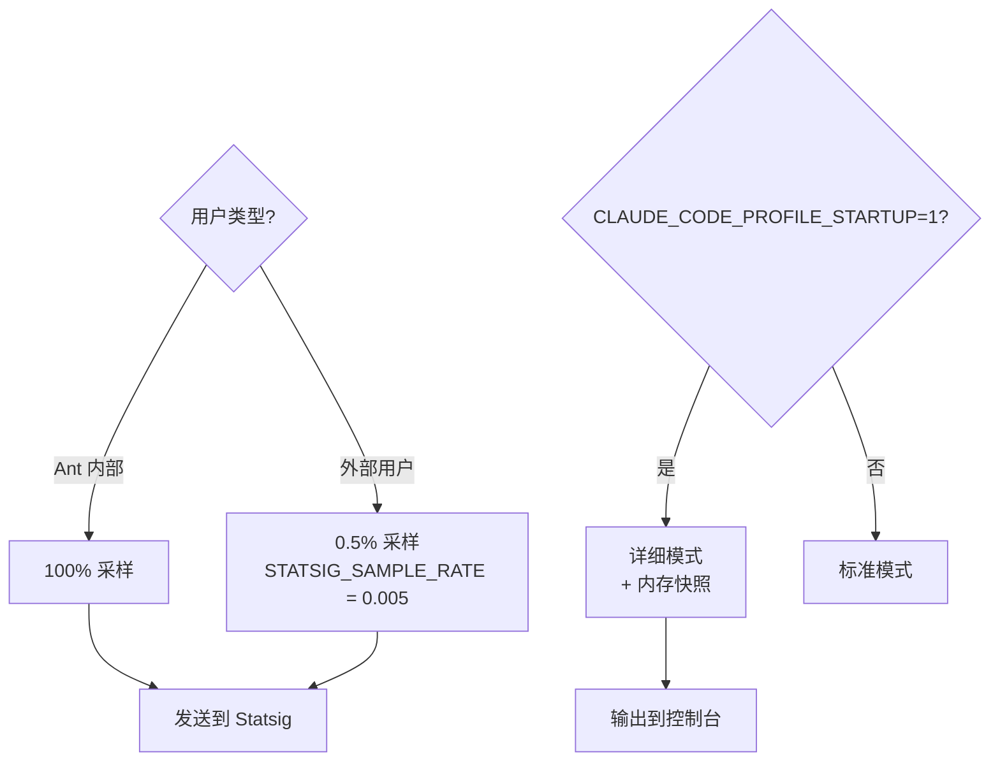

---

## 8. 防休眠自修复

```
caffeinate 超时: 300s (5 分钟)
重启间隔: 240s (4 分钟)
引用计数: 支持嵌套 start/stop
自修复: SIGKILL 后孤立进程 5 分钟自动退出
Unref: 不阻止 Node 退出
```

---

## 关键阈值速查表

| 组件 | 参数 | 值 | 位置 |
|------|------|-----|------|
| 工具并发 | MAX_CONCURRENT | 10 | toolOrchestration.ts |
| 虚拟滚动 | MAX_MOUNTED | 300 | useVirtualScroll.ts |
| 虚拟滚动 | SCROLL_QUANTUM | 40 行 | useVirtualScroll.ts |
| 虚拟滚动 | COLD_START | 30 项 | useVirtualScroll.ts |
| 虚拟滚动 | OVERSCAN | 80 行 | useVirtualScroll.ts |
| 字符缓存 | MAX_LINES | 16384 | ink/output.ts |
| Markdown | TOKEN_CACHE | 500 条 | Markdown.tsx |
| 文件缓存 | MAX_ENTRIES | 100 | fileStateCache.ts |
| 文件缓存 | MAX_SIZE | 25MB | fileStateCache.ts |
| 错误缓冲 | MAX_ERRORS | 100 | log.ts |
| 记忆索引 | MAX_LINES | 200 | memdir.ts |
| 记忆索引 | MAX_BYTES | 25KB | memdir.ts |
| TTL 缓存 | DEFAULT | 5 分钟 | memoize.ts |
| 微压缩 | IMAGE_MAX | 2000 tokens | microCompact.ts |
| 微压缩 | GAP_THRESHOLD | 60 分钟 | timeBasedMCConfig.ts |
| 自动压缩 | BUFFER | 13K tokens | autoCompact.ts |
| 自动压缩 | BREAKER | 3 次 | autoCompact.ts |
| API 预连接 | TIMEOUT | 10s | apiPreconnect.ts |
| 防休眠 | CAFFEINATE | 300s | preventSleep.ts |
| 采样率 | EXTERNAL | 0.5% | startupProfiler.ts |
| Unicode | MAX_ITER | 10 次 | sanitization.ts |
| 否决追踪 | CONSECUTIVE | 3 | denialTracking.ts |
| 否决追踪 | TOTAL | 20 | denialTracking.ts |
| 工具搜索 | AUTO_THRESHOLD | 10% | toolSearch.ts |
| 工具结果 | MAX_SIZE | 50KB | toolResultStorage.ts |
| 文件上传 | MAX_FILE | 500MB | filesApi.ts |
| 文件上传 | CONCURRENCY | 5 | filesApi.ts |
