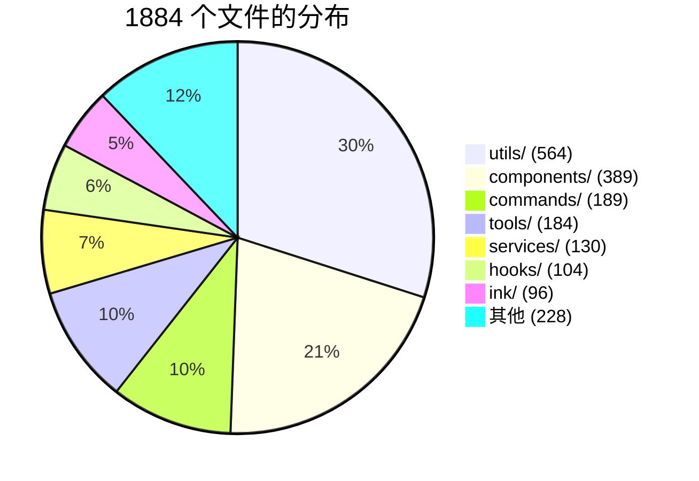
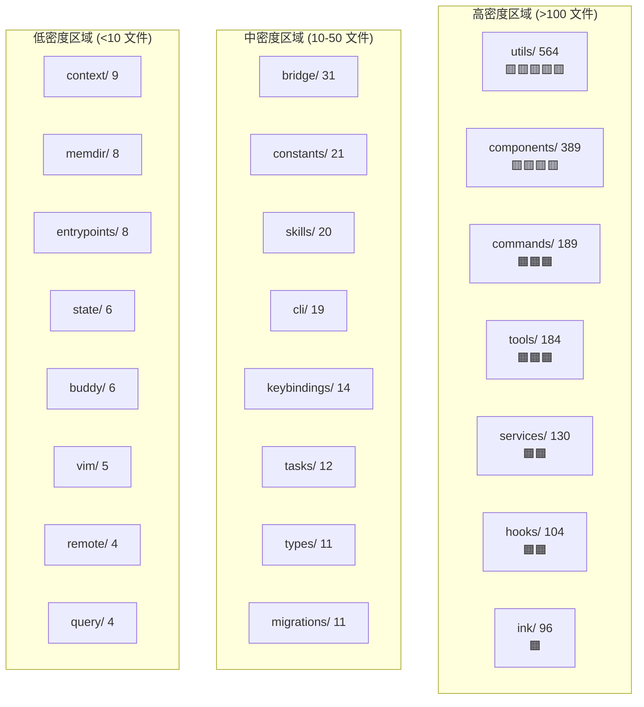

# 29 - 源码文件地图

> 1884 个 TypeScript/TSX 文件按功能归类。可按目录快速定位代码。

---

## 文件分布总览



---

## 顶层目录结构

| 目录 | 文件数 | 职责 | 文档参考 |
|------|--------|------|---------|
| **src/utils/** | 564 | 通用工具库（权限、插件、模型、设置、Bash、Swarm 等） | [25](25-design-patterns.md) |
| **src/components/** | 389 | React 组件（权限 UI、消息、代理、设计系统等） | [10](10-ui-layer.md) |
| **src/commands/** | 189 | 50+ 斜杠命令实现 | [05](05-command-system.md), [23](23-user-features-catalog.md) |
| **src/tools/** | 184 | 43+ 工具实现 | [04](04-tool-system.md) |
| **src/services/** | 130 | 服务层（API、MCP、压缩、分析、OAuth 等） | [09](09-service-layer.md) |
| **src/hooks/** | 104 | 69+ React Hooks + 通知 | [10](10-ui-layer.md) |
| **src/ink/** | 96 | 自定义 Ink 终端渲染框架 | [10](10-ui-layer.md) |
| **src/bridge/** | 31 | Bridge 远程控制系统 | [11](11-bridge-remote.md) |
| **src/constants/** | 21 | 常量（提示词、API 限制、工具限制等） | [14](14-prompt-catalog.md) |
| **src/skills/** | 20 | 技能系统（14 个内置技能） | [15](15-skills-system.md) |
| **src/cli/** | 19 | CLI 参数处理 | [02](02-startup-flow.md) |
| **src/keybindings/** | 14 | 快捷键系统 | [12](12-subsystems.md) |
| **src/tasks/** | 12 | 任务系统（Shell/Agent/Remote/Dream） | [22](22-deep-internals.md) |
| **src/types/** | 11 | 类型定义（消息、权限、命令、钩子） | [01](01-architecture-overview.md) |
| **src/migrations/** | 11 | 数据迁移（模型升级、配置迁移） | [02](02-startup-flow.md) |
| **src/context/** | 9 | React 上下文（模态、覆盖、语音、邮箱） | [10](10-ui-layer.md) |
| **src/memdir/** | 8 | 记忆系统 | [12](12-subsystems.md) |
| **src/entrypoints/** | 8 | 入口点（CLI、MCP、SDK） | [02](02-startup-flow.md) |
| **src/state/** | 6 | 应用状态管理 | [06](06-state-management.md) |
| **src/buddy/** | 6 | AI 伴侣系统 | [13](13-hidden-features.md) |
| **src/vim/** | 5 | Vim 模式 | [12](12-subsystems.md) |
| **src/remote/** | 4 | 远程会话管理 | [11](11-bridge-remote.md) |
| **src/query/** | 4 | 查询配置和 Token 预算 | [03](03-query-engine.md) |
| **src/native-ts/** | 4 | 原生模块（Yoga、颜色、文件索引） | [12](12-subsystems.md) |
| **src/server/** | 3 | 直连服务器 | [21](21-advanced-scenarios.md) |
| **src/screens/** | 3 | 主要屏幕（REPL、Doctor、Resume） | [10](10-ui-layer.md) |
| **src/其他小目录** | 9 | upstreamproxy、plugins、voice、schemas 等 | [12](12-subsystems.md) |

---

## 根级核心文件 (18 个)

| 文件 | 行数级别 | 职责 | 文档参考 |
|------|---------|------|---------|
| **main.tsx** | 4600+ | 启动引导、模式检测、完整初始化 | [02](02-startup-flow.md) |
| **query.ts** | 1700+ | REPL 对话处理主循环 | [03](03-query-engine.md), [24](24-end-to-end-flows.md) |
| **QueryEngine.ts** | 1300+ | 核心对话引擎，`submitMessage()` | [03](03-query-engine.md) |
| **Tool.ts** | 790+ | 工具类型定义和接口 | [04](04-tool-system.md) |
| **tools.ts** | 390 | 工具注册表，`getAllBaseTools()` | [04](04-tool-system.md) |
| **commands.ts** | 755 | 命令注册表，`getCommands()` | [05](05-command-system.md) |
| **context.ts** | 200 | 系统/用户上下文构建 | [06](06-state-management.md) |
| **setup.ts** | 700+ | 初始化序列（迁移、记忆、钩子） | [02](02-startup-flow.md) |
| **cost-tracker.ts** | 350+ | 费用追踪和模型使用统计 | [20](20-more-scenarios.md) |
| **history.ts** | 470+ | 粘贴内容历史管理 | [12](12-subsystems.md) |
| **interactiveHelpers.tsx** | 1900+ | 对话框、通知、渲染工具 | [23](23-user-features-catalog.md) |
| **dialogLaunchers.tsx** | 750+ | 动态对话框加载 | [23](23-user-features-catalog.md) |
| **tasks.ts** | 40 | 任务类型联合导出 | [22](22-deep-internals.md) |
| **Task.ts** | 100 | 任务基础类型 | [22](22-deep-internals.md) |
| **ink.ts** | 130 | Ink 渲染入口 + ThemeProvider 包装 | [10](10-ui-layer.md) |
| **replLauncher.tsx** | 100 | REPL 启动器 | [02](02-startup-flow.md) |
| **costHook.ts** | 20 | 费用 Hook 导出 | [09](09-service-layer.md) |
| **projectOnboardingState.ts** | 80 | 项目入门状态 | [20](20-more-scenarios.md) |

---

## utils/ 子目录 (564 文件，25 个子目录)

| 子目录 | 文件数 | 职责 |
|--------|--------|------|
| **plugins/** | 44 | 插件加载、管理、命令映射 |
| **permissions/** | 24 | 权限规则、路径验证、分类器、追踪 |
| **bash/** | 23 | Bash 安全检查、命令分析、转义 |
| **swarm/** | 22 | Team 文件、后端、权限同步、生成 |
| **settings/** | 19 | 设置加载、验证、缓存、MDM |
| **hooks/** | 17 | Hook 配置管理、执行器 (command/prompt/http/agent) |
| **model/** | 16 | 模型选择、弃用、提供商、能力检测 |
| **computerUse/** | 15 | 计算机使用 (Chicago MCP) |
| **shell/** | 10 | Shell 检测、PowerShell、输出限制 |
| **telemetry/** | 9 | OpenTelemetry 遥测 |
| **claudeInChrome/** | 7 | Chrome 浏览器自动化工具 |
| **secureStorage/** | 6 | 安全凭证存储 (Keychain) |
| **deepLink/** | 6 | 深链接 (Lodestone) |
| **task/** | 5 | 任务工具辅助 |
| **suggestions/** | 5 | 提示建议 |
| **nativeInstaller/** | 5 | 原生安装器 |
| **processUserInput/** | 4 | 用户输入处理管道 |
| **teleport/** | 4 | 跨环境迁移 |
| **其他** | ~300+ | 零散工具文件 (git、format、crypto、attachment、api 等) |

---

## tools/ 子目录 (184 文件，42 个工具)

### 按文件数排序

| 工具 | 文件数 | 特殊说明 |
|------|--------|---------|
| **AgentTool/** | 20 | 含 built-in/、forkSubagent、loadAgentsDir |
| **BashTool/** | 18 | 含 bashSecurity、dangerousPatterns |
| **PowerShellTool/** | 14 | 含 powershellDetection |
| **FileEditTool/** | 6 | |
| **LSPTool/** | 6 | |
| **WebFetchTool/** | 5 | |
| **ScheduleCronTool/** | 5 | CronCreate/Delete/List |
| **FileReadTool/** | 5 | |
| **ConfigTool/** | 5 | 含 supportedSettings |
| **BriefTool/** | 5 | SendUserMessage |
| 其余 32 个工具 | 各 1-4 | 标准结构 |

---

## services/ 子目录 (130 文件)

| 子目录 | 文件数 | 职责 | 文档参考 |
|--------|--------|------|---------|
| **mcp/** | 23 | MCP 客户端、配置、OAuth、传输 | [08](08-mcp-system.md) |
| **api/** | 20 | Claude API、错误、重试、日志、Bootstrap | [09](09-service-layer.md) |
| **compact/** | 11 | 压缩策略（auto/micro/session/time） | [22](22-deep-internals.md) |
| **analytics/** | 9 | 事件日志、Datadog、GrowthBook | [09](09-service-layer.md) |
| **lsp/** | 7 | LSP 客户端、服务器管理、诊断 | [09](09-service-layer.md) |
| **teamMemorySync/** | 5 | 团队记忆同步 | [17](17-agent-team-system.md) |
| **remoteManagedSettings/** | 5 | 远程托管设置 | [26](26-config-reference.md) |
| **oauth/** | 5 | OAuth 流、PKCE、token 交换 | [09](09-service-layer.md) |
| **tools/** | 4 | 工具编排、执行、流式 | [22](22-deep-internals.md) |
| **autoDream/** | 4 | 自动梦想巩固 | [18](18-application-scenarios.md) |
| **其余** | ~37 | 通知、语音、VCR、策略、提示建议等 | 各专题文档 |

---

## components/ 子目录 (389 文件)

| 子目录 | 文件数 | 职责 |
|--------|--------|------|
| **permissions/** | 51 | 权限请求 UI、审批对话框 |
| **messages/** | 41 | 33 种消息组件 |
| **agents/** | 26 | 代理菜单、编辑器、创建向导 |
| **PromptInput/** | 21 | 输入框组件 |
| **design-system/** | 16 | ThemedBox、Dialog、Tabs、ProgressBar |
| **LogoV2/** | 15 | Logo 渲染 |
| **mcp/** | 13 | MCP 服务器管理 UI |
| **tasks/** | 12 | 任务列表、进度显示 |
| **Spinner/** | 12 | 加载指示器 |
| **CustomSelect/** | 10 | 自定义选择器 |
| **FeedbackSurvey/** | 9 | 反馈调查 |
| **其余** | ~163 | Markdown、ToolUseLoader、AgentProgress 等 |

---

## hooks/ (104 文件)

| 分类 | 文件数 | 示例 |
|------|--------|------|
| **根级 Hooks** | 83 | useTextInput、useVirtualScroll、useMainLoopModel、useExitOnCtrlCD |
| **notifs/** | 16 | useAutoModeUnavailableNotification、useDeprecationWarning |
| **toolPermission/** | 5 | coordinatorHandler、interactiveHandler、swarmWorkerHandler |

---

## commands/ (189 文件)

### 顶级命令文件 (15 个)

```
advisor.ts, brief.ts, bridgeKick.ts, commit.ts,
commit-push-pr.ts, init.ts, init-verifiers.ts,
insights.ts, proactive.ts, review.ts, security-review.ts,
statusline.ts, version.ts, effort.ts, fast.ts
```

### 最大命令目录

| 目录 | 文件数 | 说明 |
|------|--------|------|
| **plugin/** | 17 | 插件管理 (安装/卸载/列表/配置) |
| **install-github-app/** | 14 | GitHub App 安装流程 |
| **review/** | 4 | 代码审查 |
| **mcp/** | 4 | MCP 服务器管理 |
| **extra-usage/** | 4 | 额外用量购买 |

---

## 按职能的文件热力图



---

## 文件命名约定

| 模式 | 含义 | 示例 |
|------|------|------|
| `prompt.ts` | 工具/技能提示词 | `tools/BashTool/prompt.ts` |
| `constants.ts` | 常量定义 | `tools/AgentTool/constants.ts` |
| `types.ts` | 类型定义 | `services/mcp/types.ts` |
| `index.ts` / `index.tsx` | 命令/目录入口 | `commands/resume/index.tsx` |
| `utils.ts` | 局部工具函数 | `tools/FileEditTool/utils.ts` |
| `*.test.ts` | 测试文件 | (本仓库无测试，仅源码) |
| `use*.ts` / `use*.tsx` | React Hook | `hooks/useVirtualScroll.ts` |
| `*Tool.ts` | 工具主类 | `tools/BashTool/BashTool.ts` |
| `migrate*.ts` | 数据迁移 | `migrations/migrateOpusToOpus1m.ts` |
