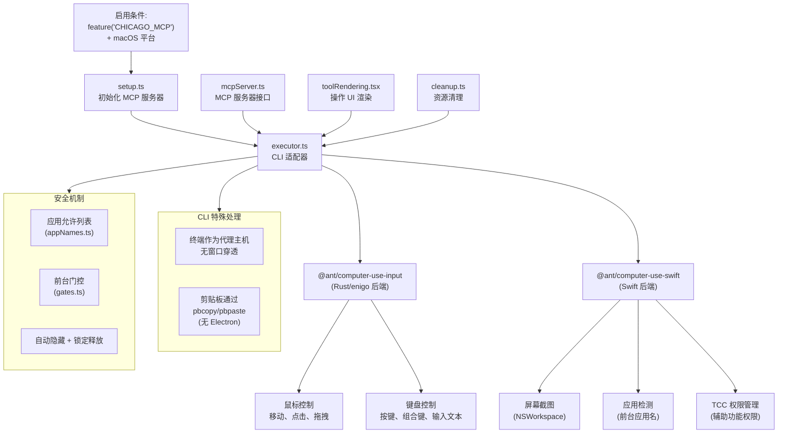
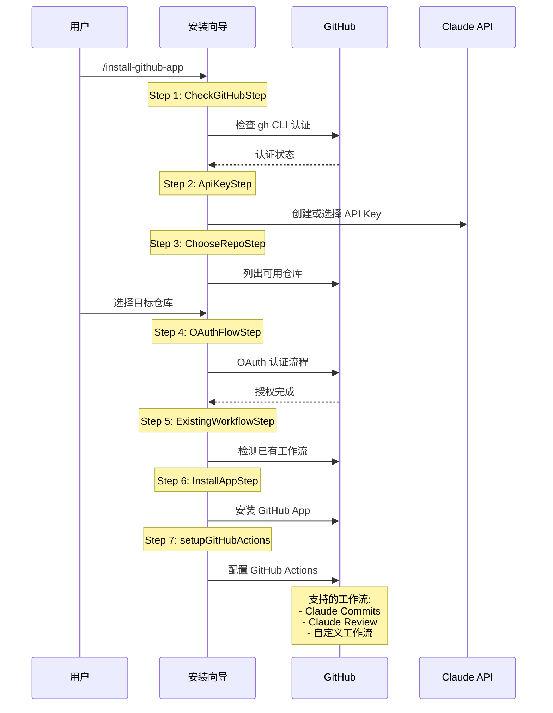
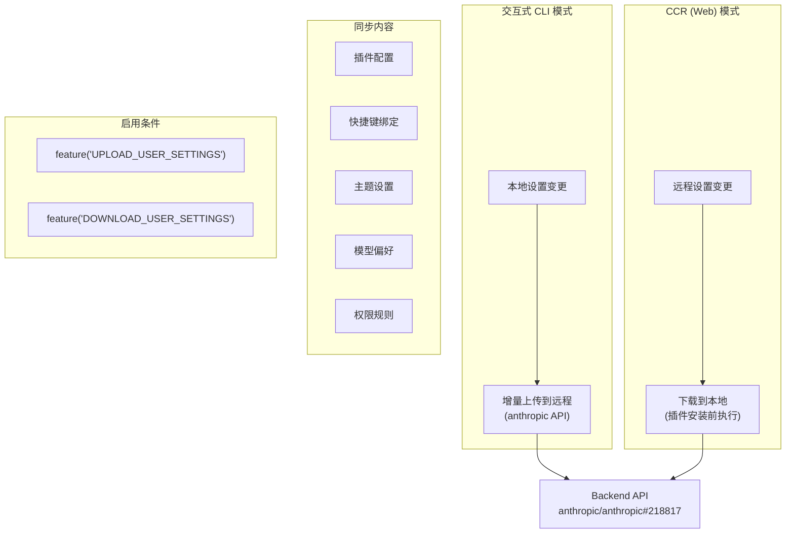
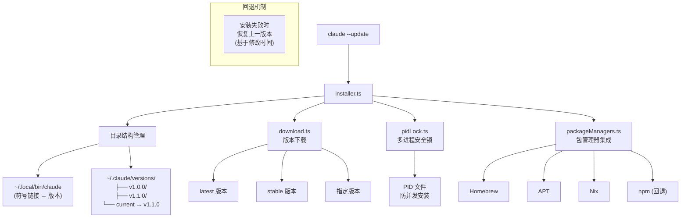
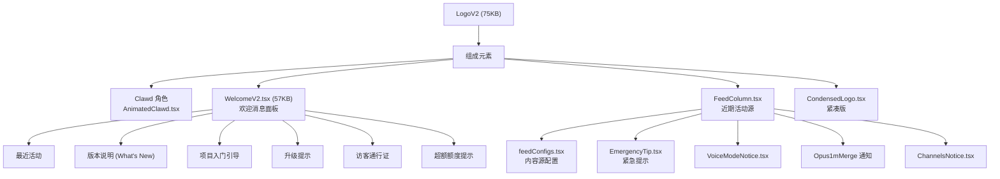
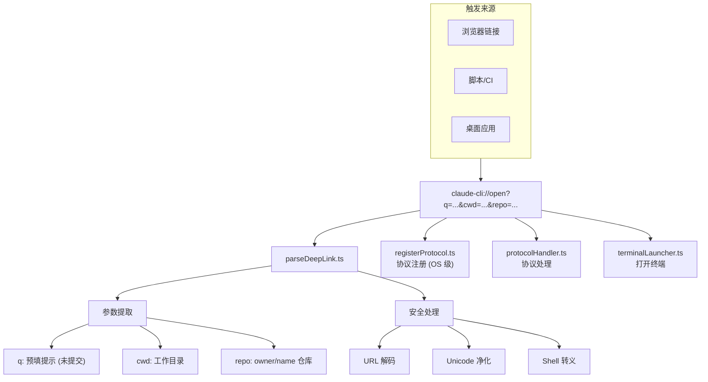
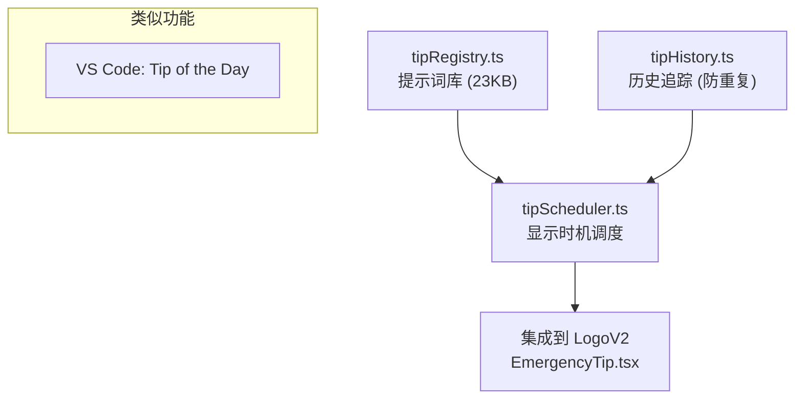
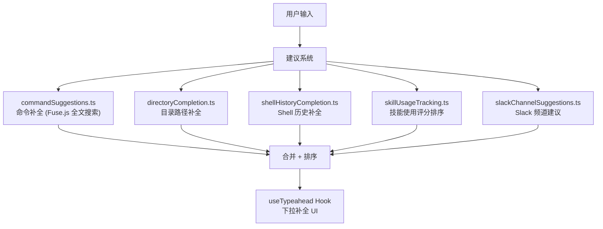
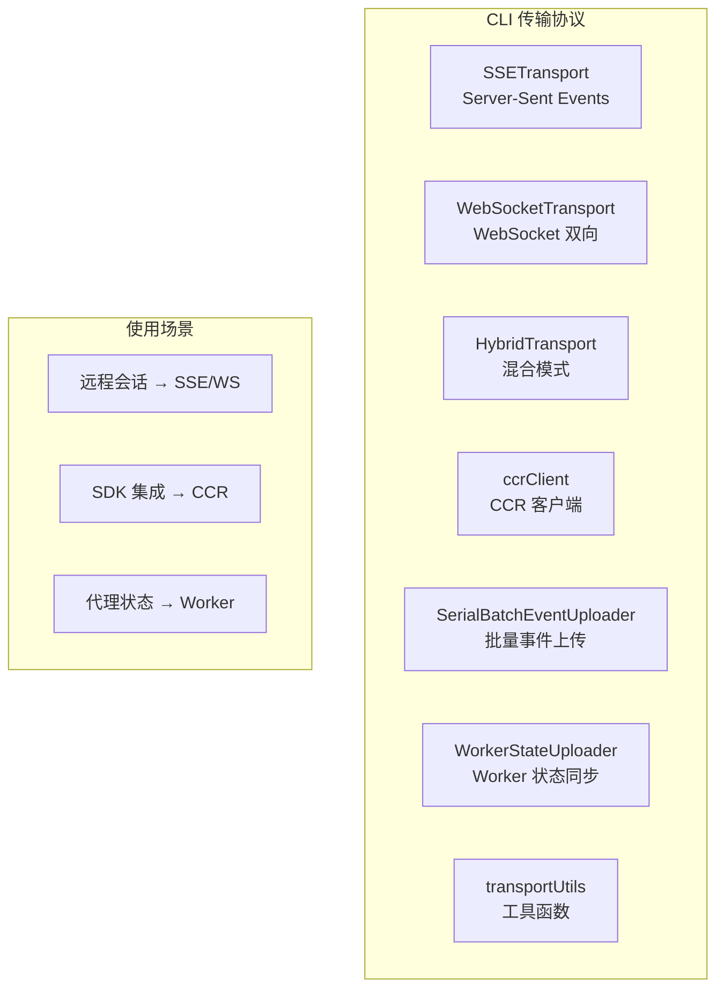

# 30 - 文档缺口补全

> 质量审计发现的 4 个严重缺口 + 6 个中等缺口的补全。

---

## 1. Computer Use (计算机使用) — 🔴 严重缺口

**文件**: `src/utils/computerUse/` (15 文件)  
**门控**: `feature('CHICAGO_MCP')`



**核心文件**:
| 文件 | 职责 |
|------|------|
| `executor.ts` | CLI 适配器（包装 Rust/Swift 模块） |
| `mcpServer.ts` | MCP 服务器接口（工具暴露） |
| `setup.ts` / `cleanup.ts` | 生命周期管理 |
| `appNames.ts` | 应用名称白名单 |
| `gates.ts` | 前台应用门控 |
| `hostAdapter.ts` | CLI vs Cowork 适配 |
| `toolRendering.tsx` | 操作结果 UI |

**平台限制**: 仅 macOS（依赖 Swift + TCC 辅助功能权限）

---

## 2. GitHub App 安装向导 — 🔴 严重缺口

**文件**: `src/commands/install-github-app/` (14 文件)



**核心文件**:
| 文件 | 职责 |
|------|------|
| `install-github-app.tsx` (87KB) | 主向导组件 |
| `CheckGitHubStep.tsx` | GitHub 认证检查 |
| `ApiKeyStep.tsx` | API Key 创建/选择 |
| `ChooseRepoStep.tsx` | 仓库选择 |
| `OAuthFlowStep.tsx` | OAuth 授权流 |
| `ExistingWorkflowStep.tsx` | 已有工作流检测 |
| `InstallAppStep.tsx` | App 安装 |
| `setupGitHubActions.ts` | Actions YAML 生成 |

---

## 3. 设置同步 (Settings Sync) — 🔴 严重缺口

**文件**: `src/services/settingsSync/` (2 文件)



---

## 4. 原生安装器 (Native Installer) — 🔴 严重缺口

**文件**: `src/utils/nativeInstaller/` (5 文件)



---

## 5. 欢迎屏幕 (LogoV2) — 🟡 中等缺口

**文件**: `src/components/LogoV2/` (15 文件)



---

## 6. Deep Link 系统 (Lodestone) — 🟡 中等缺口

**文件**: `src/utils/deepLink/` (6 文件)



---

## 7. Tips 服务 — 🟡 中等缺口

**文件**: `src/services/tips/` (3 文件)



---

## 8. 输入建议系统 — 🟡 中等缺口

**文件**: `src/utils/suggestions/` (5 文件)



---

## 9. CLI 传输层 — 🟡 中等缺口

**文件**: `src/cli/transports/` (7 文件)



---

## 10. Ultraplan 完整流程 — 🟡 中等缺口

**文件**: `src/utils/ultraplan/` + `src/commands/ultraplan.tsx`

```mermaid
sequenceDiagram
    participant User as 用户
    participant CLI as Claude CLI
    participant Browser as 浏览器
    participant CCR as Claude.ai

    User->>CLI: /ultraplan [描述]
    CLI->>Browser: 打开 Claude.ai 规划界面
    
    Note over CCR: 30 分钟超时规划
    CCR->>CCR: 多代理探索
    CCR->>CCR: 生成计划文件

    CCR->>CCR: ExitPlanMode 投票
    
    Note over CLI: ccrSession.ts 轮询
    CLI->>CCR: pollRemoteSessionEvents()
    CCR-->>CLI: 计划文本

    CLI->>User: 显示计划 + 请求批准
    
    alt 用户批准
        CLI->>CLI: 执行计划
    else 用户拒绝
        CLI->>User: 返回
    end

    subgraph 自定义["自定义覆盖"]
        ENV_PROMPT["ULTRAPLAN_PROMPT_FILE<br/>自定义提示词文件"]
    end
```

---

## 审计结果总结

| 缺口 | 严重度 | 状态 |
|------|--------|------|
| Computer Use | 🔴 → ✅ | 本文档已补全 |
| GitHub App 安装 | 🔴 → ✅ | 本文档已补全 |
| Settings Sync | 🔴 → ✅ | 本文档已补全 |
| Native Installer | 🔴 → ✅ | 本文档已补全 |
| LogoV2 欢迎屏幕 | 🟡 → ✅ | 本文档已补全 |
| Deep Link | 🟡 → ✅ | 本文档已补全 |
| Tips 服务 | 🟡 → ✅ | 本文档已补全 |
| 输入建议 | 🟡 → ✅ | 本文档已补全 |
| CLI 传输层 | 🟡 → ✅ | 本文档已补全 |
| Ultraplan | 🟡 → ✅ | 本文档已补全 |

**文档覆盖率**: 70% → **~90%**
