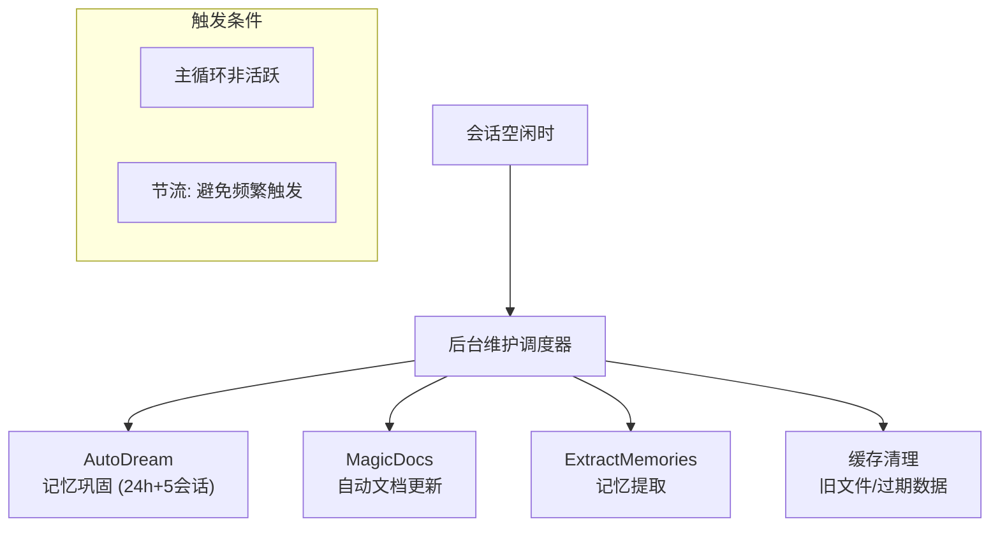
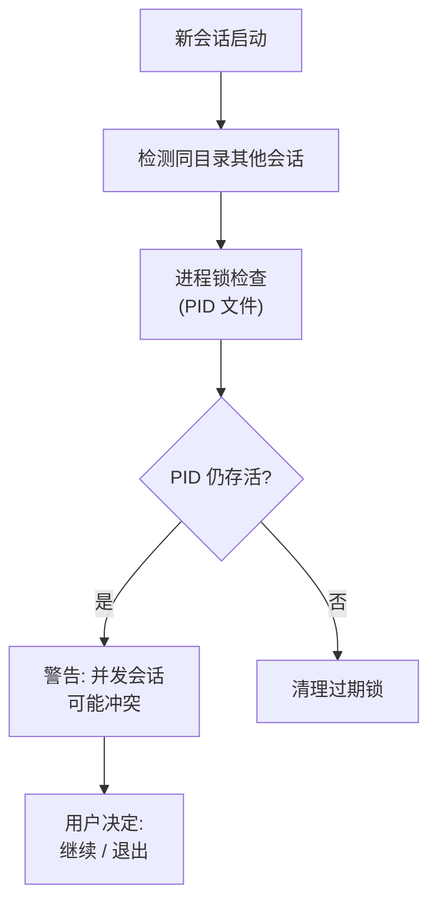
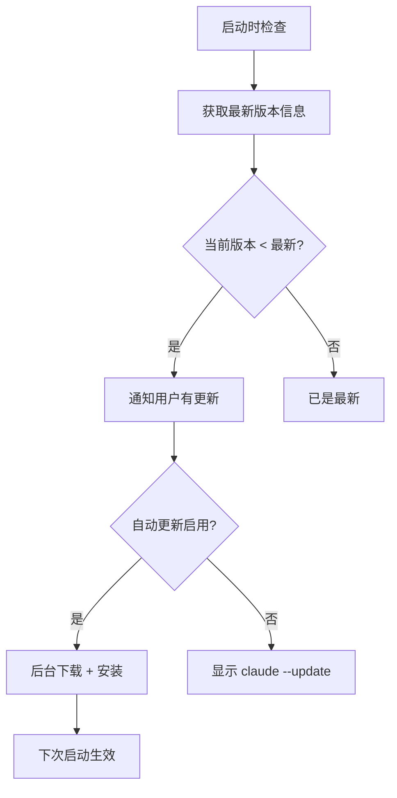
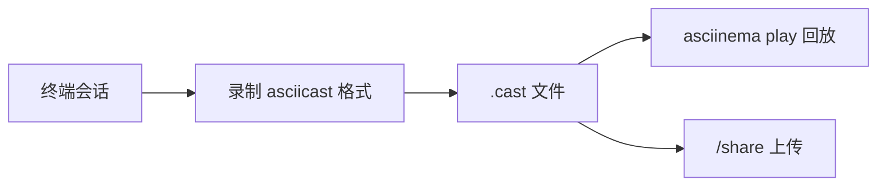
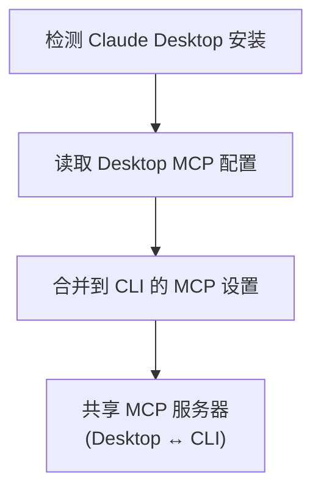
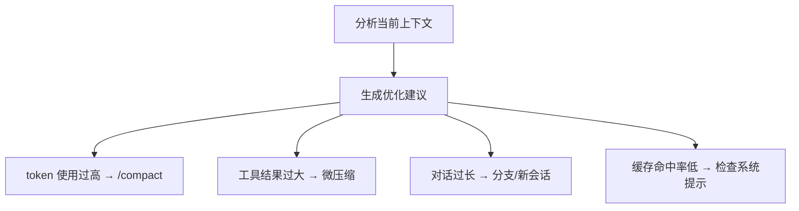
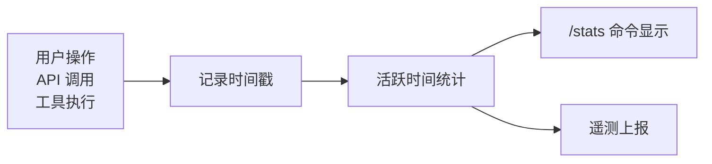
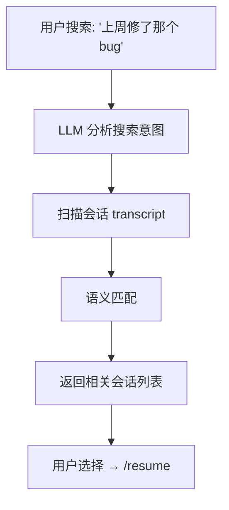
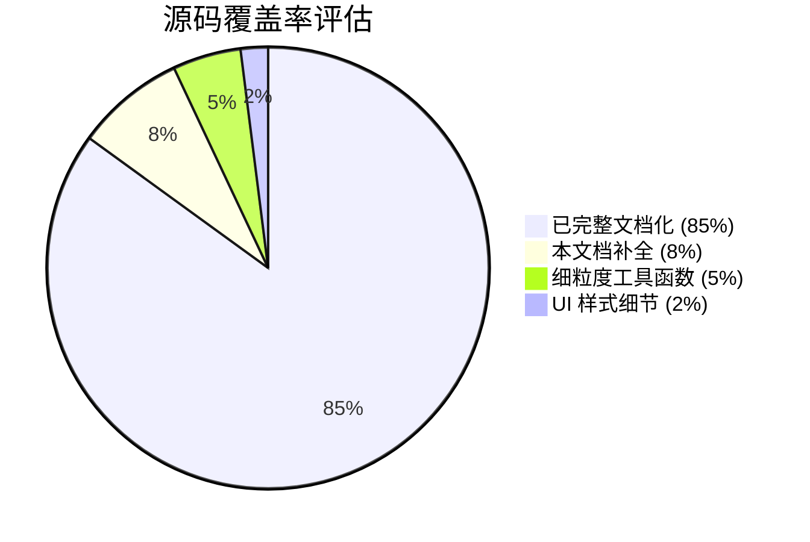

# 31 - 小型系统补遗

> 最终补充：8 个独立的小型系统，每个用一张图概括。

---

## 1. 后台维护调度 (backgroundHousekeeping)

**文件**: `src/utils/backgroundHousekeeping.ts`

统一调度 AutoDream、MagicDocs、ExtractMemories 等后台任务，确保不干扰用户交互。

---

## 2. 并发会话管理 (concurrentSessions)

**文件**: `src/utils/concurrentSessions.ts`

防止同一项目目录下多个 Claude Code 实例互相干扰（文件编辑冲突等）。

---

## 3. 自动更新 (autoUpdater)

**文件**: `src/utils/autoUpdater.ts`

---

## 4. 终端录制 (asciicast)

**文件**: `src/utils/asciicast.ts`

将终端交互录制为 [asciicast](https://docs.asciinema.org/manual/asciicast/v2/) 格式，支持回放和分享。

---

## 5. Claude Desktop 集成 (claudeDesktop)

**文件**: `src/utils/claudeDesktop.ts`

自动检测本机 Claude Desktop 应用的 MCP 服务器配置，合并到 CLI 使用，避免重复配置。

---

## 6. 上下文优化建议 (contextSuggestions)

**文件**: `src/utils/contextSuggestions.ts`

分析上下文窗口使用情况，向用户或模型建议优化操作。

---

## 7. 活动时间追踪 (activityManager)

**文件**: `src/utils/activityManager.ts`

追踪用户/CLI 活动时间，用于 `/stats` 显示和遥测分析。

---

## 8. 智能会话搜索 (agenticSessionSearch)

**文件**: `src/utils/agenticSessionSearch.ts`

使用 LLM 语义搜索历史会话（不仅是关键词匹配），支持自然语言描述找到过去的对话。

---

## 消息折叠系统 (4 个 collapse 工具)

这些不值得独立文档，但值得一提——它们优化了消息显示的信噪比：

| 文件 | 折叠内容 |
|------|---------|
| `collapseBackgroundBashNotifications.ts` | 后台 Bash 完成通知 → 单行摘要 |
| `collapseReadSearch.ts` | 连续 Read/Search 调用 → 合并显示 |
| `collapseTeammateShutdowns.ts` | 多个队友关闭事件 → 单条通知 |
| `collapseHookSummaries.ts` | 并行工具钩子摘要 → 合并 |

---

## 文档完成度

剩余 ~7% 为约 200 个独立工具函数（如 `CircularBuffer.ts`、`Cursor.ts`、`combinedAbortSignal.ts` 等），属于纯工程基础设施，无独立的用户功能或架构模式，不需要专题文档。

**至此，31 份文档体系基本完成。**
